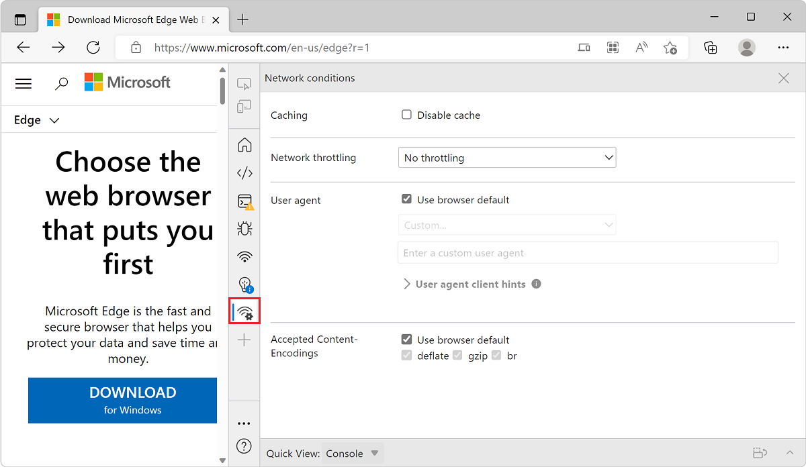

# Network conditions tool

Use the **Network conditions** tool to do the following:
*  Disable the browser cache.
*  Set network throttling.
*  Set the user agent string.
*  Set Content-Encodings such as deflate, gzip, and br.

<!-- ====================================================================== -->
## Disable the browser cache

See [Disable the browser cache from the Network Conditions drawer](../network/reference.md#disable-the-browser-cache-from-the-network-conditions-drawer) in _Network features reference_.

<!-- ====================================================================== -->
## Set network throttling

See [Emulate slow network connections from the Network Conditions drawer](../network/reference.md#emulate-slow-network-connections-from-the-network-conditions-drawer) in _Network features reference_.

<!-- ====================================================================== -->
## Set the user agent string

See:
* [Set the user agent string](../device-mode/index.md#set-the-user-agent-string) in _Emulate mobile devices (Device Emulation)_.
* [Override the user agent string](../device-mode/override-user-agent.md).
* [Set user agent client hints](../network/reference.md#set-user-agent-client-hints) in _Network features reference_.

<!-- ====================================================================== -->
## Set Content-Encodings, such as deflate, gzip, and br

See [Enable text compression](../speed/get-started.md#enable-text-compression) in _Optimize website speed using Lighthouse_.

<!-- ====================================================================== -->
## See also

The following What's New entries provide additional information:

* [Easier customization of User-Agent Client Hints](../whats-new/2021/07/devtools.md#easier-customization-of-user-agent-client-hints) in _What's New in DevTools (Microsoft Edge 93)_.
* [User-Agent Client Hints for devices in the Network conditions tab](../whats-new/2021/05/devtools.md#user-agent-client-hints-for-devices-in-the-network-conditions-tab) in _What's New in DevTools (Microsoft Edge 92)_.
* [New options to configure Content-Encodings in the Network conditions tool](../whats-new/2021/04/devtools.md#new-options-to-configure-content-encodings-in-the-network-conditions-tool) in _What's New in DevTools (Microsoft Edge 91)_.
* [Updated User-Agent strings](../whats-new/2019/12/devtools.md#updated-user-agent-strings) in _What's new in DevTools (Microsoft Edge 80)_.
