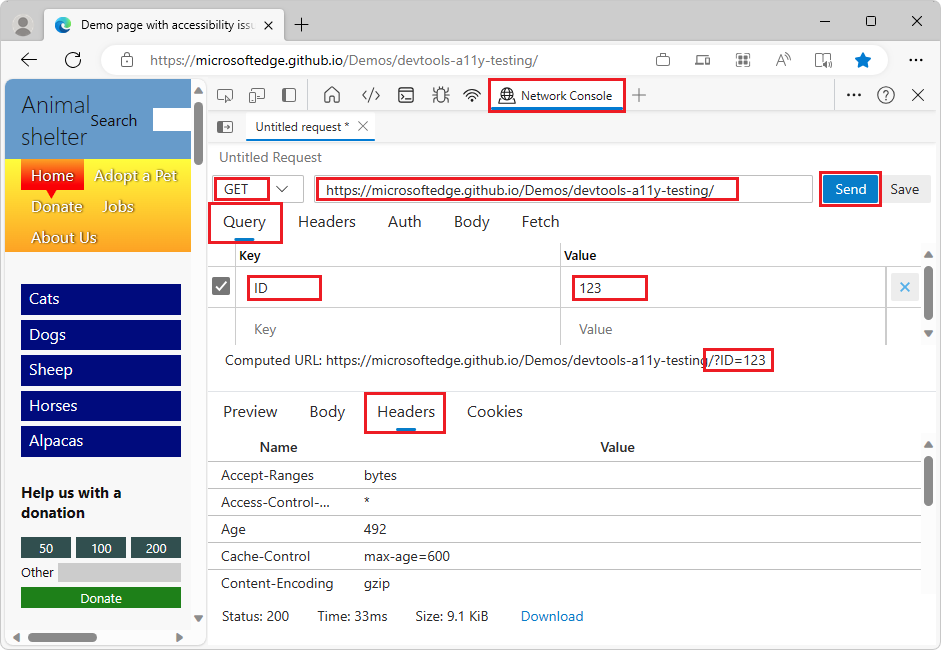
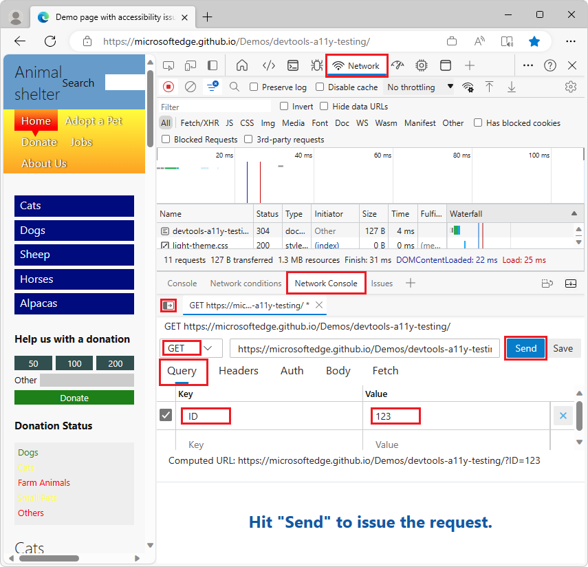

# Compose and send web API requests using the Network Console tool

Use the **Network Console** tool to send web API requests.  For example, use the **Network Console** tool when you're developing and testing web APIs.

To test a URL:

1. To open DevTools, right-click the webpage, and then select **Inspect**.  Or, press **Ctrl+Shift+I** (Windows, Linux) or **Command+Option+I** (macOS).  DevTools opens.

1. In DevTools, on the main toolbar or the Drawer toolbar at the bottom, select the **Network Console** tab.  If that tab isn't visible, click the **More tabs** () button, or else the **More Tools** () button.

   The Network Console tool opens:

   

1. In the main pane of the Network Console tool, click **Create a request**.

1. In the **Untitled Request** text box, enter a URL to test.

1. In the **GET** dropdown list, select a REST method: **GET**, **HEAD**, **POST**, **PUT**, or **PATCH**.

1. Optionally, in the **Query** section, click the **Key** and **Value** text boxes and enter key/value pairs:

   

   The **Computed URL** is updated as you enter key/value pairs.

1. Click the **Send** button.

<!-- ====================================================================== -->
## Starting from the Network tool

To use the **Network Console** starting from the **Network** tool:

1. Go to a webpage to test.

1. To open DevTools, right-click the webpage, and then select **Inspect**.  Or, press **Ctrl+Shift+I** (Windows, Linux) or **Command+Option+I** (macOS).  DevTools opens.

1. In DevTools, on the main toolbar, select the **Network** tab.  If that tab isn't visible, click the **More tabs** () button, or else the **More Tools** () button.

1. Refresh the webpage.

   The **Network** tool displays the resources that are used to construct the webpage.

1. Right-click the network request that you want to change and resend, and then select **Edit and Resend**:

   

   The resource opens in the **Network Console** tool in the Drawer at the bottom of DevTools.

1. In the **Network Console**, edit the network request information, and then click the **Send** button:

   

   <!-- Another screenshot (used by Experimental Features article)

    -->

<!-- ====================================================================== -->
## Save and export Collections, Environments, and environment variables

You can:
*  Save and export Collections.
*  Save and export Environments.
*  Edit and export sets of environment variables.

Entering a name for the new environment:

Selecting the format for the new environment:

The **Network Console** tool is compatible with the [Postman v2.1](https://schema.getpostman.com/json/collection/v2.1.0/docs/index.html) and [OpenAPI v2](https://swagger.io/specification/v2) schemas.

See also:
* [Save and export using the Network Console](../whats-new/2020/10/devtools.md#save-and-export-using-the-network-console) in _What's New in DevTools (Microsoft Edge 87)_

<!-- ====================================================================== -->
## See also

* [View formatted JSON](../json-viewer/json-viewer.md)
<!-- * [edge-devtools-network-console repo](https://github.com/microsoft/edge-devtools-network-console) -->
