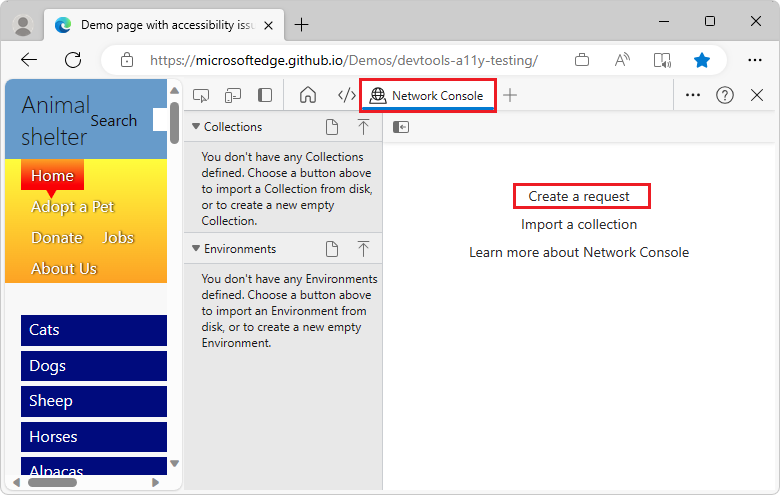
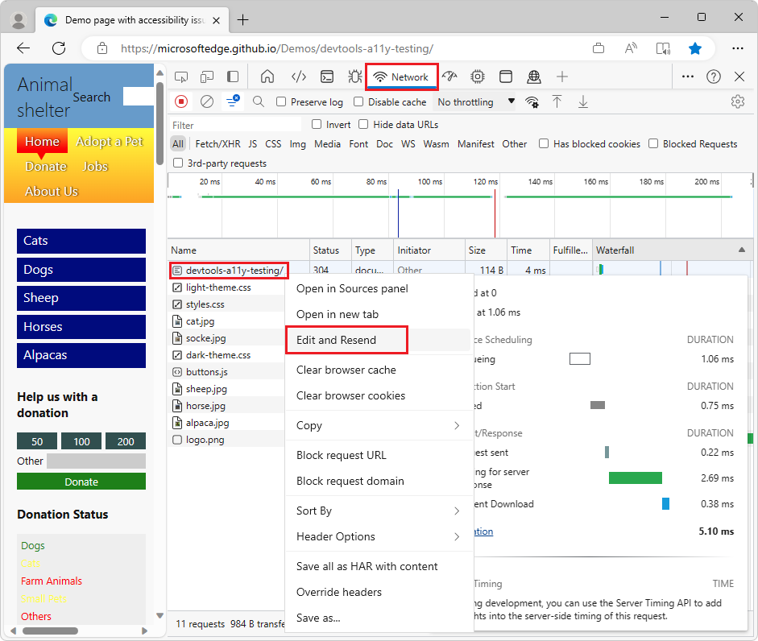
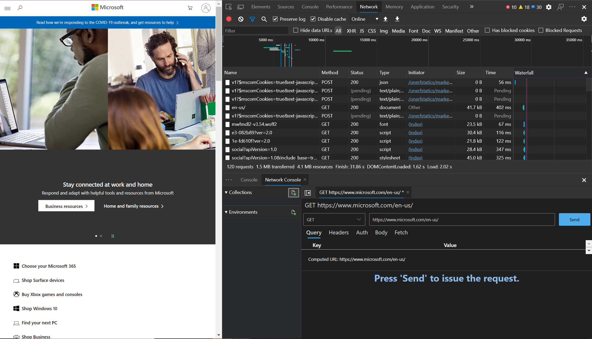

# Compose and send web API requests using the Network Console tool

Use the **Network Console** tool to send web API requests.  For example, use the **Network Console** tool when you're developing and testing web APIs.

To test a URL:

1. To open DevTools, right-click a webpage, and then select **Inspect**.  Or, press **Ctrl+Shift+I** (Windows, Linux) or **Command+Option+I** (macOS).

1. On the main toolbar, click the **More tools** () button, and then select **Network Console**.

   The Network Console tool opens:

   

1. Click **Create a request**.

1. Click the **Hide Network Console navigator** () button, to get more space.

1. In the **Untitled Request** text box, enter a URL to test, such as: `https://microsoftedge.github.io/Demos/devtools-a11y-testing/`

1. In the **GET** dropdown list, select a REST method, such as **GET**, which is the default.  The REST methods include:
   * **GET**
   * **HEAD**
   * **POST**
   * **PUT**
   * **PATCH**
   * **DELETE**
   * **OPTIONS**

1. Optionally, in the **Query** section, enter key/value pairs in the **Key** and **Value** text boxes, such as **ID** and **123**:

   

   The **Computed URL** is updated as you enter key/value pairs.

1. Click the **Send** button.  The bottom part of the **Network Console** tool displays the following tabs:
   * **Preview**
   * **Body**
   * **Headers**
   * **Cookies**

<!-- ====================================================================== -->
## Opening the Network Console tool from within the Network tool

To get to the **Network Console** tool by starting from the **Network** tool:

1. To open DevTools, right-click a webpage, and then select **Inspect**.  Or, press **Ctrl+Shift+I** (Windows, Linux) or **Command+Option+I** (macOS).

1. On the main toolbar, select the **Network** () tab.  If that tab isn't visible, click the **More tools** () button, and then select **Network**.

1. Refresh the webpage.  The **Network** tool displays the resources that are used to construct the webpage.

1. Right-click the network request that you want to change and resend, and then select **Edit and Resend**:

   

   The **Network Console** tool opens in the **Quick View** panel at the bottom of DevTools.

1. Click the **Hide Network Console navigator** () button, to get more space.

1. Edit the network request information, and then click the **Send** button:

   

   <!-- another screenshot (used by "Experimental features in Microsoft Edge DevTools" article):
    -->

<!-- ====================================================================== -->
## Save and export Collections, Environments, and environment variables

You can:
*  Save and export Collections.
*  Save and export Environments.
*  Edit and export sets of environment variables.

To define and save a new environment:

1. In DevTools, in the **Network Console** tool, make sure the left, navigator part of the tool is displayed.  If needed, click the **Show Network Console navigator** () button.

1. In the **Environments** section, click the **New** () button.

1. In the text box that appears, enter a name for the new environment:

   

1. Select the format for the new environment:
   * **Network Console** - Supports multiple environments in one file.
   * **Postman** - Supports one environment per file, but work with Postman.

   

The **Network Console** tool is compatible with the [Postman v2.1](https://schema.getpostman.com/json/collection/v2.1.0/docs/index.html) and [OpenAPI v2](https://swagger.io/specification/v2) schemas.

See also:
* [Save and export using the Network Console](../whats-new/2020/10/devtools.md#save-and-export-using-the-network-console) in _What's New in DevTools (Microsoft Edge 87)_
* [Postman.com](https://www.postman.com/) - A platform for building and testing APIs.

<!-- ====================================================================== -->
## See also

* [View formatted JSON](../json-viewer/json-viewer.md)
<!-- * [edge-devtools-network-console repo](https://github.com/microsoft/edge-devtools-network-console) -->
