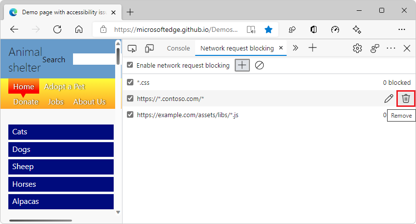
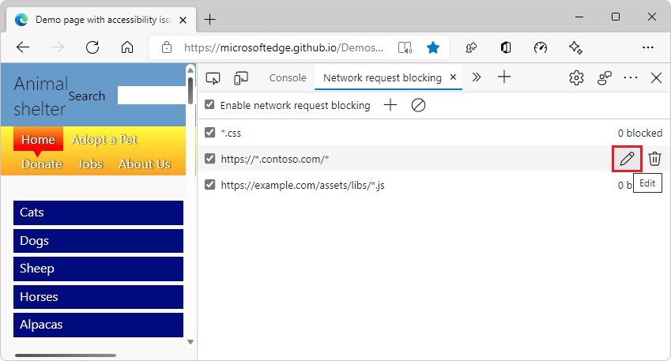
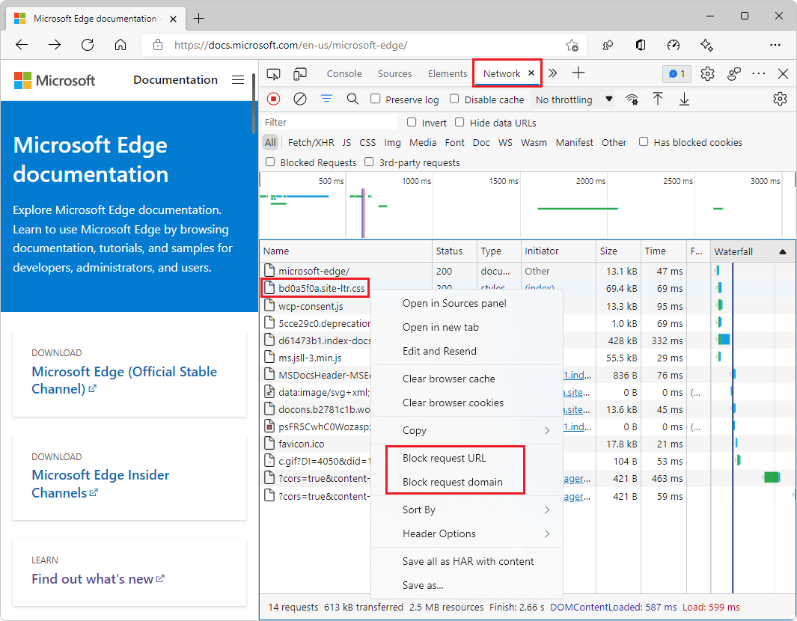

# Network request blocking tool

When a web page depends on resources (e.g. images, JavaScript files, fonts, or CSS stylesheets) that are hosted on other servers than the web page itself, there can be times when those servers become unresponsive or just not available to all your users. When this happens, the resources that your web page depends on may not all successfully be retrieved by the web browser.

As a web developer, it is important to verify how your web page behaves when external resources fail to load and whether the page handles this gracefully or appears broken to your users.

The **Network request blocking** tool can be used to verify how a web page looks and behave when some resources are not available.

## Block requests from the Network request blocking tool

To block a request from the **Network request blocking** tool:

1. On the main toolbar or **Drawer** toolbar, click the **More Tools** (`+`) icon and then select **Network request blocking**.
1. Click **Add pattern** (`+`) and then type the URL of a request that you want to block. You can either type the full URL, or replace parts of it with `*` for wildcard pattern matching.
1. Click **Add**.

## Manage blocked requests

Once you have created blocked network requests, you can edit or delete them.

### Delete blocked requests

To delete a request you don't want to block anymore, hover over it in in the **Network request blocking** table and then click **Remove** ().

You can also delete all requests at once by clicking **Remove all patterns** () in the toolbar.

### Update blocked requests

To change a blocked request, hover over it in the **Network request blocking** table and then click **Edit** ().

## Toggle request blocking

You can toggle request blocking at any time without having to delete and recreate all of the blocked requests.

Select or clear the **Enable network request blocking** checkbox in the toolbar to enable or disable blocking.

## Block requests from the Network tool

In addition to being able to manually add requests to be blocked, you can also use the **Network** tool to block requests made by your web page.

To block requests from the **Network** tool:

1. Click **Network** in the main toolbar.
1. Find the request you want to block in the request table.
1. Right-click the request and then click **Block request URL** to block this exact resource or **Block request domain** to block all resources from the same domain.

