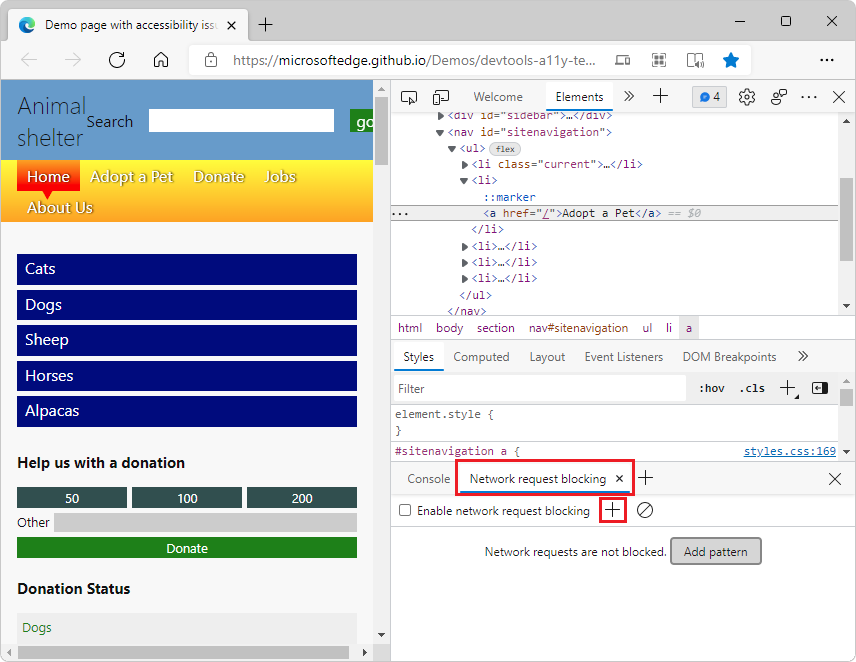
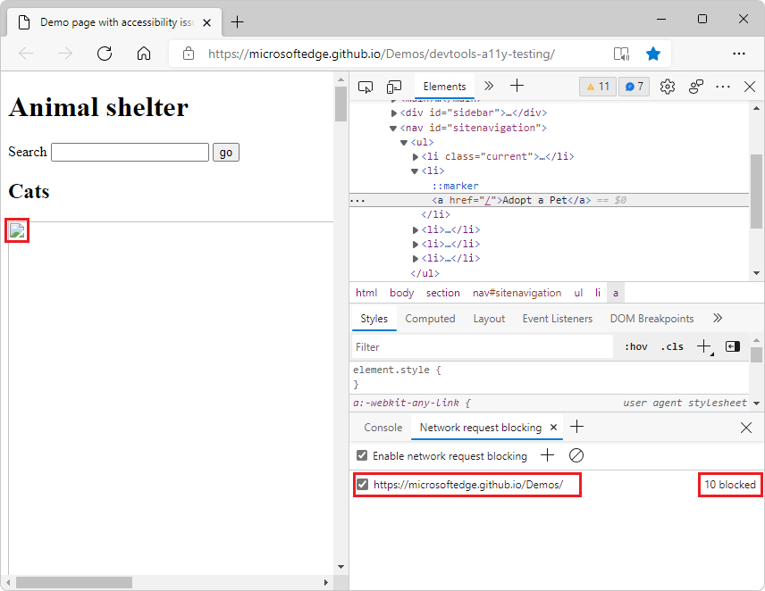

# Network request blocking tool

Use the **Network request blocking** tool to test blocking network requests to a specified URL pattern and see how a webpage behaves.

To try the **Network request blocking** tool:

1. In a separate window or tab, go to the [Accessibility-testing demo webpage](https://microsoftedge.github.io/Demos/devtools-a11y-testing/).

1. To open DevTools, right-click the webpage, and then select **Inspect**.  Or, press `Ctrl`+`Shift`+`I` (Windows, Linux) or `Command`+`Option`+`I` (macOS).  DevTools opens.

1. In DevTools, on the main toolbar, select the **Network request blocking** tab.  If that tab isn't visible, click the **More tabs** () button, or else the **More Tools** () button.

   The page content is displayed:

   

1. In the the **Network request blocking** panel, click the **Add pattern** () icon or the **Add pattern** button, if it's displayed.

1. In the **Text pattern to block matching requests** text box, paste the following URL path, and then click the **Add** button:

   ```http
   https://microsoftedge.github.io/Demos/
   ```
   
1.  Refresh the page.  Now most elements of the page aren't displayed, and a number of network requests are indicated as blocked:

    

1. Click the **Remove all patterns** () icon, and then click **Refresh**.  The page content re-appears.
