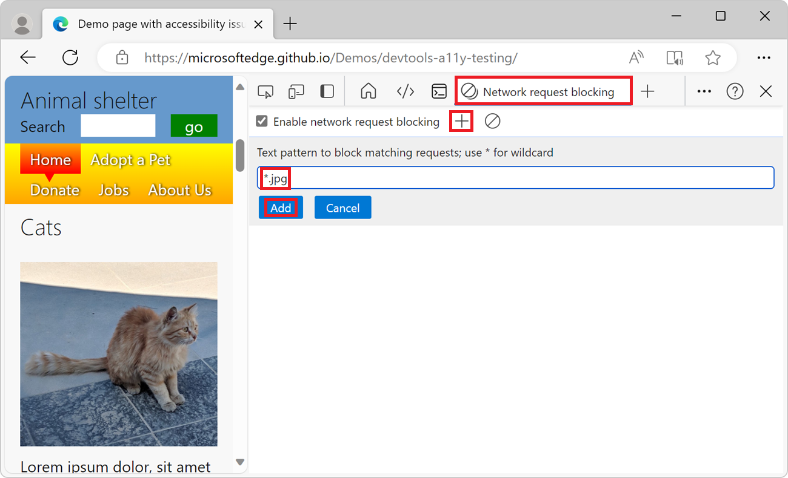
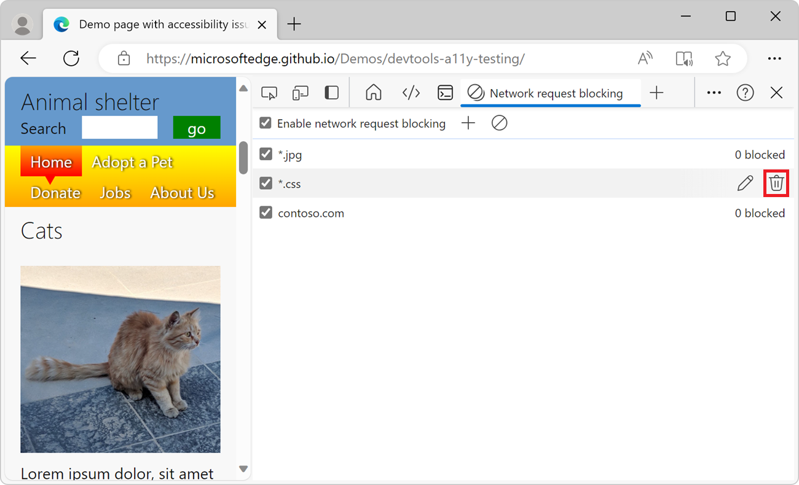

# Network request blocking tool

Use the **Network request blocking** tool to check how a webpage looks and behaves when some resources are unavailable, such as image files, JavaScript files, fonts, or CSS stylesheets.  Use this tool to test blocking network requests to a specified URL pattern and see how a webpage behaves.

When a webpage depends on _external resources_ that are hosted on other servers than the HTML webpage, sometimes those servers might be unresponsive or unavailable to some users. When this happens, some resources that your webpage depends on might not be retrieved by the web browser.  It's important to check how your webpage behaves when external resources fail to load.  Test whether the webpage handles missing resources gracefully, or appears broken to your users.

After you create blocked network requests and test the webpage, you can then edit or delete the blocked network requests.


<!-- ====================================================================== -->
## Block a network request

To block a network request:

1. Go to the webpage for which you want to block network requests.

1. To open DevTools, right-click the webpage, and then select **Inspect**.  Or, press **Ctrl+Shift+I** (Windows, Linux) or **Command+Option+I** (macOS).

1. In DevTools, on the main toolbar, click the **Network request blocking** tab.  If that tab isn't visible, click the **More tabs** () button, or else the **More Tools** () button.

1. Click the **Add pattern** () button.  The **Enable network request blocking** checkbox is automatically selected.

1. In the **Text pattern to block network requests** text box, type the URL of a network request that you want to block.  You can either type the full URL, just the domain name to block all requests from this domain, or replace parts of it with `*` for wildcard pattern matching.
   
   For example, `contoso.com` matches URLs like:

   * `https://contoso.com`
   * `https://subdomain.contoso.com`
   * `https://subdomain.contoso.com/path/to/resource`

   And `*.png` matches URLs like:
   
   * `https://www.contoso.com/resource.png`
   * `http://third-party.com/6469272/163348534-b90ea1a3-c33cbeb1aed8.png`

1. Click the **Add** button:

   


<!-- ====================================================================== -->
## Delete a blocked network request

To delete a specific network blocking request:

*  In the **Network request blocking** table, hover over the network blocking request, and then click the **Remove** () button:

   


To delete all network blocking requests at once:

*  In the toolbar, click the **Remove all patterns** () button.


<!-- ====================================================================== -->
## Modify a blocked network request

To change an existing blocked network request:

*  In the **Network request blocking** table, hover over the blocked network request, and then click **Edit** ():

   


<!-- ====================================================================== -->
## Toggle network request blocking

To toggle network request blocking without having to delete and re-create all of the blocked network requests:

*  In the toolbar, select or clear the **Enable network request blocking** checkbox:

   


<!-- ====================================================================== -->
## Block a network request by using the Network tool

You can block network requests that are made by your webpage either by using the **Network request blocking** tool or by using the **Network** tool.

To block network requests by using the **Network** tool:

1. Go to the webpage for which you want to block network requests.

1. To open DevTools, right-click the webpage, and then select **Inspect**.  Or, press **Ctrl+Shift+I** (Windows, Linux) or **Command+Option+I** (macOS).  DevTools opens.

1. In DevTools, on the main toolbar, click the **Network** tab.  If that tab isn't visible, click the **More tabs** () button, or else the **More Tools** () button.

1. In the table of network requests in the bottom pane, find the network request that you want to block.

1. Right-click the network request, and then click **Block request URL** to block this specific resource, or **Block request domain** to block all resources from the same domain:

   


<!-- ====================================================================== -->
## Try the network request blocking tool

To try the **Network request blocking** tool:

1. In a separate window or tab, go to the [Accessibility-testing demo webpage](https://microsoftedge.github.io/Demos/devtools-a11y-testing/).

1. To open DevTools, right-click the webpage, and then select **Inspect**.  Or, press **Ctrl+Shift+I** (Windows, Linux) or **Command+Option+I** (macOS).  DevTools opens.

1. In DevTools, on the main toolbar, select the **Network request blocking** tab.  If that tab isn't visible, click the **More tabs** () button, or else the **More Tools** () button.

   The page content is displayed:

   

1. In the the **Network request blocking** panel, click the **Add pattern** () icon or the **Add pattern** button, if it's displayed.

1. In the **Text pattern to block matching requests** text box, paste the following URL path, and then click the **Add** button:

   ```http
   https://microsoftedge.github.io/Demos/
   ```
   
1.  Refresh the page.  Now most elements of the page aren't displayed, and a number of network requests are indicated as blocked:

    

1. Click the **Remove all patterns** () icon, and then click **Refresh**.  The page content re-appears.
