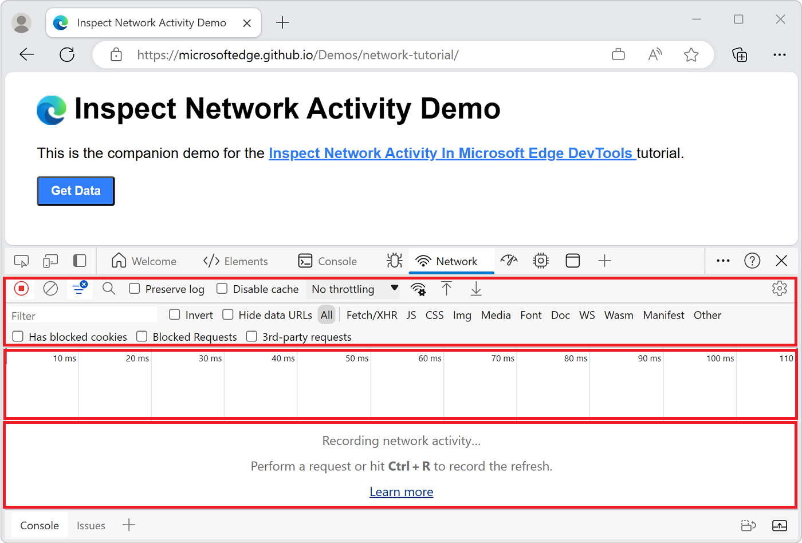

<!-- Copyright Kayce Basques

   Licensed under the Apache License, Version 2.0 (the "License");
   you may not use this file except in compliance with the License.
   You may obtain a copy of the License at

       https://www.apache.org/licenses/LICENSE-2.0

   Unless required by applicable law or agreed to in writing, software
   distributed under the License is distributed on an "AS IS" BASIS,
   WITHOUT WARRANTIES OR CONDITIONS OF ANY KIND, either express or implied.
   See the License for the specific language governing permissions and
   limitations under the License. -->
# Inspect network activity

Use the **Network** tool to make sure the resources your webpage needs to run are downloaded as expected and that the requests to server-side APIs are sent correctly.  Inspect the properties of individual HTTP requests and responses, such as the HTTP headers, content, or size.

This is a step-by-step tutorial walkthrough of the **Network** tool, for inspecting network activity for a page.

For an overview of the network-related DevTools features, see [Network features reference](reference.md).

For a video version of this tutorial, view the following video:

<!-- TODO: entire section needs a Microsoft Edge DevTools rewrite  -->

<!-- ====================================================================== -->
## When to use the Network tool

In general, use the **Network** tool when you need to make sure that resources are being downloaded correctly and requests to server-side APIs are being sent as expected.  The most common use cases for the **Network** tool are:

*  Making sure that resources are actually being downloaded at all.

*  Verifying the request parameters and responses of server-side API calls.

If you're looking for ways to improve page load performance, the **Network** tool can help understand how much data is being downloaded and how long it takes to download it, but there are many other types of load performance issues that aren't related to network activity.  To further investigate page load performance issues, you can use the **Performance tool**, the **Issues** tool, and the **Lighthouse** tool, because it gives you targeted suggestions on how to improve your page.  For example, see [Optimize website speed using Lighthouse](../speed/get-started.md).

<!-- ====================================================================== -->
## Open the Network tool

To get the most out of this tutorial, open the demo and try out the features on the demo page.

1. Open the [Inspect Network Activity Demo](https://microsoftedge.github.io/Demos/network-tutorial/) in a new tab or window:

   

   <!-- You can view the source files for this demo in the [MicrosoftEdge/Demos > devtools-css-get-started](https://github.com/MicrosoftEdge/Demos/tree/main/network-tutorial) repo folder: -->

   <!--
   
   -->

1. To open DevTools, right-click the webpage, and then select **Inspect**.  Or, press **Ctrl+Shift+J** (Windows, Linux) or **Command+Option+J** (macOS).  DevTools opens.

1. In DevTools, on the **Activity Bar**, select the **Network** tab.  If that tab isn't visible, click the **More tools** () button:

   You might prefer to [dock DevTools to the bottom of your window](../customize/placement.md):

   

The **Network** tool is initially empty.  DevTools only logs network activity after you open it, and no network activity has occurred since you opened DevTools.

<!-- ====================================================================== -->
## Understand the Network tool user interface

The Network tool is divided in three main parts:

* The top toolbar contains options to customize the tool and filter network requests.
* Below the top toolbar, the **Overview** graph provides a high-level overview of the network traffic over time and allows to filter network requests.
* Below the **Overview** graph, the **Network Log** section shows the network activity and allows to inspect individual requests.

<!-- ====================================================================== -->
## Log network activity

To view the network activity that a page causes:

1. Refresh the webpage.  The **Network** tool logs all network activity in the **Network Log**:

   

   Each row of the **Network Log** represents a resource.  By default the resources are listed chronologically.  The top resource is usually the main HTML document.  The bottom resource is whatever was requested last.

   Each column represents information about a resource.  In the previous figure, the default columns are displayed.

    *  **Status**.  The HTTP status code for response.

    *  **Type**.  The resource type.

    *  **Initiator**.  The cause of the resource request.  Clicking a link in the **Initiator** column takes you to the source code that caused the request.

    *  **Time**.  The duration of the request.

    *  **Waterfall**.  A graphical representation of the different stages of the request.  To display a breakdown, hover over a **Waterfall**.

    Note that the **Overview** graph also shows network activity.  You won't use the **Overview** graph in this tutorial, so you can hide it.  See [Hide the Overview pane](reference.md#hide-the-overview-pane).

   After you open DevTools, it records network activity in the **Network Log**.

1. To demonstrate this, first look at the bottom of the **Network Log** and make a mental note of the last activity.

1. Now, click the **Get Data** button in the demo.

1. Look at the bottom of the **Network Log** again.  A new resource named `getstarted.json` is displayed:

   

<!-- ====================================================================== -->
## Show more information

The columns of the Network Log are configurable.  You can hide columns that you aren't using.  There are also many columns that are hidden by default which you might find useful.

1. Right-click the header of the Network Log table, and then select **Domain**.  The domain of each resource is now shown:

   

1. To see the full URL of a resource, hover over its cell in the **Name** column.

<!-- ====================================================================== -->
## Simulate a slower network connection

The network connection of the computer that you use to build sites is probably faster than the network connections of the mobile devices of your users.  By throttling the page, you get a better idea of how long a page takes to load on a mobile device.

1. Select the **Throttling** dropdown list in the top toolbar. It is set to **No throttling** by default.

1. Select **Slow 3G**:

   

1. Long-press **Reload** () (or right-click **Refresh**) and then select **Empty cache and hard refresh**:

   

On repeat visits, the browser usually serves some files from the [cache](https://developer.mozilla.org/docs/Web/HTTP/Caching), which speeds up the page load.  **Empty cache and hard refresh** forces the browser to go the network for all resources.  Use it to display how a first-time visitor experiences a page load.

The **Empty cache and hard refresh** workflow is only available when DevTools is open.

See also [Emulate slow network connections](../network/reference.md#emulate-slow-network-connections) in _Network features reference_.

<!-- ====================================================================== -->
## Capture screenshots

Screenshots display how a webpage looks over time while it loads.

1. Click the () button and then select the **Capture screenshots** checkbox:

   

1. Refresh the page again using the **Empty cache and hard refresh** workflow.  See [Simulate a slower connection](#simulate-a-slower-network-connection) above if you need a reminder on how to do this.

   The **Screenshots** panel provides thumbnails of how the page looked at various points during the loading process:

   

1. Click the first thumbnail.  DevTools shows you what network activity was occurring at that moment in time:

   

1. Click () again and turn off the **Capture screenshots** checkbox to close the **Screenshots** pane.

1. Refresh the page again.

<!-- ====================================================================== -->
## Inspect the details of the resource

Select a resource to learn more information about it.

1. Select `network-tutorial/`.  The **Headers** panel is shown.  Use this panel to inspect HTTP headers:

   

1. Select the **Preview** panel.  A basic rendering of the HTML is shown:

   

    The panel is helpful when an API returns an error code in HTML.  You might find it easier to read the rendered HTML than the HTML source code, or when you inspect images.

1. Select the **Response** panel.  The HTML source code is shown:

   

   Tip: When a file is minified, select the **Format** () button at the bottom of the **Response** panel to re-format the contents of the file for readability.

   For example, if the response contains minified JSON data, click the **Format** button to re-format the JSON syntax so that each object property is on its own line. You can also use the **JSON viewer** to view formatted and highlighted JSON responses in a browser tab. See [View formatted JSON](../json-viewer/json-viewer.md).

1. Select the **Timing** panel.  A breakdown of the network activity for the resource is displayed:

   

1. Click **Close** () to view the Network Log again:

   

<!-- ====================================================================== -->
## Search network headers and responses

Use the **Search** pane when you need to search the HTTP headers and responses of all resources for a certain string or regular expression.

For example, suppose you want to verify that your resources are using reasonable **cache policies**.<!--[cache policies](../../../web/tools/lighthouse/audits/cache-policy) -->

<!--TODO: add cache policies section when available  -->

1. Select **Search** ().  The Search pane opens to the left of the Network log:

   

1. Type `no-cache` and press **Enter**.  The Search pane lists all instances of `no-cache` that it finds in resource headers or content:

   

1. Click a result to view the resource in which the result was found.  If you are looking at the details of the resource, select a result to go directly to it.  For example, if the query was found in a header, the **Headers** panel opens.   If the query was found in content, the **Response** panel opens:

   

1. Close the Search pane and the **Headers** panel.

<!-- ====================================================================== -->
## Filter resources

DevTools provides numerous workflows for filtering out resources that aren't relevant to the task at hand.

The **Filters** toolbar should be turned on by default.  If the **Filters** toolbar isn't on, click **Filter** () to show it:

### Filter by string, regular expression, or property

The **Filter** text box supports many different types of filtering.

1. Type `png` into the **Filter** text box.  Only the files that contain the text `png` are shown.  In this case the only files that match the filter are the PNG images.

1. Type `/.*\.[cj]s+$/`, which is a JavaScript regular expression.  DevTools filters out any resource with a filename that doesn't end with a `j` or a `c` followed by 1 or more `s` characters.

1. Type `-main.css`.  DevTools filters out `main.css`.  If any file matches that pattern, it's also filtered out.

1. Type `larger-than:1000` into the **Filter** text box.  DevTools filters out any resource with responses that are smaller than 1000 bytes.

   For the full list of filterable properties, see [Filter requests by properties](reference.md#filter-requests-by-properties).

1. Clear the **Filter** text box of any text.

### Filter by resource type

To focus in on a certain type of file, such as stylesheets:

1. Select **CSS**.  All other file types are filtered out:

   

1. To also display scripts, press and hold **Ctrl** (Windows, Linux) or **Command** (macOS), and then click **JS**.

1. To remove the filters and display all resources again, select **All**.

For other filtering workflows, see [Filter requests](reference.md#filter-requests).

<!-- ====================================================================== -->
## Block requests

How does a page look and behave when some of the page resources aren't available?  Does it fail completely, or is it still somewhat functional?  Block requests to find out:

1. Press **Ctrl+Shift+P** (Windows, Linux) or **Command+Shift+P** (macOS) to open the **Command Menu**.

1. Type `block`, select **Show Network request blocking**, and then press **Enter**:

   

1. Click **Add Pattern** (), then type `main.css`, and then click **Add**:

   

1. Refresh the page.  As expected, the styling of the page is slightly messed up, because the main stylesheet has been blocked.

   In the `main.css` row in the Network Log, the red text means that the resource was blocked:

   

1. Clear the **Enable network request blocking** checkbox.

<!-- ====================================================================== -->
## Conclusion

Congratulations, you have completed the tutorial!  You now know how to use the **Network** tool in Microsoft Edge DevTools.

To discover more DevTools features related to inspecting network activity, see [Network features reference](reference.md).

<!-- ====================================================================== -->
> [!NOTE]
> Portions of this page are modifications based on work created and [shared by Google](https://developers.google.com/terms/site-policies) and used according to terms described in the [Creative Commons Attribution 4.0 International License](https://creativecommons.org/licenses/by/4.0).
> The original page is found [here](https://developer.chrome.com/docs/devtools/network/) and is authored by [Kayce Basques](https://developers.google.com/web/resources/contributors#kayce-basques) (Technical Writer, Chrome DevTools \& Lighthouse).

This work is licensed under a [Creative Commons Attribution 4.0 International License](https://creativecommons.org/licenses/by/4.0).
