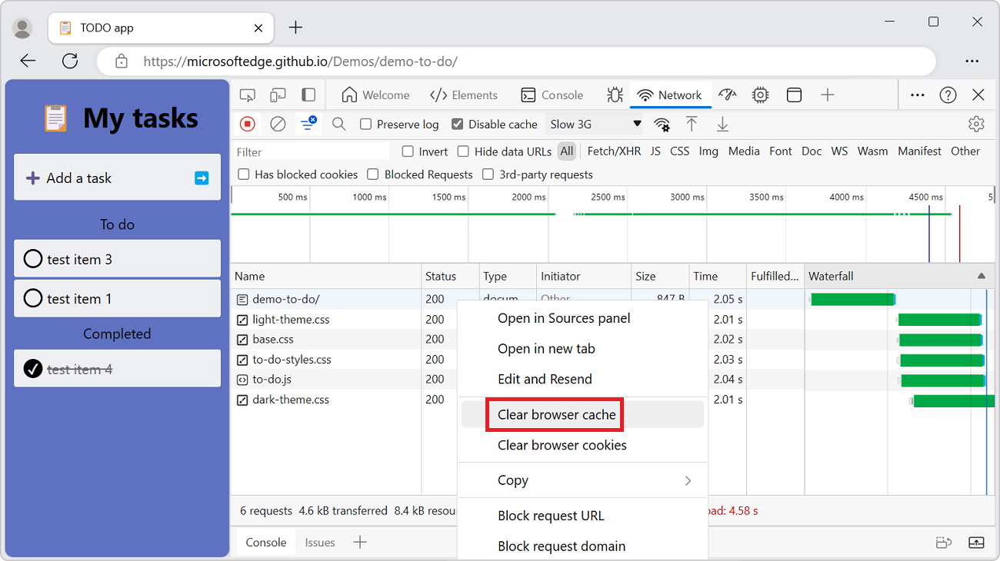
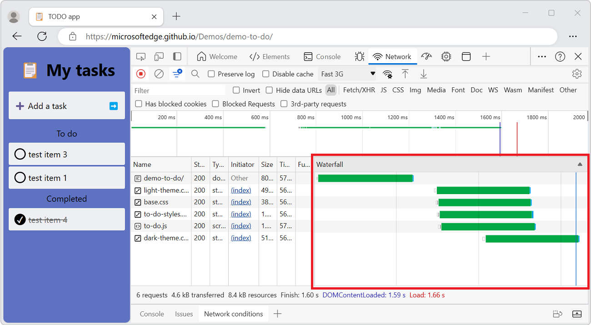
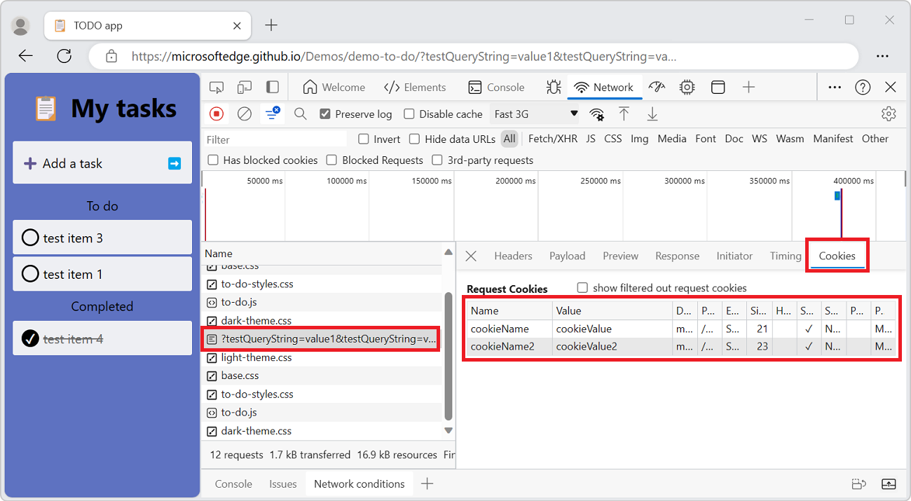
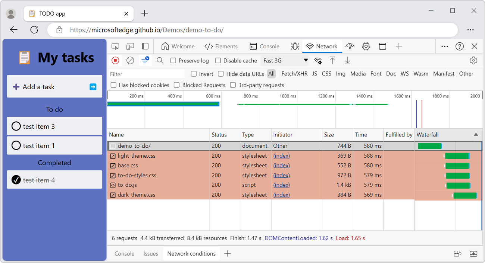
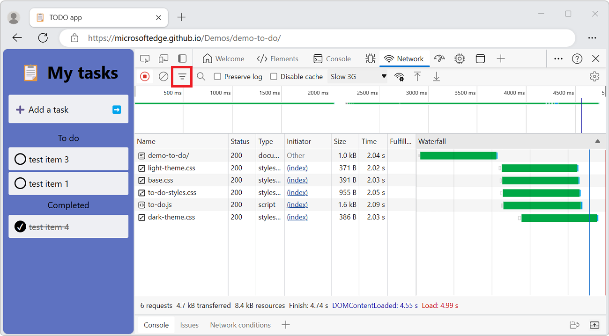

<!-- Copyright Kayce Basques

   Licensed under the Apache License, Version 2.0 (the "License");
   you may not use this file except in compliance with the License.
   You may obtain a copy of the License at

       https://www.apache.org/licenses/LICENSE-2.0

   Unless required by applicable law or agreed to in writing, software
   distributed under the License is distributed on an "AS IS" BASIS,
   WITHOUT WARRANTIES OR CONDITIONS OF ANY KIND, either express or implied.
   See the License for the specific language governing permissions and
   limitations under the License.  -->
# Network features reference

This article is a feature-driven inventory of the **Network** tool.  Use the **Network** tool to inspect network activity for a webpage.  For a step-by-step walkthrough and introduction to the **Network** tool, see [Inspect network activity](index.md).


<!-- -------------- -->
**Detailed contents:**
<!-- omit h6 (3rd level).  compare Table of contents in https://developer.chrome.com/docs/devtools/network/reference/ -->

* [Record network requests](#record-network-requests)
   * [Stop recording network requests](#stop-recording-network-requests)
   * [Clear requests](#clear-requests)
   * [Save requests across page loads](#save-requests-across-page-loads)
   * [Capture screenshots during page load](#capture-screenshots-during-page-load)
* [Change loading behavior](#change-loading-behavior)
   * [Emulate a first-time visitor by disabling the browser cache](#emulate-a-first-time-visitor-by-disabling-the-browser-cache)
   * [Manually clear the browser cache](#manually-clear-the-browser-cache)
   * [Emulate offline](#emulate-offline)
   * [Emulate slow network connections](#emulate-slow-network-connections)
   * [Manually clear browser cookies](#manually-clear-browser-cookies)
   * [Override the user agent](#override-the-user-agent)
* [Set user agent client hints](#set-user-agent-client-hints)
* [Filter requests](#filter-requests)
   * [Filter requests by properties](#filter-requests-by-properties)
   * [Filter requests by type](#filter-requests-by-type)
   * [Filter requests by time](#filter-requests-by-time)
   * [Hide data URLs](#hide-data-urls)
* [Sort requests](#sort-requests)
   * [Sort by column](#sort-by-column)
   * [Sort by activity phase](#sort-by-activity-phase)
* [Analyze requests](#analyze-requests)
   * [Display the timing relationship of requests](#display-the-timing-relationship-of-requests)
   * [Display a preview of a response body](#display-a-preview-of-a-response-body)
   * [Display a response body](#display-a-response-body)
   * [Display HTTP headers](#display-http-headers)
   * [Display query string parameters](#display-query-string-parameters)
   * [Display cookies](#display-cookies)
   * [Display the timing breakdown of a request](#display-the-timing-breakdown-of-a-request)
   * [Display initiators and dependencies](#display-initiators-and-dependencies)
   * [Display load events](#display-load-events)
   * [Display the total number of requests](#display-the-total-number-of-requests)
   * [Display the total download size](#display-the-total-download-size)
   * [Display the stack trace that caused a request](#display-the-stack-trace-that-caused-a-request)
   * [Display the uncompressed size of a resource](#display-the-uncompressed-size-of-a-resource)
* [Export requests data](#export-requests-data)
   * [Save all network requests to a HAR file](#save-all-network-requests-to-a-har-file)
   * [Copy one or more requests to the clipboard](#copy-one-or-more-requests-to-the-clipboard)
   * [Copy formatted response JSON to the clipboard](#copy-formatted-response-json-to-the-clipboard)
   * [Copy property values from network requests to your clipboard](#copy-property-values-from-network-requests-to-your-clipboard)
* [Change the layout of the Network panel](#change-the-layout-of-the-network-panel)
   * [Hide the Filters pane](#hide-the-filters-pane)
   * [Big request rows](#big-request-rows)
   * [Hide the Overview pane](#hide-the-overview-pane)


<!-- ====================================================================== -->
## Record network requests

By default, DevTools records all network requests in the **Network** tool, so long as DevTools is open.


<!-- ------------------------------ -->
#### Stop recording network requests

To stop recording requests:

1. On the **Network** tool, click **Stop recording network log** ().  It turns grey to indicate that DevTools is no longer recording requests.

1. Press **Ctrl+E** (Windows, Linux) or **Command+E** (macOS) while the **Network** tool is in focus.


<!-- ------------------------------ -->
#### Clear requests

To clear all requests from the Requests table, in the **Network** tool, click the **Clear network log** () button:


Or, press **Ctrl+L** (Windows, Linux, macOS) or **Command+K** (macOS) while the **Network** tool has focus.


<!-- ------------------------------ -->
#### Save requests across page loads

To save requests across page loads, on the **Network** tool, select the **Preserve log** checkbox:


DevTools saves all requests until you disable **Preserve log**.


<!-- ------------------------------ -->
#### Capture screenshots during page load

You can capture screenshots to analyze what's displayed for users while waiting for your page to load.

To enable screenshots:

1. In DevTools, open the **Network** tool.

1. In the upper right within the **Network** tool, click the **Network settings** (gear) icon.  A row of checkboxes appears.

1. Select the **Capture screenshots** checkbox:

   

To capture a screenshot:

1. While the **Network** tool has focus, press **Ctrl+F5** to refresh the page.  Screenshots are captured during the page load and thumbnails are shown below the row of checkboxes.

   You can interact with the screenshots as follows.

1. Hover over a screenshot to display the point at which that screenshot was captured.  A yellow vertical line is displayed on the **Overview** chart pane.

   

1. Click the thumbnail of a screenshot to filter out any requests that occurred after the screenshot was captured.

1. Double-click a screenshot thumbnail to zoom-in and view the screenshot.
 
1. Press **Esc** to close the screenshot viewer.

<!--  ### Replay XHR request  -->

<!--  To replay an XHR request, right-click the request in the Requests table, and then click **Replay XHR**.  -->

<!--

-->


<!-- ====================================================================== -->
## Change loading behavior


<!-- ------------------------------ -->
#### Emulate a first-time visitor by disabling the browser cache

To emulate how a first-time user experiences your site, turn on the **Disable cache** checkbox.  DevTools disables the browser cache.  This feature more accurately emulates a first-time user's experience, because requests are served from the browser cache on repeat visits.

The **Disable Cache** checkbox:


<!-- ---------- -->
###### Disable the browser cache from the Network conditions tool

From the **Network** tool, you can open the **Network conditions** tool in the **Quick View** panel and then disable the browser cache from there:

1. In the **Network** tool, click the **More network conditions** ( button.  The **Network conditions** tool opens in the **Quick View** panel.

1. In the **Network conditions** tool, select the **Disable cache** checkbox:

   

See also:
* [Network conditions tool](../network-conditions/network-conditions-tool.md)


<!-- ------------------------------ -->
#### Manually clear the browser cache

To manually clear the browser cache at any time, right-click anywhere in the **Requests** table, and then select **Clear browser cache**:




<!-- ------------------------------ -->
#### Emulate offline

A class of web apps, named [Progressive Web Apps](../progressive-web-apps/index.md) (PWA), are able to function offline with the help of **service workers**.<!-- [service workers](/web/fundamentals/getting-started/primers/service-workers) --> You may find it useful to quickly simulate a device that has no data connection, when you are building this type of app.

To simulate an offline network experience, select the **No throttling** dropdown menu > **Presets** > **Offline**.

The **Offline** dropdown menu:


<!-- ------------------------------ -->
#### Emulate slow network connections

Emulate Slow 3G, Fast 3G, and other connection speeds from the **No throttling** dropdown menu.

The **Throttling** dropdown menu:


You can choose from different presets, such as Slow 3G or Fast 3G.  To add your own custom presets, open the Throttling menu, and select **Custom** > **Add**.

DevTools displays a warning icon next to the **Network** tool to remind you that throttling is enabled.

See also [Simulate a slower network connection](../network/index.md#simulate-a-slower-network-connection) in _Inspect network activity_.


<!-- ---------- -->
###### Emulate slow network connections from the Network Conditions tool

From the **Network** tool, you can open the **Network conditions** tool in the **Quick View** panel and then throttle the network connection from there:

1. In the **Network** tool, click the **More network conditions** ( button.  The **Network conditions** tool opens in the **Quick View** panel.

1. In the **Network conditions** tool, in the **Network throttling** menu, select a connection speed.

See also:
* [Network conditions tool](../network-conditions/network-conditions-tool.md)


<!-- ------------------------------ -->
#### Manually clear browser cookies

To manually clear browser cookies at any time, right-click anywhere in the Requests table, and then select **Clear browser cookies**.


<!-- ------------------------------ -->
#### Override the user agent

To manually override the user agent:

1. In the **Network** tool, click the **More network conditions** ( button.  The **Network conditions** tool opens in the **Quick View** panel.

1. In the **Network conditions** tool, clear the **Use browser default** checkbox.  The other controls become available.

1. Select a user agent option from the menu, or enter a custom user agent in the text box.


<!-- ====================================================================== -->
## Set user agent client hints

If your site employs user agent client hints and you want to test them, you can set them either in the **Network conditions** tool or in [Emulate mobile devices (Device Emulation)](../device-mode/index.md).

To set user agent client hints in the **Network conditions** tool:

1. In the **Network** tool, click the **More network conditions** ( button.  The **Network conditions** tool opens in the **Quick View** panel.

1. In the **User agent** section, clear the **Use browser default** checkbox, and then expand **User agent client hints**:

   

1. In the **User agent** dropdown list, select a predefined browser and device.  Or, accept the default value of **Custom...**, and enter information in the **Enter a custom user agent** text box.

1. For either choice (predefined or custom), specify user agent client hints as follows:
   * **Brand** and **Version** such as *Edge* and *92*.  To add multiple brand/version pairs, click **+ Add Brand**.
   * **Full Browser Version** such as *92.0.1111.0*.
   * **Platform** and **Version** such as *Windows* and *10.0*.
   * **Architecture** such as *x86*.
   * **Device model** such as *Galaxy Nexus*.

   You can set or change any of the user agent client hints; there are no required values.

1. Select **Update**.

1. To verify changes, click **Console** and type `navigator.userAgentData`.  Expand the results as needed to view changes to user agent data.

See also:
* [User-Agent Client Hints](../../web-platform/user-agent-guidance.md#user-agent-client-hints) in _Detecting Microsoft Edge from your website_.


<!-- ====================================================================== -->
## Filter requests

You can filter requests by properties, by type, or by time, and you can hide data URLs.


<!-- ------------------------------ -->
#### Filter requests by properties

Use the **Filter** text box to filter requests by properties, such as the domain or size of the request.

If the text box isn't displayed, the **Filters** pane is probably hidden.
For more information, see [Hide the Filters pane](#hide-the-filters-pane).

The **Filter** text box:


You can use multiple properties simultaneously by separating each property with a space.  For example, `mime-type:image/png larger-than:1K` displays all PNGs that are larger than 1 kilobyte.  The multi-property filters are equivalent to `AND` operations.  `OR` operations are currently not supported.

The complete list of supported properties:

| Property | Details |
|:--- | :--- |
| `domain` | Only display resources from the specified domain.  You can use a wildcard character (`*`) to include multiple domains.  For example, `*.com` displays resources from all domain names ending in `.com`.  DevTools populates the autocomplete dropdown menu with all of the domains that are found. |
| `has-response-header` | Displays the resources that contain the specified HTTP response header.  DevTools populates the autocomplete dropdown menu with all of the response headers that are found. |
| `is` | Use `is:running` to find `WebSocket` resources. |
| `larger-than` | Displays resources that are larger than the specified size, in bytes.  Setting a value of `1000` is equivalent to setting a value of `1k`. |
| `method` | Displays resources that were retrieved over a specified HTTP method type.  DevTools populates the dropdown menu with all of the HTTP methods  that are found. |
| `mime-type` | Displays resources of a specified MIME type.  DevTools populates the dropdown menu with all MIME types  that are found. |
| `mixed-content` | Show all mixed content resources (`mixed-content:all`) or just the ones that are currently displayed (`mixed-content:displayed`). |
| `scheme` | Displays resources retrieved over unprotected HTTP (`scheme:http`) or protected HTTPS (`scheme:https`). |
| `set-cookie-domain` | Displays resources that have a `Set-Cookie` header with a `Domain` attribute that matches the specified value.  DevTools populate the autocomplete with all of the cookie domains that are found. |
| `set-cookie-name` | Displays resources that have a `Set-Cookie` header with a name that matches the specified value.  DevTools populate the autocomplete with all of the cookie names that are found. |
| `set-cookie-value` | Displays resources that have a `Set-Cookie` header with a value that matches the specified value.  DevTools populate the autocomplete with all of the cookie values that are found. |
| `status-code` | Displays resources that match the specific HTTP status code.  DevTools populates the autocomplete dropdown menu with all of the status codes that are found. |


<!-- ------------------------------ -->
#### Filter requests by type

To filter requests by request type, click the buttons on the **Network** panel:
*  **XHR**
*  **JS**
*  **CSS**
*  **Img**
*  **Media**
*  **Font**
*  **Doc**
*  **WS** - WebSocket.
*  **Manifest**
*  **Other** - Any other type not listed here.

If the buttons don't appear, the **Filters** pane might be hidden.  See [Hide the Filters pane](#hide-the-filters-pane).

To enable multiple type filters simultaneously, press and hold **Ctrl** (Windows, Linux) or **Command** (macOS) and then click the filters.

Use the **Type** filters to display JS, CSS, and Document resources:


<!-- ------------------------------ -->
#### Filter requests by time

Click and drag left or right on the **Overview** pane to only display requests that were active during that time frame.  The filter is inclusive.  Any request that was active during the highlighted time is shown.

Filtering out any requests that were inactive around 300 ms:


<!-- ------------------------------ -->
#### Hide data URLs

[Data URLs](https://developer.mozilla.org/docs/Web/HTTP/Basics_of_HTTP/Data_URIs) are small files embedded into other documents.  Any request that displays in the Requests table that starts with `data:` is a data URL.

To hide the requests, turn off the **Hide data URLs** checkbox:


<!-- ====================================================================== -->
## Sort requests

By default, the requests in the Requests table are sorted by initiation time, but you can sort the table using other criteria.


<!-- ------------------------------ -->
#### Sort by column

Click the header of any column in the Requests to sort requests by that column.


<!-- ------------------------------ -->
#### Sort by activity phase

To change how the Waterfall sorts requests:

* Right-click the header of the Requests table, click **Waterfall**, and then select one of the following options:

   * **Start Time** - The first request that was initiated is placed at the top.
   
   * **Response Time** - The first request that started downloading is placed at the top.
   
   * **End Time** - The first request that finished is placed at the top.
   
   * **Total Duration** - The request with the shortest connection settings and request or response is placed at the top.
   
   * **Latency** - The request that waited the shortest time for a response is placed at the top.
      
These descriptions assume that each respective option is ranked from shortest to longest.  Click the header of the **Waterfall** column to reverse the order.

The following shows sorting the Waterfall by total duration.  The lighter portion of each bar is time spent waiting and the darker portion is time spent downloading bytes:


<!-- ====================================================================== -->
## Analyze requests

So long as DevTools is open, it logs all requests in the **Network** tool.  Use the **Network** tool to analyze requests.


<!-- ------------------------------ -->
#### Display a log of requests

Use the **Requests** table to display a log of all requests made while DevTools has been open.  To reveal more information about each item, click or hover on requests.


The Requests table displays the following columns by default:

- **Name**. The filename of, or an identifier for, the resource.
- **Status**. The HTTP status code.
- **Type**. The MIME type of the requested resource.
- **Initiator**. The following objects or processes can initiate requests:
  - **Parser**. The HTML parser.
  - **Redirect**. An HTTP redirect.
  - **Script**. A JavaScript function.
  - **Other**. Some other process or action, such as navigating to a page via a link or entering a URL in the address bar.
- **Size**. The combined size of the response headers plus the response body, as delivered by the server.
- **Time**. The total duration, from the start of the request to the receipt of the final byte in the response.
- **Fulfilled by**. Whether the request was fulfilled by the HTTP cache or the app's service worker.
- [Waterfall](#display-the-timing-relationship-of-requests). A visual breakdown of each request's activity.


<!-- ---------- -->
###### Add or remove columns

Right-click the header of the Requests table and select a column name to hide or show it.  The currently displayed columns have checkmarks next to them.


<!-- ---------- -->
###### Add columns for response headers

To add a custom column to the Requests table, right-click the header of the Requests table and then select **Response Headers** > **Manage Header Columns**. The **Manage Header Columns** popup window opens.  Click the **Add custom header** button, enter the custom header name, and then click **Add**. 


<!-- ------------------------------ -->
#### Display the timing relationship of requests

Use the Waterfall to display the timing relationships of requests.  The default organization of the Waterfall uses the start time of the requests.  So, requests that are farther to the left started earlier than the requests that are farther to the right.

To see the different ways that you can sort the Waterfall, go to [Sort by activity phase](#sort-by-activity-phase).

The Waterfall column of the **Requests** pane:



<!-- ### Analyze the frames of a WebSocket Connection  -->

<!--To view the frames of a WebSocket connection:

1. Click the URL of the WebSocket connection, under the **Name** column of the Requests table.
1. Click the **Frames** panel.  The table shows the last 100 frames.

To refresh the table, re-select the name of the WebSocket connection under the **Name** column of the Requests table.  -->

<!--

-->

<!--The table contains the following three columns.

*  **Data**.  The message payload.  If the message is plain text, it is displayed here.  For binary opcodes, this column displays the name and code of the opcode.  The following opcodes are supported: Continuation Frame, Binary Frame, Connection Close Frame, Ping Frame, and Pong Frame.
*  **Length**.  The length of the message payload, in bytes.
*  **Time**.  The time when the message was received or sent.  -->

<!--Messages are color-coded according to each type.

*  Outgoing text messages are light-green.
*  Incoming text messages are white.
*  WebSocket opcodes are light-yellow.
*  Errors are light-red.  -->


<!-- ------------------------------ -->
#### Display a preview of a response body

To preview the contents of an HTTP response body:

1. In the Request table, click the name of the request.
1. In the sidebar, select the **Preview** tab:

   


<!-- ------------------------------ -->
#### Display a response body

To display the response body to a request:

1. In the Request table, click the name of the request.
1. In the sidebar, select the **Response** tab:

   


<!-- ------------------------------ -->
#### Display HTTP headers

To display HTTP header data about a request:

1. In the Request table, click the name of the request.
1. In the sidebar, select the **Headers** tab:

   


<!-- ----------
###### Display HTTP header source
this feature doesn't exist anymore

By default, the **Headers** panel shows header names alphabetically.  To display the HTTP header names in the order received:

1. Open the **Headers** panel for the request that interests you.  For more information, see [Display HTTP headers](#display-http-headers).

1. Click **view source**, next to the **Request Header** or **Response Header** section. -->


<!-- ------------------------------ -->
#### Display query string parameters

To display the query string parameters of an HTTP request in a human-readable format:

1. In the Request table, click the name of the request.
1. In the sidebar, select the **Payload** tab:

  

   To display the source of the query string parameters instead, click **view source**.


<!-- ---------- -->
###### Display URL-encoded query string parameters

To display query string parameters in a human-readable format, but with encodings preserved:

1. In the Request table, click the name of the request.
1. In the sidebar, select the **Payload** tab.
1. Click **view URL-encoded**.


<!-- ------------------------------ -->
#### Display cookies

To display the cookies sent in the HTTP header of a request:

1. In the Request table, click the name of the request.
1. In the sidebar, select the **Cookies** tab:

   

<!--For more information about each of the columns, see [Fields](manage-data/cookies#fields).  TODO: add link when section is available -->


<!-- ------------------------------ -->
#### Display the timing breakdown of a request

To display the timing breakdown of a request:

1. In the Request table, click the name of the request.
1. In the sidebar, select the **Timing** tab.

   

For a faster way to access the data, see [Preview a timing breakdown](#preview-a-timing-breakdown).

For more information about each of the phases that may be displayed in the **Timing** panel, see [Timing breakdown phases explained](#timing-breakdown-phases-explained).


<!-- ---------- -->
###### Preview a timing breakdown

To display a preview of the timing breakdown of a request, in the **Waterfall** column of the Requests table, hover on the entry for the request.

Previewing the timing breakdown of a request:


To view the data without hovering, see the top of the present section, [Display the timing breakdown of a request](#display-the-timing-breakdown-of-a-request).


<!-- ---------- -->
###### Timing breakdown phases explained

Each of these phases may appear in the **Timing** tab:

- **Queueing**. The browser queues requests when any of the following are true
  - There are higher priority requests.
  - There are already six TCP connections open for this origin, which is the limit. Applies to HTTP/1.0 and HTTP/1.1 only.
  - The browser is briefly allocating space in the disk cache.

- **Stalled**. The request could be stalled for any of the reasons described in **Queueing**.

- **DNS Lookup**. The browser is resolving the IP address for the request.

- **Initial connection**. The browser is establishing a connection, including TCP handshakes and retries and negotiating a Secure Socket Layer (SSL).

- **Proxy negotiation**. The browser is negotiating the request with a [proxy server](https://wikipedia.org/wiki/Proxy_server).

- **Request sent**. The request is being sent.

- **ServiceWorker Preparation**. The browser is starting up the service worker.

- **Request to ServiceWorker**. The request is being sent to the service worker.

- **Waiting (TTFB)**. The browser is waiting for the first byte of a response. TTFB stands for _Time To First Byte_. This timing includes one round trip of latency and the time the server took to prepare the response.

- **Content Download**. The browser is receiving the response.

- **Receiving Push**. The browser is receiving data for this response via HTTP/2 Server Push.

- **Reading Push**. The browser is reading the local data that was previously received.


<!-- ------------------------------ -->
#### Display initiators and dependencies

To display the initiators and dependencies of a request, hold **Shift** and hover on the request in the **Requests** table.

*  The requests that initiated the hovered request are shown in green.
*  The dependencies of the hovered requests are shown in red.



When the Requests table is ordered chronologically, if you hover on a line, the line preceding it displays a green request.  The green request is the initiator of the dependency.  If another green request is displayed on the line before that, that higher request is the initiator of the initiator.  And so on.


<!-- ------------------------------ -->
#### Display load events

DevTools displays the timing of the `DOMContentLoaded` and `load` events in multiple places on the **Network** tool:

* In the **Overview** pane with vertical lines.
* In the **Waterfall** column of the Request table with vertical lines.
* In the **Summary** pane, at the bottom of the **Network** tool, with timing labels.

The `DOMContentLoaded` event is colored blue, and the `load` event is red.


<!-- ------------------------------ -->
#### Display the total number of requests

The total number of requests is listed in the **Summary** pane, at the bottom of the **Network** tool.


> [!CAUTION]
> This number only tracks requests that have been logged since DevTools was opened.  If other requests occurred before DevTools was opened, those requests aren't counted.


<!-- ------------------------------ -->
#### Display the total download size

The total download size of requests is listed in the **Summary** pane, at the bottom of the **Network** tool.


> [!CAUTION]
> This number only tracks requests that have been logged since DevTools was opened.  If other requests occurred before DevTools was opened, the previous requests aren't counted.

To verify how large resources are after the browser uncompresses each item, see [display the uncompressed size of a resource](#display-the-uncompressed-size-of-a-resource).


<!-- ------------------------------ -->
#### Display the stack trace that caused a request

After a JavaScript statement requests a resource, hover on the **Initiator** column to display the stack trace leading up to the request.


<!-- [codepen.io/contoso/pen/yLBrOWa?editors=0010#0](https://codepen.io/contoso/pen/yLBrOWa?editors=0010#0) -->

<!--
```javascript
function init() {
  getData();
}

function getData() {
  fetch('https://httpbin.org/get?message=hi');
}

init();
```
-->


<!-- ------------------------------ -->
#### Display the uncompressed size of a resource

To see both the transferred size and the uncompressed size of a resource at the same time:

1. In the upper right within the **Network** tool, click the **Network settings** (gear) icon.  A row of checkboxes appears.

1. Turn on the **Big request rows** checkbox.

1. Examine the **Size** column in the Request table. The top value is the transferred size, and the bottom value is the size of the resource after the browser uncompresses it:

   


<!-- ====================================================================== -->
## Export requests data


<!-- ------------------------------ -->
#### Save all network requests to a HAR file

To save all network requests to a HAR file:

1. In the **Requests** table, right-click a request and then select **Save all as HAR with Content**.

   

1. DevTools saves all requests that have occurred since you opened DevTools to the HAR file.  You can't filter requests, and you can't save a single request.

Once you save a HAR file, you can import it back into DevTools for analysis by drag-and-dropping the HAR file into the **Requests** table.
<!--For more information, see also [HAR Analyzer](https://toolbox.alphabetapps.com/apps/har_analyzer)  Todo: add section link when content is available  -->


<!-- ------------------------------ -->
#### Copy one or more requests to the clipboard

Under the **Name** column of the Requests table, right-click a request, click **Copy**, and then select one of the following options:

| Name | Details |
| --- | --- |
| **Copy Link Address** | Copy the URL of the request to the clipboard. |
| **Copy Response** | Copy the response body to the clipboard. |
| **Copy as Fetch** | &nbsp; |
| **Copy as cURL** | Copy the request as a cURL command. |
| **Copy All as Fetch** | &nbsp; |
| **Copy All as cURL** | Copy all requests as a chain of cURL commands. |
| **Copy All as HAR** | Copy all requests as HAR data. |


<!-- ------------------------------ -->
#### Copy formatted response JSON to the clipboard

To copy the formatted JSON data of a JSON response:

1. In the Request table, click the name of the request that led to a JSON response.
1. In the sidebar, select the **Preview** tab.
1. Right-click the first line of the formatted JSON response preview and then select **Copy value**. 

   

   You can now paste the value into any editor to review it.


<!-- ------------------------------ -->
#### Copy property values from network requests to your clipboard

To copy property values from network requests to your clipboard:

1. In the Request table, click the name of the request.
1. In the sidebar, select the **Payload** tab:
1. Expand one of the following sections.
    *  Request payload (JSON)
    *  Form Data
    *  Query String Parameters
    *  Request Headers
    *  Response Headers
1. Right-click a value and then select **Copy value**.  You can now paste the value into any editor to review it.


<!-- ====================================================================== -->
## Change the layout of the Network panel

You can expand or collapse sections of the **Network** tool UI to focus important information.


<!-- ------------------------------ -->
#### Hide the Filters pane

By default, DevTools shows the **Filters** pane.  To hide the **Filters** pane, select **Filter** ().




<!-- ------------------------------ -->
#### Big request rows

Use big request rows when you want more whitespace in your network requests table. Some columns also provide a little more information when using large rows.  For example, the bottom value of the **Size** column is the uncompressed size of a request.

To enable large rows, select the **Big request rows** checkbox. An example of large request rows in the **Requests** pane:


<!-- ------------------------------ -->
#### Hide the Overview pane

By default, DevTools displays the **Overview** pane.  To hide the **Overview** pane, clear the **Show Overview** checkbox.


<!-- ====================================================================== -->
## See also

* [Inspect network activity](index.md) - step-by-step walkthrough and introduction to the **Network** tool.


<!-- ====================================================================== -->
> [!NOTE]
> Portions of this page are modifications based on work created and [shared by Google](https://developers.google.com/terms/site-policies) and used according to terms described in the [Creative Commons Attribution 4.0 International License](https://creativecommons.org/licenses/by/4.0).
> The original page is found [here](https://developer.chrome.com/docs/devtools/network/reference/) and is authored by [Kayce Basques](https://developers.google.com/web/resources/contributors#kayce-basques) (Technical Writer, Chrome DevTools \& Lighthouse).

[](https://creativecommons.org/licenses/by/4.0)
This work is licensed under a [Creative Commons Attribution 4.0 International License](https://creativecommons.org/licenses/by/4.0).
