# Overview of DevTools

<!-- icon clipboard below -->

<!-- ====================================================================== -->
<!-- keep sync'd:
* [Overview of DevTools](overview.md) - intro section
* [Microsoft Edge DevTools](../develop-web-microsoft-edge.md#microsoft-edge-devtools) in _Develop for the web with Microsoft Edge_
-->

The Microsoft Edge browser comes with built-in web development tools, called Microsoft Edge DevTools.  DevTools is a set of web development tools that appears next to a rendered webpage in the browser.  DevTools provides a powerful way to inspect and debug webpages and web apps.  You can even edit source files and create website projects, all within the DevTools environment.

With DevTools, you can do the following:

*  Inspect, tweak, and change the styles of elements in the webpage using live tools with a visual interface.  Inspect where the browser stored content to construct the webpage, including `.html`, `.css`, `.js`, and `.png` file formats.

*  Emulate how your website behaves on different devices and simulate a mobile environment, complete with different network conditions.  Inspect the network traffic and see the location of the problems.

*  Debug your JavaScript using breakpoint debugging and with the live console.  Find memory problems and rendering issues with your web apps.

*  Find accessibility, performance, compatibility, and security issues in your products, and use DevTools to fix the accessibility issues that are found.

*  Use a development environment to sync changes in DevTools with the file system and from the web.

<!-- /keep sync'd -->


<!-- ====================================================================== -->
## Open DevTools
<!-- keep sync'd:
[Open DevTools](../overview.md#open-devtools) in _Overview of DevTools_
[Open DevTools](accessibility/navigation.md#open-devtools) in _Navigate DevTools with assistive technology_
-->

In Microsoft Edge, you can open DevTools by using the mouse or keyboard, in any of the following ways.  Which tool is opened depends on how you open DevTools.

**Main ways:**

| Action | Resulting tool |
|---|---|
| Right-click any item on a webpage, and then select **Inspect**. | The **Elements** tool, with the DOM tree expanded to show the right-clicked page element. |
| Press **Ctrl+Shift+I** (Windows, Linux) or **Command+Option+I** (macOS).| The previously used tool, or the **Welcome** tool. |
| Press **F12**. | The previously used tool, or the **Welcome** tool. |

**Additional ways:**

| Action | Resulting tool |
|---|---|
| On the Microsoft Edge toolbar, select **Settings and more** () >  **More tools** >  **Developer tools**. | The previously used tool, or the **Welcome** tool. |
| Press **Ctrl+Shift+J** (Windows, Linux) or **Command+Option+J** (macOS). | The **Console** tool. |
| Press **Ctrl+Shift+C** (Windows, Linux) or **Command+Option+C** (macOS). | The **Elements** tool, with the DOM tree expanded to show the `<body>` element. |
| Press **Shift+F10** to open the right-click menu.  To select the **Inspect** command, press **Up Arrow** and then **Enter**. | The **Elements** tool, with the DOM tree expanded to show the `<html>` element. |
| Press **Tab** or **Shift+Tab** to put focus on a page element.  Then press **Shift+F10** to open the right-click menu.  To select the **Inspect** command, press **Up Arrow** and then **Enter**. | The **Elements** tool, with the DOM tree expanded to show the focused page element. |

<!-- /keep sync'd -->

<!--
hit counts:

**F12** 45 (in 30)

**Ctrl+Shift+J** 22 (in 14)
**Ctrl+Shift+I** 21 (in 11)
**Ctrl+Shift+C** 7 (in 6)

**Command+Option+J**  21  (in 12)
**Command+Option+I** 15    (in 6)
**Command+Option+C**  3   (in 2)
 -->


<!-- ------------------------------ -->
#### Open DevTools by right-clicking an item in a webpage

A good way to open DevTools is to right-click an item on a webpage, and then select **Inspect**:

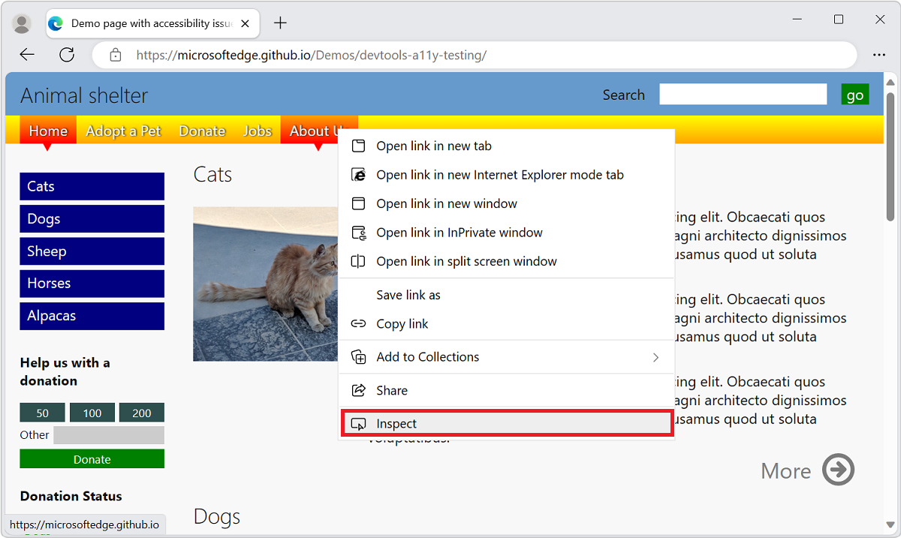

DevTools opens, with the right-clicked element highlighted in the **DOM tree** in the **Elements** tool:


<!-- ------------------------------ -->
#### Open DevTools by using the Microsoft Edge toolbar

On the Microsoft Edge toolbar, select **Settings and more** (`...`) >  **More tools** >  **Developer tools**:

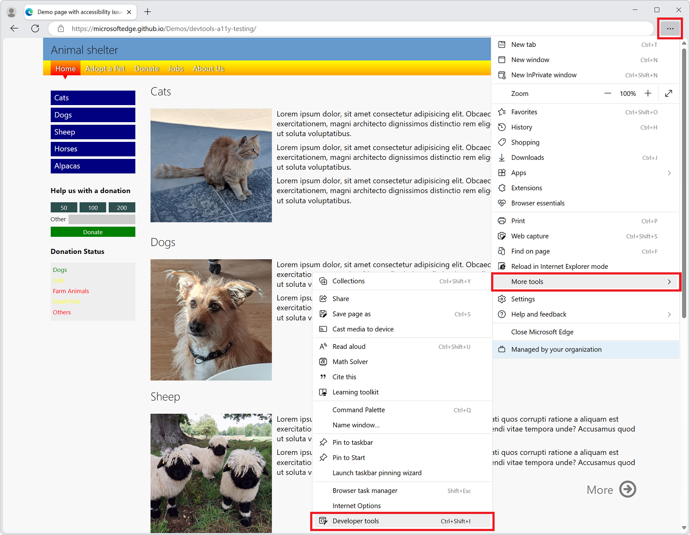


<!-- ------------------------------ -->
#### Have DevTools automatically open when you open a new tab

To have DevTools automatically open whenever you open a new tab in the browser:

1. At the command line, open Microsoft Edge, passing in the `--auto-open-devtools-for-tabs` flag, as follows:

   Windows command prompt:
   
   ```cmd
   start msedge --auto-open-devtools-for-tabs
   ```
   
   Windows PowerShell:
   
   ```powershell
   Start-Process -FilePath "msedge" -ArgumentList "--auto-open-devtools-for-tabs"
   ```
   
   macOS Terminal:
   
   ```bash
   /Applications/Microsoft\ Edge.app/Contents/MacOS/Microsoft\ Edge --auto-open-devtools-for-tabs
   ```
   
   bash shell on Linux:
   
   ```bash
   microsoft-edge --auto-open-devtools-for-tabs
   ```

###### Disabling startup boost

**Important:** There must be no running Microsoft Edge processes when launching via `auto-open-devtools-for-tabs`, so you may need to disable **Startup boost** in `edge://settings/system`.

The startup boost feature keeps a minimal Microsoft Edge process running in the background.  This interferes with the `auto-open-devtools-for-tabs` feature and would need to be disabled to use it.  For more information, see [Get help with startup boost](https://support.microsoft.com/topic/get-help-with-startup-boost-ebef73ed-5c72-462f-8726-512782c5e442).

#### Turning off the F12 keyboard shortcut

To prevent pressing **F12** from opening DevTools:

1. In Microsoft Edge, go to `edge://settings/system`.

1. Scroll down to the **Developer Tools** section, and then turn off the **Use F12 key to open the Developer tools** toggle.

   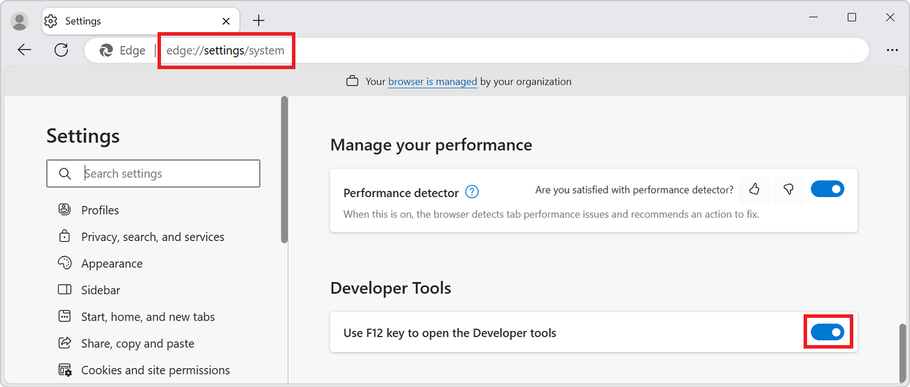


<!-- ====================================================================== -->
## Keyboard support

You can interact with DevTools using the mouse or keyboard.  Keyboard shortcuts provide a quick way to access functionality, and are needed for accessibility.  Various tools are increasingly accessible through the keyboard and assistive technologies such as screen readers.

See [Keyboard shortcuts](shortcuts/index.md) and [Navigate DevTools with assistive technology](accessibility/navigation.md).


<!-- ====================================================================== -->
## Change where DevTools is docked in the browser

You can dock DevTools in the right, left, or bottom of the browser, or undock it into a separate window.  See [Change DevTools placement (Undock, Dock to bottom, Dock to left)](customize/placement.md).


<!-- ====================================================================== -->
## Zoom DevTools in or out

The DevTools UI is implemented using HTML and CSS, like web pages, so you can zoom in and out by using the standard keyboard shortcuts.  The zoom levels for DevTools and the rendered page are independent.

**To zoom the DevTools portion of the browser:**

1. If focus isn't already on DevTools, click somewhere in DevTools.
1. Press **Ctrl**+**+** or **Ctrl**+**-** (Windows or Linux).  Or, press **Command**+**+** or **Command**+**-** (macOS).

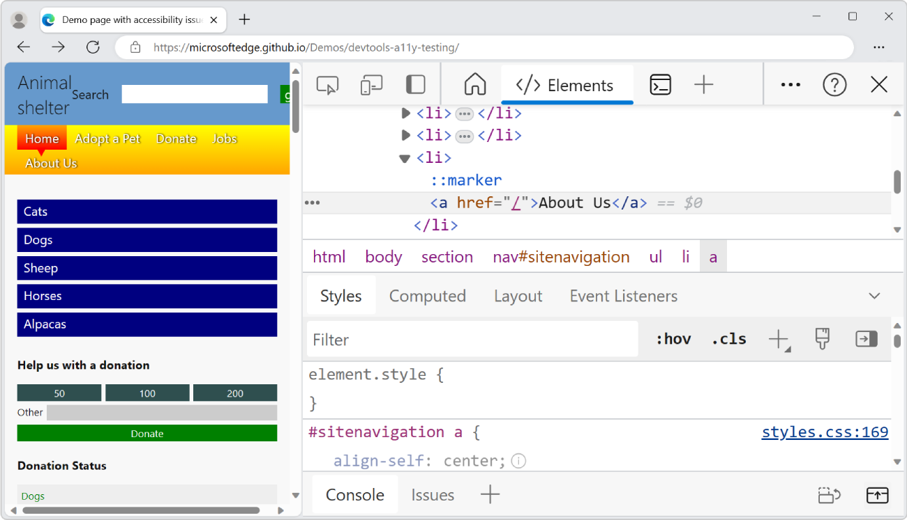

To zoom the rendered page, click the page, and then use the same keyboard shortcuts as above.

**To restore zoom to 100%:**

1. Make sure focus is on the desired part of the browser, either DevTools or the rendered page.
1. Press **Ctrl+0** or **Ctrl+NumPad0** (Windows or Linux), or **Command+0** (macOS).

**To zoom DevTools Settings:**

1. In DevTools **Settings**, click **Close** (**x**) in the upper right.
1. Change the zoom level of DevTools, as described above.
1. Click the **Settings** () button.

**To zoom DevTools by using the Command Menu:**

1. Click the **Customize and control DevTools** () menu button, and then select **Run command**.
1. In the **Command Menu**, start typing **zoom**, and then select a zoom command:
   *  **Reset zoom level**
   *  **Zoom in**
   *  **Zoom out**


<!-- ====================================================================== -->
## Overview of the user interface

The DevTools user interface has the following main areas:

* The **Activity Bar** at the top, or on the left side, which contains icons used to access tools, settings, documentation, and more.
   * The current tool area, where the tool that's currently selected in the **Activity Bar** appears.

* The **Quick View** toolbar, at the bottom, which contains tabs used to access tools.
   * The bottom tool area, where the tool that's currently selected in the **Quick View** toolbar appears.

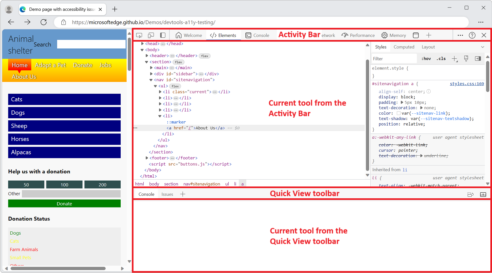

By default, the **Activity Bar** contains the following tools:

*  **Inspect** tool () toggle button.

*  **Device Emulation** tool () button.

*  **Welcome** tool ().

*  **Elements** tool ().

*  **Console** tool ().

*  **Sources** tool ().

*  **Network** tool ().

*  **Performance** tool ().

*  **Memory** tool ().

*  **Application** tool ().

By default, the **Quick View** toolbar contains the following tools:

*  **Console** tool ().

*  **Issues** tool ().

In the **Activity Bar**, tool tabs either contain the tool name and icon, or just the tool icon, depending on the width of the DevTools window. If the window is wide enough, the tool name and icon appear. If the window is too narrow, only the tool icon appears and the tool name appears when you hover over the tool icon.

If the **Activity Bar** is located on the left side of the DevTools window, vertically, only the tool icons appear, and the tool names appear when you hover over the tool icons.


<!-- ------------------------------ -->
#### Change the location of the Activity Bar

By default, the **Activity Bar** is displayed horizontally at the top of the DevTools window. To maximize usable screen space in a variety of DevTools window size and locations, you can change the location of the **Activity Bar** to the left side of the DevTools window or to be automatically set depending on the DevTools window docking location.

The **Activity Bar** can be in one of the following locations:

* **Top** (default): The **Activity Bar** will always be horizontal.

* **Left side**: The **Activity Bar** will always be vertical.

* **Adapt to dock location**: The **Activity Bar** will be in a horizontal or vertical orientation depending on where DevTools is docked.

  * When DevTools is docked to the left or right side of the browser window, the **Activity Bar** is vertical.

  * When DevTools is docked to the bottom side of the browser window, or undocked in its own window, the **Activity Bar** is horizontal.

When the **Activity Bar** is horizontal, tool names appear next to tool icons if there is enough space to display them.

If there isn't enough space to display all tool names, the horizontal **Activity Bar** shows some tabs with tool icons and names, and some tabs with icons that have a tooltip instead:


To change the location of the **Activity Bar**, do either of the following:

* Click the **Customize and control DevTools** () button, and then select a location in **Activity Bar location**:

  

* In the **Activity Bar**, click **Move Activity Bar to left** () or **Move Activity Bar to top** ().

* Use the Command Menu. Press **Ctrl+Shift+P** (Windows, Linux) or **Command+Shift+P** (macOS), enter the words **activity bar**, and then select **Move Activity Bar to left** or **Move Activity Bar to top**. See [Power tip: Use the Command Menu](#power-tip-use-the-command-menu).


<!-- ------------------------------ -->
#### Change the location of Quick View

By default, the **Quick View** panel is at the bottom of DevTools.  You can also put the **Quick View** panel on the right side of DevTools.

To display the **Quick View** panel, press **Esc**.

To change the location of the **Quick View** panel, in the **Quick View** toolbar, click the **Dock Quick View to the right** button or the **Dock Quick View to the bottom** () button:


<!-- ====================================================================== -->
## Features of the Activity Bar

DevTools gives you an amazing amount of power to inspect, debug, and change the website currently displayed in the browser.  Most of the tools display the changes live.  Live updates make the tools useful to refine the appearance and navigation or functionality of a webpage without the need to refresh or build it.


<!-- ------------------------------ -->
#### Tabbed tool panels containing tabs and pages

Other than the **Inspect** tool and **Device Emulation**, DevTools is divided into a set of tabbed tools, such as the **Elements** tool, the **Console** tool, and the **Sources** tool.  Within the **Command Menu**, tools are referred to as _panels_.  A tool's tab contains a panel which contains the tool's UI.

**Higher-level tabs:**

Tools are organized into a set of tabs on the **Activity Bar** and on the **Quick View** toolbar.  Most tools are also called _panels_.  A panel is the inner UI of a tool.  A tool has a tab that can be present on the **Activity Bar** and **Quick View** toolbar.

**Lower-level tabs:**

Within the panel of some tools, there are one or more sets of tabs (tabbed panes).  For example, the **Elements** tool contains a set of tabs that includes **Styles**, **Event Listeners**, and **Accessibility** tabs.  For other tools, the tool's panel has pages listed along the left side.


<!-- ------------------------------ -->
#### The Activity Bar and the Quick View toolbar

There are two toolbars: the **Activity Bar** at the top of DevTools, and the **Quick View** toolbar at the bottom when you press **Esc**.

The **Activity Bar** contains the following features:

* Icon tools:
   *  **Inspect tool** () toggle button.
   *  **Device Emulation** () button.

<!--
* **Automatically emulate Microsoft-recommended device baselines**
Present if Experiments > "Emulate Microsoft-recommended hardware and network performance presets" checkbox is selected -->

* Tool tabs:
   *  **Welcome** tool.
   *  **Elements** tool.  Permanent.
   *  **Console** tool.  Permanent.
   *  **Sources** tool.  Permanent.
   *  **Network** tool.
   *  **Performance** tool.
   *  **Memory** tool.
   *  **Application** tool.

* Icons:
   *  **Move Activity Bar to left** () button.
   *  **More tools** () button.
   *  **Customize and control DevTools** () menu button.
   *  **Help** () button.
   *  **Close** DevTools () button.


The **Activity Bar** features are described below.


<!-- ------------------------------ -->
#### Pin and rearrange tools in the Activity Bar

Besides the permanent **Elements**, **Console**, and **Sources** tools, you can control which tools appear in the **Activity Bar**, to customize DevTools to focus on your current activities.

1. Click **More tools** (**+**) to list all the available tools:

   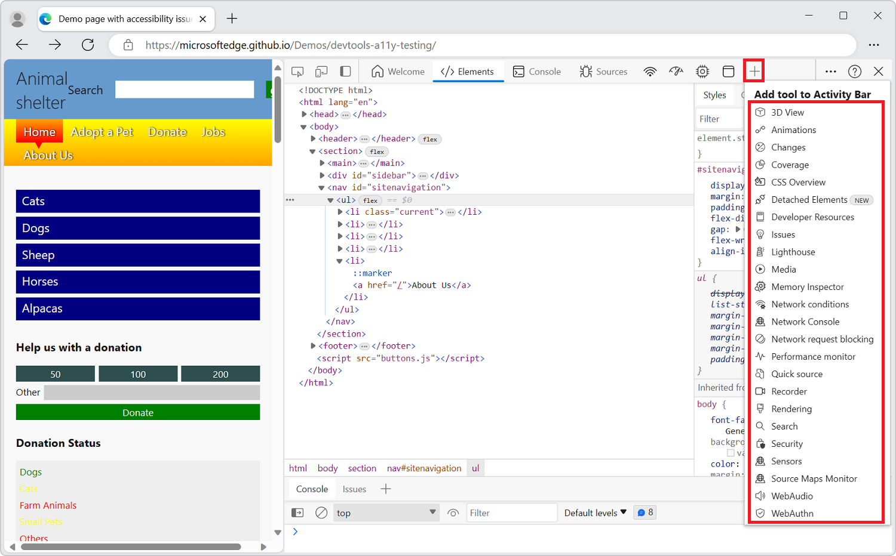

1. Select a tool to pin it to the **Activity Bar**.  The tool is then present in the **Activity Bar** whenever DevTools is opened.

If there isn't enough space in the **Activity Bar** to display all of the pinned tools, some tools may overflow into the **More tools** menu:

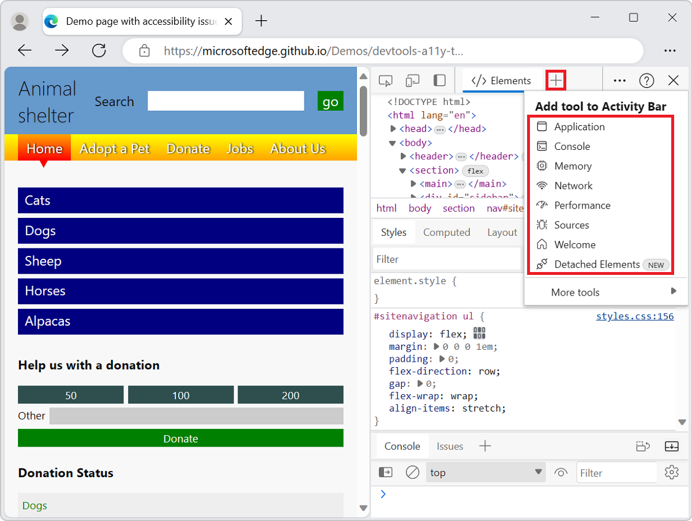

To unpin a tool from the **Activity Bar**, right-click the tool's tab and then select **Remove from Activity Bar**:

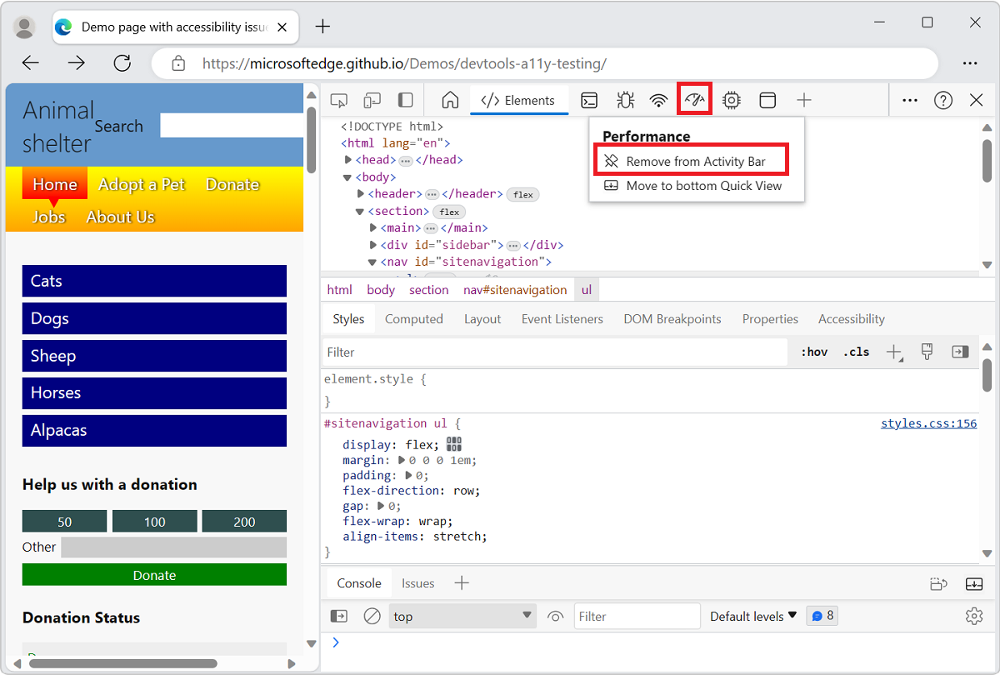


<!-- ------------------------------ -->
#### Inspect tool

When you click the **Inspect tool** () button, you can select an element on the current webpage.  While the **Inspect** tool is active, you can move your mouse over different parts of the webpage to get detailed information about page elements, along with a multi-color overlay that shows the layout dimensions, padding, and margin of the page element.

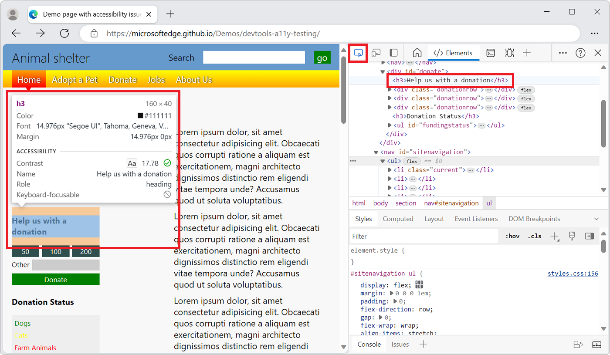


<!-- ------------------------------ -->
#### Device Emulation

Click the **Device Emulation** () button to display the current website in an emulated device mode.  The **Device Emulation** tool allows you to run and test how your product reacts when you resize the browser.  It also gives you an estimation of the layout and behavior on a mobile device.


See [Emulate mobile devices (Device Emulation)](device-mode/index.md).


<!-- ------------------------------ -->
#### Welcome tool

Includes information about the new features of DevTools, how to contact the team, and provides information about certain features.


<!-- ------------------------------ -->
#### Elements tool

Allows you to inspect, edit, and debug your HTML and CSS.  You can edit in the tool while displaying the changes live in the browser.

The **Elements** tool is always present on the **Activity Bar**.


<!-- ------------------------------ -->
#### Console tool

In the **Console** tool, you can:

*  View and filter logged messages from network requests or from JavaScript log statements.
*  Enter JavaScript statements to evaluate in realtime.  Expressions are evaluated in the current context, such as when the JavaScript debugger in the **Sources** tool is paused at a breakpoint.

The **Console** tool is always present on the **Activity Bar** and on the **Quick View** toolbar.

See [Console](console/index.md).


<!-- ------------------------------ -->
#### Sources tool

The [Sources](sources/index.md) tool is a code editor and JavaScript debugger.  You can edit projects, maintain snippets, and debug your current project.

The **Sources** tool is always present on the **Activity Bar**.


<!-- ------------------------------ -->
#### Network tool

The **Network** tool allows you to monitor and inspect requests or responses from the network and browser cache.  You can filter requests and responses to fit your needs and simulate different network conditions.

See [Inspect network activity](network/index.md).


<!-- ------------------------------ -->
#### Performance tool

See [Introduction to the Performance tool](evaluate-performance/index.md).


<!-- ------------------------------ -->
#### Memory tool

See [Fix memory problems](memory-problems/index.md).


<!-- ------------------------------ -->
#### Application tool

See [View, edit, and delete cookies](storage/cookies.md).


<!-- ------------------------------ -->
#### More Tools button

To add a tool to the **Activity Bar**, click the **More tools** () button.


<!-- ------------------------------ -->
#### Customize and control DevTools menu

The **Customize and control DevTools** () button opens a dropdown menu to:

* Dock DevTools.
* Dock the **Activity Bar**.
* Select a theme.
* Show keyboard shortcuts.
* Change DevTools settings.
* Open Device Emulation.
* Toggle the **Quick View** panel.
* Run a command.
* Search for code.
* Open a file.


<!-- ------------------------------ -->
#### Help button

The **Help** () button opens a dropdown menu that gives access to DevTools documentation, release notes, and to the **Feedback** () tool.

To send connect with the Microsoft Edge DevTools team to report problems, issues, or suggest ideas, click the **Feedback** button. The **Send Feedback** dialog opens. Enter information to describe what happened and include a screenshot. See [Contact the Microsoft Edge DevTools team](contact.md).


<!-- ------------------------------ -->
#### Close DevTools button

Click the **Close** DevTools () button in the upper right corner of DevTools to close DevTools and use the entire window to display the current webpage.


<!-- ====================================================================== -->
## Features of the Quick View toolbar

Use the **Quick View** panel to open a second tool below or to the right of the tool that's already selected in the **Activity Bar**:

1. Select a tool from the **Activity Bar**.

1. In the **Quick View** toolbar, click **More tools** (**+**), and then select a different tool from the list.

For example, open the **Rendering** tool in the **Quick View** panel, below the **Network** tool that's open in the **Activity Bar**:


To hide or expand **Quick View**, click **Collapse Quick View** () or **Expand Quick View** (), or press the **Escape** key.


<!-- ====================================================================== -->
## Overview of all tools

For a summary of each tool, see [Overview of all tools](about-tools.md#overview-of-all-tools) in _About the list of tools_.


<!-- ====================================================================== -->
## Tool, tab, or panel

The words "tool", "tab", and "panel" are somewhat interchangeable.  In the Command Menu, the tools are called _panels_; for example, the **Elements** tool is called the **Elements** panel.  To switch to the **Elements** tool, you click the **Elements** tab.  There's a **More tools** (**+**) button and list used to select tools, which are also called _panels_.

You can customize each of the tools, and the content of a tool can change based on the context.


<!-- ====================================================================== -->
## About Activity Bar and Quick View tools

The **More tools** (**+**) button is displayed both in the **Activity Bar** and in the **Quick View** toolbar. When you open a tool from the **More tools** list that's located in the **Activity Bar**, the tool appears in the **Activity Bar**. When you open a tool from the **More tools** list in the **Quick View** toolbar, the tool is opened in the **Quick View** panel.

| Task | Steps |
| --- | --- |
| Open a tool in the **Activity Bar** at the top of DevTools | In the **Activity Bar** at the top of DevTools, click **More tools** (**+**) and then select a tool. |
| Open a tool on the **Quick View** toolbar | When DevTools has focus, press **Esc** to show the **Quick View** toolbar if it's not shown yet.  In the **Quick View** toolbar, click the **More tools** (**+**) button, and then select a tool. |
| Move a tool from the **Quick View** toolbar to the **Activity Bar** | When DevTools has focus, press **Esc** to show the **Quick View**.  In the **Quick View** toolbar, right-click the tool's tab, and then select **Move to top Activity Bar** or **Move to left Activity Bar**. |
| Move a tool from the **Activity Bar** to the **Quick View** toolbar | In the **Activity Bar**, right-click the tool's tab, and then select **Move to bottom Quick View** or **Move to side Quick View**. |
| Open a tool in its default toolbar (**Activity Bar** or **Quick View**) | When DevTools has focus, open the **Command Menu** by pressing **Ctrl+Shift+P** (Windows, Linux) or **Command+Shift+P** (macOS).  Type the name of the tool, and then select a **Show \<tool\>** command. |

In addition to **Activity Bar** and **Quick View** tools, DevTools includes the following tools:

*  The **Inspect** tool.  See [Use the Inspect tool to detect accessibility issues by hovering over the webpage](accessibility/test-inspect-tool.md).
*  The **Device Emulation** tool.  See [Emulate mobile devices (Device Emulation)](device-mode/index.md).
*  The **Command Menu**.  See [Run commands with the Microsoft Edge DevTools Command Menu](command-menu/index.md).


<!-- ------------------------------ -->
#### See also

* [About the list of tools](about-tools.md)


<!-- ====================================================================== -->
## Power tip: Use the Command Menu

DevTools provides lots of features and functionality to use with your website.  You can access the different parts of DevTools in many ways, but often a fast way is to use the Command Menu.


In the Command Menu, the tools are called "panels"; for example, the **Elements** tool is called the **Elements** panel.  To switch to the **Elements** tool, you select the **Elements** tab.

1. To open the Command Menu, do either of the following:

   *  Click the **Customize and control DevTools** () button, and then select **Run command**.
   *  Press **Ctrl+Shift+P** (Windows, Linux) or **Command+Shift+P** (macOS).

   The Command Menu allows you to type commands to display, hide, or run features in DevTools.

1. In the Command Menu, start typing the name of a tool, such as **changes**, and then select a **Show** command, such as **Show Changes**.  The Command Menu displays the matching commands:

   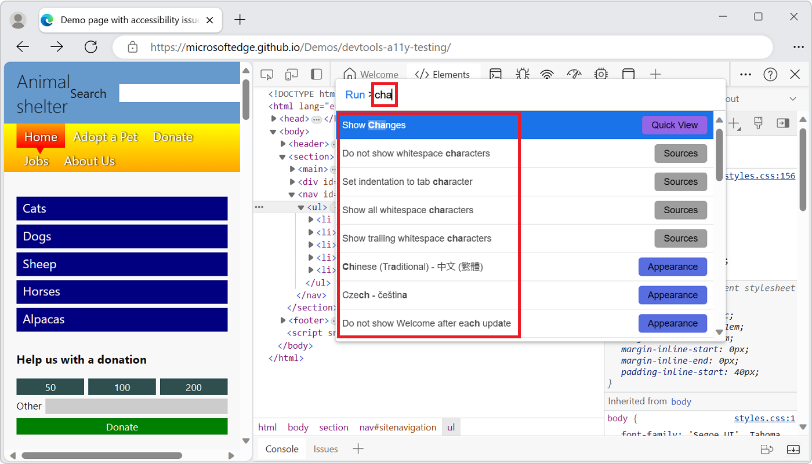

1. Press **Enter** to select a **Show** command, such as **Show Changes**.  The selected tool opens in the **Quick View** panel, at the bottom:

   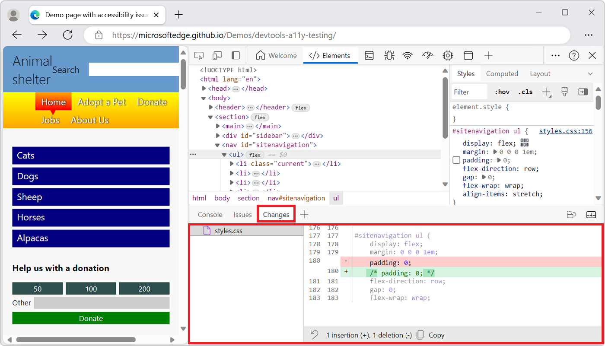

   The **Changes** tool is useful when you edit CSS.  In this example, the Command Menu provides a fast alternative to selecting **More tools** (**+**) and then selecting **Changes**.  This example also provides an alternative to editing a `.js` file in the **Sources** tool, and then right-clicking and selecting **Local modifications**.

See also [Run commands with the Microsoft Edge DevTools Command menu](command-menu/index.md).


<!-- ====================================================================== -->
## Customizing DevTools

You can customize DevTools to meet your needs for the way you work.  To change settings, click the **Customize and control DevTools** () button, and then select **Settings** (), or press **F1**.

In the **Settings** > **Preferences** page, you can change several parts of DevTools.  For example, you can use the **Browser UI language** setting to use the same language in DevTools that is used in your browser.  For another example, use the **Theme** setting to change the color theme of DevTools.

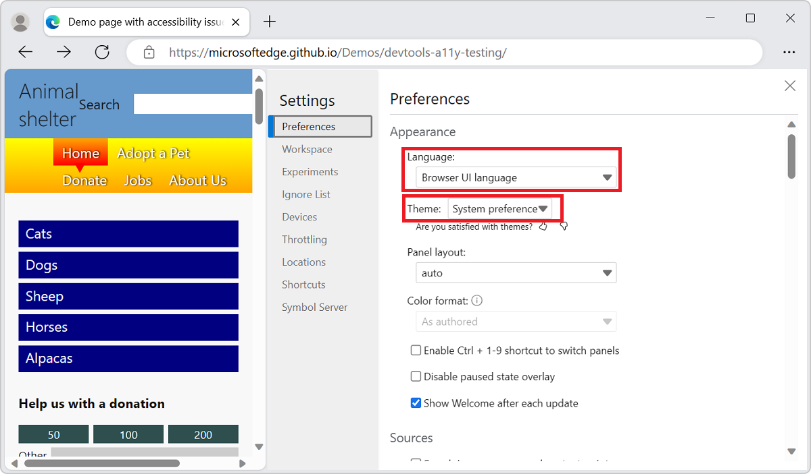

You can also change the settings of advanced features, such as:
<!-- todo: how/where, for each item in this list?-->

*  Add local files to a [Workspace](workspaces/index.md).
*  Filter library code by using the **Ignore List**.
*  Define the **Devices** you want to include in the device simulation and test mode.  For more information, see [Emulate mobile devices (Device Emulation)](device-mode/index.md).
*  Select a network **Throttling** profile.
*  Define simulated **Locations**.
*  Customize keyboard **Shortcuts**.  For example, to use the same shortcuts in DevTools as in Visual Studio Code, select **Match shortcuts from preset** > **Visual Studio Code**.

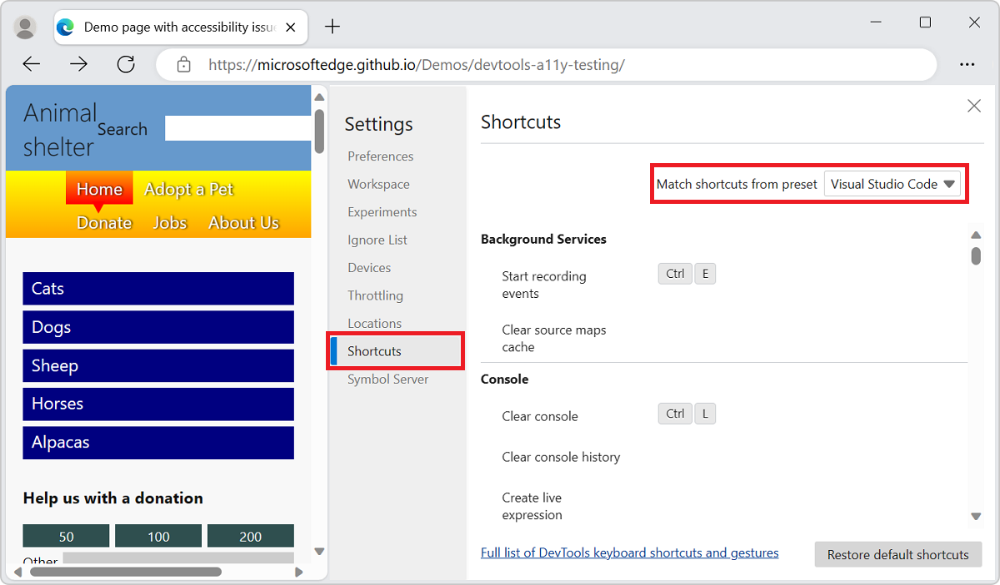


<!-- ====================================================================== -->
## Trying experimental features

The DevTools team provides new features as _experiments_ in DevTools.  You can turn each of the experiments on or off.  To see the full list of [Experimental features in Microsoft Edge DevTools](experimental-features/index.md), in DevTools, select **Settings** (), and then select **Experiments**.

To preview the latest features coming to DevTools, download [Microsoft Edge Canary](https://www.microsoft.com/edge/download/insider), which builds nightly.

See also:
* [Experimental features](experimental-features/index.md)
* [What's New in Microsoft Edge DevTools](./whats-new/whats-new.md)


<!-- ====================================================================== -->
## See also

<!-- todo: remove all but ~5 links -->

* [About the list of tools](about-tools.md)<!--keep link-->
* [Inspect and change the current webpage](dom/index.md)<!--keep link?-->
* [Emulate how your product behaves on different devices](device-mode/index.md)<!--keep link?-->
* [Inspect, tweak, and change the styles of elements](inspect-styles/edit-fonts.md)<!--keep link?-->
* [Debug your JavaScript](javascript/index.md)<!--keep link?-->
* [Live console](console/index.md)<!--keep link?-->
* [Accessibility, performance, compatibility, and security issues](issues/index.md)<!--keep link?-->
* [Inspect the network traffic](network/index.md)<!--keep link?-->
* [Inspect where the browser stored content](storage/sessionstorage.md)<!--keep link?-->
* [Evaluate the performance](evaluate-performance/index.md)<!--keep link?-->
* [Memory problems](memory-problems/index.md)<!--keep link?-->
* [Rendering issues](rendering-tools/index.md)<!--keep link?-->
* [Use a development environment](sources/index.md)<!--keep link?-->
* [Sync changes in DevTools with the file system](workspaces/index.md)<!--keep link?-->
* [Override files from the web](javascript/overrides.md)<!--keep link?-->


<!-- ====================================================================== -->
<!-- ## Clipboard: How to open DevTools and any specific tool tab

1. To open DevTools, right-click the webpage, and then select **Inspect**.  Or, press **Ctrl+Shift+I** (Windows, Linux) or **Command+Option+I** (macOS).  DevTools opens.

1. In DevTools, on the **Activity Bar**, select the **__** tab.  If that tab isn't visible, click the **More tools** () button.

1. To the right of the **Styles** tab, click the **Accessibility** tab.  If the **Accessibility** tab isn't visible, click the **More tools** () button.


#### Clipboard entry for opening a specific Settings page:


1. To open DevTools, right-click the webpage, and then select **Inspect**.  Or, press **Ctrl+Shift+I** (Windows, Linux) or **Command+Option+I** (macOS).  DevTools opens.

1. In DevTools, on the main toolbar, click the **Settings** () button.  Or, press **Shift+?**.  The **Settings** panel opens, with the **Preferences** page selected.

1. On the left side of the **Settings** panel, select the **__** page.
-->


<!-- ====================================================================== -->
<!-- ## Clipboard: Mid-sentence icons

icon tagging to maintain here & propagate:
to paste these into articles, always need to add ../ prefix:
click the **Inspect tool** () button.
click the **Device Emulation** () button.
click the **More tools** () button.
click the **JavaScript errors counter** () button.
click the **Issues counter** () button.
click the **Settings** () button.
select **Settings and more** ()
click the **Send Feedback** () button.
click the **Customize and control DevTools** () menu button.
click the **Close** DevTools () button.
-->
