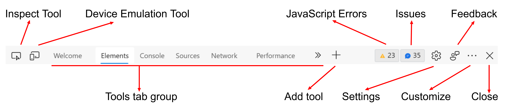
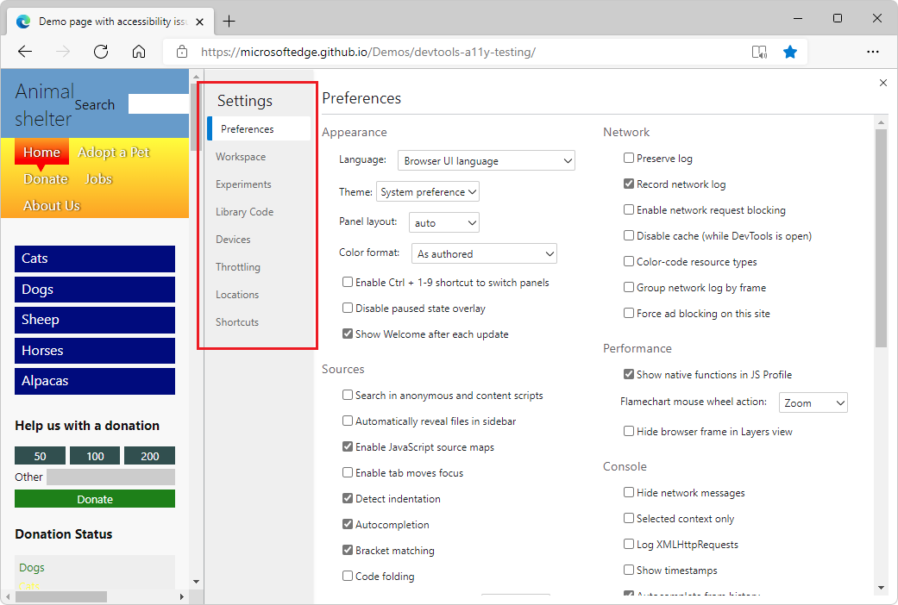

# Overview of DevTools

<!-- icon clipboard below -->

<!-- ====================================================================== -->
<!-- keep sync'd:
* [Overview of DevTools](overview.md) - intro section
* [Microsoft Edge DevTools](../develop-web-microsoft-edge.md#microsoft-edge-devtools) in _Develop for the web with Microsoft Edge_
-->

The Microsoft Edge browser comes with built-in web development tools, called Microsoft Edge DevTools.  DevTools is a set of web development tools that appears next to a rendered webpage in the browser.  DevTools provides a powerful way to inspect and debug webpages and web apps.  You can even edit source files and create website projects, all within the DevTools environment.

With DevTools, you can do the following:

*  Inspect, tweak, and change the styles of elements in the webpage using live tools with a visual interface.  Inspect where the browser stored content to construct the webpage, including `.html`, `.css`, `.js`, and `.png` file formats.

*  Emulate how your website behaves on different devices and simulate a mobile environment, complete with different network conditions.  Inspect the network traffic and see the location of the problems.

*  Debug your JavaScript using breakpoint debugging and with the live console.  Find memory problems and rendering issues with your web apps.

*  Find accessibility, performance, compatibility, and security issues in your products, and use DevTools to fix the accessibility issues that are found.

*  Use a development environment to sync changes in DevTools with the file system and from the web.

<!-- /keep sync'd -->


<!-- See also [Reasons to use Microsoft Edge DevTools](devtools-guide-chromium/reasons-edge-devtools.md). -->


<!-- ====================================================================== -->
## Open DevTools
<!-- keep sync'd:
[Open DevTools](../overview.md#open-devtools) in _Overview of DevTools_
[Open DevTools](accessibility/navigation.md#open-devtools) in _Navigate DevTools with assistive technology_
-->

In Microsoft Edge, you can open DevTools by using the mouse or keyboard, in any of the following ways.  Which tool is opened depends on how you open DevTools.

**Main ways:**

| Action | Resulting tool |
|---|---|
| Right-click any item on a webpage, and then select **Inspect**. | The **Elements** tool, with the DOM tree expanded to show the right-clicked page element. |
| Press **Ctrl+Shift+I** (Windows, Linux) or **Command+Option+I** (macOS).| The previously used tool, or the **Welcome** tool. |
| Press **F12**. | The previously used tool, or the **Welcome** tool. |

**Additional ways:**

| Action | Resulting tool |
|---|---|
| On the Microsoft Edge toolbar, select **Settings and more** () >  **More tools** >  **Developer tools**. | The previously used tool, or the **Welcome** tool. |
| Press **Ctrl+Shift+J** (Windows, Linux) or **Command+Option+J** (macOS). | The **Console** tool. |
| Press **Ctrl+Shift+C** (Windows, Linux) or **Command+Option+C** (macOS). | The **Elements** tool, with the DOM tree expanded to show the `<body>` element. |
| Press **Shift+F10** to open the right-click menu.  To select the **Inspect** command, press **Up Arrow** and then **Enter**. | The **Elements** tool, with the DOM tree expanded to show the `<html>` element. |
| Press **Tab** and **Shift+Tab** to put focus on a page element.  Then press **Shift+F10** to open the right-click menu.  To select the **Inspect** command, press **Up Arrow** and then **Enter**. | The **Elements** tool, with the DOM tree expanded to show the focused page element. |

<!-- /keep sync'd -->

<!--
hit counts:

**F12** 45 (in 30)

**Ctrl+Shift+J** 22 (in 14)
**Ctrl+Shift+I** 21 (in 11)
**Ctrl+Shift+C** 7 (in 6)

**Command+Option+J**  21  (in 12)
**Command+Option+I** 15    (in 6)
**Command+Option+C**  3   (in 2)
 -->


<!-- ------------------------------ -->
#### Open DevTools by right-clicking an item in a webpage

A good way to open DevTools is to right-click an item on a webpage, and then select **Inspect**:


DevTools opens, with the right-clicked element highlighted in the **DOM tree** in the **Elements** tool:


<!-- ------------------------------ -->
#### Open DevTools by using the Microsoft Edge toolbar

On the Microsoft Edge toolbar, you can select **Settings and more** (`...`) >  **More tools** >  **Developer tools**:


<!-- ------------------------------ -->
#### Have DevTools automatically open when you open a new tab

To have DevTools automatically open whenever you open a new tab in the browser:

1. At the command line, open Microsoft Edge, passing in the `--auto-open-devtools-for-tabs` flag, as follows:

   Windows command prompt:
   
   ```cmd
   start msedge --auto-open-devtools-for-tabs
   ```
   
   Windows PowerShell:
   
   ```powershell
   Start-Process -FilePath "msedge" -ArgumentList "--auto-open-devtools-for-tabs"
   ```
   
   bash shell on macOS:
   
   ```bash
   /Applications/Microsoft\ Edge\ Beta.app/Contents/MacOS/Microsoft\ Edge\ Beta --auto-open-devtools-for-tabs
   ```
   
   bash shell on Linux:
   
   ```bash
   microsoft-edge-dev --auto-open-devtools-for-tabs
   ```
   

###### Disabling startup boost

**Important:** There must be no running Microsoft Edge processes when launching via `auto-open-devtools-for-tabs`, so you may need to disable **Startup boost** in `edge://settings/system`.

The startup boost feature keeps a minimal Microsoft Edge process running in the background.  This interferes with the `auto-open-devtools-for-tabs` feature and would need to be disabled to use it.  For more information, see [Get help with startup boost](https://support.microsoft.com/topic/get-help-with-startup-boost-ebef73ed-5c72-462f-8726-512782c5e442).

#### Turning off the F12 keyboard shortcut

To prevent pressing **F12** from opening DevTools:

1. In Microsoft Edge, go to `edge://settings/system`.

1. In the **Developer Tools** section, turn off the **Open the DevTools when the F12 key is pressed** toggle.

   


<!-- ====================================================================== -->
## Keyboard support

You can interact with DevTools using the mouse or keyboard.  Keyboard shortcuts provide a quick way to access functionality, and are needed for accessibility.  Various tools are increasingly accessible through the keyboard and assistive technologies such as screen readers.

See [Keyboard shortcuts](shortcuts/index.md) and [Navigate DevTools with assistive technology](accessibility/navigation.md).


<!-- ====================================================================== -->
## Change where DevTools is docked in the browser

You can dock DevTools in the right, left, or bottom of the browser, or undock it into a separate window.  See [Change DevTools placement (Undock, Dock to bottom, Dock to left)](customize/placement.md).


<!-- ====================================================================== -->
## Zoom DevTools in or out

The DevTools UI is implemented using HTML and CSS, like web pages, so you can zoom in and out by using the standard keyboard shortcuts.  The zoom levels for DevTools and the rendered page are independent.

**To zoom the DevTools portion of the browser:**

1. If focus isn't already on DevTools, click somewhere in DevTools.
1. Press **Ctrl**+**+** or **Ctrl**+**-** (Windows or Linux).  Or, press **Command**+**+** or **Command**+**-** (macOS).


<!--  -->

To zoom the rendered page, click the page, and then use the same keyboard shortcuts as above.

**To restore zoom to 100%:**

1. Make sure focus is on the desired part of the browser, either DevTools or the rendered page.
1. Press **Ctrl+0** or **Ctrl+NumPad0** (Windows or Linux), or **Command+0** (macOS).

**To zoom DevTools Settings:**

1. In DevTools **Settings**, click **Close** (**x**) in the upper right.
1. Change the zoom level of DevTools, as described above.
1. Click the **Settings** () button.

**To zoom DevTools by using the Command Menu:**

1. Click the **Customize and control DevTools** () menu button, and then select **Run command**.
1. In the **Command Menu**, start typing **zoom**, and then select a zoom command:
   *  **Reset zoom level**
   *  **Zoom in**
   *  **Zoom out**


<!-- ====================================================================== -->
## Display DevTools Tooltips

The DevTools Tooltips feature helps you learn about all the different tools and panes.  Hover over each outlined region of DevTools to learn more about how to use the tool.  To turn on Tooltips, do one of the following: 

*  Select **Customize and control DevTools** (`...`) > **Help** > **Toggle the DevTools Tooltips**.
*  Press **Ctrl+Shift+H** (Windows, Linux) or **Cmd+Shift+H** (macOS).
*  [Open the Command Menu](command-menu/index.md#open-the-command-menu) and then type **tooltips**.

Then hover over each outlined region of DevTools:


To turn off Tooltips, press **Esc**.  


<!-- ====================================================================== -->
## Features of the main toolbar

DevTools gives you an amazing amount of power to inspect, debug, and change the website currently displayed in the browser.  Most of the tools display the changes live.  Live updates make the tools incredibly useful to refine the appearance and navigation or functionality of a web project without the need to refresh or build it.


<!-- ------------------------------ -->
#### Tabbed tool panels containing tabs and pages

Other than a couple of icon tools (the **Inspect** tool and **Device Emulation**), DevTools is divided into and a set of tabbed tools, such as the **Elements** tool, the **Console** tool, and the **Sources** tool.  Within the **Command Menu**, tools are referred to as _panels_.  A tool's tab contains a panel which contains the tool's UI.

**Higher-level tabs:**

Tools are organized into a set of tabs on the main toolbar and on the drawer toolbar.  Most tools are also called _panels_.  A panel is the inner UI of a tool.  A tool has a tab that can be present on the main toolbar and Drawer toolbar.

**Lower-level tabs:**

Within the panel of some tools, there are one or more sets of tabs (tabbed panes).  For example, the **Elements** tool contains a set of tabs that includes **Styles**, **Event Listeners**, and **Accessibility** tabs.  For other tools, the tool's panel has pages listed along the left side.


<!-- ------------------------------ -->
#### The main toolbar and the Drawer toolbar

<!-- clarify: DevTools also allows you to change web-based third-party products on your computer.  extensions? -->

There are two toolbars: the main toolbar at the top of DevTools, and the **Drawer** at the bottom when you press **Esc**.

The main toolbar contains the following features:

* Icon tools:
   *  **Inspect tool** () toggle button.
   *  **Device Emulation** () button.

* Tool tabs:
   *  **Welcome** tool.
   *  **Elements** tool.  Permanent.
   *  **Console** tool.  Permanent.
   *  **Sources** tool.  Permanent.
   *  **Network** tool.
   *  **Performance** tool.
   *  **Memory** tool.
   *  **Application** tool.
   *  **Security** tool.
   *  **Lighthouse** tool.
   *  **CSS Overview** tool.

* Icons:
   *  **More tabs** () button.
   *  **More Tools** () button.
   *  **JavaScript errors counter** () button.
   *  **Issues counter** () button.
   *  **Settings** () button.
   *  **Send Feedback** () button.
   *  **Customize and control DevTools** () menu button.
   *  **Close** DevTools () button.



The toolbar features are described below.


<!-- ------------------------------ -->
#### Inspect tool

When you click the **Inspect tool** () button, you can select an element on the current webpage.  While the **Inspect** tool is active, you can move your mouse over different parts of the webpage to get detailed information about page elements, along with a multi-color overlay that shows the layout dimensions, padding, and margin of the page element.


<!-- ------------------------------ -->
#### Device Emulation

Click the **Device Emulation** () button to display the current website in an emulated device mode.  The **Device Emulation** tool allows you to run and test how your product reacts when you resize the browser.  It also gives you an estimation of the layout and behavior on a mobile device.


See [Emulate mobile devices (Device Emulation)](device-mode/index.md).


<!-- ------------------------------ -->
#### Welcome tool

Includes information about the new features of DevTools, how to contact the team, and provides information about certain features.


<!-- ------------------------------ -->
#### Elements tool

Allows you to inspect, edit, and debug your HTML and CSS.  You can edit in the tool while displaying the changes live in the browser.

The **Elements** tool is always present on the main toolbar.


<!-- ------------------------------ -->
#### Console tool

In the **Console** tool, you can:
*  View and filter logged messages from network requests or from JavaScript log statements.
*  Enter JavaScript statements to evaluate in realtime.  Expressions are evaluated in the current context, such as when the JavaScript debugger in the **Sources** tool is paused at a breakpoint.

The **Console** tool is always present on the main toolbar and on the Drawer toolbar.

See [Console](console/index.md).


<!-- ------------------------------ -->
#### Sources tool

The [Sources](sources/index.md) tool is a code editor and JavaScript debugger.  You can edit projects, maintain snippets, and debug your current project.

The **Sources** tool is always present on the main toolbar.


<!-- ------------------------------ -->
#### Network tool

The **Network** tool allows you to monitor and inspect requests or responses from the network and browser cache.  You can filter requests and responses to fit your needs and simulate different network conditions.

See [Inspect network activity](network/index.md).


<!-- ------------------------------ -->
#### Performance tool

See [Get started analyzing runtime performance](evaluate-performance/index.md).


<!-- ------------------------------ -->
#### Memory tool

See [Fix memory problems](memory-problems/index.md).


<!-- ------------------------------ -->
#### Application tool

See [View, edit, and delete cookies](storage/cookies.md).


<!-- ------------------------------ -->
#### Security tool

See [Understand security issues using the Security tool](security/index.md).


<!-- ------------------------------ -->
#### Lighthouse tool

See [Lighthouse tool](lighthouse/lighthouse-tool.md).


<!-- ------------------------------ -->
#### CSS Overview tool

Identify potential CSS improvements.

See [CSS Overview tool](css/css-overview-tool.md).


<!-- ------------------------------ -->
#### More tabs button

To display a tool that's open but hidden because the window is too narrow, click the **More tabs** () button.


<!-- ------------------------------ -->
#### More Tools button

To add a tool to the toolbar, click the **More Tools** () button.


<!-- ------------------------------ -->
#### JavaScript errors counter

The **JavaScript errors counter** () button displays the following:

*  A red circle containing an **X**, followed by the number of JavaScript errors that were automatically detected on the current webpage.

*  A yellow triangle containing an exclamation mark, followed by the number of JavaScript warnings that were automatically detected on the current webpage.

The tooltip for the **JavaScript counter** button is **Open Console to view # errors, # warnings**.

Click the JavaScript errors counter to open the [Console](console/index.md) and learn about the error.


<!-- ------------------------------ -->
#### Issues counter

The **Issues counter** () button shows the number of HTML or CSS issues that are automatically found on the current webpage.

The tooltip for the **Issues counter** is **Open Issues to view # issues**.  The button's icon is a blue speech bubble icon followed by the number of HTML or CSS issues.

Click the **Issues counter** to open the [Issues](issues/index.md) tool.


<!-- ------------------------------ -->
#### Settings button

To open the DevTools **Settings** webpage, click the **Settings** () button.  The **Settings** page contains the following sub-pages:

*  Preferences
*  Workspace
*  Experiments
*  Ignore List
*  Devices
*  Throttling
*  Locations
*  Shortcuts
*  Symbol Server

See [Settings](customize/index.md#settings) in _Customize DevTools_.


<!-- ------------------------------ -->
#### Send Feedback button

To open the **Send Feedback** dialog, click the **Send Feedback** () button.  The **Send Feedback** dialog opens.  Enter information to describe what happened and automatically includes a screenshot.  Use **Send Feedback** to connect with DevTools team to report problems, issues, or suggest ideas.

See [Contact the Microsoft Edge DevTools team](contact.md).


<!-- ------------------------------ -->
#### Customize and control DevTools menu

The **Customize and control DevTools** () button opens a dropdown menu that enables you to define where to dock DevTools, search, open different tools, and more.


<!-- ------------------------------ -->
#### Close DevTools button

Click the **Close** DevTools () button in the upper right corner of DevTools to close DevTools and use the entire window to display the current webpage.


<!-- ====================================================================== -->
## Overview of all tools

For a summary of each tool, see [Overview of all tools](about-tools.md#overview-of-all-tools) in _About the list of tools_.


<!-- ====================================================================== -->
## Tool, tab, or panel

Often the words "tool", "tab", or "panel" are used interchangeably.  In the Command Menu, the tools are called _panels_; for example, the **Elements** tool is called the **Elements** panel.  To switch to the **Elements** tool, you select the **Elements** tab.  There's a **More Tools** (**+**) button and list, and there's a **More tabs** button on the toolbar, both of which are used to select tools, which are also called _panels_.

You can customize each of the tools, and the content of a tool can change based on the context.       


<!-- ====================================================================== -->
## About Panel and Drawer tools

The tools that are listed in the **More Tools** (**+**) can be displayed either as a Panel tool (on the main toolbar) or a Drawer tool (on the Drawer toolbar).  In the **Command Menu**, each of these tools is labelled as either a **Panel** tool or as a **Drawer** tool.  But you can add them to either the main toolbar or the Drawer toolbar, and you can use any of the following methods to open them or move them between the two toolbars.

Use the **More Tools** (**+**) menu to select any of the Panel tools or Drawer tools.  A **More Tools** menu appears in multiple places:

*  In the upper right of DevTools, on the main toolbar, click the **Customize and control DevTools** () button, hover over the **More tools** command, and then select a tool.

*  On the main toolbar at the top of DevTools (where _Panel_ tools usually go).

*  On the **Drawer** toolbar (where _Drawer_ tools usually go).

| Task | Steps |
| --- | --- |
| Open a tool on the main toolbar at the top of DevTools | On the main toolbar at the top of DevTools, click **More Tools** (**+**) and then select a tool. |
| Open a tool on the Drawer toolbar | When DevTools has focus, press **Esc** to show the Drawer.  On the Drawer toolbar, click **More Tools** (**+**) and then select a tool. |
| Move a tool from the Drawer toolbar to the main Toolbar | When DevTools has focus, press **Esc** to show the Drawer.  On the Drawer toolbar, right-click the tool's tab, and then select **Move to top**. |
| Move a tool from the main toolbar to the drawer Toolbar | On the main toolbar, right-click the tool's tab, and then select **Move to bottom**. |
| Open a tool in its default toolbar | When DevTools has focus, open the **Command Menu** by pressing **Ctrl+Shift+P** (Windows, Linux) or **Command+Shift+P** (macOS).  Type the name of the tool, and then select the tool. |

In addition to Panel tools and Drawer tools, DevTools includes the following tools:
*  The **Inspect** tool.  See [Use the Inspect tool to detect accessibility issues by hovering over the webpage](accessibility/test-inspect-tool.md).
*  The **Device Emulation** tool.  See [Emulate mobile devices (Device Emulation)](device-mode/index.md).
*  The **Command Menu**.  See [Run commands with the Microsoft Edge DevTools Command Menu](command-menu/index.md).


<!-- ------------------------------ -->
#### See also

* [About the list of tools](about-tools.md)


<!-- ====================================================================== -->
## Power tip: Use the Command Menu

DevTools provides lots of features and functionality to use with your website.  You can access the different parts of DevTools in many ways, but often a fast way is to use the Command Menu.


In the Command Menu, the tools are called "panels"; for example, the **Elements** tool is called the **Elements** panel.  To switch to the **Elements** tool, you select the **Elements** tab.

To open the Command Menu, do either of the following:

*  Click the **Customize and control DevTools** () button, and then select **Run command**.

*  Press **Ctrl+Shift+P** (Windows, Linux) or **Command+Shift+P** (macOS).


The Command Menu allows you to type commands to display, hide, or run features in DevTools.  With the Command Menu open, enter the word **changes**, and then select **Drawer: Show Changes**.

The **Changes** tool opens, which is useful when you edit CSS.  In this case, the Command Menu provides a fast alternative to selecting **More Tools** (...) and then selecting **Changes**, or editing a `.js` file in the **Sources** tool, then right-clicking and selecting **Local modifications**.

After you type **cha**, the Command Menu displays the options:


Press **Enter**, and then the **Changes** tool opens:


See also [Run commands with the Microsoft Edge DevTools Command menu](command-menu/index.md).


<!-- ====================================================================== -->
## Customizing DevTools

You can customize DevTools to meet your needs for the way you work.  To change settings, click the **Settings** () button, or press **F1**.

In the **Settings** > **Preferences** page, you can change several parts of DevTools.  For example, you can use the **Match the browser language** setting to use the same language in DevTools that is used in your browser.  For another example, use the **Theme** setting to change the color theme of DevTools.



You can also change the settings of advanced features, such as:
*  Add local files to a [Workspace](workspaces/index.md).
*  Filter library code by using the **Ignore List**.
*  Define the **Devices** you want to include in the device simulation and test mode.  For more information, see [Emulate mobile devices (Device Emulation)](device-mode/index.md).
*  Select a network **Throttling** profile.
*  Define simulated **Locations**.
*  Customize keyboard **Shortcuts**.  For example, to use the same shortcuts in DevTools as in Visual Studio Code, select **Match shortcuts from preset** > **Visual Studio Code**.


<!-- ====================================================================== -->
## Trying experimental features

The DevTools team provides new features as _experiments_ in DevTools.  You can turn each of the experiments on or off.  To see the full list of [Experimental features](experimental-features/index.md), in DevTools, select **Settings** (the gear icon), and then select **Experiments**.

To preview the [latest features coming to DevTools](whats-new/2021/02/devtools.md), download [Microsoft Edge Canary](https://www.microsoftedgeinsider.com/download), which builds nightly.


<!-- ====================================================================== -->
## See also

<!--
* [Reasons to use Microsoft Edge DevTools](devtools-guide-chromium/reasons-edge-devtools.md)
-->

* [About the list of tools](about-tools.md)
* [Inspect and change the current webpage](dom/index.md)
* [Emulate how your product behaves on different devices](device-mode/index.md)
* [Inspect, tweak, and change the styles of elements](inspect-styles/edit-fonts.md)
* [Debug your JavaScript](javascript/index.md)
* [Live console](console/index.md)
* [Accessibility, performance, compatibility, and security issues](issues/index.md)
* [Inspect the network traffic](network/index.md)
* [Inspect where the browser stored content](storage/sessionstorage.md)
* [Evaluate the performance](evaluate-performance/index.md)
* [Memory problems](memory-problems/index.md)
* [Rendering issues](rendering-tools/index.md)
* [Use a development environment](sources/index.md)
* [Sync changes in DevTools with the file system](workspaces/index.md)
* [Override files from the web](javascript/overrides.md)


<!-- ====================================================================== -->
<!-- ## Clipboard: How to open DevTools and any specific tool tab

1. To open DevTools, right-click the webpage, and then select **Inspect**.  Or, press **Ctrl+Shift+I** (Windows, Linux) or **Command+Option+I** (macOS).  DevTools opens.

1. In DevTools, on the main toolbar, select the **__** tab.  If that tab isn't visible, click the **More tabs** () button, or else the **More Tools** () button.


don't need, if have the above step:
1. In DevTools, on the main toolbar, click the **More Tools** () button, and then select **(toolname)**.

1. To the right of the **Styles** tab, click the **Accessibility** tab.  If the **Accessibility** tab isn't visible, click the **More tabs** () button.


#### Clipboard entry for opening a specific Settings page:


1. To open DevTools, right-click the webpage, and then select **Inspect**.  Or, press **Ctrl+Shift+I** (Windows, Linux) or **Command+Option+I** (macOS).  DevTools opens.

1. In DevTools, on the main toolbar, click the **Settings** () button.  Or, press **Shift+?**.  The **Settings** panel opens, with the **Preferences** page selected.

1. On the left side of the **Settings** panel, select the **__** page.
-->


<!-- ====================================================================== -->
<!-- ## Clipboard: Mid-sentence icons

icon tagging to maintain here & propagate:
to paste these into articles, always need to add ../ prefix:
click the **Inspect tool** () button.
click the **Device Emulation** () button.
click the **More tabs** () button.
click the **More Tools** () button.
click the **JavaScript errors counter** () button.
click the **Issues counter** () button.
click the **Settings** () button.
select **Settings and more** ()
click the **Send Feedback** () button.
click the **Customize and control DevTools** () menu button.
click the **Close** DevTools () button.
-->
