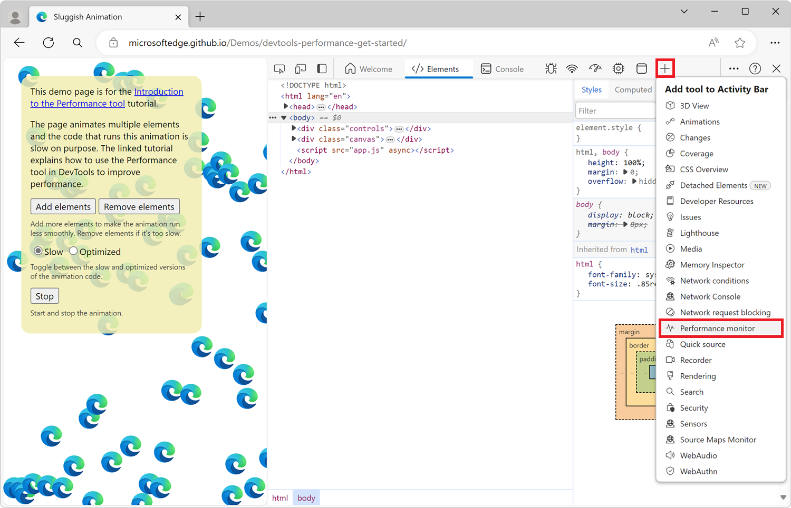
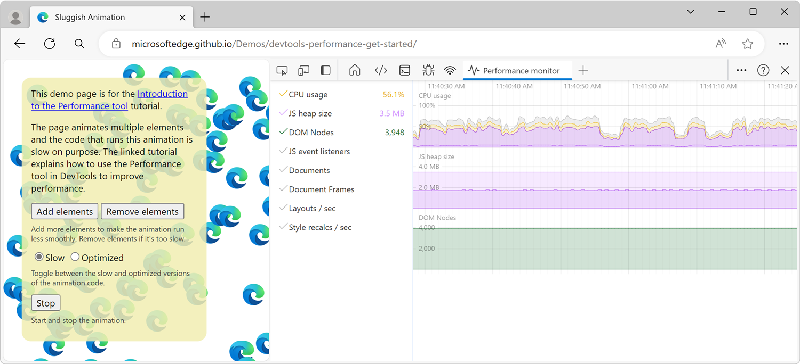
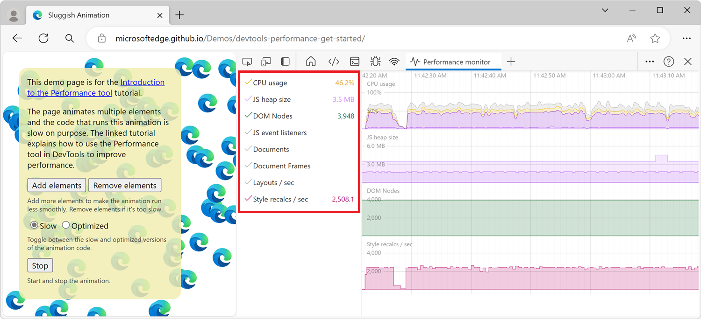

# Measure runtime performance of a page using the Performance monitor tool

Use the **Performance monitor** tool to get a real-time view of the runtime performance of a webpage.

The **Performance monitor** tool helps determine where performance problems come from.  There are various reasons why a website might run slowly.  This tool provides clues to understand whether the problems are related to causes such as the following:
*  High memory or CPU usage.
*  Too frequent layout and style calculations.
*  Too many DOM nodes and event listeners.

<!-- ====================================================================== -->
## Open the Performance monitor tool

To open the **Performance monitor** tool:

1. To open DevTools, right-click the webpage, and then select **Inspect**.  Or, press **Ctrl+Shift+I** (Windows, Linux) or **Command+Option+I** (macOS).  DevTools opens.

1. In DevTools, on the **Activity Bar**, select the **Performance monitor** tab.  If that tab isn't visible, click the **More Tools** () button:

The **Performance monitor** shows graphs of various performance metrics that update in real time:

<!-- ====================================================================== -->
## Select performance metrics to monitor

The **Performance monitor** tool shows three performance metrics by default, and additional metrics are available.

| Performance metric | Description |
|---|---|
| **CPU usage** | The percentage of CPU used by the web page.  Shown by default. |
| **JS heap size** | The amount of memory used by the JavaScript program on the page.  Shown by default. |
| **DOM Nodes** | The number of DOM nodes in the browser (across tabs).  Shown by default. |
| **JS event listeners** | The number of JavaScript event listeners in the browser (across tabs). |
| **Documents** | The number of document objects in the browser (across tabs). |
| **Document Frames** | The number of document frames in the browser (across tabs). |
| **Layouts / sec** | The number of times per second the browser engine constructs the layout of the page. |
| **Style recalcs / sec** | The number of times per second the browser engine calculates the CSS style of the page. |

To enable or disable any of the available performance metrics, click the labels in the sidebar:

