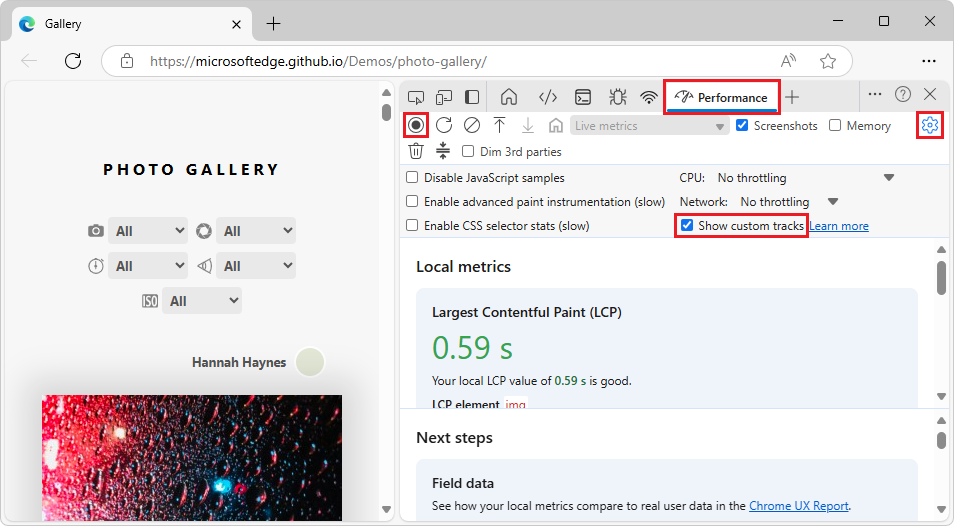
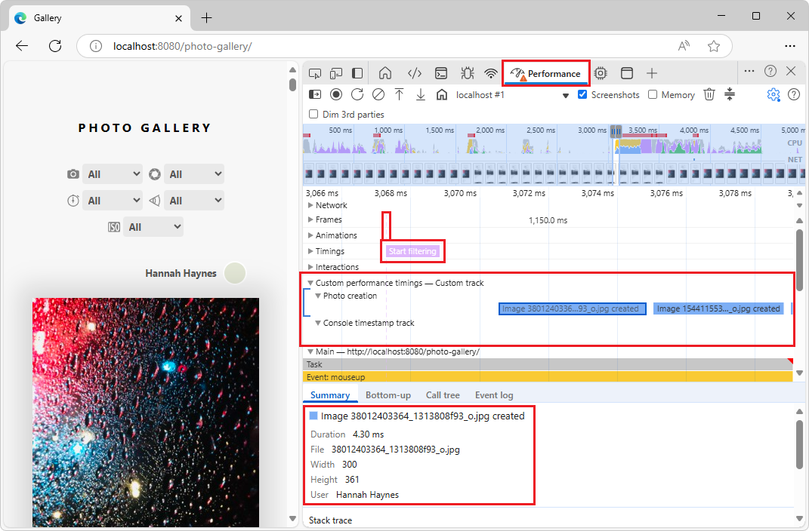

<!-- Copyright Andrés Olivares and Sofia Emelianova

   Licensed under the Apache License, Version 2.0 (the "License");
   you may not use this file except in compliance with the License.
   You may obtain a copy of the License at

       https://www.apache.org/licenses/LICENSE-2.0

   Unless required by applicable law or agreed to in writing, software
   distributed under the License is distributed on an "AS IS" BASIS,
   WITHOUT WARRANTIES OR CONDITIONS OF ANY KIND, either express or implied.
   See the License for the specific language governing permissions and
   limitations under the License.  -->
# Customize your performance data with extensibility API
<!-- https://developer.chrome.com/docs/devtools/performance/extension -->

**Detailed contents:**
* [Overview](#overview)
* [Key benefits](#key-benefits)
* [Inject your data with `console.timeStamp`](#inject-your-data-with-consoletimestamp)
* [Inject your data with the User Timings API](#inject-your-data-with-the-user-timings-api)
   * [`devtools` object](#devtools-object)
* [View your data in the timeline](#view-your-data-in-the-timeline)
* [Code examples](#code-examples)
   * [`console.timeStamp` API examples](#consoletimestamp-api-examples)
   * [User Timings API examples](#user-timings-api-examples)
      * [Add custom tracks and entries to the timeline (`performance.measure()`)](#add-custom-tracks-and-entries-to-the-timeline-performancemeasure)
      * [Add markers to the Timings track (`performance.mark()`)](#add-markers-to-the-timings-track-performancemark)
* [See also](#see-also)


<!-- ====================================================================== -->
## Overview
<!-- https://developer.chrome.com/docs/devtools/performance/extension#overview -->

Want deeper insights into your application's performance beyond the browser's built-in metrics?  The **Performance** tool empowers you to bring your own performance data directly into the timeline.  Whether you're a framework author needing to visualize internal processes, a library developer tracking the impact of your code, or building a complex application with custom instrumentation, the performance extensibility API provides the tools to gain a truly comprehensive understanding of what's happening under the hood.

By injecting your custom measurements and events, you can create tailored visualizations within the **Performance** tool.  Imagine seeing your framework's component lifecycle events alongside standard browser performance metrics, or tracking the execution flow of your custom rendering engine in perfect synchronization with the browser's rendering pipeline.

This API offers two approaches to achieve this:

1. **The `console.timeStamp` API (extended for DevTools)**

   This API provides a high-performance method for instrumenting applications and surfacing timing data exclusively to the **Performance** tool in DevTools.  It's designed for minimal runtime overhead, making it suitable for instrumenting hot paths and production builds.  It does not add entries to the browser's internal performance timeline.

1. **The User Timings API (using `performance.mark` and `performance.measure`)**

   This API leverages the existing [User Timings API](https://developer.mozilla.org/docs/Web/API/Performance_API/User_timing).  It also adds entries to the browser's internal performance timeline, allowing for further analysis and integration with other performance tools; see [Performance APIs](https://developer.mozilla.org/docs/Web/API/Performance_API) at MDN.


<!-- upstream toolbar shows localhost:4200/ -->
<!-- upstream "Main" timeline shows http://localhost:4200/ -->


<!-- ====================================================================== -->
## Key benefits
<!-- https://developer.chrome.com/docs/devtools/performance/extension#key_benefits -->

Both APIs offer:

* **Custom Tracks:** Add dedicated tracks and track groups to represent the unique performance aspects of your code.

* **Entries:** Populate these tracks with entries that clearly mark important events or the duration of specific operation.

* **Color Customization:** Use color-coding to visually distinguish different types of events or measurements at a glance.

**Choosing the right API for your needs:**

* `console.timeStamp` API:

   * Performance impact of instrumentation is a primary concern, especially in production builds.

   * You need a quick and efficient way to mark durations or events without the need for extra metadata.

   * You only need the data to be visualized within the **Performance** tool.

* **User Timings API (performance.mark, performance.measure):**

   * Use when you need to store extra data with each entry, and when you are already using the User Timings API.

   * You need to associate rich data (tooltips, detailed properties) with your performance entries.

   * You want to add visual markers to highlight specific moments.

   * You require the data to be available not only in DevTools but also in the browser's internal performance timeline for broader analysis or other tools.

   * You are already familiar with or using the User Timings API.


<!-- ====================================================================== -->
## Inject your data with `console.timeStamp`
<!-- https://developer.chrome.com/docs/devtools/performance/extension#inject_your_data_with_consoletimestamp -->

The `console.timeStamp` API is extended to allow for the creation of custom timing entries in the **Performance** tool with minimal overhead, especially when DevTools is not recording a trace.

Syntax:

```javascript
console.timeStamp(label: string, 
                  start?: string|number, 
                  end?: string|number, 
                  trackName?: string, 
                  trackGroup?: string, 
                  color?: DevToolsColor);
```

* `label`:

   The label for the timing entry.

* `start` (optional):

   * If defined as string: the name of a previously recorded timestamp (using `console.timeStamp(timeStampName)`).

   * If defined as number: a timestamp in milliseconds relative to [Performance.timeOrigin](https://developer.mozilla.org/docs/Web/API/Performance/timeOrigin) (for example, taken with [performance.now()](https://developer.mozilla.org/docs/Web/API/Performance/now)) that represents the start time of the timing entry.

   * If undefined, the current time is used as start time.

* `end`:

   * If defined as string: The name of a previously recorded timestamp.

   * If defined as number: a timestamp in milliseconds relative to [Performance.timeOrigin](https://developer.mozilla.org/docs/Web/API/Performance/timeOrigin) (for example, taken with [performance.now()](https://developer.mozilla.org/docs/Web/API/Performance/now)) that represents the end time of the timing entry.

   * If undefined, the current time is used as end time.

* `trackName`:

   * The name of the custom track.

* `trackGroup`:

   * The name of the track group.

* `color`:

   * The color of the entry.


<!-- ====================================================================== -->
## Inject your data with the User Timings API
<!-- https://developer.chrome.com/docs/devtools/performance/extension#inject_your_data_with_the_user_timings_api -->

To inject custom data, include a `devtools` object within the `detail` property of [performance.mark](https://developer.mozilla.org/docs/Web/API/Performance/mark#detail) and [performance.measure](https://developer.mozilla.org/docs/Web/API/Performance/measure#detail) methods.  The structure of this `devtools` object determines how your data is displayed in the **Performance** tool.

* Use [performance.mark](https://developer.mozilla.org/docs/Web/API/Performance/mark) to record an instant event or timestamp in the timeline.  You can mark the start or end of a specific operation or any point of interest that doesn't have a duration.  When you include a `devtools` object within the `detail` property, the **Performance** tool shows a custom marker in the **Timings** track.

* Use [performance.measure](https://developer.mozilla.org/docs/Web/API/Performance/measure) to measure the duration of a task or process.  When you include a `devtools` object within the `detail` property, the **Performance** tool shows custom measurement entries in the timeline in a custom track.  If you're using `performance.mark` as a reference point to create a `performance.measure`, you don't need to include the `devtools` object in `performance.mark` calls.


<!-- ------------------------------ -->
#### `devtools` object
<!-- https://developer.chrome.com/docs/devtools/performance/extension#devtools_object -->

<!-- resume -->

These types define the structure of the `devtools` object for different extension features:

```javascript
type DevToolsColor =
  "primary" | "primary-light" | "primary-dark" |
  "secondary" | "secondary-light" | "secondary-dark" |
  "tertiary" | "tertiary-light" | "tertiary-dark" |
  "error";

interface ExtensionTrackEntryPayload {
  dataType?: "track-entry"; // Defaults to "track-entry"
  color?: DevToolsColor;    // Defaults to "primary"
  track: string;            // Required: Name of the custom track
  trackGroup?: string;      // Optional: Group for organizing tracks
  properties?: [string, string][]; // Key-value pairs for detailed view
  tooltipText?: string;     // Short description for tooltip
}

interface ExtensionMarkerPayload {
  dataType: "marker";       // Required: Identifies as a marker
  color?: DevToolsColor;    // Defaults to "primary"
  properties?: [string, string][]; // Key-value pairs for detailed view
  tooltipText?: string;     // Short description for tooltip
}
```


<!-- ====================================================================== -->
## View your data in the timeline
<!-- https://developer.chrome.com/docs/devtools/performance/extension#view-custom-data -->
<!-- how to view a custom track, not how to create it -->

To see the custom performance measures in the demo:

1. Optionally, clone the "MicrosoftEdge / Demos" repo, and then start a localhost server in the cloned `demos/photo-gallery` directory.  See [Clone the Edge Demos repo to your drive](../sample-code/sample-code.md#clone-the-edge-demos-repo-to-your-drive) and [Start the localhost server](../sample-code/sample-code.md#start-the-localhost-server), in _Sample code for DevTools_.  This approach enables you to modify the sample code.

1. In the browser, go to `http://localhost:8080` or equivalent, in a new window or tab.

   Or, instead of cloning the repo and starting the server, open the [Photo Gallery demo page](https://microsoftedge.github.io/Demos/photo-gallery/) in a new window or tab.  This approach doesn't enable you to modify the sample code.

   **Open the Performance tool:**

1. Right-click the demo webpage, and then select **Inspect**.

   DevTools opens.

1. In DevTools, select the **Performance** () tool.

1. In the **Performance** tool, click the **Capture settings** () button, and then make sure that the **Show custom tracks** checkbox is selected:

   

1. Click the **Record** () button.

1. Reload the page.

1. Change the camera model filter.  For example, at the top of the demo page, in the **Camera** dropdown menu on the left, change from **All** to **Apple iPhone 12**.

1. Click a photo, such as the first photo.

   The photo expands.

1. In DevTools, click the **Stop** button.

   The profile is displayed.

1. Scroll down to the **Custom performance timings — Custom track** track group, and expand it.

   The following custom tracks are shown:
   * **Photo creation**
   * **Filtering**
   * **Loading**

1. Expand each of these three tracks.

1. Use the mouse and/or arrow keys to shift and zoom the profile, to display the custom performance measures.

   

1. In the custom track, select a marker.  A custom tooltip is displayed.

   In the **Summary** tab at the bottom of the **Performance** tool, details are shown for the marker.

The code that defines these custom performance measures is shown in [Add custom tracks and entries to the timeline (`performance.measure()`)](#add-custom-tracks-and-entries-to-the-timeline-performancemeasure), below.


<!-- ====================================================================== -->
## Code examples
<!-- https://developer.chrome.com/docs/devtools/performance/extension#code_examples -->

Below are a few examples of how to use the API to add your own data to the **Performance** tool by using each available mechanism.


<!-- ------------------------------ -->
#### `console.timeStamp` API examples
<!-- https://developer.chrome.com/docs/devtools/performance/extension#consoletimestamp_api_examples -->

To add `console.timeStamp` to the Photo Gallery demo:

1. Clone the Demos repo and start the localhost server as described in [View your data in the timeline](#view-your-data-in-the-timeline), above.

1. In `\Demos\photo-gallery\gallery.js`, in the top of the `loadPhoto()` method, add the following code:

   ```javascript
   // Take a start timestamp
   const start = performance.now();
   // Measure duration from start to now
   console.timeStamp("measure 1", start, undefined, "My Track", "My Group", "primary-light");
   // Take an end timestamp
   const end = performance.now();
   // Measure duration from start to end
   console.timeStamp("measure 2", start, end, "My Track", "My Group", "secondary-dark");
   ```
   
1. Make a recording and then view it, as described in [View your data in the timeline](#view-your-data-in-the-timeline), above.

   This results in the following custom track entry in the performance timeline:

   


<!-- ------------------------------ -->
#### User Timings API examples
<!-- https://developer.chrome.com/docs/devtools/performance/extension#user_timings_api_examples -->

In the next sections, see the examples of code that showcase how to do the following:

* [Add custom tracks and entries to the timeline](#add-custom-tracks-and-entries-to-the-timeline)
* [Add markers to the Timings track](#add-markers-to-the-timings-track)


<!-- ---------- -->
###### Add custom tracks and entries to the timeline (`performance.measure()`)
<!-- https://developer.chrome.com/docs/devtools/performance/extension#tracks -->

Create custom tracks and populate them with entries to visualize your performance data in a custom track.

<!-- not upstream: -->
For example, the above Photo Gallery demo uses the [performance.measure()](https://developer.mozilla.org/docs/Web/API/Performance/measure#detail) method from the User Timings API.  (The provided demo doesn't use `performance.mark()` or the `console.timeStamp` API.)

Below are excerpts from the demo's source code and which keywords are used for custom perf data, from [photo-gallery/gallery.js](https://github.com/MicrosoftEdge/Demos/blob/main/photo-gallery/gallery.js):

```javascript
const customPerformanceTrackGroupName = "Custom performance timings";
```

```javascript
const imageCreationStart = performance.now();
```

To inject custom data, the Gallery demo includes a `devtools` object within the `detail` property of the `performance.measure` method:

```javascript
const perfMeasureDescription = `Image ${file} created`;
performance.measure(perfMeasureDescription, {
   start: imageCreationStart,
   end: performance.now(),
   detail: {
      devtools: {
         dataType: "track-entry",
         color: "primary",
         trackGroup: customPerformanceTrackGroupName,
         track: "Photo creation",
         properties: [
            ['File', file],
            ['Width', w],
            ['Height', h],
            ['User', user],
         ],
         tooltipText: perfMeasureDescription
      }
   },
});
```

```javascript
const filterStartTime = performance.now();
```

```javascript
const description = `Filter applied: ${filter.id}`;
performance.measure(description, {
   start: filterStartTime,
   end: performance.now(),
   detail: {
      devtools: {
         dataType: "track-entry",
         color: "secondary",
         trackGroup: customPerformanceTrackGroupName,
         track: "Filtering",
         properties: [
            ['Filter Value', filter.value]
         ],
         tooltipText: description
      }
   },
});
```

```javascript
const loadStartTime = performance.now();
const perfMeasureDescription = `Loading photo: ${fileName}`;
```

```javascript
performance.measure(perfMeasureDescription, {
   start: loadStartTime,
   end: performance.now(),
   detail: {
      devtools: {
         dataType: "track-entry",
         color: "tertiary",
         trackGroup: customPerformanceTrackGroupName,
         track: "Loading",
         properties: [
            ['Photo', fileName]
         ],
         tooltipText: perfMeasureDescription
      }
   },
});
```

The result is shown in [View your data in the timeline](#view-your-data-in-the-timeline), above.


<!-- ---------- -->
**Example 2, not used in photo-gallery demo:**

```javascript
// Mark used to represent the start of the image processing task
// The start time is defaulted to now
const imageProcessingTimeStart = performance.now();

// ... later in your code

// Track entry representing the completion of image processing
// with additional details and a tooltip
// The start time is a marker from earlier
// The end time is defaulted to now
performance.measure("Image Processing Complete", {
  start: imageProcessingTimeStart,
  detail: {
    devtools: {
      dataType: "track-entry",
      track: "Image Processing Tasks",
      trackGroup: "My Tracks", // Group related tracks together
      color: "tertiary-dark",
      properties: [
        ["Filter Type", "Gaussian Blur"],
        ["Resize Dimensions", "500x300"]
      ],
      tooltipText: "Image processed successfully"
    }
  }
});
```


<!-- ---------- -->
###### Add markers to the Timings track (`performance.mark()`)
<!-- https://developer.chrome.com/docs/devtools/performance/extension#markers -->

Visually highlight specific points of interest in the timeline with custom markers that span across all tracks.

For example:

Within `\Demos\photo-gallery\gallery.js`, within the `addEventListener('input', e => {` body, below the `performance.measure()` call, add the following `performance.mark()` call:

```javascript
performance.mark("Filter Applied", {
   detail: {
      devtools: {
         dataType: "marker",
         color: "secondary",
         properties: [
            ['Filter Value', filter.value]
         ],
         tooltipText: "Filter Applied"
      }
   }
});
```

Within `\Demos\photo-gallery\gallery.js`, within the `function loadPhoto()` body, below the `performance.measure()` call, add the following `performance.mark()` call:

```javascript
performance.mark("Photo Loaded", {
   detail: {
      devtools: {
      dataType: "marker",
      color: "secondary",
      properties: [
         ['Photo', fileName]
      ],
      tooltipText: "Photo Loaded"
      }
   }
});
```

This results in the **Filter Applied** and **Photo Loaded** markers in the **Timings** track, along with tooltip text and properties:


<!-- ---------- -->
**Example 3, not used in photo-gallery demo:**

```javascript
// Marker indicating when the processed image was uploaded
performance.mark("Image Upload", {
  detail: {
    devtools: {
      dataType: "marker",
      color: "secondary",
      properties: [
        ["Image Size", "2.5MB"],
        ["Upload Destination", "Cloud Storage"]
      ],
      tooltipText: "Processed image uploaded"
    }
  }
});
```


<!-- ====================================================================== -->
## See also
<!-- not upstream -->
<!-- all links in article -->

MDN:
* [Performance APIs](https://developer.mozilla.org/docs/Web/API/Performance_API)
   * [User timing](https://developer.mozilla.org/docs/Web/API/Performance_API/User_timing) in Web APIs > Performance APIs.
* [Performance: now() method](https://developer.mozilla.org/docs/Web/API/Performance/now)
* [Performance: mark() method](https://developer.mozilla.org/docs/Web/API/Performance/mark)
* [Performance: measure() method](https://developer.mozilla.org/docs/Web/API/Performance/measure)
* [Performance: timeOrigin property](https://developer.mozilla.org/docs/Web/API/Performance/timeOrigin)

Demos:
* [Photo Gallery](https://microsoftedge.github.io/Demos/photo-gallery/) - the running web app.
   * [photo-gallery/gallery.js](https://github.com/MicrosoftEdge/Demos/blob/main/photo-gallery/gallery.js) - Source code.


<!-- ====================================================================== -->
> [!NOTE]
> Portions of this page are modifications based on work created and [shared by Google](https://developers.google.com/terms/site-policies) and used according to terms described in the [Creative Commons Attribution 4.0 International License](https://creativecommons.org/licenses/by/4.0). 
> The original page is found [here](https://developer.chrome.com/docs/devtools/performance/extension) and is authored by Andrés Olivares and Sofia Emelianova.

[](https://creativecommons.org/licenses/by/4.0)
This work is licensed under a [Creative Commons Attribution 4.0 International License](https://creativecommons.org/licenses/by/4.0).
