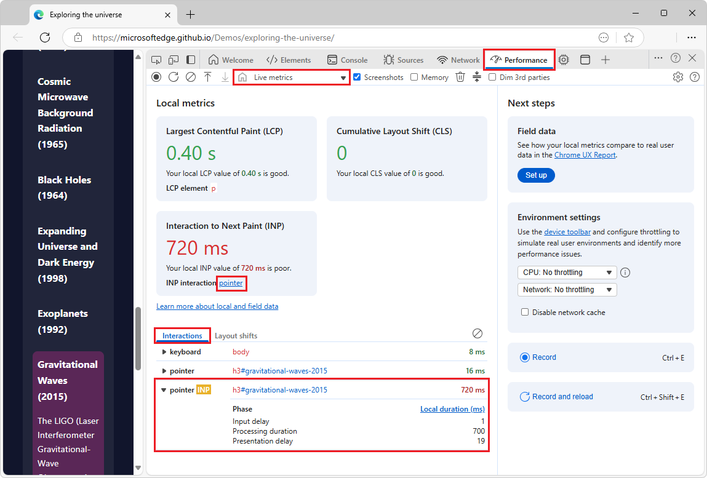
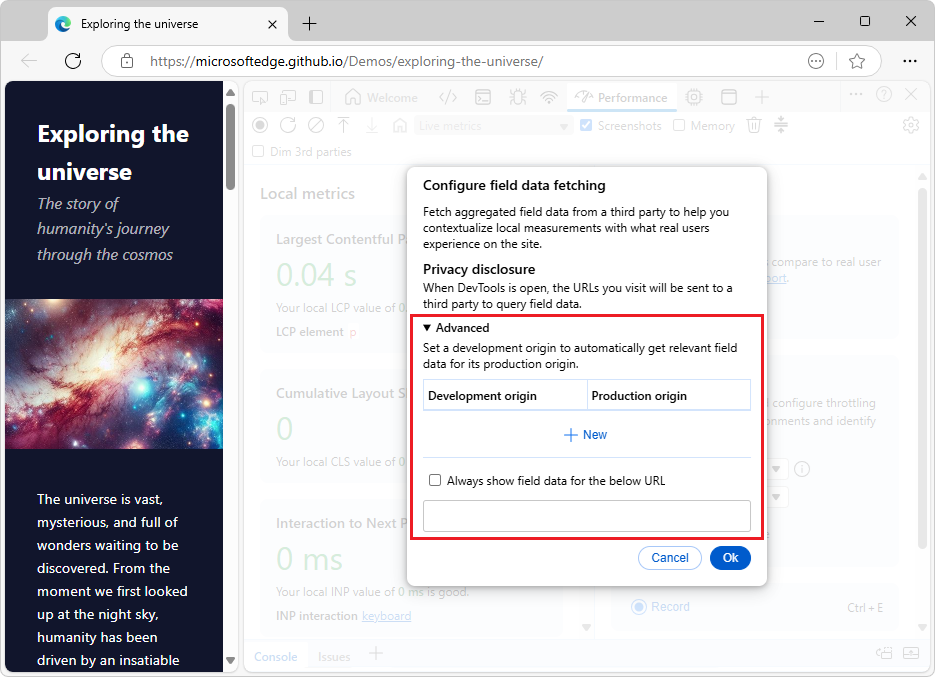

<!-- Copyright Dale St. Marthe and Sofia Emelianova

   Licensed under the Apache License, Version 2.0 (the "License");
   you may not use this file except in compliance with the License.
   You may obtain a copy of the License at

       https://www.apache.org/licenses/LICENSE-2.0

   Unless required by applicable law or agreed to in writing, software
   distributed under the License is distributed on an "AS IS" BASIS,
   WITHOUT WARRANTIES OR CONDITIONS OF ANY KIND, either express or implied.
   See the License for the specific language governing permissions and
   limitations under the License.  -->
# Performance tool: Analyze your website's performance
<!-- https://developer.chrome.com/docs/devtools/performance/overview -->

Use the **Performance** tool to analyze your website's performance.

**Detailed contents:**
* [Overview](#overview)
* [Open the Performance tool](#open-the-performance-tool)
   * [Using the Command Menu](#using-the-command-menu)
* [Monitor Core Web Vitals metrics](#monitor-core-web-vitals-metrics)
   * [Interaction to Next Paint (INP)](#interaction-to-next-paint-inp)
   * [Interactions tab](#interactions-tab)
   * [Layout shifts tab](#layout-shifts-tab)
   * [View local and field metrics](#view-local-and-field-metrics)
      * [Compare your experience to the experience of your users](#compare-your-experience-to-the-experience-of-your-users)
   * [Simulate a real user environment](#simulate-a-real-user-environment)
      * [Configure your environment to better match that of your users](#configure-your-environment-to-better-match-that-of-your-users)
* [Capture and analyze a performance report](#capture-and-analyze-a-performance-report)
   * [Record a performance profile](#record-a-performance-profile)
   * [Change capture settings](#change-capture-settings)
   * [Analyze a performance report](#analyze-a-performance-report)
* [Improve performance with these tools](#improve-performance-with-these-tools)

<!-- ====================================================================== -->
## Overview
<!-- https://developer.chrome.com/docs/devtools/performance/overview#overview -->

The **Performance** tool lets you record CPU performance profiles of your web applications.  Analyze profiles to find potential performance bottlenecks and ways you can optimize resource use.

<!-- https://microsoftedge.github.io/Demos/exploring-the-universe/ -->

Use the **Performance** tool to do the following:

* View local Core Web Vitals metrics: Largest Contentful Paint (LCP), Cumulative Layout Shift (CLS), and Interaction to Next Paint (INP).
* Record a performance profile.
* Change capture settings.
* Analyze a performance report.

When you initially open the **Performance** tool, Core Web Vitals metrics are displayed, in three cards in a **Local metrics** section.  After you record a performance trace, the performance trace is displayed instead of Core Web Vitals.  A dropdown menu enables switching between Core Web Vitals (**Local metrics**) and multiple recorded performance traces.

For a comprehensive guide on improving your website's performance, see [Analyze runtime performance (tutorial)](./index.md).

<!-- ====================================================================== -->
## Open the Performance tool
<!-- https://developer.chrome.com/docs/devtools/performance/overview#open_the_performance_panel -->

To open the **Performance** tool: 

1. Right-click a webpage,<!-- https://microsoftedge.github.io/Demos/devtools-performance-get-started/ --> and then select **Inspect**.

   DevTools opens.

1. In the **Activity Bar** at top, select the  **Performance** tool.

   If the  **Performance** tool isn't shown in the **Activity Bar**, click the **More tools** () button and then select the **Performance** tool.

<!-- ------------------------------ -->
#### Using the Command Menu
<!-- added heading as separator, compared to upstream -->

Or, open the **Performance** tool by using the **Command Menu**, as follows:

1. Right-click a webpage, and then select **Inspect**.

   DevTools opens.

1. Open the **Command Menu** by pressing:

   * macOS: **Command+Shift+P**
   * Windows, Linux, ChromeOS: **Control+Shift+P**

   

1. Start typing **performance**, select **Show Performance [panel]**, and then press **Enter**.

<!-- ====================================================================== -->
## Monitor Core Web Vitals metrics
<!-- ## Observe Core Web Vitals live  https://developer.chrome.com/docs/devtools/performance/overview#live-metrics -->

The home page of the **Performance** tool shows performance metrics about the rendered webpage, such as:
* Largest Contentful Paint (LCP), which shows how quickly the main content of the page loaded.
* Cumulative Layout Shift (CLS), which shows a measure of the most recent unexpected layout shift.
* Interaction to Next Paint (INP), which assesses the responsiveness of the most recent user interaction on the page.

In contrast, a recorded performance trace shows information about the performance of the page over the period of time where the recording occurred, such as:
* The user interactions that occurred during the recording.
* The JavaScript code that ran.
* The styling and layout operations that occurred.
* Other performance metrics over time, such as network requests and layout shifts.

<!-- ---------------------------------- -->
#### Terminology

| Term | Description | Docs |
|---|---|---|
| Web Vitals | A large set of metrics giving unified guidance to delivering a great user experience on the web. | [Web Vitals](https://web.dev/articles/vitals) |
| Core Web Vitals | The subset of Web Vitals that apply to all web pages, and should be measured by all site owners.  Each of the Core Web Vitals represents a distinct facet of the user experience, is measurable in the field, and reflects the real-world experience of a critical user-centric outcome. | [Core Web Vitals](https://web.dev/articles/vitals#core-web-vitals) in _Web Vitals_ |
| Largest Contentful Paint (LCP) | Measures _loading_ performance. To provide a good user experience, LCP should occur within 2.5 seconds of when the page first starts loading.  The render time of the largest image, text block, or video visible in the viewport, relative to when the user first navigated to the page. | [Largest Contentful Paint (LCP)](https://web.dev/articles/lcp) |
| Cumulative Layout Shift (CLS) | Measures _visual stability_. To provide a good user experience, pages should maintain a CLS of 0.1. or less.  The largest burst of layout shift scores for every unexpected layout shift that occurs during the entire lifecycle of a page. | [Cumulative Layout Shift (CLS)](https://web.dev/articles/cls) |
| Interaction to Next Paint (INP) | Measures _interactivity_. To provide a good user experience, pages should have a INP of 200 milliseconds or less.  The page's overall responsiveness to user interactions, based on the latency of all click, tap, and keyboard interactions that occur throughout the lifespan of a user's visit to a page. | [Interaction to Next Paint (INP)](https://web.dev/articles/inp) |
| local metrics, local data | The LCP, CLS, and INP metrics.  They are captured locally on the inspected webpage, and are updated as you interact with the page. | |
| field metrics, field data | Data from the Chrome UX Report (CrUX), showing how most of your users experience your website. | [Overview of CrUX](https://developer.chrome.com/docs/crux) |

When you open the **Performance** tool, it immediately captures and displays the local [Largest Contentful Paint (LCP)](https://web.dev/articles/lcp) and [Cumulative Layout Shift (CLS)](https://web.dev/articles/cls) metrics, and displays their scores (**good**, **needs improvement**, or **bad**).

The **Interaction to Next Paint (INP)** card is also displayed, initially without data.

To get a breakdown of a metric score, hover over the metric value to see a tooltip.

<!-- ------------------------------ -->
#### Interaction to Next Paint (INP)

If you interact with your page, the **Performance** tool also captures your local [Interaction to Next Paint (INP)](https://web.dev/articles/inp) and its score, which, in addition to LCP and CLS, gives you a complete overview of the Core Web Vitals metrics of your page when using your network connection and device.

See [Core Web Vitals](https://web.dev/articles/vitals#core-web-vitals) in _Web Vitals_ at web.dev.

To interact with a webpage to display the **Interaction to Next Paint (INP)** card:

1. Open the [Sluggish Animation](https://microsoftedge.github.io/Demos/devtools-performance-get-started/) demo in a new window or tab.

1. Right-click the webpage and then select **Inspect** to open DevTools, and then select the **Performance** tool.

1. In the demo webpage, click the **Add elements** button.

   Below the **Local metrics** cards, the **Interactions** tab and **Layout shifts** tabs are populated.

<!-- ------------------------------ -->
#### Interactions tab

The **Interactions** tab displays information about your interactions with the webpage:

The **Interactions** tab includes:
* Phases.
* Elements.
* Timings.

To clear the **Interactions** tab, click the **Clear the current log** () button to the right of the **Interactions** tab.

<!-- ------------------------------ -->
#### Layout shifts tab

The **Layout shifts** tab displays information about layout shifts:

The **Layout shifts** tab includes:
* Scores.
* Elements.

To clear the **Layout shifts** tab, click the **Clear the current log** () button to the right of the **Layout shifts** tab.

<!-- ------------------------------ -->
#### Compare your experience to the experience of your users
<!-- https://developer.chrome.com/docs/devtools/performance/overview#compare -->

You can fetch field data from the [Chrome UX Report](https://developer.chrome.com/docs/crux) and compare the experience of your site's users to your local metrics.

To add field data:

1. In the **Performance** tool home page > **Next steps** section > **Field data** section, click the **Set up** button:

   <!-- 2nd use of this png -->

   If the **Performance** tool home page is not shown, because the timeline is shown instead, optionally click the **Save profile** () button, and then click the **Clear** () button.

   The **Configure field data fetching** dialog opens:

   <!-- 2nd use of this png -->

   <!-- expander section -->
   **Advanced: Set up a mapping between development and production environments:**

      Optionally, to automatically get the most relevant field data, you can set up (multiple) mappings between your development and production origins:

      1. In the **Configure field data fetching** dialog, expand the **Advanced** section, and then click **+ New**.
   
      1. In the mapping table, enter your development and production URLs and click **+**.

      

      For example, a mapping of `http://localhost:8080` to `https://example.com` will bring up field data for `example.com/page1` when you navigate to `localhost:8080/page1`.

      Additionally, if for some reason you can't get the field data automatically, you can select the **Always show field data for the below URL** checkbox and provide a URL.  The **Performance** tool will attempt to fetch field data for this URL first and then show you this field data no matter what page you navigate to.

      To change your field data fetch settings after setup, in the **Performance** tool home page, in the **Field data** section, click the **Configure** button.  If the **Performance** tool home page is not shown, because the timeline is shown instead, optionally click the **Save profile** () button, and then click the **Clear** () button.

   <!-- end expander section -->

1. Note the **Privacy disclosure**, and then click the **Ok** button.

   With the field data fetch set up, the **Performance** tool now shows you a comparison between your local metric scores and those that your users experience.  You can see the collection period in the **Field data** section on the right.

   <!-- todo: redo showing edge -->

   To get a breakdown of a metric score, hover over the metric value to see a tooltip.

<!-- ---------- -->
###### View local and field metrics
<!-- merge this section with [Compare your experience to the experience of your users](#compare-your-experience-to-the-experience-of-your-users), below -->
<!-- section not in upstream article; copied from https://developer.chrome.com/blog/new-in-devtools-130#live-metrics-recommendations -->
See also [Compare your experience to the experience of your users](#compare-your-experience-to-the-experience-of-your-users), below.

<!-- 
so far, we haven't told users how to display field metrics
so talking about the different between local and field metrics feels premature
todo: at first mention of 'local' or 'field' at top of article, give glossary definition of the two terms
-->

<!--  -->
<!-- todo: add screenshot showing both metrics at the same time -->

<!-- added 2 paras in Edge docs: -->
* _Local metrics_ are the LCP, CLS, and INP metrics described above.  They are captured locally on the inspected webpage and updated as you interact with the page.
* _Field metrics_ come from the Chrome UX Report (CrUX), and show how most of your users experience your website.  For information about CrUX, see [Overview of CrUX](https://developer.chrome.com/docs/crux).  The difference between the local and field metrics shows that most of your users might not experience your website under the same conditions as you do.

The **Environment settings** section gives you recommendations about simulating a slower CPU and network connection to better match your users' experience.

<!-- composed new procedure added in this section: -->
1. Open a webpage; for example, right-click this [Sluggish Animation demo](https://microsoftedge.github.io/Demos/devtools-performance-get-started/) link, and then open it in a new window or tab.

1. Right-click the demo page and then select **Inspect**.  DevTools opens.

1. Select the **Performance** tool.

   The **Performance** tool home page appears:

   <!-- 1st use of this png -->

   Local metrics<!-- per UI --> are sometimes called "live metrics".<!-- per upstream docs -->  Local metrics provide metric-specific recommendations that help you configure your development environment as close as possible to what your users experience.

1. In the **Next steps** > **Field data** section, click the **Set up** button.

   The **Configure field data fetching** dialog opens:

   <!-- 1st use of this png -->

1. Click the **Ok** button.

   The field metrics are displayed:

   

   Enabling field metrics changes the **Local metrics** section of the page to be **Local and field metrics**, and shows both the user's local metrics and metrics that were captured on real users' devices.

   In the **Performance** tool home page > **Next steps** section **Field data** section, the **Set up** button is replaced by the **Configure** button, which re-opens the **Configure field data fetching** dialog.

<!-- from start of upstream What's new section, w/ reformatted links: -->
Live metrics provide metric-specific recommendations that help you configure your development environment as close as possible to what your users experience.  See [Monitor Core Web Vitals metrics](#monitor-core-web-vitals-metrics), above.

<!-- from upstream What's new section, con't, w/ reformatted links: -->
To get recommendations, first set up field data fetching from Chrome UX Report (CrUX).  To set up field data fetching, see [Compare your experience to the experience of your users](#compare-your-experience-to-the-experience-of-your-users), below.  For information about Chrome UX Report (CrUX), see [Overview of CrUX](https://developer.chrome.com/docs/crux).

<!-- from upstream What's new section, con't, w/ reformatted links: -->
Then expand the **Consider your local test conditions** section in each metric card (if any) and **Consider real user environments** in the **Environment settings**.

<!-- equiv. to png in upstream What's New: -->
The expanded sections with recommendations:

The above screenshot of the **Performance** tool's **Local metrics** home page contains the sections:
* **Largest Contentful Paint (LCP)**
* **Cumulative Layout Shift (CLS)**
* **Interaction to Next Paint (INP)**

<!-- from end of upstream What's new section: -->
To approximate the experience of your users, follow the recommendations in [Configure your environment to better match that of your users](#configure-your-environment-to-better-match-that-of-your-users), above.

<!-- ------------------------------ -->
#### Simulate a real user environment
<!-- section not in upstream article; copied from "Simulate a mobile CPU" in tut -->

<!-- added para in this PR, 2nd spot in this article: -->
The difference between the local and field metrics, as seen above, shows that most of your users might not experience your website under the same conditions as you do.  The **Environment settings** section gives you recommendations about simulating a slower CPU and network connection to better match with what your users experience.

<!-- remainder copied from [Simulate a mobile CPU](./index.md#simulate-a-mobile-cpu) in _Analyze runtime performance (tutorial)_. -->
Mobile devices have much less CPU power than desktops and laptops.  Whenever you profile a page, use CPU Throttling to simulate how your page performs on mobile devices.

<!-- added para's, compared to copied section: -->
1. Open a webpage in an InPrivate browser window; for example, right-click the link [Sluggish Animation](https://microsoftedge.github.io/Demos/devtools-performance-get-started/) and then select **Open link in InPrivate window**.

1. Right-click the demo webpage, and then select **Inspect**.

   DevTools opens.

1. In DevTools, open the **Performance** tool:<!-- end of added para's -->

   

1. Click the **Capture settings** () button.

   DevTools displays settings for capturing performance metrics.

1. In the **CPU** drop-down list, select **4x slowdown - recommended**:

   

   DevTools throttles your CPU so that it's 4 times slower than usual.  A warning icon is displayed on the **Performance** tool's tab, to remind you that throttling is enabled.

   If you want to ensure that pages work well on low-end mobile devices, set **CPU** to **6x slowdown**.

<!-- ---------- -->
###### Configure your environment to better match that of your users
<!-- https://developer.chrome.com/docs/devtools/performance/overview#env-config -->

With the field data fetch set up as described in [Compare your experience to the experience of your users](#compare-your-experience-to-the-experience-of-your-users) above, the **Performance** tool provides you with recommendations on how to configure your environment to better match the experience of your users.

To configure your environment:

1. In the **Performance** tool, in each metric card, expand the **Consider your local test conditions** section, if any, and read the recommendations.

   <!--  -->
   <!-- upstream, matching png: -->
   <!-- Looks like in this example, to better match the experience of your users, you might want to use a common desktop screen size and throttle down the CPU and network. -->

1. Apply the recommendations.  For example, set your viewport to one of the common screen sizes (for example, 720p or 1080p).  To emulate specific devices and screen sizes, you can use device emulation in the **Elements** tool; see [Emulate mobile devices (Device Emulation)](../device-mode/index.md).

1. Some percentage of users of the website use desktops to browse.  To make sure that you compare your local metric scores to the correct field data, you can select **Desktop** from the **Field data** > **Device** drop-down list.

1. In the **Environment settings** section, set the **Network** drop-down list to, for example, **Fast 4G**, and **CPU** to, for example, **20x slowdown**.  You may also make sure to select the **Disable network cache** checkbox in the same section.

1. Reload the webpage, interact with the webpage to capture your local INP, and compare the metric scores again.

   <!-- todo: redo w/ edge -->

   The metric scores are now more similar to those that your users experience.  Accordingly, the **Consider your local test conditions** sections are no longer displayed in the metric cards.

You can now start improving the [Core Web Vitals](https://web.dev/articles/vitals) of your website:

* [Optimize LCP](https://web.dev/articles/optimize-lcp)
* [Optimize INP](https://web.dev/articles/optimize-inp)
* [Optimize CLS](https://web.dev/articles/optimize-cls)

<!-- ====================================================================== -->
## Capture and analyze a performance report
<!-- https://developer.chrome.com/docs/devtools/performance/overview#capture_and_analyze_a_performance_report -->

In the next sections, follow guidance on how to record a profile, change capture settings, and analyze the report.

<!-- ------------------------------ -->
#### Record a performance profile
<!-- https://developer.chrome.com/docs/devtools/performance/overview#record_a_performance_profile -->

When you are ready to record, the **Performance** tool gives you the following options:

* [Record runtime performance](./reference.md#record-runtime-performance) in _Performance features reference_.
* [Record load performance](./reference.md#record-load-performance) in _Performance features reference_.
* [Capture screenshots while recording](./reference.md#capture-screenshots-while-recording) in _Performance features reference_.
* [Force garbage collection while recording](./reference.md#force-garbage-collection-while-recording) in _Performance features reference_.
* [Save and share a recording](./reference.md#save-and-share-a-recording) in _Performance features reference_.
* [Load a recording](./reference.md#load-a-recording) in _Performance features reference_.
* [Clear the previous recording](./reference.md#clear-the-previous-recording) in _Performance features reference_.

<!-- ------------------------------ -->
#### Change capture settings
<!-- https://developer.chrome.com/docs/devtools/performance/overview#change_capture_settings -->

**Capture settings** let you change how DevTools captures performance recordings and can give you additional information in the report.  Click the **Capture settings** () button to access the **Capture settings** menu.

Select the following options from the **Capture settings** menu:

* Select the **Disable JavaScript samples** checkbox:  Disables the recording of the JavaScript call stacks displayed in the Main track that are called during the recording.  Reduces performance overhead.  See [Disable JavaScript samples](../performance/reference.md#disable-javascript-samples) in _Performance features reference_.

* Select the **Enable advanced rendering instrumentation (slow)** checkbox:  Captures advanced paint instrumentation.  Significantly hinders performance.  See [Enable advanced paint instrumentation](../performance/reference.md#enable-advanced-paint-instrumentation) in _Performance features reference_.

* Select the **Enable CSS selector stats (slow)** checkbox: Captures CSS selector statistics.  Significantly hinders performance.  See [View CSS selector costs in the Performance tool sidebar](../whats-new/2024/11/devtools-131.md#view-css-selector-costs-in-the-performance-tool-sidebar) in _What's New in DevTools (Microsoft Edge 131)_.

* CPU throttling: Simulate slower CPU speeds.  See [Throttle the CPU while recording](../performance/reference.md#throttle-the-cpu-while-recording) in _Performance features reference_.  

* Network throttling: Simulate slower network speeds.  See [Throttle the network while recording](../performance/reference.md#throttle-the-network-while-recording) in _Performance features reference_.

<!-- ------------------------------ -->
#### Analyze a performance report
<!-- https://developer.chrome.com/docs/devtools/performance/overview#analyze_a_performance_report -->

For a complete guide on how to use the **Performance** tool, see [Analyze a performance recording](../performance/reference.md#analyze-a-performance-recording) in _Performance features reference_.

To navigate a performance report:

* See [Navigate the recording](../performance/reference.md#navigate-the-recording) in _Performance features reference_.

* See [Search activities](../performance/reference.md#search-activities) in _Performance features reference_.

* See [Track event initiators](../performance/reference.md#track-event-initiators) in _Performance features reference_.

To focus on what matters for your workflow:

* [Change the order of tracks and hide them](../performance/reference.md#change-the-order-of-tracks-and-hide-them)

* [Hide functions and their children in the flame chart](../performance/reference.md#hide-functions-and-their-children-in-the-flame-chart)

* [Zoom on portions of a recording and switch between zoom levels](./reference.md#zoom-on-portions-of-a-recording-and-switch-between-zoom-levels) in _Performance features reference_.

To learn about the **Bottom-up**, **Call tree**, and **Event log** tabs:

* [View activities in a table](./reference.md#view-activities-in-a-table) in _Performance features reference_.

To analyze a performance report:

* [View main thread activity](./reference.md#view-main-thread-activity) in _Performance features reference_.
* [Read the flame chart](./reference.md#read-the-flame-chart) in _Performance features reference_.
* [View a screenshot](./reference.md#view-a-screenshot) in _Performance features reference_.
* [View memory metrics](./reference.md#view-memory-metrics) in _Performance features reference_.
* [View the duration of a portion of a recording](./reference.md#view-the-duration-of-a-portion-of-a-recording) in _Performance features reference_.
* [Analyze CSS selector performance during Recalculate Style events](./selector-stats.md).
* [Analyze frames per second (FPS)](./reference.md#analyze-frames-per-second-fps) in _Performance features reference_.
* [Performance recording event reference](./performance-reference.md)

<!-- ====================================================================== -->
## Improve performance with these tools

Discover other tools that can help you improve your website's performance:

| Tool | Article |
|---|---|
| **Lighthouse** tool | [Optimize website speed using Lighthouse](../speed/get-started.md) |
| **Memory** tool | [Fix memory problems](../memory-problems/index.md) |
| **Performance** tool > **Insights** tab | [Get actionable insights](./reference.md#get-actionable-insights) in _Performance features reference_. |
| **Rendering** tool | [Rendering tool, to see what a webpage looks like with different display options or vision deficiencies](../rendering-tools/rendering-tool.md) |
| **Issues** tool | [Find and fix problems using the Issues tool](../issues/index.md) |
| **Performance** tool | [View layers information](../performance/reference.md#view-layers-information) in _Performance features reference_ |

<!-- ====================================================================== -->
> [!NOTE]
> Portions of this page are modifications based on work created and [shared by Google](https://developers.google.com/terms/site-policies) and used according to terms described in the [Creative Commons Attribution 4.0 International License](https://creativecommons.org/licenses/by/4.0). 
> The original page is found [here](https://developer.chrome.com/docs/devtools/performance/overview) and is authored by Dale St. Marthe and Sofia Emelianova.

This work is licensed under a [Creative Commons Attribution 4.0 International License](https://creativecommons.org/licenses/by/4.0).
