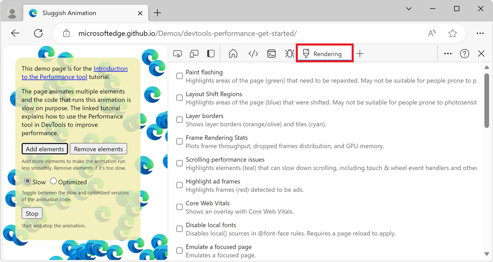

<!-- Copyright Kayce Basques

   Licensed under the Apache License, Version 2.0 (the "License");
   you may not use this file except in compliance with the License.
   You may obtain a copy of the License at

       https://www.apache.org/licenses/LICENSE-2.0

   Unless required by applicable law or agreed to in writing, software
   distributed under the License is distributed on an "AS IS" BASIS,
   WITHOUT WARRANTIES OR CONDITIONS OF ANY KIND, either express or implied.
   See the License for the specific language governing permissions and
   limitations under the License.  -->
# Performance features reference
<!-- https://developer.chrome.com/docs/devtools/performance/reference -->

This page is a comprehensive reference of DevTools features that are related to analyzing performance.

For a step-by-step tutorial on how to analyze the performance of a page using the **Performance** tool, see [Analyze runtime performance (tutorial)](index.md).

The images in this page show DevTools undocked into its own, dedicated window. To learn more about undocking DevTools, see [Undock DevTools into a separate window](../customize/placement.md#undock-devtools-into-a-separate-window) in _Change DevTools placement (Undock, Dock to bottom, Dock to left)_.


<!-- generated by tocex on 2025/02/21 -->
**Detailed contents:**
* [Open the Performance tool](#open-the-performance-tool)
* [Record performance](#record-performance)
   * [Record runtime performance](#record-runtime-performance)
   * [Record load performance](#record-load-performance)
   * [Capture screenshots while recording](#capture-screenshots-while-recording)
   * [Force garbage collection while recording](#force-garbage-collection-while-recording)
   * [Show recording settings](#show-recording-settings)
   * [Disable JavaScript samples](#disable-javascript-samples)
   * [Throttle the network while recording](#throttle-the-network-while-recording)
   * [Throttle the CPU while recording](#throttle-the-cpu-while-recording)
   * [Enable CSS selector stats](#enable-css-selector-stats)
   * [Enable advanced paint instrumentation](#enable-advanced-paint-instrumentation)
* [Annotate a recording and share it](#annotate-a-recording-and-share-it)
   * [Save and share a recording](#save-and-share-a-recording)
   * [Load a recording](#load-a-recording)
* [Clear the previous recording](#clear-the-previous-recording)
* [Analyze a performance recording](#analyze-a-performance-recording)
   * [Get actionable insights](#get-actionable-insights)
   * [Navigate the recording](#navigate-the-recording)
      * [Use keyboard shortcuts to navigate](#use-keyboard-shortcuts-to-navigate)
      * [Select a portion of a recording](#select-a-portion-of-a-recording)
      * [Zoom on portions of a recording and switch between zoom levels](#zoom-on-portions-of-a-recording-and-switch-between-zoom-levels)
      * [Scroll a long flame chart](#scroll-a-long-flame-chart)
   * [Search activities](#search-activities)
   * [Change the order of tracks and hide them](#change-the-order-of-tracks-and-hide-them)
   * [View main thread activity](#view-main-thread-activity)
   * [Read the flame chart](#read-the-flame-chart)
   * [Track event initiators](#track-event-initiators)
   * [Hide functions and their children in the flame chart](#hide-functions-and-their-children-in-the-flame-chart)
      * [Ignore scripts in the flame chart](#ignore-scripts-in-the-flame-chart)
   * [View activities in a table](#view-activities-in-a-table)
      * [Root activities](#root-activities)
      * [The Bottom-up tab](#the-bottom-up-tab)
      * [The Call tree tab](#the-call-tree-tab)
      * [The Event log tab](#the-event-log-tab)
   * [View performance markers](#view-performance-markers)
   * [View custom timings](#view-custom-timings)
   * [View interactions](#view-interactions)
   * [View layout shifts](#view-layout-shifts)
   * [View animations](#view-animations)
   * [View GPU activity](#view-gpu-activity)
   * [View raster activity](#view-raster-activity)
   * [Analyze frames per second (FPS)](#analyze-frames-per-second-fps)
      * [The Frames section](#the-frames-section)
   * [View network requests](#view-network-requests)
   * [View memory metrics](#view-memory-metrics)
   * [View the duration of a portion of a recording](#view-the-duration-of-a-portion-of-a-recording)
   * [View a screenshot](#view-a-screenshot)
   * [View layers information](#view-layers-information)
   * [View paint profiler](#view-paint-profiler)
   * [View CSS selector statistics](#view-css-selector-statistics)
   * [View messages between windows, iframes, and dedicated workers](#view-messages-between-windows-iframes-and-dedicated-workers)
* [Analyze rendering performance with the Rendering tool](#analyze-rendering-performance-with-the-rendering-tool)
   * [View frames per second in realtime with the FPS meter](#view-frames-per-second-in-realtime-with-the-fps-meter)
   * [View painting events in realtime with Paint Flashing](#view-painting-events-in-realtime-with-paint-flashing)
   * [View an overlay of layers with Layer Borders](#view-an-overlay-of-layers-with-layer-borders)
   * [Find scroll performance issues in realtime](#find-scroll-performance-issues-in-realtime)
   * [Disable local fonts](#disable-local-fonts)
* [Visualize memory leaks (Performance tool: Memory checkbox)](#visualize-memory-leaks-performance-tool-memory-checkbox)


<!-- ====================================================================== -->
## Open the Performance tool
<!-- upstream doesn't have this section, has section in Overview article https://developer.chrome.com/docs/devtools/performance/overview#open_the_performance_panel  -->

<!-- in each section, instead of linking away to this detailed Open h2 or Overview article's Open h2, start w/ inline step:
1. Right-click a webpage, select **Inspect**, and then in DevTools, click the **Performance** tab in the **Activity bar**.
-->

To use the sections in this page, open the **Performance** tool in DevTools:

1. To open DevTools, right-click the webpage, and then select **Inspect**.  Or, press **Ctrl+Shift+I** (Windows, Linux) or **Command+Option+I** (macOS). DevTools opens.

1. In DevTools, on the **Activity Bar**, select the **Performance** tab.  If that tab isn't visible, click the **More tools** () button.


<!-- ====================================================================== -->
## Record performance

The sections below describe how to record the performance of a webpage in DevTools.


<!-- ------------------------------ -->
#### Record runtime performance

To analyze the performance of a webpage while it's running (rather than while it's loading):

1. Go to the webpage that you want to analyze, such as the [Photo Gallery demo](https://microsoftedge.github.io/Demos/photo-gallery/).

1. In DevTools, open the **Performance** tool.

1. Click the **Record** () button.

   

1. Interact with the page for a while.  DevTools records all page activity that occurs as a result of your interactions.

1. Click **Record** again.  Or, click **Stop** to stop recording.

   The **Performance** tool displays the recording.


<!-- ------------------------------ -->
#### Record load performance

To analyze the performance of a webpage while it's loading (rather than while it's running):

1. Go to the webpage that you want to analyze, such as the [Photo Gallery demo](https://microsoftedge.github.io/Demos/photo-gallery/).

1. In DevTools, open the **Performance** tool.

1. Click the **Refresh page** () button:

   

   DevTools records performance metrics while the page refreshes and then automatically stops the recording a couple seconds after the load finishes. Then, DevTools displays the recording and automatically zooms in on the portion of the recording where most of the activity occurred:

   <!-- 1st instance of this png ~~ -->


<!-- ------------------------------ -->
#### Capture screenshots while recording

To capture a screenshot of every frame while recording, select the **Screenshots** checkbox:


To learn how to interact with screenshots, see [View a screenshot](#view-a-screenshot), below.


<!-- ------------------------------ -->
#### Force garbage collection while recording

To force garbage collection while you are recording a page, click the **Collect garbage** () button:


<!-- ------------------------------ -->
#### Show recording settings

To expose more settings related to how DevTools captures performance recordings, in the **Performance** tool, click the **Capture settings** () button.  Checkboxes and dropdown lists are displayed at the top of the **Performance** tool:


<!-- ------------------------------ -->
#### Disable JavaScript samples

By default, the **Main** section of a recording displays detailed call stacks of JavaScript functions that were called during the recording.  To disable the JavaScript call stacks:

1. In the **Performance** tool, click the **Capture settings** () button.

1. Select the **Disable JavaScript samples** checkbox.

1. Take a recording of the page.


The following two figures show the difference between disabling and enabling JavaScript samples.  The **Main** section of the recording is much shorter when JavaScript sampling is disabled, because the recording omits the JavaScript call stacks.

An example of a recording when JS samples are disabled:


An example of a recording when JS samples are enabled:


<!-- ------------------------------ -->
#### Throttle the network while recording
<!-- https://developer.chrome.com/docs/devtools/performance/reference#network-throttle -->

To throttle the network while recording:

1. In the **Performance** tool, click the **Capture settings** () button.  See [Show recording settings](#show-recording-settings), above.

1. Set **Network** to the desired level of throttling.

   A warning icon is displayed on the **Network** tool's tab, to remind you that throttling is enabled.


<!-- ------------------------------ -->
#### Throttle the CPU while recording
<!-- https://developer.chrome.com/docs/devtools/performance/reference#cpu-throttle -->

To throttle the CPU while recording:

1. In the **Performance** tool, click the **Capture settings** () button.  See [Show recording settings](#show-recording-settings), above.

1. Set **CPU** to the desired level of throttling.

   A warning icon is displayed on the **Performance** tool's tab, to remind you that throttling is enabled.

Throttling is relative to the capabilities of your computer.  For example, the **2x slowdown** option makes your CPU operate twice as slow than normal.  DevTools don't truly simulate the CPUs of mobile devices, because the architecture of mobile devices is very different from that of desktops and laptops.


<!-- ------------------------------ -->
#### Enable CSS selector stats

To view the statistics of your CSS rule selectors during long-running **Recalculate Style** events:

1. Click the **Capture settings** () button.  See [Show recording settings](#show-recording-settings), above.

1. Select the **Enable CSS selector stats** checkbox.

For details, see [Analyze CSS selector performance during Recalculate Style events](./selector-stats.md).


<!-- ------------------------------ -->
#### Enable advanced paint instrumentation

To view detailed paint instrumentation:

1. Click the **Capture settings** () button.  See [Show recording settings](#show-recording-settings), above.

1. Select the **Enable advanced paint instrumentation (slow)**<!-- 2025-02-14 ui --> checkbox.

To learn how to interact with the paint information, see [View layers information](#view-layers-information), below, and [View paint profiler](#view-paint-profiler), below.


<!-- ====================================================================== -->
## Annotate a recording and share it
<!-- https://developer.chrome.com/docs/devtools/performance/reference#annotate -->

Once a performance trace is [recorded](#record-performance), you can [analyze](#analyze-a-performance-recording) it, and annotate it to share your findings.

To annotate a recording, open the **Annotations** tab in the **Performance** tool sidebar.  If the sidebar is not visible, click **Show sidebar** ().

The **Annotations** tab in the sidebar initially contains instructions about how to add annotations.  After you create annotations, as shown below, the tab lists your existing annotations, and allows you to delete them.

There are several ways to add an annotation:

<!-- equivalent instructions are shown in the initial empty Annotations tab, for these 3 + Delete -->
* **Label an item**: To label an item in the performance trace, double-click the item, enter the label in the text box, and then press **Enter**.

* **Connect two items**: To draw an arrow between two items in the performance trace, double-click the first item, click the arrow icon next to it, and then click the second item.

* **Label a time range**: To draw and label an arbitrary time range in the performance trace, hold the **Shift** key and drag from the start of a time range to the end, enter the label in the text box that appears, and then press **Enter**.

For example, open the [Activity Tabs Demo](https://microsoftedge.github.io/Demos/devtools-performance-activitytabs/) webpage in a new window or tab, create a performance recording, and then do the above three actions.  Result:


In this example, there are:
* Three annotations.
* An arrow annotation connecting two annotations.
* An annotated time range highlighted in pink.

The **Annotations** tab shows the number of annotations next to its tab name; in this example, 5.

To delete an annotation, hover over it in the **Annotations** tab and then click the **Delete** button next to it.

To hide annotations from the performance trace, select **Hide annotations** at the bottom of the **Annotations** tab.


<!-- ------------------------------ -->
#### Save and share a recording
<!-- https://developer.chrome.com/docs/devtools/performance/reference#save -->

To save a recording as a file on your device and later share it with your annotated performance findings, in the action bar at the top of the **Performance** tool, click the **Save profile** () button, and then select **Save trace**.


<!-- [Activity Tabs Demo](https://microsoftedge.github.io/Demos/devtools-performance-activitytabs/) -->

Alternatively, select **Save trace without annotations**.

Instead of clicking the **Save profile** () button at the top, you can right-click a track of a recording, and then select **Save profile**:


<!-- ------------------------------ -->
#### Load a recording
<!-- https://developer.chrome.com/docs/devtools/performance/reference#load -->

To load a recording from a file, click the **Load profile** () button in the action bar at the top of the **Performance** tool.


The **Performance** tool will show annotations if they are present in the trace.

Or, right-click in the **Performance** tool, and then select **Load profile**:


You can right-click in an existing recording, or on the screen that's displayed in the **Performance** tool when there are no recordings.


<!-- ====================================================================== -->
## Clear the previous recording

After making a recording, to remove that recording from the **Performance** tool, click the **Clear recording** () button:


<!-- ====================================================================== -->
## Analyze a performance recording
<!-- https://developer.chrome.com/docs/devtools/performance/reference#analyze -->

After you [record runtime performance](#record-runtime-performance) or [record load performance](#record-load-performance), the **Performance** tool displays a lot of data about the recording.  Use the recorded data to analyze the performance of your webpage.


<!-- ------------------------------ -->
#### Get actionable insights

The **Performance** tool extracts actionable insights from the recorded performance data.  These insights are ways in which you can improve the performance of your website.  The insights are focused on:

* LCP and INP by subpart.
* LCP request discovery.
* Layout shift culprits.
* Render blocking requests.
* Third parties.
* Image delivery.
* Document request latency.
* Viewport optimization for mobile.
* CSS selector costs.

To use the insights:

1. Make a performance recording, per [Record performance](#record-performance), above.

1. In the left sidebar of the **Performance** tool, select the **Insights** tab, expand different sections, and hover over and click items.  The **Performance** tool highlights the corresponding events in the trace:

   


   To make the **Interactions** tab visible, click the **Move activity bar to the left** () button.<!-- added in Edge doc -->


<!-- ------------------------------ -->
#### Navigate the recording
<!-- https://developer.chrome.com/docs/devtools/performance/reference#navigate -->

To closely inspect your performance recording, you can select a portion of a recording, scroll a long flame chart, zoom in and out, and use breadcrumbs to jump between zoom levels.


<!-- ---------- -->
###### Use keyboard shortcuts to navigate

To use keyboard shortcuts to quickly navigate the recording, first, choose your preferred style of keyboard navigation.

In the top-right corner of the **Performance** tool, click the **Show shortcuts** () button, and then select the **Modern** or **Classic** option button.  The **Keyboard shortcuts** dialog displays the available shortcuts for the selected mapping option.

With the **Modern** option button selected:


* To zoom: **Command/Ctrl** + mouse wheel.
* To vertical scroll: Mouse wheel.
* To horizontal scroll: **Shift** + mouse wheel.


With the **Classic** option button selected:

* To zoom: Mouse wheel, or touchpad up or down.
* To vertical scroll: **Shift** + mouse wheel.
* To horizontal scroll: **Shift** + **Left arrow**|**Right arrow**


You can also pan left and right by pressing the **A** and **D** keys, and zoom by pressing the **W** or **S** keys.

See also:
* [Performance panel: enable a switch to an alternative timeline navigation option](../experimental-features/index.md#performance-panel-enable-a-switch-to-an-alternative-timeline-navigation-option) in _Experimental features in Microsoft Edge DevTools_.
<!-- this checkbox is selected by default for Stable 133 & Canary 135 -->


<!-- ---------- -->
###### Select a portion of a recording
<!-- Select a portion of the recording https://developer.chrome.com/docs/devtools/performance/reference#select -->

At the top of the recording, the **Timeline overview** section is displayed, including the **CPU** and **NET** charts (indicated on the right):


To select a portion of a recording, in the **Timeline overview**, click and drag horizontally:


To select a portion using the keyboard:

1. Focus the **Main** track or any of its neighbors.

1. Use the **W**, **A**, **S**, **D** keys to zoom in, move left, zoom out, and move right, respectively.


To select a portion using a trackpad:

1. Hover over the **Timeline overview** section or any of the tracks (**Main** and its neighbors).

1. Using two fingers, swipe up to zoom out, swipe left to move left, swipe down to zoom in, and swipe right to move right.


You can select a portion of a recording by using a mouse, keyboard, or trackpad.<!-- line: edge docs only -->


**Mouse:**<!-- line: edge docs only -->

To select a portion of a recording by using the mouse:

* Drag your mouse left or right across the **Overview**.  The **Overview** is the section that contains the **CPU** and **NET** charts:


To scroll a long flame chart in the **Main** section or in any of the neighboring sections, click and hold while dragging up and down.  Drag left or right to move which portion of the recording is selected.


**Keyboard:**<!-- line: edge docs only -->

To select a portion of a recording by using the keyboard:

1. Select the background of the **Main** section, or select the background of a section that's next to the **Main** section, such as **Interactions**, **Network**, or **GPU**.  This keyboard workflow only works when one of these sections is in focus.

1. Press `W` or `S` to zoom in or out.  Press `A` or `D` to move left or right.


**Trackpad:**<!-- line: edge docs only -->

To select a portion of a recording by using a trackpad:

1. Hover over the **Overview** section or the **Details** section.  The **Overview** section is the area containing the **FPS**, **CPU**, and **NET** charts.  The **Details** section is the area containing the **Main** section and the **Interactions** section.

1. Using two fingers, swipe up to zoom out, or down to zoom in.  Using two fingers, swipe left to move left, or right to move right.


<!-- ---------- -->
###### Zoom on portions of a recording and switch between zoom levels
<!-- https://developer.chrome.com/docs/devtools/performance/reference#breadcrumbs (Create breadcrumbs and jump between zoom levels) -->

The **Timeline overview** lets you zoom in on portions of your recording in succession, and create breadcrumbs at each step, allowing you to then switch between these zoom levels.

To zoom on a portion of your recording and use breadcrumbs:

1. In **Timeline overview**, [select a portion of the recording](#select-a-portion-of-a-recording) (above).

1. Hover over the selection, and then click the **N ms** () button:

   

   The selection expands to fill the **Timeline overview**.  A chain of breadcrumbs starts building at top of the **Timeline overview**.

1. Repeat the previous two steps to create another nested breadcrumb.  You can continue to nest breadcrumbs as long as the selection range is greater than 5 milliseconds.

1. To jump to a chosen zoom level, click the corresponding breadcrumb in the chain at top of the **Timeline overview**.


To remove the children of a breadcrumb, right-click the parent breadcrumb and then select **Remove child breadcrumbs**:


<!-- ---------- -->
###### Scroll a long flame chart

To scroll a long flame chart in the **Main** track or any of its neighbors, click and hold, then drag in any direction until what you are looking for comes into view.


<!-- ------------------------------ -->
#### Search activities
<!-- https://developer.chrome.com/docs/devtools/performance/reference#search -->

You can search across the activities in the **Main** track and requests in the **Network** track.


To open the search box at the bottom of the **Performance** tool:

1. Press **Ctrl+F** (Windows, Linux) or **Command+F** (macOS).

   The **Find** box appears at the bottom of the **Performance** tool:

   

1. In the **Find** box, enter a query, such as "recalculate style".

   The matching activities are highlighted in the **Main** section as you type, and the total number of matches appears in the search box.  The first matching activity is selected, outlined in blue:

   


To navigate among the activities that match your query:

* To select the next activity, press **Enter** or click the **Next** () button.

* To select the previous activity, press **Shift+Enter** or click the **Previous** () button.

The **Performance** tool shows a tooltip over the activity that's selected in the search box.


To modify the query settings:

* To use a regular expression in your query, click the **Enable regular expressions** () button.  If you select the **Regex** button and then enter `^E.*` that finds any activity that  any activity that begins with the letter E.

* To make the query case-sensitive, click the **Enable case sensitive search** () button.


To hide the search box, click the **Cancel** button.


<!-- ------------------------------ -->
#### Change the order of tracks and hide them
<!-- https://developer.chrome.com/docs/devtools/performance/reference#track-config -->

To declutter the performance trace, you can change the order of tracks and hide the irrelevant ones in track configuration mode.

To move and hide tracks:

1. To enter the configuration mode, right-click a track name and then select **Configure tracks**.

1. Click the **Move track up** () button or the **Move track down** () button to move a track up or down.  Click the **Hide track** () button to hide it.

1. Right-click the track, and then select **Finish configuring**.

<!--  -->

The **Performance** tool applies your track configuration to new traces as well, unless you close and then re-open DevTools.


<!-- ------------------------------ -->
#### View main thread activity

Use the **Main** section to view the activity that occurred on the main thread of the page:


Select an event to view more information about it in the **Summary** tab.  DevTools outlines the selected event:


DevTools represents main thread activity with a flame chart: 


The x-axis represents the recording over time.  The y-axis represents the call stack.  An event that's near the top causes the events that are below it; for example, in the previous figure, an `input` event caused a `Function Call`, which ran an anonymous function that called `filterByCamera` and then `populateGallery`.  The `populateGallery` function then made DOM changes by calling `set innerHTML`.

DevTools assigns scripts random colors.  In the previous figure, function requests from a script are colored fuchsia (purple-pink).  The darker yellow represents scripting activity, and the purple event represents rendering activity.  These darker yellow and purple events are consistent across all recordings.

If you want to hide the detailed flame chart of JavaScript requests, see [Disable JavaScript samples](#disable-javascript-samples), above.
When JavaScript samples are disabled, only high-level events are displayed, such as `Event: input` and `Function Call` from the previous figure.
<!--When JS samples are disabled, you only see high-level events such as `Event (click)` and `Function Call` (script_foot_closure.js:53). -->


<!-- ------------------------------ -->
#### Read the flame chart
<!-- https://developer.chrome.com/docs/devtools/performance/reference#flame-chart -->

The **Performance** tool represents main thread activity in a flame chart.  The x-axis represents the recording over time.  The y-axis represents the call stack.  The events on top cause the events below.


<!-- uncomment after add pngs: the above repurposed png might not fit w/ the following text from upstream:
This example shows a flame chart in the **Main** track.  A `click` event caused an anonymous function call.  This function, in turn, called `onEndpointClick_`, which called `handleClick_`, and so on. -->

The **Performance** tool assigns scripts random colors to break up the flame chart and make it more readable.
<!-- uncomment after add pngs: In the earlier example, function calls from one script are colored light blue.  Calls from another script are colored light pink. The darker yellow represents scripting activity, and the purple event represents rendering activity.  These darker yellow and purple events are consistent across all recordings. -->

Long tasks are also highlighted with a red triangle, and with the part over 50 milliseconds shaded in red.<!-- don't link long tasks here -->

<!--  -->

<!-- uncomment after add pngs:
In this example, the task took more than 400 milliseconds, so the part representing the last 350 milliseconds is shaded in red, while the initial 50 milliseconds is not. -->

Additionally, the **Main** track shows information on CPU profiles started and stopped with `profile()` and `profileEnd()` console functions.

To hide the detailed flame chart of JavaScript calls, see Disable JavaScript samples.  When JS samples are disabled, you see only the high-level events such as `Event (click)` and `Function Call`.


<!-- ------------------------------ -->
#### Track event initiators
<!-- https://developer.chrome.com/docs/devtools/performance/reference#event-initiators -->

The **Main** track can show arrows that connect the following initiators and the events they caused:

* Style or layout invalidation -> **Recalculate styles** or **Layout**
* **Request Animation Frame** -> **Animation Frame Fired**
* **Request Idle Callback** -> **Fire Idle Callback**
* **Install Timer** -> **Timer Fired**
* **Create WebSocket** -> **Send...** and **Receive WebSocket Handshake** or **Destroy WebSocket**
* **Schedule postTask** -> **Fire postTask** or **Abort postTask**

To see the arrows, find either an initiator or the event it caused in the flame chart and select it.

<!--  - out of scope for initial PR -->

When selected, the **Summary** tab shows **Initiator for** links for initiators and **Initiated by** links for the events they caused.  Click them to jump between the corresponding events.

<!--  -->


<!-- ------------------------------ -->
#### Hide functions and their children in the flame chart
<!-- https://developer.chrome.com/docs/devtools/performance/reference#hide-func -->

To declutter the flame chart in the **Main** thread, you can hide selected functions or their children:

1. In the **Main** track, right-click a function and choose one of the following options or press the corresponding shortcut:

   * **Hide function** (**H**)
   * **Hide children** (**C**)
   * **Hide repeating children** (**R**)
   * **Reset children** (**U**)
   * **Reset trace** (**T**)
   * **Add script to ignore list** (**I**)

   <!--  -->

   A **number hidden** drop-down () button appears next to the function name with hidden children.

1. To see the number of hidden children, hover over the **number hidden** drop-down () button.

   <!--  -->

1. To reset a function with hidden children or the whole flame chart, select the function and press **U** or right-click any function and select **Reset trace** respectively.


<!-- ---------- -->
###### Ignore scripts in the flame chart
<!-- https://developer.chrome.com/docs/devtools/performance/reference#ignore_scripts_in_the_flame_chart -->

To add a script to the ignore list, right-click a script in the chart and select **Add script to ignore list**.

<!--  -->

The chart collapses ignored scripts, marks them as **On ignore list**, and adds them to the **Custom exclusion** rules in **Customize and control DevTools** () > **Settings** > **Ignore list**.  Ignored scripts are saved until you remove them either from the trace or from the **Custom exclusion rules**.

<!--  -->


<!-- ------------------------------ -->
#### View activities in a table
<!-- https://developer.chrome.com/docs/devtools/performance/reference#activities -->

After recording a page, in addition to the **Main** section to analyze activities, DevTools also provides three tabular views for analyzing activities.  Each view gives you a different perspective on the activities:

*  To view the activities where the most time was directly spent, use the [Bottom-up](#the-bottom-up-tab) tab.

*  To view the root activities that cause the most work, use the [Call tree](#the-call-tree-tab) tab.

*  To view the activities in the order in which they occurred during the recording, use the [Event log](#the-event-log-tab) tab.

To help you find what you are looking for faster, all three tabs have buttons for advanced filtering next to the **Filter** bar:

* The **Enable regular expressions** () button.

* The **Enable case sensitive search** () button.


Each tabular view in the **Performance** tool shows links for activities such as functions calls.  To help you debug, DevTools finds the corresponding function declarations in source files.  Additionally, if the appropriate source maps are present and enabled, DevTools automatically finds the original files.

Click a link to open a source file in the **Sources** tool.

<!--  -->

The next three sections all refer to the same demo.  You can run the demo yourself at [Activity Tabs Demo](https://microsoftedge.github.io/Demos/devtools-performance-activitytabs/) and see the source at
[MicrosoftEdge / Demos > /devtools-performance-activitytabs/](https://github.com/MicrosoftEdge/Demos/tree/main/devtools-performance-activitytabs).


<!-- ---------- -->
###### Root activities
<!-- https://developer.chrome.com/docs/devtools/performance/reference#root-activities -->

Here's an explanation of the root activities concept that's mentioned in the **Call Tree** tab, **Bottom-Up** tab, and **Event Log** sections.

_Root activities_ are activities that cause the browser to do some work.  For example, when you click a webpage, the browser runs an `Event` activity as the root activity.  That `Event` activity may cause other activities to run, such as a handler.

In the flame chart of the **Main** section, root activities are at the top of the chart.  In the **Call tree** and **Event log** tabs, root activities are the top-level items.

For an example of root activities, see [The Call tree tab](#the-call-tree-tab), below.


<!-- matches upstream section order -->
<!-- ---------- -->
###### The Call tree tab

Use the **Call tree** tab to view which [root activities](#root-activities) cause the most work.

The **Call tree** tab only displays activities during the selected portion of the recording.  To learn how to select a portion of a recording, see [Select a portion of a recording](#select-a-portion-of-a-recording), above.


<!-- https://microsoftedge.github.io/Demos/devtools-performance-activitytabs/ -->

In the previous figure, the top-level items in the **Activity** column, such as `Event Timing`, are root activities.  The nesting represents the call stack.  For example, in the previous figure, `Event Timing` caused `Event: mouseup`, which caused `Function Call`, which cause `(anonymous)`, and so on.

**Self Time** represents the time directly spent in that activity.  **Total Time** represents the time spent in that activity or any of the children.

Click **Self Time**, **Total Time**, or **Activity** to sort the table by that column.

Use the **Filter** text box to filter events by activity name.

By default the **Grouping** menu is set to **No Grouping**.  Use the **Grouping** menu to sort the activity table based on various criteria.

Click **Show Heaviest Stack** () to reveal another table to the right of the **Activity** table.  Click on an activity to populate the **Heaviest Stack** table.  The **Heaviest Stack** table displays which children of the selected activity took the longest time to run.


<!-- ---------- -->
###### The Bottom-up tab

Use the **Bottom-up** tab to view which activities directly took up the most time in aggregate.

The **Bottom-up** tab only displays activities during the selected portion of the recording.  To learn how to select a portion of a recording, see [Select a portion of a recording](#select-a-portion-of-a-recording), above.


<!-- https://microsoftedge.github.io/Demos/devtools-performance-activitytabs/ -->

In the **Main** section flame chart of the previous figure, almost all of the time was spent running the `a`, `b`, and `c` functions.  The top activities in the **Bottom-up** tab of the previous figure are also `a`, `b`, and `c`. In the **Bottom-up** tab, the next most expensive activity is `Minor GC`.

The **Self Time** column represents the aggregated time spent directly in that activity, across all of the occurrences.

The **Total Time** column represents aggregated time spent in that activity or any of the children.


<!-- ---------- -->
###### The Event log tab

Use the **Event log** tab to view activities in the order in which they occurred during the recording.

The **Event log** tab only displays activities during the selected portion of the recording.  To learn how to select a portion of a recording, see [Select a portion of a recording](#select-a-portion-of-a-recording), above.


The **Start Time** column represents the point at which that activity started, relative to the start of the recording.  For example, the start time of `925.0 ms` for the selected item in the previous figure means that activity started 925.0 ms after the recording started.

The **Self Time** column represents the time spent directly in that activity.

The **Total Time** column represents time spent directly in that activity or in any of the children.

Click the **Start Time**, **Self Time**, or **Total Time** column heading, to sort the table by that column.

Use the **Filter** text box to filter activities by name.

Use the **Duration** menu to filter out any activities that took less than 1 ms or 15 ms.  By default, the **Duration** menu is set to **All**, meaning that all activities are shown.

Clear the **Loading**, **Scripting**, **Rendering**, or **Painting** checkboxes to filter out all activities from those categories.


<!-- ------------------------------ -->
#### View performance markers
<!-- https://developer.chrome.com/docs/devtools/performance/reference#perf-markers -->

In an overlay with vertical lines across the performance trace, you can see important performance markers, such as:

* [First Paint (FP)](https://developer.mozilla.org/docs/Glossary/First_paint)
* [First Contentful Paint (FCP)](https://web.dev/articles/fcp)
* [Largest Contentful Paint (LCP)](https://web.dev/articles/lcp)
* [DOMContentLoaded Event (DCL)](https://developer.mozilla.org/docs/Web/API/Window/DOMContentLoaded_event)
* [Onload Event (L)](https://developer.mozilla.org/docs/Web/API/Window/load_event)

<!--  - youtube.com in titlebar -->

Hover over a marker name at the bottom of the trace to see its timestamp.


<!-- ------------------------------ -->
#### View custom timings
<!-- https://developer.chrome.com/docs/devtools/performance/reference#timings -->

On the **Timings** track, view your custom performance markers such as:

* `performance.mark()` calls.<!-- todo: An individual mark with tooltip is shown below at 813.44 ms, labelled **Starting to run JavaScript**. -->

* `performance.measure()` calls.<!-- todo: A yellow span is shown below, labelled **Slow Interaction**. -->

<!--  -->

Select a marker to see more details in the **Summary** tab, including its timestamp, total time, self time, and the `detail` object.  For `performance.mark()` and `performance.measure()` calls, the tab also shows stack traces.


<!-- ------------------------------ -->
#### View interactions
<!-- https://developer.chrome.com/docs/devtools/performance/reference#interactions -->
<!-- todo: upstream has more content -->

Use the **Interactions** section to find and analyze user interactions that happened during the recording:


A red line at the bottom of an interaction represents time spent waiting for the main thread.

Click an interaction to view more information about it in the **Summary** tab.


<!-- ------------------------------ -->
#### View layout shifts
<!-- https://developer.chrome.com/docs/devtools/performance/reference#layout-shifts -->

View layout shifts on the **Layout shifts** track.  Shifts are shown as purple diamonds and are grouped in clusters (purple lines) based on their proximity on the timeline.  For information about clusters, see [Evolving the CLS metric](https://web.dev/blog/evolving-cls)<!-- 0 hits on 'cluster' --> at web.dev.

<!--  -->

To highlight an element that caused a layout shift in the viewport, hover over the corresponding diamond.

To see more information about a layout shift or shifts in the **Summary** tab with timings, scores, elements, and potential culprits, click the corresponding diamond or cluster.

For more information, see [Cumulative Layout Shift (CLS)](https://web.dev/articles/cls) at web.dev.


<!-- ------------------------------ -->
#### View animations
<!-- https://developer.chrome.com/docs/devtools/performance/reference#animations -->

View animations on the **Animations** track.  Animations are named as corresponding CSS properties or elements if any, for example, `transform` or `my-element`.  Non-compositing animations are marked with red triangles in the top right corner.

<!--  -->

Select an animation to see more details in the **Summary** tab, including reasons for compositing failures.


<!-- ------------------------------ -->
#### View GPU activity
<!-- https://developer.chrome.com/docs/devtools/performance/reference#gpu -->

View GPU activity in the **GPU** section of the **Performance** tool:


<!-- ------------------------------ -->
#### View raster activity
<!-- https://developer.chrome.com/docs/devtools/performance/reference#raster -->

View raster activity in the **Thread Pool** section.

<!-- todo: update png from dark mode to light mode -->


<!-- ------------------------------ -->
#### Analyze frames per second (FPS)
<!-- https://developer.chrome.com/docs/devtools/performance/reference#fps -->

DevTools provides two ways to analyze frames per second:

*  Use the **Frames** section to view how long a particular frame took.  See [The Frames section](#the-frames-section), below.

*  Use the **FPS meter** for a realtime estimate of FPS as the page runs.  See [View frames per second in realtime with the FPS meter](#view-frames-per-second-in-realtime-with-the-fps-meter), below.


<!-- ---------- -->
###### The Frames section
<!-- https://developer.chrome.com/docs/devtools/performance/reference#frames -->

The **Frames** section tells you exactly how long a particular frame took.

Hover over a frame to view a tooltip with more information about it:


The above example shows a tooltip when you hover over a frame.

The Frames section can show four types of frames:

* Idle frame (white). No changes.

* Frame (green). Rendered as expected and in time.

* Partially presented frame (yellow with a sparse wide dash-line pattern).  Microsoft Edge did its best to render at least some visual updates in time.  For example, in case the work of the main thread of the renderer process (canvas animation) is late but the compositor thread (scrolling) is in time.

* Dropped frame (red with a dense solid-line pattern).  Microsoft Edge can't render the frame in reasonable time.

<!--  -->

<!-- The above example shows a tooltip when you hover over a partially presented frame. -->

Click a frame to view more information about the frame in the **Summary** tab at the bottom of the **Performance** tool.  DevTools outlines the selected frame in blue:


<!-- ------------------------------ -->
#### View network requests
<!-- https://developer.chrome.com/docs/devtools/performance/reference#network -->
<!-- upstream walks through a different demo page, so section content differs -->

Expand the **Network** section to view a waterfall of network requests that occurred during the recording:


Click on a request to view more information about it in the **Summary** tab:


Requests in the **Network** section are color-coded as follows:

* Blue background: HTML request.
* Purple background: CSS request.
* Dark yellow background: JS request.
* Green background: image request.

Requests have squares in the top-left corner:
* A darker-blue square in the top-left of a request means it's a higher-priority request.
* A lighter-blue square means lower-priority.

For example, in the previous figure, the **photo-gallery** request, in the top left corner of the **Network** section is higher-priority.

Requests might have lines on the left and right sides, and their bars might be split into two colors.  Here's what these lines and colors represent:

* The left line is everything up to the `Connection Start` group of events, inclusive.  In other words, it's everything before `Request Sent`, exclusive.

* The light portion of the bar is `Request Sent` and `Waiting (TTFB)` for server response.

* The dark portion of the bar is `Content Download`.

* The right line is essentially time spent waiting for the main thread.  This isn't represented in the **Timing** tab.


<!-- ------------------------------ -->
#### View memory metrics
<!-- https://developer.chrome.com/docs/devtools/performance/reference#memory -->

Select the **Memory** checkbox to view memory metrics in a performance recording:


DevTools displays a **Memory** chart, above the **Summary** tab.  There is also a chart below the **NET** chart, called **HEAP**.  The **HEAP** chart provides the same information as the **JS Heap** line in the **Memory** chart:


The colored lines on the chart map to the colored checkboxes above the chart.  Clear a checkbox to hide that category from the chart.

The chart only displays the region of the recording that is currently selected.  For example, in the previous figure, the **Memory** chart is only showing memory usage from around the 3600 ms mark to the 6200 ms mark.

See also:
* [Visualize memory leaks (Performance tool: Memory checkbox)](#visualize-memory-leaks-performance-tool-memory-checkbox), below.


<!-- ------------------------------ -->
#### View the duration of a portion of a recording
<!-- https://developer.chrome.com/docs/devtools/performance/reference#duration -->

When analyzing a section like **Network** or **Main**, sometimes you need a more precise estimate of how long certain events took.  Hold **Shift**, click and hold, and drag left or right to select a portion of the recording.  At the bottom of your selection, DevTools shows how long that portion took:


<!-- ------------------------------ -->
#### View a screenshot
<!-- https://developer.chrome.com/docs/devtools/performance/reference#view-screenshot -->

To learn how to turn on screenshots, see [Capture screenshots while recording](#capture-screenshots-while-recording), above.

To view a screenshot of how the page looked during that moment of the recording, hover over the **Overview**.  The **Overview** is the section that contains the **CPU** and **NET** charts:


You can also view screenshots by selecting a frame in the **Frames** section.  DevTools displays a small version of the screenshot in the **Summary** tab:


To zoom in on the screenshot, click the thumbnail in the **Summary** tab.


<!-- ------------------------------ -->
#### View layers information
<!-- https://developer.chrome.com/docs/devtools/performance/reference#layers -->

To view advanced layers information about a frame:

1. In the **Performance** tool, click the **Capture settings** () button, and then select the **Enable advanced rendering instrumentation (slow)** checkbox.

1. In the **Frames** section, select a frame.  DevTools displays information about the layers in the **Layers** tab at the bottom of the **Performance** tool:

   

The **Layers** tab works like the **Composited Layers** tab in the **3D View** tool.  To learn how to interact with the **Layers** tab, see [Navigate webpage layers, z-index, and DOM using the 3D View tool](../3d-view/index.md).


<!-- ------------------------------ -->
#### View paint profiler
<!-- https://developer.chrome.com/docs/devtools/performance/reference#paint-profiler -->

To view advanced information about a paint event:

1. In the **Performance** tool, click the **Capture settings** () button, and then select the **Enable advanced rendering instrumentation (slow)** checkbox.

1. Select a **Paint** event in the **Main** section.  DevTools displays information about the paint event in the **Paint Profiler** tab:

   


<!-- ------------------------------ -->
#### View CSS selector statistics
<!-- section in downstream doc only -->

To view statistics about the selectors of the CSS rules that got recalculated during a performance recording:

*  In the **Performance** tool, click the **Capture settings** () button, and then select the **Enable advanced rendering instrumentation (slow)** checkbox.

   DevTools displays aggregate information about the selectors of the CSS rules that were recalculated during the recording in the **Selector Stats** tab:

   

1. In the **Main** section, select a **Recalculate Style** event. In the **Selector Stats** tab, DevTools displays information about the selectors of the CSS rules that were recalculated during that event.

See also:
* [Analyze CSS selector performance during Recalculate Style events](./selector-stats.md)


<!-- ------------------------------ -->
#### View messages between windows, iframes, and dedicated workers
<!-- section in downstream doc only.  copied from edge what's new:
[postMessage events and handlers are distinguished from other events on the timeline](../whats-new/2024/04/devtools-124.md#postmessage-events-and-handlers-are-distinguished-from-other-events-on-the-timeline) in _What's New in DevTools (Microsoft Edge 124)_
-->

The DevTools experiment **Performance panel: show postMessage dispatch and handling flows** improves the **Performance** tool's **Main** section to help you quickly identify `postMessage` events and handlers, by distinguishing events that are triggered by the `postMessage` method from other events that are displayed in the **Performance** tool.  This experiment helps you investigate performance issues that are related to posting messages across various threads of an application.

Without this experiment, events that are triggered by dispatching and handling messages between threads of an application appear as generic scripting function-call events.  With this experiment enabled:
* `postMessage` dispatch events appear as **Schedule postMessage**.
* `postMessage` handler events appear as **On Message**:


This experiment helps you investigate when a `postMessage` call occurred, and how long the message was queued before the `postMessage` handler starts.  The dispatch events are linked to handler events by initiator arrows that appear when you click on either type of event:


To use this feature, in DevTools, select **Customize and control DevTools** () > **Settings** > **Experiments**, select the checkbox **Performance panel: show postMessage dispatch and handling flows**, click the **Close** (X) button, and then click the **Reload DevTools** button.

See also:
* [Performance recording event reference](../performance/performance-reference.md)
* [postMessage Trace Events demo (rendered)](https://microsoftedge.github.io/Demos/devtools-postmessage-perf-timeline/)
* [postMessage Trace Events demo (source code)](https://github.com/MicrosoftEdge/Demos/tree/main/devtools-postmessage-perf-timeline)


<!-- ====================================================================== -->
## Analyze rendering performance with the Rendering tool
<!-- https://developer.chrome.com/docs/devtools/performance/reference#rendering -->

Use the **Rendering** tool to help visualize the rendering performance of your page.  The **Rendering** tool is a **Quick View** tool; if you open it from the **Command Menu**, it opens at the bottom of DevTools.

To open the **Rendering** tool:

1. Right-click a webpage, and then select **Inspect**.  Or, press **Ctrl+Shift+I** (Windows, Linux) or **Command+Option+I** (macOS).  DevTools opens.

1. On the **Activity Bar** (or **Quick View**), click the **More tools** () button, and then select **Rendering**.

   The **Rendering** tool opens:

   

See also:
* [Rendering tool, to see what a webpage looks like with different display options or vision deficiencies](../rendering-tools/rendering-tool.md)<!-- https://developer.chrome.com/docs/devtools/rendering#open-rendering -->


<!-- ------------------------------ -->
#### View frames per second in realtime with the FPS meter
<!-- https://developer.chrome.com/docs/devtools/performance/reference#fps-meter -->

The **FPS meter** is an overlay that appears in the top-left corner of the rendered webpage.  It provides a realtime estimate of FPS as the page runs.  To open the **FPS meter**:

1. Open the **Rendering** tool.  See [Analyze rendering performance with the Rendering tool](#analyze-rendering-performance-with-the-rendering-tool), above.

1. Select the **Frame Rendering Stats** checkbox. The **FPS meter** overlay appears in the rendered webpage:

   

<!-- See also:
* [Frame rendering stats](https://developer.chrome.com/docs/devtools/rendering#frame-rendering-stats)
upstream doesn't actually have yet section #frame-rendering-stats -->


<!-- ------------------------------ -->
#### View painting events in realtime with Paint Flashing
<!-- https://developer.chrome.com/docs/devtools/performance/reference#paint-flash -->

Use Paint Flashing to get a realtime view of all paint events on the page.  Whenever a part of the page gets re-painted, DevTools outlines that section in green.

To turn on Paint Flashing:

1. Open the **Rendering** tool.  See [Analyze rendering performance with the Rendering tool](#analyze-rendering-performance-with-the-rendering-tool), above.

1. Select the **Paint Flashing** checkbox. Green outlines appear in the rendered webpage:

   

<!-- See also:
* [Paint flashing](https://developer.chrome.com/docs/devtools/rendering#paint-flashing)
upstream doesn't actually have yet section #paint-flashing -->


<!-- ------------------------------ -->
#### View an overlay of layers with Layer Borders
<!-- https://developer.chrome.com/docs/devtools/performance/reference#layer-border -->

To view an overlay of layer borders and tiles on top of the page:

1. Open the **Rendering** tool, as described in [Analyze rendering performance with the Rendering tool](#analyze-rendering-performance-with-the-rendering-tool), above.

1. Select the **Layer Borders** checkbox. Layer borders appear in the rendered webpage:

   

See the comments in [debug_colors.cc](https://source.chromium.org/chromium/chromium/src/+/main:cc/debug/debug_colors.cc) for an explanation of the color-codings.

<!-- See also: same status as above -->


<!-- ------------------------------ -->
#### Find scroll performance issues in realtime
<!-- https://developer.chrome.com/docs/devtools/performance/reference#find_scroll_performance_issues_in_real_time -->

Use the **Scrolling Performance Issues** checkbox to identify elements of the page that have event listeners related to scrolling that may harm the performance of the page.  DevTools outlines the potentially problematic elements in teal.

To view scroll performance issues:

1. Open the **Rendering** tool, as described in [Analyze rendering performance with the Rendering tool](#analyze-rendering-performance-with-the-rendering-tool), above.

1. Select the **Scrolling Performance Issues** checkbox. Potentially problematic elements are outlined:

   

See also:
* [Slow scroll rects (checkbox)](../3d-view/index.md#slow-scroll-rects-checkbox) in _Navigate webpage layers, z-index, and DOM using the 3D View tool_.

<!-- See also: same status as above -->

<!-- /end of upstream page -->


<!-- ------------------------------ -->
#### Disable local fonts
<!-- in edge doc only.  copied from
[Emulate missing local fonts](../whats-new/2020/08/devtools.md#emulate-missing-local-fonts) in _What's New in DevTools (Microsoft Edge 86)_ -->

In the **Rendering** tool, use the **Disable local fonts** checkbox to emulate missing `local()` sources in `@font-face` rules.

For example, when the **Rubik** font is installed on your device and the `@font-face src` rule uses it as a `local()` font, Microsoft Edge uses the local font file from your device.

When **Disable local fonts** is selected, DevTools ignores the `local()` fonts and fetches each font from the network:


This feature is useful if you use two different copies of the same font during development, such as:
*  A local font for your design tools.
*  A web font for your code.

Use **Disable local fonts** to make it easier to:
*  Debug and measure loading performance and optimization of web fonts.
*  Verify accuracy of your CSS `@font-face` rules.
*  Discover differences between local versions installed on your device and a web font.


<!-- ====================================================================== -->
## Visualize memory leaks (Performance tool: Memory checkbox)
<!-- This h2 is in downstream version of this doc only.
todo: move this h2 section to a Perf tool article?
In upstream docs, this h2 section is in:
https://developer.chrome.com/docs/devtools/memory-problems#visualize_memory_leaks_with_timeline_recordings
Moved this h2 section from downstream (redesigned) "Fix memory problems" article.
It would be best to match the upstream location ("Fix memory problems" > "Visualize memory leaks with Performance recordings") - requires revisit design of "Fix memory problems" vs. the upstream Memory > Overview page.
This section is about the **Performance** tool >  **Memory** checkbox - which is doc'd in [View memory metrics](#view-memory-metrics), above. -->

As a starting point to investigate webpage memory usage, use the **Performance** tool's **Memory** checkbox.  (Or, [Monitor memory use in realtime (Microsoft Edge Browser Task Manager)](../memory-problems/microsoft-edge-browser-task-manager.md).)

The **Performance** tool helps you visualize the memory use of a page over time.

1. In DevTools, open the **Performance** tool.

1. Select the **Memory** checkbox.

1. Make a recording, per [Record performance](#record-performance), above.

It's a good practice to start and end your recording with a forced garbage collection.  To force garbage collection, click the **collect garbage**  button while recording.

To demonstrate memory recordings, consider the following code:

```javascript
var x = [];
function grow() {
    for (var i = 0; i < 10000; i++) {
        document.body.appendChild(document.createElement('div'));
    }
    x.push(new Array(1000000).join('x'));
}
document.getElementById('grow').addEventListener('click', grow);
```

Every time that the button referenced in the code is clicked, 10,000 `div` nodes are appended to the document body, and a string of 1,000,000 `x` characters is pushed onto the `x` array.  Running the previous code produces a recording in the **Performance** tool:


First, an explanation of the user interface.  The **HEAP** graph in the **Overview** pane (below **NET**) represents the JS heap.  Below the **Overview** pane is the **Counter** pane.  The memory usage is broken down by JS heap (same as **HEAP** graph in the **Overview** pane), documents, DOM nodes, listeners, and GPU memory.  Clear a checkbox to hide it from the graph.

Now, an analysis of the code compared with the previous figure.  If you review the node counter (the green graph), it matches up cleanly with the code.  The node count increases in discrete steps.  You can presume that each increase in the node count is a call to `grow()`.

The JS heap graph (the blue graph) is not as straightforward.  In keeping with best practices, the first dip is actually a forced garbage collection (click the  **collect garbage**  button).

As the recording progresses, the JS heap size spikes are displayed.  This is natural and expected: the JavaScript code is creating the DOM nodes on every button you click, and is doing a lot of work when it creates the string of one million characters.

The key thing here is the fact that the JS heap ends higher than it began (the "beginning" here being the point after the forced garbage collection).  In the real world, if you saw this pattern of increasing JS heap size or node size, it would potentially indicate a memory leak.

See also:
* [View memory metrics](#view-memory-metrics), above.


<!-- ====================================================================== -->
> [!NOTE]
> Portions of this page are modifications based on work created and [shared by Google](https://developers.google.com/terms/site-policies) and used according to terms described in the [Creative Commons Attribution 4.0 International License](https://creativecommons.org/licenses/by/4.0).
> The original page is found [here](https://developer.chrome.com/docs/devtools/performance/reference) and is authored by Kayce Basques.

[](https://creativecommons.org/licenses/by/4.0)
This work is licensed under a [Creative Commons Attribution 4.0 International License](https://creativecommons.org/licenses/by/4.0).
