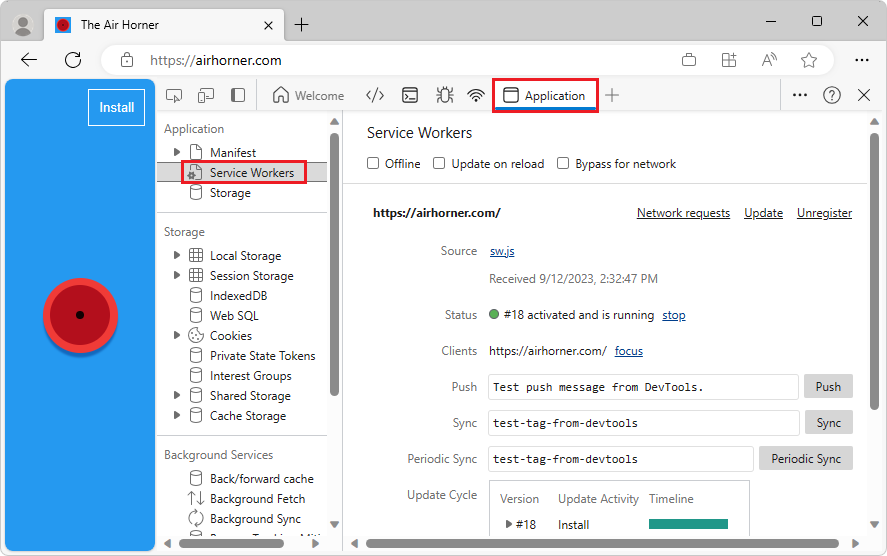
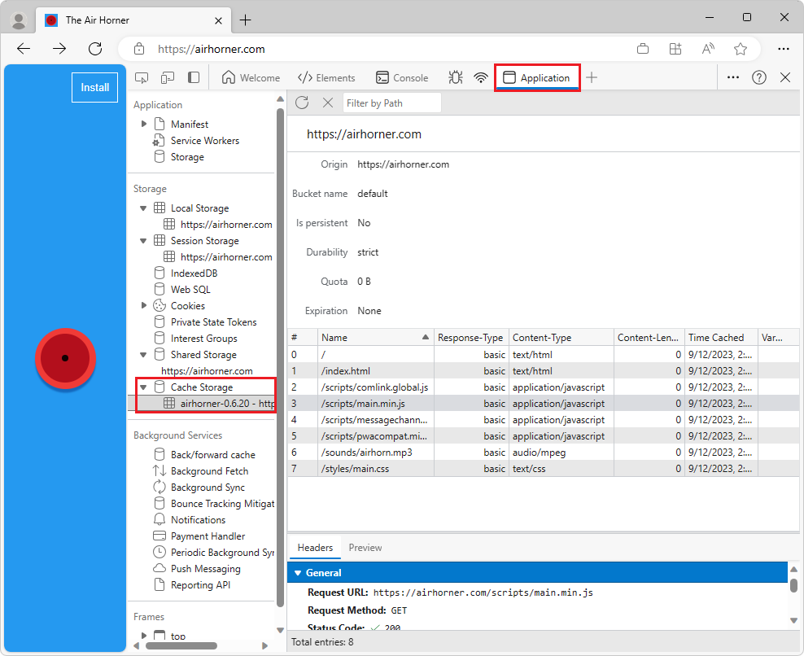

<!-- Copyright Kayce Basques

   Licensed under the Apache License, Version 2.0 (the "License");
   you may not use this file except in compliance with the License.
   You may obtain a copy of the License at

       https://www.apache.org/licenses/LICENSE-2.0

   Unless required by applicable law or agreed to in writing, software
   distributed under the License is distributed on an "AS IS" BASIS,
   WITHOUT WARRANTIES OR CONDITIONS OF ANY KIND, either express or implied.
   See the License for the specific language governing permissions and
   limitations under the License.  -->
# Debug Progressive Web Apps (PWAs)

Use the **Application** tool to inspect, modify, and debug web app manifests, service workers, and service worker caches.  The **Application** tool includes the following panes for Progressive Web App features:

*  Use the **Manifest** pane to inspect your web app manifest and trigger "Add to Homescreen" events.

*  Use the **Service Workers** pane for service-worker-related tasks, such as:
   * Unregistering or updating a service.
   * Emulating push events.
   * Going offline.
   * Stopping a service worker.

*  Use the **Cache Storage** pane to view your service worker cache.

*  Use the **Storage** pane to unregister a service worker and clear all storage and caches.

This article discusses the Progressive Web App features of the **Application** tool.  For help on the other panes in the **Application** tool, see [View the resource files that make up a webpage](../resources/index.md) and [View and edit local storage](../storage/localstorage.md).

See also:
* [Overview of Progressive Web Apps (PWAs)](../../progressive-web-apps-chromium/index.md)

<!-- ====================================================================== -->
## Web app manifest

If you want your users to be able to add your app to their mobile homescreens, you need a web app manifest.  The manifest defines how the app appears on the homescreen, where to direct the user when launching from homescreen, and what the app looks like on launch.

<!--Related Guides:

* [Improve user experiences with a Web App Manifest](/web/fundamentals/web-app-manifest)
* [Using App Install Banners](/web/fundamentals/app-install-banners)  -->

<!--TODO:  Link to sections when available. -->

After you have your manifest set up, you can use the **App Manifest** pane of the **Application** tool to inspect your manifest:

The **App Manifest** pane contains the following sections:
* Manifest link
* **Identity**
* **Presentation**
* **Protocol Handlers**
* **Icons**
* **Window Controls Overlay**
* **Screenshot #1**
* **Screenshot #2**

*  To look at the manifest source, click the link below the **App Manifest** label (`manifest.json` in the previous figure, which opens `https://airhorner.com/manifest.json`).
<!-- *  Click the **Add to homescreen** button to simulate an Add to Homescreen event.  Check out the next section for more information.  -->

*  The **Identity** and **Presentation** sections display fields from the manifest source in a more user-friendly display.

*  The **Icons** section displays every icon that's been specified in the manifest.

<!--#### Simulate Add to Homescreen events  -->

<!--A web app may only be added to a homescreen when the site is visited at least twice, with at least five minutes between visits.  While developing or debugging your Add to Homescreen workflow, the criteria is potentially inconvenient.
The **Add to homescreen** button on the **App Manifest** pane lets you simulate Add to Homescreen events whenever you want.  -->

<!--You can test out this feature with the [Microsoft I/O 2016 progressive web app](https://events.alpahabet.com/io2016/), which has proper support for Add to Homescreen.  Choosing on **Add to Homescreen** while the app is open prompts Microsoft Edge to display the "add this site to your shelf" banner, which is the desktop equivalent of the "add to homescreen" banner for mobile devices.  -->

<!--

-->

<!--
> [!Tip]
> Keep the **Console** drawer open while simulating Add to Homescreen events.  The Console tells you if your manifest has any issues and logs other information about the Add to Homescreen lifecycle.  -->

<!--The **Add to Homescreen** feature cannot yet simulate the workflow for mobile devices.  Notice how the "add to shelf" prompt was triggered in the screenshot above, even though DevTools is in Device Mode (Device Emulation).  However, if you can successfully add your app to your desktop shelf, then it works for mobile, too.  -->

<!-- TODO: Rework content after sample app is created. -->

<!--If you want to test out the genuine mobile experience, you can connect a real mobile device to DevTools via [remote debugging](/debug/remote-debugging/remote-debugging), and then click the **Add to Homescreen** button (on DevTools) to trigger the "add to homescreen" prompt on the connected mobile device.  -->

<!--TODO:  Link Debug "remote debugging" sections when available. -->

<!-- ====================================================================== -->
## Service workers

Service workers are a fundamental technology in the web platform.  Service workers are scripts that the browser runs in the background, separate from a web page.  These scripts enable you to access features that don't need a webpage or user interaction, such as push notifications, background sync, and offline experiences.

<!--Related Guides:

* [Intro to Service Workers](/web/fundamentals/primers/service-worker)
* [Push Notifications: Timely, Relevant, and Precise](/web/fundamentals/push-notifications)  -->

<!-- [How Push Works](/web/fundamentals/push-notifications/how-push-works) -->

<!--TODO:  Link to sections when available. -->

The **Service Workers** pane in the **Application** tool is the main place in DevTools to inspect and debug service workers:

*  If a service worker is installed to the currently open page, then it is listed on this pane.  For example, in the previous figure, there is a service worker installed for the scope of `https://weather-pwa-sample.firebaseapp.com`.

*  The **Offline** checkbox puts DevTools into offline mode.  This is equivalent to the offline mode available from the **Network** tool, or the `Go offline` option in the [Command Menu](../command-menu/index.md).

*  The **Update on reload** checkbox forces the service worker to update on every page load.

*  The **Bypass for network** checkbox bypasses the service worker and forces the browser to go to the network for requested resources.

*  The **Update** button performs a one-time update of the specified service worker.

*  The **Push** button emulates a push notification without a payload (also known as a **tickle**).

*  The **Sync** button emulates a background sync event.

*  The **Unregister** button unregisters the specified service worker.  Check out [Storage](#storage) for a way to unregister a service worker and wipe storage and caches with a single button click.

*  The **Source** line tells you when the currently running service worker was installed.  The link is the name of the source file of the service worker.  Choosing on the link sends you to the source of the service worker.

*  The **Status** line tells you the status of the service worker.  The ID number next to the green status indicator (`#36` in previous figure) is for the currently active Service Worker.  Next to the status, a **start** button (if the service worker is stopped) or a **stop** button (if the service worker is running) is displayed.  Service workers are designed to be stopped and started by the browser at any time.  Explicitly stopping your service worker using the **stop** button may simulate that.  Stopping your service worker is a great way to test how your code behaves when the service worker starts back up again.  It frequently reveals bugs due to faulty assumptions about persistent global state.

*  The **Clients** line tells you the origin that the service worker is scoped to.  The **focus** button is mostly useful when you've enabled the **show all** checkbox.  When that checkbox is enabled, all registered service workers are listed.  If you click the **focus** button next to a service worker that is running in a different tab, Microsoft Edge focuses on that tab.

If the service worker causes any errors, a new label called **Errors** shows up.

<!--

-->

<!--TODO:  Capture Service Worker Errors sample when available. -->
<!--TODO:  Link Web "How tickle works" sections when available. -->

<!-- ====================================================================== -->
## Service worker caches

The **Cache Storage** pane provides a read-only list of resources that have been cached using the (service worker) [Cache API](https://developer.mozilla.org/docs/Web/API/Cache):

The first time you open a cache and add a resource to it, DevTools might not detect the change.  Refresh the page to display the cache.

All open caches are listed under the **Cache Storage** expander.

<!-- ====================================================================== -->
## Quota usage

Some responses within the **Cache Storage** pane may be flagged as being "opaque".<!-- [opaque](/web/fundamentals/glossary#opaque-response) -->  This refers to a response retrieved from a different origin, like from a **CDN**<!-- [CDN](/web/fundamentals/glossary#CDN) --> or remote API, when [CORS](https://fetch.spec.whatwg.org/#http-cors-protocol) isn't enabled.

<!--TODO:  Link Web "CDN" section when available. -->
<!--TODO:  Link Web "opaque" section when available. -->

In order to avoid leakage of cross-domain information, significant padding is added to the size of an opaque response used for calculating storage quota limits (for example whether a `QuotaExceeded` exception is thrown) and reported by the `navigator.storage` API.

<!--TODO:  Link Estimating "`navigator.storage` API" sections when available. -->
<!-- [Estimating available storage space](whats-new/2017/08/estimating-available-storage-space) -->

The details of this padding vary from browser to browser, but for Microsoft Edge, this means that the **minimum size** that any single cached opaque response contributes to the overall storage usage is [approximately 7 megabytes](https://bugs.chromium.org/p/chromium/issues/detail?id=796060#c17).  Remember the padding when determining how many opaque responses you want to cache, since you may easily exceed storage quota limitations much sooner than you otherwise expect based on the actual size of the opaque resources.

Related Guides:

* [Stack Overflow: What limitations apply to opaque responses?](https://stackoverflow.com/q/39109789/385997)
<!--* [Alphabet work container: Understanding Storage Quota](/web/tools/Alphabet-work-container/guides/storage-quota#beware_of_opaque_responses)  -->

<!--TODO:  Link Work container storage quota for opaque responses section when available. -->

<!-- ====================================================================== -->
## Storage

The **Storage** pane is a very useful feature when developing progressive web apps.  This pane lets you unregister service workers and clear all caches and storage with a single button click.  <!--Check out the section below to learn more.  -->

<!--Related Guides:

* [Clear Storage](/iterate/manage-data/local-storage#clear-storage)  -->

<!--TODO:  Link to sections when available. -->

<!--## Other Application panel guides

Check out the guides below for more help on the other panes of the **Application** tool.

Related Guides:

* [Inspect page resources](/iterate/manage-data/page-resources)
* [Inspect and manage local storage and caches](/iterate/manage-data/local-storage)  -->

<!-- ====================================================================== -->
> [!NOTE]
> Portions of this page are modifications based on work created and [shared by Google](https://developers.google.com/terms/site-policies) and used according to terms described in the [Creative Commons Attribution 4.0 International License](https://creativecommons.org/licenses/by/4.0).
> The original page is found [here](https://developer.chrome.com/docs/devtools/progressive-web-apps/) and is authored by [Kayce Basques](https://developers.google.com/web/resources/contributors#kayce-basques) (Technical Writer, Chrome DevTools \& Lighthouse).

This work is licensed under a [Creative Commons Attribution 4.0 International License](https://creativecommons.org/licenses/by/4.0).
