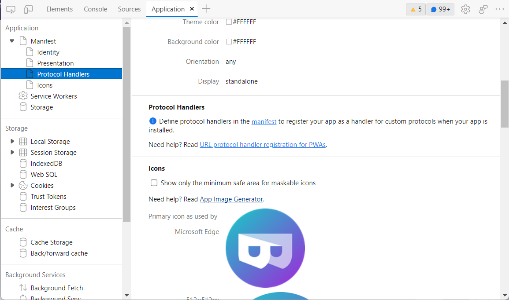
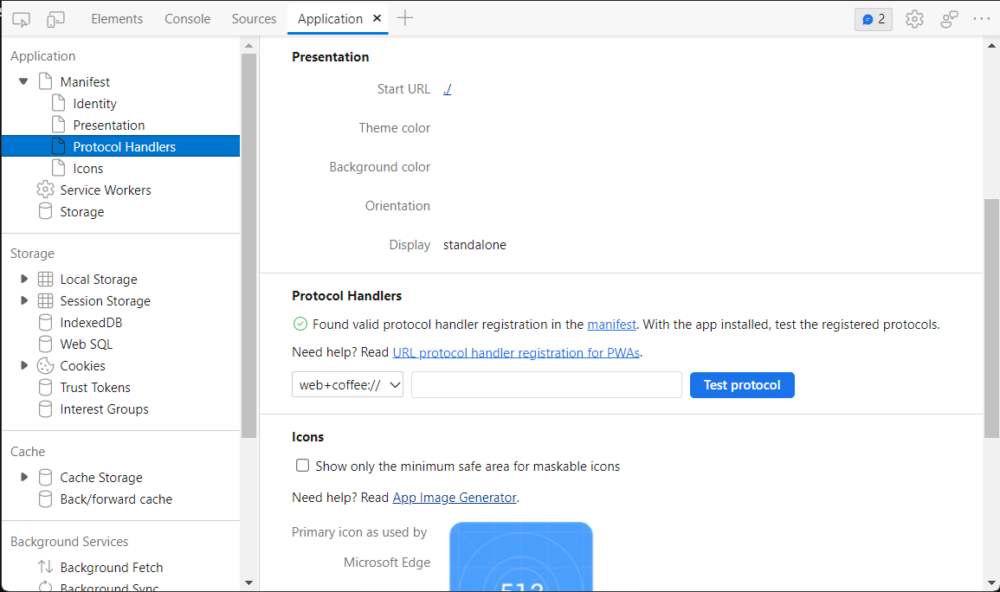
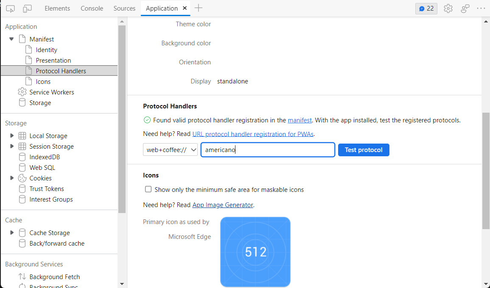

# Test protocol handlers for PWAs

> [!IMPORTANT]
> To learn how to define and register protocols for your app to handle in the manifest, see [Handle protocols in Progressive Web Apps](../../progressive-web-apps-chromium/how-to/handle-protocols.md).  
> 
> This article assumes that you have already defined protocols in your app manifest and are debugging your app with the DevTools.

Use the **Application** tool to verify and test that Microsoft Edge has successfully registered your app as a handler for custom protocols defined in your app manifest.  

## Verify that you have defined protocols correctly in your app manifest

If you haven't already defined custom protocols for your app to handle in your manifest, then the Application tool will note that protocols haven't been defined and provide additional info on how to update your manifest.  If you have defined protocols correctly in your manifest, then the Application tool will report that Microsoft Edge has found valid protocol handler registration and that you can test protocols with your app installed.

To verify that you have defined protocols correctly, complete the following steps:

  1. Navigate to your PWA in Microsoft Edge
  1. Open DevTools > Application tool
  1. Expand the dropdown for **Manifest**
  1. Select the **Protocol Handlers** entry

In the screenshot below, protocols handlers haven't been defined in the manifest.

In the screenshot below, protocol handlers have been defined successfully in the manifest.

From the **Protocol Handlers** section in the Application tool, you can now test the protocols you've defined.

## Test custom protocols from the Application tool

> [!NOTE]
> In order to successfully complete the steps described in this section, you must have already installed your PWA.  To learn how to install your PWA, see [Installing a PWA](../../progressive-web-apps-chromium/ux.md#installing-a-pwa)

The Application tool parses your app manifest for all of the custom protocols you have defined and displays them in a dropdown under the **Protocol Handlers** section. Select the dropdown and the protocol you want to test.

Next to the protocol dropdown is a textbox where you can enter the URL or endpoint for the protocol you're testing. In the screenshot below, the `web+coffee://americano` protocol is being tested.

Selecting the **Test protocol** button will launch your PWA.  Depending on your OS, you may need to allow Microsoft Edge to open your app and accept any OS-level permissions for registering your app as a handler for your protocol.

## See also

*  [Debug Progressive Web Apps (PWAs)](./index.md)
*  [Handle protocols in Progressive Web Apps](../../progressive-web-apps-chromium/how-to/handle-protocols.md)
*  [Getting started with Protocol Handlers for your web app](https://blogs.windows.com/msedgedev/2022/01/20/getting-started-url-protocol-handlers-microsoft-edge/)
*  [URL protocol handler registration for PWAs](https://web.dev/url-protocol-handler/)