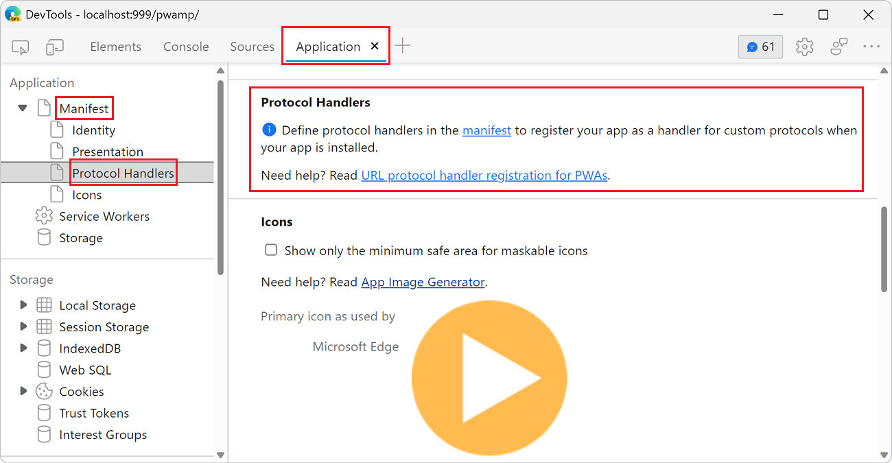
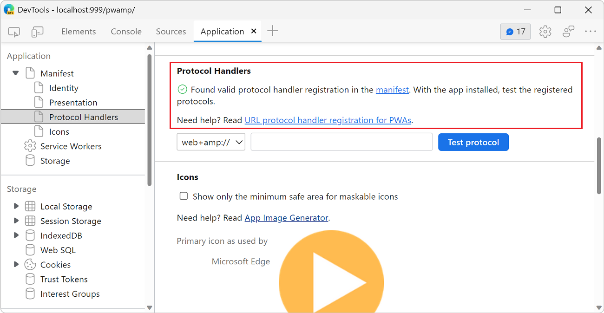
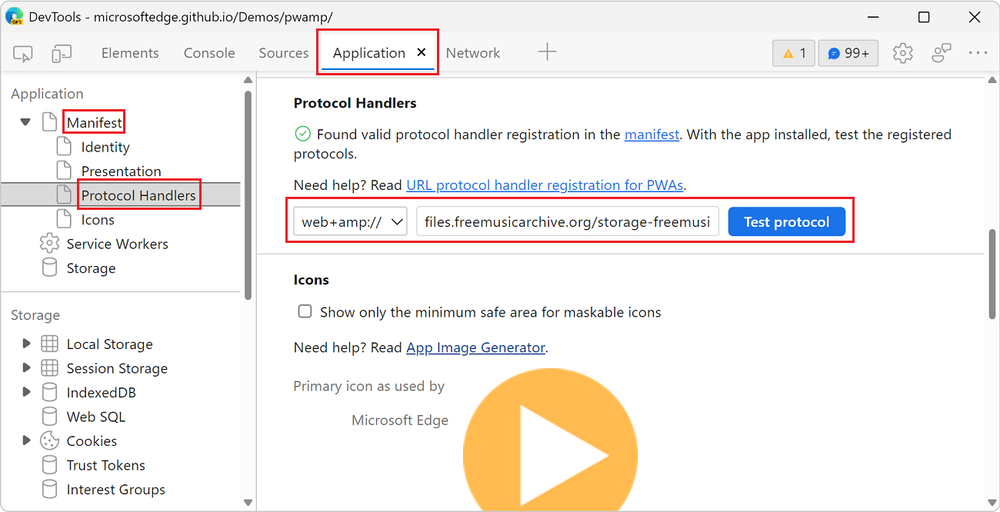

# Test Progressive Web App (PWA) protocol handling

This article assumes that you have already defined protocol handlers in your PWA web app manifest and are debugging your app with the DevTools. To learn about how to define and register protocols in your PWA, see [Handle protocols in Progressive Web Apps](../../progressive-web-apps-chromium/how-to/handle-protocols.md).  

Use the **Application** tool to verify and test that Microsoft Edge has successfully registered your app as a handler for protocols defined in your web app manifest.

<!-- ====================================================================== -->
## Verify that protocol handlers are defined correctly

If you haven't already defined handlers for protocols in your PWA web app manifest, the **Application** tool will note that protocols haven't been defined and will provide additional information on how to update your web app manifest.

If you have defined protocols correctly in your web app manifest, the **Application** tool will report that Microsoft Edge has found valid protocol handler registrations and that you can test these protocol handlers with your installed PWA.

To verify that you have correctly defined protocol handlers:

1. Navigate to your PWA in Microsoft Edge. You can use [the PWAmp demo application](https://microsoftedge.github.io/Demos/pwamp/).
1. Open DevTools (**F12**).
1. Open the **Application** tool.
1. Click **Manifest** to expand the dropdown list.
1. Click **Protocol Handlers**.

If protocol handlers haven't been defined in the web app manifest, or have been defined incorrectly, the following message will be displayed:

If protocol handlers have been defined successfully in the web app manifest, the following message will be displayed:

The **Protocol Handlers** section also makes it possible to test the protocol handlers you've defined.

<!-- ====================================================================== -->
## Test protocols from the Application tool

To test your protocol handlers from the **Application** tool, you must have already installed your PWA. To learn how to install your PWA, see [Installing a PWA](../../progressive-web-apps-chromium/ux.md#installing-a-pwa).

The **Application** tool detects all the protocol handlers from your web app manifest. To test a handler:

1. Navigate to your PWA in Microsoft Edge and open DevTools (**F12**). You can use [the PWAmp demo application](https://microsoftedge.github.io/Demos/pwamp/).
1. Open the **Application** tool and click **Manifest** > **Protocol Handlers**.
1. Select the protocol you want to test by choosing from the dropdown list.
1. Enter the rest of the URI in the text and click **Test protocol**. This will launch your PWA. Depending on your operating system (OS), you may need to allow Microsoft Edge to open your PWA and accept any OS-level permissions for registering your app as a handler for your protocol.

In the following screenshot, the `web+amp://files.freemusicarchive.org/storage-freemusicarchive-org/music/no_curator/Kevin_MacLeod/Jazz_Sampler/Kevin_MacLeod_-_AcidJazz.mp3` URI is being tested.

<!-- ====================================================================== -->
## See also

*  [Debug Progressive Web Apps (PWAs)](./index.md)
*  [Handle protocols in Progressive Web Apps](../../progressive-web-apps-chromium/how-to/handle-protocols.md)
*  [Getting started with Protocol Handlers for your web app](https://blogs.windows.com/msedgedev/2022/01/20/getting-started-url-protocol-handlers-microsoft-edge/)
*  [URL protocol handler registration for PWAs](https://web.dev/url-protocol-handler/)
