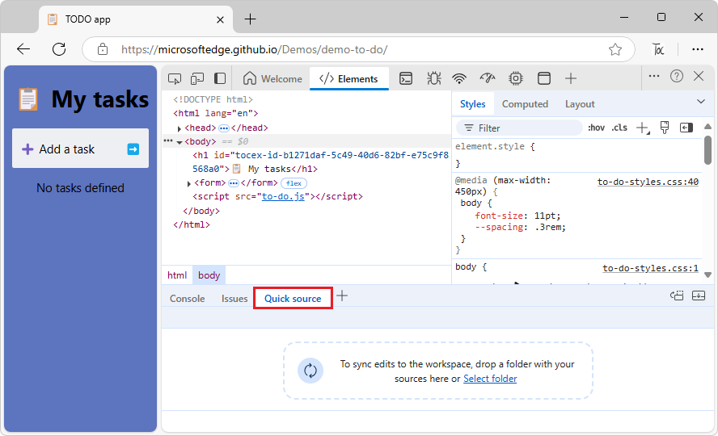

# Display or edit source files using the Quick source tool

Use the **Quick source** tool to display or edit source files when using a tool other than the **Sources** tool.

The main place to view source files in the DevTools is within the **Sources** tool.  But sometimes you need to access other tools, such as **Elements** or **Console**, while viewing or editing your source files.  Use the **Quick source** tool, which by default opens in the **Quick View** panel at the bottom of DevTools.

To open the **Quick source** tool at the bottom of DevTools:

1. Open a webpage; for example, open [Demo To Do](https://microsoftedge.github.io/Demos/demo-to-do/) in a new window or page.

1. Right-click the webpage and then select **Inspect**.

   DevTools opens.

1. If the **Quick View** toolbar and panel isn't shown at the bottom of DevTools, press **Esc**.

1. In the **Quick View** toolbar at the bottom of DevTools, click the **More tools** button, and then select **Quick source**.

1. Click the **Select folder** link.  (Or, drag a folder onto the **Quick source** panel.)

   The **Select Folder** dialog opens.

1. Navigate to a folder, such as `C:\Users\localAccount\GitHub\Demos\demo-to-do`, and then click the **Select Folder** button.

   At the top of DevTools, a message reads **DevTools requests full access to \<path\>".

1. Click the **Allow** button.

   The folder is displayed in the **Quick source** tool in the **Quick View** panel at the bottom of DevTools.

   <!-- todo: show png after open folder in Quick View > Quick source tool -->

<!-- ====================================================================== -->
## See also:

* [Displaying source files when using a different tool](../sources/index.md#displaying-source-files-when-using-a-different-tool) in _Sources tool overview_
* [Step 4: Save a JavaScript change to disk](../workspaces/index.md#edit-javascript-and-save-changes-to-the-source-file) in _Edit files with Workspaces (Filesystem tab)_
