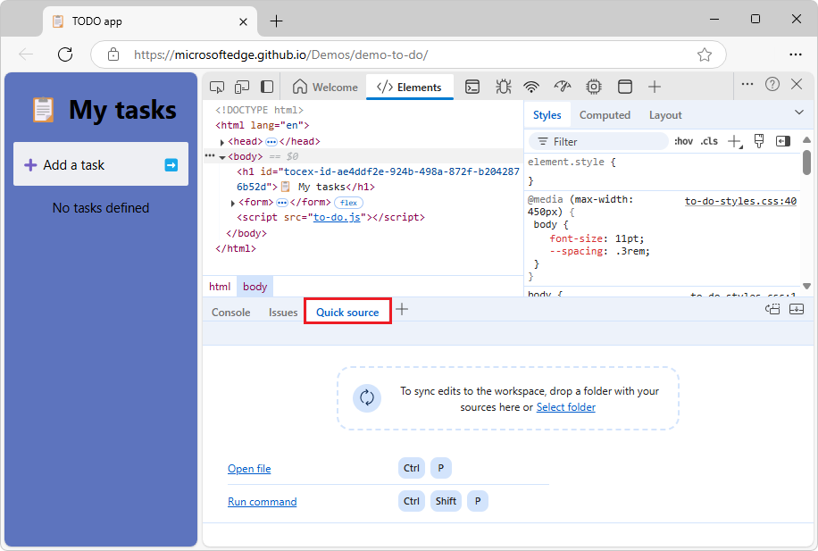

# Display or edit source files using the Quick source tool
<!-- https://developer.chrome.com/docs/devtools/quick-source -->

Use the **Quick source** tool to display or edit source files when using a tool other than the **Sources** tool.

The main place to view source files in the DevTools is within the **Sources** tool.  But sometimes you need to access other tools, such as **Elements** or **Console**, while viewing or editing your source files.  Use the **Quick source** tool, which by default opens in the **Quick View** panel at the bottom of DevTools.

The **Quick source** tool provides an alternative display of the files that are open in the **Sources** tool.
* If one tool is empty and displays instructions, the other tool is empty and displays instructions.
* If you open or close a file in one tool, the file is opened or closed in the other tool.
* In both tools, there's a tab for each open file.


<!-- ====================================================================== -->
## Open a file in the Quick source tool

To open a file in the **Quick source** tool:

1. Open a webpage; for example, open [Demo To Do](https://microsoftedge.github.io/Demos/demo-to-do/) in a new window or page.

1. Right-click the webpage and then select **Inspect**.

   DevTools opens.

1. If the **Quick View** toolbar isn't shown at the bottom of DevTools, press **Esc**.

1. In the **Quick View** toolbar at the bottom of DevTools, click the **More tools** button, and then select **Quick source**.

   The **Quick source** tool opens in **Quick View**:

   

1. Drag the separator to make the **Quick View** pane tall enough to display the **Open file** link (if instructions are displayed rather than a file).

   Next, you can either:
   * Open a file in the **Sources** () tool, per the steps below.
   * [Open a file by using the Command Menu](#open-a-file-by-using-the-command-menu), described below.

   **Open a file using the Sources tool:**

1. In the **Activity Bar** at the top of DevTools, select the **Sources** () tool.

   The **Quick View** pane is minimized at the bottom of DevTools.

1. In the **Sources** tool, in the **Page** tab, select one or more files, such as `to-do.js`.

   The tabs for the selected files are opened in the **Sources** tool:

   

1. In the **Activity Bar** at the top of DevTools, select a tool other than **Sources**, such as **Elements**.

   The **Quick source** tool expands in **Quick View** at the bottom of DevTools, and has a tab for each open file:

   <!-- 1st use -->


See also:
* [Using the Page tab to explore resources that construct the current webpage](../sources/index.md#using-the-page-tab-to-explore-resources-that-construct-the-current-webpage) in _Sources tool overview_.


<!-- ====================================================================== -->
## Open a file by using the Command Menu

Opening a file in the **Quick source** tool or **Sources** tool opens the file in both tools.


To open a file by using the **Open File** prompt of the **Command Menu**:

* When the **Quick source** tool (or **Sources** tool) is empty, click the **Open file** link in the instructions in the tool:

  

  The **Open File** prompt of the **Command Menu** is displayed.

  To display the **Open file** link in the instructions in the panel, you might need to scroll down, or drag the **Quick View** divider up to make the **Quick View** panel taller.

Or do any of the following:

* Press **Ctrl+P** (Windows, Linux) or **Command+P** (macOS).

* Select **Sources tool** > **More options** (next to the **Page** tab) > **Open file**.

* Select **Customize and control DevTools** > **Open file**.


To close a file, click the **x** button in the file's tab.  The file is closed in the **Quick source** tool and **Sources** tool.


<!-- ====================================================================== -->
## Edit local source files in DevTools by selecting a Workspace folder
<!-- full end-to-end steps required b/c multiple tools interact -->

By selecting a local folder as a **Workspace**, you can make edits in DevTools **Quick source** tool (or **Sources** tool) and have those edits be saved to your local drive.  This way, when you edit the folder's files in DevTools, the edits are not only made to the transient file that's returned by the server, but are also saved to the source files on your local drive.


To open a file in the **Quick source** tool and sync edits to the **Workspace** folder of local source files:

1. Open a webpage that's on a web server; for example, open [Demo To Do](https://microsoftedge.github.io/Demos/demo-to-do/) in a new window or page.  That page is hosted on the web server `microsoftedge.github.io`.

   **Open the DevTools Quick source tool:**

1. Right-click the webpage and then select **Inspect**.

   DevTools opens.

1. If the **Quick View** toolbar isn't shown at the bottom of DevTools, press **Esc**.

1. In the **Quick View** toolbar at the bottom of DevTools, click the **More tools** button, and then select **Quick source**.

   The **Quick source** tool opens in **Quick View** at the bottom of DevTools:

   

   You'll click the **Select folder** link in the empty **Quick source** tool after making sure that the local drive has the source files that match the files on the server.

   **Have local source files that match the web server files:**

1. Have source files on your local drive (as well as on a web server).  For example, if not done already, clone the [MicrosoftEdge / Demos](https://github.com/MicrosoftEdge/Demos#readme) repo to your local drive:

   

   In a step below, you'll select the local `/Demos/demo-to-do/` directory of the cloned `Demos` repo.

1. Assuming you have git installed, open a command prompt.  Or, you can use Visual Studio Code > **Source Control** pane.

1. Clone the repo to your local drive, entering the URL string that you copied from the GitHub repo.  If you use a command prompt:

   ```Shell
   # example location where the repo directory will be added:
   cd c:/users/localAccount/github/
   git clone https://github.com/MicrosoftEdge/Demos.git
   ```

   For details about cloning a repo, see:
   * [Clone the Demos repo](../sample-code/sample-code.md#clone-the-demos-repo) in _Sample code for DevTools_.<!-- todo: show git bash, not only VS Code's Source Control pane -->
   * [Clone the WebView2Samples repo](../../webview2/how-to/machine-setup.md#clone-the-webview2samples-repo) in _Set up your Dev environment for WebView2_.  Shows a different sample repo, but shows steps for several tools.
   * [Cloning a repository](https://docs.github.com/en/repositories/creating-and-managing-repositories/cloning-a-repository) - GitHub docs.

   Now you have a local folder of source files that match the files on the web server.

   **Select a local folder of source files as the Workspace:**

1. In the **Quick source** tool, click the **Select folder** link.  (Or, drag a folder onto the **Quick source** panel.)

   To display the **Select folder** link in the instructions in the empty **Quick source** tool, you might need to scroll down, or drag the **Quick View** divider up to make the **Quick View** panel taller.

   If a file is already open in the **Quick source** tool, the instructions and **Select folder** link are not displayed.  Instead, open the **Sources** tool, and then in the **Workspace** tab (grouped with the **Page** tab), click the **Add folder** button.

   The **Select Folder** dialog opens.

1. Navigate to a folder, such as `C:\Users\localAccount\GitHub\Demos\demo-to-do`, and then click the **Select Folder** button.

   At the top of DevTools, a message reads **DevTools requests full access to \<path\>**.

1. Click the **Allow** button.

   The **Sources** tool is opened, with no file selected, and continues to display a **Select folder** link (if no file is open yet).

1. In the **Sources** tool, in the **Workspace** tab, expand the tree, and then click one or more files, such as `to-do.js`.

   The file opens in the **Sources** tool:

   

1. In the **Activity Bar** at the top of DevTools, select a tool other than the **Sources** tool, such as the **Elements** tool.

   The **Quick source** tool expands in **Quick View** at the bottom of DevTools, and has a tab for each open file:

   <!-- 2nd use -->

Now, when you edit the folder's files in DevTools (through the **Quick source** tool or **Sources** tool), the edits are not only made to the transient file that's returned by the server, but are also saved to the source files on your local drive.

See also:
* [Select a local Workspace, to use DevTools to edit files and save changes to disk](../sources/index.md#select-a-local-workspace-to-use-devtools-to-edit-files-and-save-changes-to-disk) in _Sources tool overview_.
* [Edit files with Workspaces](../workspaces/index.md)
   * [Step 4: Save a JavaScript change to disk](../workspaces/index.md#edit-javascript-and-save-changes-to-the-source-file) in _Edit files with Workspaces_


<!-- ====================================================================== -->
## Options in the empty Quick source tool

When the **Quick source** tool (or **Sources** tool) is empty, the tool displays instructions, including some of the following approaches.


<!-- ------------------------------ -->
#### Select a Workspace folder

To save your DevTools edits to the source files on your local drive:

* Click the **Select folder** link.

* Drag a folder that contains your source files onto the empty **Quick source** tool (or **Sources** tool).

* In the **Sources** tool, in the **Workspace** tab, click the **Add folder** button.


<!-- ------------------------------ -->
#### Open a file

To open a file by using the **Command Menu**:

* Click the **Open file** link in the empty **Quick source** tool (or **Sources** tool).

* Press **Ctrl+P**.

* Select **Customize and control DevTools** > **Open file**.

* Select **Sources tool** > **More options** (next to the **Page** tab) > **Open file**.


<!-- ------------------------------ -->
#### Open the Command Menu

To open the **Command Menu**:

* Click the **Run command** link in the empty **Quick source** tool (or **Sources** tool).

* Press **Ctrl+Shift+P**.


<!-- ====================================================================== -->
## See also

* [Displaying source files when using a different tool](../sources/index.md#displaying-source-files-when-using-a-different-tool) in _Sources tool overview_
