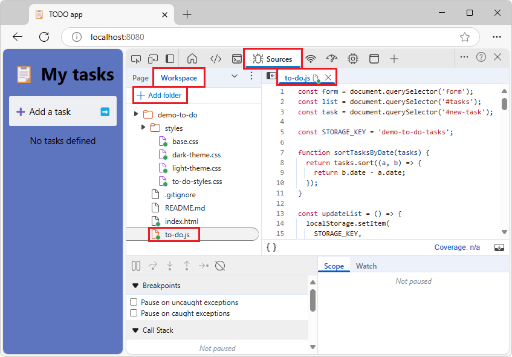

# Display or edit source files using the Quick source tool
<!-- https://developer.chrome.com/docs/devtools/quick-source -->
<!-- first give the always-available GUI way, then keyboard shortcuts
don't doc the empty tool UI, which is transient and is designed for the Sources tool -->

Use the **Quick source** tool to display or edit source files at the same time as displaying a tool other than the **Sources** tool.  The **Quick source** tool always displays the same files that are open in the **Sources** tool.


The main place to view source files in the DevTools is within the **Sources** tool.  But sometimes you need to access other tools, such as **Elements** or **Console**, while viewing or editing your source files.  Use the **Quick source** tool, which by default opens in the **Quick View** panel at the bottom of DevTools.


<!-- ------------------------------ -->
#### Use the Quick source tool in conjunction with the Sources tool

To display the **Quick source** tool in **Quick View** at the bottom of DevTools, a tool other than the **Sources** tool must be open in the **Activity Bar** at the top of DevTools.

The **Quick source** tool provides an alternative display of the files that are open in the **Sources** tool.  The **Quick source** tool has a subset of features.  For full features, temporarily switch to the **Sources** tool.

If you open or close a file in one tool, the file is opened or closed in the other tool.  In both tools, there's a tab for each open file.


<!-- ====================================================================== -->
## Open a file in the Quick source tool

<!-- todo: run & show localhost in addr bar instead of github.io? -->

To view source files while using a tool than the **Sources** tool in the **Activity Bar**, use the **Quick source** tool, as follows:

1. Open a webpage; for example, open [Demo To Do](https://microsoftedge.github.io/Demos/demo-to-do/) in a new window or page.

1. Right-click the webpage and then select **Inspect**.

   DevTools opens.

1. In the **Activity Bar** at the top of DevTools, select the **Sources** () tool.

1. In the **Sources** tool, in the **Page** tab, select one or more files, such as `to-do.js`.

   The tabs for the selected files are opened in the **Sources** tool:

   

1. In the **Activity Bar** at the top of DevTools, select a tool other than **Sources**, such as **Elements** ().

1. If the **Quick View** toolbar isn't shown at the bottom of DevTools, press **Esc**.

1. In the **Quick View** toolbar at the bottom of DevTools, click the **More tools** button, and then select **Quick source**.

   The **Quick source** tool expands in **Quick View** at the bottom of DevTools, and displays the same files that are open in the **Sources** tool:

   

You can now view or edit the file in the **Quick source** tool, at the same time as displaying a different tool in the main part of DevTools.

See also:
* [Using the Page tab to explore resources that construct the current webpage](../sources/index.md#using-the-page-tab-to-explore-resources-that-construct-the-current-webpage) in _Sources tool overview_.


<!-- ====================================================================== -->
## Edit local source files in DevTools by selecting a Workspace folder

By selecting a local folder as a **Workspace** in the **Sources** tool, you can then edit files from within the **Quick source** tool at the same time as displaying a different tool, and have those edits be saved to your local drive.  This way, you can edit files in the **Quick source** tool while using another tool, such as **Elements** or **Network**, and have your edits be saved to the corresponding source file on your local drive.

To edit source files in the **Quick source** tool:

1. Have access to your source files locally, such as a cloned repo.  See [Have local source files, such as a cloned repo](#have-local-source-files-such-as-a-cloned-repo), below.
1. In the **Workspace** tab in the **Sources** tool, add a local folder of source files.  See [Select a local folder of source files as the Workspace](#select-a-local-folder-of-source-files-as-the-workspace), below.
1. In the **Activity Bar**, select a tool other than the **Sources** tool, such as the **Elements** tool.  Then in the **Quick View** panel at the bottom of DevTools, open the **Quick source** tool.  See [Open the Quick source tool](#open-the-quick-source-tool), below.

These steps are detailed below.


<!-- ------------------------------ -->
#### Have local source files, such as a cloned repo

To use the **Quick source** tool to save changes locally, you must have local source files that match the web server files.  Make sure there are source files on your local drive, that match the transient files that are returned by the web server.

For example, if not done already, clone the **MicrosoftEdge / Demos** repo to your local drive, as follows:

1. Go to [MicrosoftEdge / Demos](https://github.com/MicrosoftEdge/Demos) in a new window or tab.

1. Click the **Code** drop-down button.

1. Click the **Copy url to clipboard** button.

   

   The URL is copied to the clipboard: `https://github.com/MicrosoftEdge/Demos.git`

   Or, if you have GitHub Desktop installed, click **Open with GitHub Desktop** to clone the repo, and skip the command prompt step below.

   Or, you can use Visual Studio Code's **Source Control** pane to clone the repo, and skip the command prompt step below.

1. Assuming you have git installed, open a command prompt.

1. Clone the repo to your local drive, entering the URL string that you copied from the GitHub repo.  If you use a command prompt:

   ```Shell
   # example location where the repo directory will be added:
   cd c:/users/localAccount/github/
   git clone https://github.com/MicrosoftEdge/Demos.git
   ```

   For details about cloning a repo, see:
   * [Clone the Demos repo](../sample-code/sample-code.md#clone-the-demos-repo) in _Sample code for DevTools_.<!-- todo: show git bash, not only VS Code's Source Control pane -->
   * [Clone the WebView2Samples repo](../../webview2/how-to/machine-setup.md#clone-the-webview2samples-repo) in _Set up your Dev environment for WebView2_.  Shows a different sample repo, but shows steps for several tools.
   * [Cloning a repository](https://docs.github.com/en/repositories/creating-and-managing-repositories/cloning-a-repository) - GitHub docs.

   Now you have a local folder of source files (such as `/demo-to-do/`) that match the files on the web server.

Continue with the next section.


<!-- ------------------------------ -->
#### Select a local folder of source files as the Workspace

<!-- todo: start localhost server -->

1. In the **Activity Bar** at the top of DevTools, select the **Sources** () tool, select the **Workspace** tab (grouped with the **Page** tab), and then in the **Workspace** tab, click the **Add folder** button.

   The **Select Folder** dialog opens.

1. Navigate to a folder, such as `C:\Users\localAccount\GitHub\Demos\demo-to-do`, and then click the **Select Folder** button.

   At the top of DevTools, a message reads **DevTools requests full access to \<path\>**.

1. Click the **Allow** button.

   The **Sources** tool is opened.

1. In the **Sources** tool, in the **Workspace** tab, expand the tree, and then click one or more files, such as `to-do.js`.

   The file opens in the **Sources** tool:

   <!-- todo: localhost in addr bar -->

1. In the **Activity Bar** at the top of DevTools, select a tool other than the **Sources** tool, such as the **Elements** tool.

   The **Quick source** tool expands in **Quick View** at the bottom of DevTools, and has a tab for each open file:

   <!-- copied from above then appended -2 --><!-- todo: localhost in addr bar -->

Continue with the next section.


<!-- ------------------------------ -->
#### Open the Quick source tool

1. In the **Activity Bar**, select a tool other than the **Sources** tool, such as the **Elements** tool.

1. If the **Quick View** toolbar isn't shown at the bottom of DevTools, press **Esc**.

1. In the **Quick View** toolbar at the bottom of DevTools, click the **More tools** button, and then select **Quick source**.

   The **Quick source** tool opens in **Quick View** at the bottom of DevTools:

   

   The **Quick source** tool might show instructions including an **Select folder** link, or it might display a file.  Instead of relying on that transient link, the steps further below show how to use the **Workspace** tab in the **Sources** tool, to select a local folder of source files.


Now, when you edit the folder's files in DevTools, the edits are not only made to the transient file that's returned by the server, but are also saved to the source files on your local drive.  You can edit the file from within the **Quick source** tool at the same time as displaying another tool (or from within the **Sources** tool).

See also:
* [Select a local Workspace, to use DevTools to edit files and save changes to disk](../sources/index.md#select-a-local-workspace-to-use-devtools-to-edit-files-and-save-changes-to-disk) in _Sources tool overview_.
* [Edit and save files in a workspace](../workspaces/index.md)
   * [Step 4: Save a JavaScript change to disk](../workspaces/index.md#step-4-save-a-javascript-change-to-disk) in _Edit and save files in a workspace_


<!-- ====================================================================== -->
## Open a file by using the Command Menu

Opening a file by using the **Command Menu** opens that file in both the **Quick source** tool and **Sources** tool.


To open the **Command Menu**, do any of the following:

* Select **Customize and control DevTools** > **Run command**.

* Press **Ctrl+Shift+P** (Windows, Linux) or **Command+Shift+P** (macOS).

* Click the **Run command** link in the empty **Quick source** tool (or **Sources** tool).


To open a file by using the **Open File** prompt of the **Command Menu**, do any of the following:

* Select **Sources tool** > **More options** (next to the **Page** tab) > **Open file**.

* Select **Customize and control DevTools** > **Open file**.

* Press **Ctrl+P** (Windows, Linux) or **Command+P** (macOS).

* When the **Quick source** tool (or **Sources** tool) is empty, click the **Open file** link in the instructions in the tool:

  

  The **Open File** prompt of the **Command Menu** is displayed.

  To display the **Open file** link in the instructions in the panel, you might need to scroll down, or drag the **Quick View** divider up to make the **Quick View** panel taller.


<!-- ====================================================================== -->
## Close a file

To close a file, click the **x** button in the file's tab.

The file is closed in the **Quick source** tool and **Sources** tool.


<!-- ====================================================================== -->
## See also

* [Sources tool overview](../sources/index.md)
   * [Quick source tool, to display source files when using a different tool](../sources/index.md#quick-source-tool-to-display-source-files-when-using-a-different-tool) in _Sources tool overview_
   * [Track changes to files using the Changes tool](../changes/changes-tool.md)
