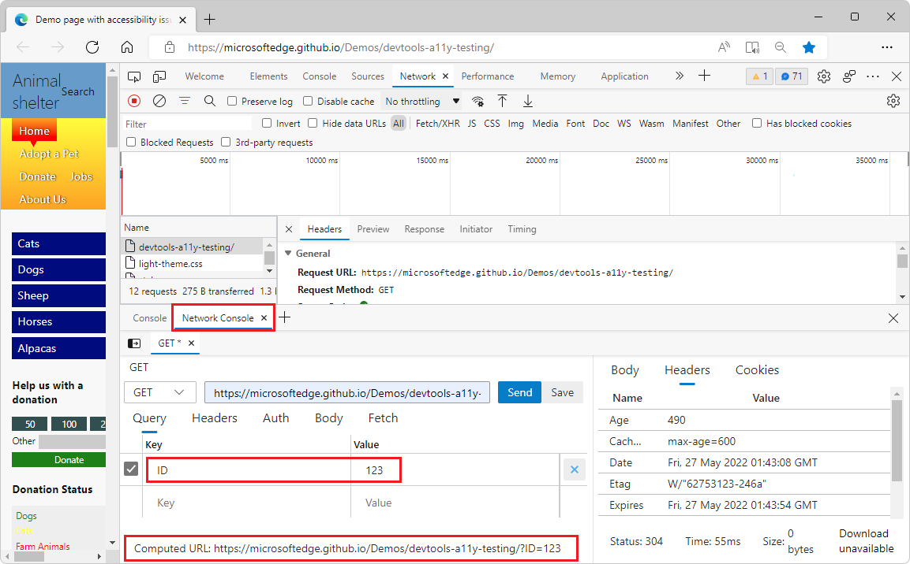

# Reasons to use Microsoft Edge DevTools

The Microsoft Edge DevTools team has added many new features based on feedback we received from the developer community.  These features improve the developer experience and are unique to Microsoft Edge, which is available on Windows, Mac, and Linux.

**Contents:**

* [Ease of use](#ease-of-use)
   * [Open and close tools easily](#open-and-close-tools-easily)
   * [Move tools around in the UI](#move-tools-around-in-the-ui)
   * [Focus Mode with Activity Bar and Quick View tool menu](#focus-mode-with-activity-bar-and-quick-view-tool-menu)
   * [DevTools Tooltips mode](#devtools-tooltips-mode)

* [Customization](#customization)
   * [Change the UI language](#change-the-ui-language)
   * [Change the color theme](#change-the-color-theme)

* [Unique tools](#unique-tools)
   * [Detached Elements tool](#detached-elements-tool)
   * [Console error search](#console-error-search)
   * [3D View](#3d-view)
   * [Integration with webhint](#integration-with-webhint)
   * [Integration of Microsoft Edge DevTools with Visual Studio Code](#integration-of-microsoft-edge-devtools-with-visual-studio-code)
   * [Network Console](#network-console)

<!-- ====================================================================== -->
## Ease of use

The developer tools in the browser grew organically over the years.  They can be overwhelming, and sometimes it can be hard to find the feature you're looking for.  So we've been working to ease new users into the tools by providing an improved documentation system.  For users who have more experience with DevTools, we've been making it easier to customize the tools to adapt them to your needs.

### Open and close tools easily

By clicking the **More Tools** () button on the main toolbar or the Drawer toolbar, you can add tools without having to use the **Customize and control DevTools** `...` menu.  You can click the **x** button on any tool tab to remove the tool.  The **Elements**, **Sources** and **Console** tools are always open, and don't have an **x** on their tab.

Adding a new tool to a menu bar by clicking the **More Tools** () button:

Removing a tool by clicking the **x** button on the tab of the tool:

See [The More Tools menus](about-tools.md#the-more-tools-menus) in _About the list of tools_.

### Move tools around in the UI
 
By right-clicking any tab in the main toolbar or Drawer toolbar, you can move a tool from the top to the bottom panel, and vice versa.

Moving a tool to the bottom drawer using the right-click menu:

The tool now appears on the bottom drawer:

See [Panel tools vs. Drawer tools](about-tools.md#panel-tools-vs-drawer-tools) in _About the list of tools_.

### Focus Mode with Activity Bar and Quick View tool menu

Focus Mode is a new user interface for DevTools.  Focus Mode simplifies and streamlines the DevTools UI.

Focus Mode replaces the DevTools toolbar and its tabs with an Activity Bar, which is a compact toolbar with distinctive icons.  You can keep the Activity Bar on the left or move it to the top.  The Activity Bar makes it possible to pin, rearrange, and open your favorite tools for quick access.  The Activity Bar also provides access to user settings, help, and other features.

Focus Mode also provides a **Quick View** list to open a second tool alongside the tool that's already selected in the Activity Bar.

See [Simplify DevTools using Focus Mode](experimental-features/focus-mode.md).

### DevTools Tooltips mode

When you turn on DevTools Tooltips, informational tips about tools and panels are shown as you hover over them:

DevTools Tooltips are not yet supported in Focus Mode.

See [Display DevTools Tooltips](overview.md#display-devtools-tooltips) in _Overview of DevTools_.

<!-- ====================================================================== -->
## Customization

### Change the UI language

You can choose a different user interface language for Microsoft Edge DevTools.

Microsoft Edge DevTools displayed in German:

Microsoft Edge DevTools displayed in Japanese:

See [Change DevTools language settings](customize/localization.md).

### Change the color theme

You can choose a different color theme to change the look of DevTools.  Several popular Visual Studio Code themes are available if you prefer to use the same theme and syntax highlighting across DevTools and Visual Studio Code.

Switching to a different theme in DevTools Settings:

Microsoft Edge DevTools displayed in the Monokai theme:

See [Apply a color theme to DevTools](customize/theme.md).

<!-- ====================================================================== -->
## Unique tools

These web development tools are only available in Microsoft Edge DevTools.

### Detached Elements tool

The **Detached Elements** tool was built on feedback from a Microsoft team that needed to find out about memory leaks in one of our products.  You can find out which elements are using up memory even though they're no longer part of the Document Object Model (DOM) tree.

The **Detached Elements** tool, showing elements that need to be removed from memory:

See [Debug DOM memory leaks with the Detached Elements tool](memory-problems/dom-leaks.md).

### Console error search

In user studies we found that people often copy and paste error messages from the Console to a search engine to find out more about the problem.  We added an icon to these Console messages to make that easier.

Console with highlighted search icon that would open a web search with the error message in a new browser tab:

See [Search the web for a Console error message string](console/index.md#search-the-web-for-a-console-error-message-string) in _Console overview_.

### 3D View

The **3D View** tool displays either the DOM, the composited layers of a webpage, or the parts of a webpage page that have a z-index assigned to them, as a 3-dimensional representation in an interactive user interface.  This dynamic view allows you to gauge the complexity of your webpage and find out about memory problems.

See [Navigate z-index, DOM, and layers using the 3D View tool](3d-view/index.md).

### Integration with webhint

The **Issues** tool automatically shows you all the things that need fixing in the current webpage.  Under the hood, the **Issues** tool uses [webhint](https://webhint.io), which generates reports and provides reporting on various issues.  You not only learn what's wrong with your webpage, but also why it's a problem, where in your webpage the problem exists, and how to fix the issue.

Current problems of a webpage displayed in the Issues panel:

See [Find and fix problems using the Issues tool](issues/index.md).

### Integration of Microsoft Edge DevTools with Visual Studio Code

When you're debugging a problem with your webpage, it's cumbersome to change from a code editor, to the browser, then using DevTools in the browser to analyze the problem, and then going back to try a possible fix of the problem in your source code.  This is why we created a Visual Studio Code extension that embeds Microsoft Edge DevTools into your code editor workflow. 

For example, without integrated tools, you temporarily fix CSS style rules in your transient, resulting webpage files that are sent from your development server to your browser, and then you have to remember the changes, and then re-apply those changes to your actual source code in your source files, over in your code editor.

Now, by using the Microsoft Edge DevTools extension for Visual Studio Code, you can simply use Microsoft Edge DevTools to change your source code directly within an instance of DevTools that's running in the IDE environment of Visual Studio Code.<!-- condense end -->

Microsoft Edge DevTools integrated into Visual Studio Code:

See [Microsoft Edge DevTools extension for Visual Studio Code](../visual-studio-code/microsoft-edge-devtools-extension.md).

### Network Console

Inspecting the network traffic of your web product is already insightful, but often you need to make some changes to the requests to see why they fail.  Using the **Network Console**, you can change and replay any of the requests, and you can make detailed API calls.

**Network Console** showing options for changing a network call:

See [Compose and send web API requests using the Network Console tool](network-console/network-console-tool.md).

<!-- ====================================================================== -->
## Next steps

* [Sample code for DevTools](sample-code/sample-code.md)

<!--
As a demo tour of Microsoft Edge DevTools, open these demo webpages and follow the steps in the linked articles:

* [Demo tour of DevTools](demo-tour/demo-tour-of-microsoft-edge-devtools.md)
-->
