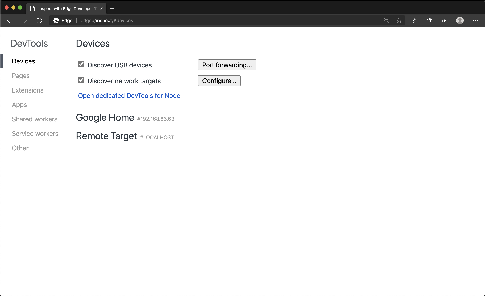
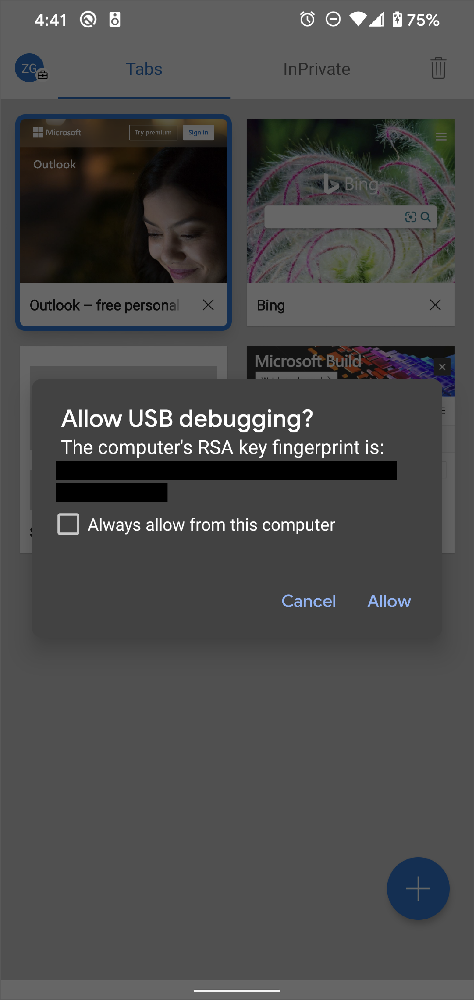
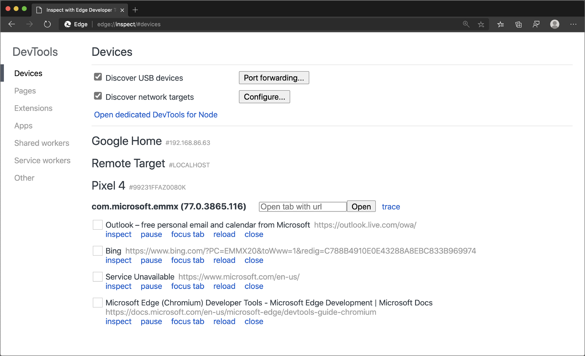
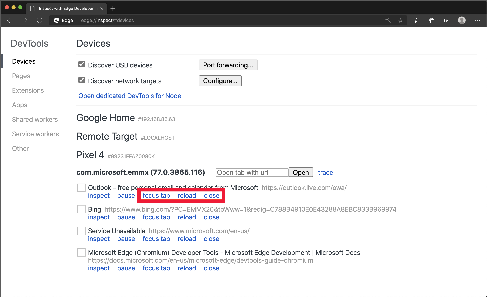

<!-- Copyright Kayce Basques

   Licensed under the Apache License, Version 2.0 (the "License");
   you may not use this file except in compliance with the License.
   You may obtain a copy of the License at

       https://www.apache.org/licenses/LICENSE-2.0

   Unless required by applicable law or agreed to in writing, software
   distributed under the License is distributed on an "AS IS" BASIS,
   WITHOUT WARRANTIES OR CONDITIONS OF ANY KIND, either express or implied.
   See the License for the specific language governing permissions and
   limitations under the License.  -->
# Remotely debug Android devices

Remote debug live content on an Android device from your Windows or macOS computer.  The following tutorial page teaches you how to:

*  Set up your Android device for remote debugging, and discover it from your development machine.

*  Inspect and debug live content on your Android device from your development machine.

*  Screencast content from your Android device onto a DevTools instance on your development machine.

<!--

-->

> [!NOTE]
> Remote debugging the Microsoft Edge app on iOS devices isn't currently supported.  The following guide is specifically focused on remote debugging Microsoft Edge on Android devices.
> If you have a macOS device, follow the [Brightcove Debugging guide](https://general.support.brightcove.com/developer/debugging-mobile-devices.html) to remotely debug Microsoft Edge on an iOS device using Safari.  For more information about the Web Inspector tool in Safari, see [Safari Web Development Tools](https://developer.apple.com/safari/tools).

<!-- ====================================================================== -->
## Step 1: Discover your Android device

The workflow below works for most users.  For more help, see [Troubleshooting: DevTools isn't detecting the Android device](#troubleshooting-devtools-isnt-detecting-the-android-device), below.

1. Open the **Developer Options** screen on your Android.  See [Configure On-Device Developer Options](https://developer.android.com/studio/debug/dev-options).

1. Select **Enable USB Debugging**.

1. On your development machine, open Microsoft Edge.

1. In the Address bar, go to `edge://inspect`.

   

1. Connect your Android device directly to your development machine using a USB cable.  The first time you try to connect, a prompt should be displayed about DevTools detecting an unknown device.  Accept the **Allow USB Debugging** permission prompt on your Android device.

   

1. If the model name of your Android device is displayed, then Microsoft Edge has successfully established the connection to your device.  Continue to the [Step 2](#step-2-debug-content-on-your-android-device-from-your-development-machine) section.

   <!--
   
   -->

### Troubleshooting: DevTools isn't detecting the Android device

Use the following tips to help you troubleshoot the correct settings for your hardware.

*  If you are using a USB hub, try connecting your Android device directly to your development machine.
*  Try unplugging the USB cable between your Android device and development machine, and then re-plugging your USB cable.  Complete the task while your Android and development machine screens are unlocked.
*  Make sure that your USB cable works.  You should be able to inspect files on your Android device from your development machine.

Use the following tips to help you verify that your software is set up correctly.

*  If your development machine is running Windows, try manually installing the USB drivers for your Android device.  For more information, see [Install OEM USB Drivers](https://developer.android.com/tools/extras/oem-usb.html).
*  Some combinations of Windows and Android devices (especially Samsung) require additional settings.  For more information, see [DevTools Devices does not detect device when plugged in](https://stackoverflow.com/questions/21925992).

If the **Allow USB Debugging** prompt isn't displayed on your Android device, try:

*  Disconnecting and then re-connecting the USB cable while DevTools is in focus on your development machine and your Android homescreen is showing.  Sometimes the prompt isn't displayed when your Android or development machine screens are locked.
*  Updating the display settings for your Android device and development machine so that they never go to sleep.
*  Setting the USB mode for Android to PTP.  See [Galaxy S4 does not show Authorize USB debugging dialog](https://android.stackexchange.com/questions/101933).
*  Select **Revoke USB Debugging Authorizations** from the **Developer Options** screen on your Android device to reset it to a fresh state.

If you find a solution that isn't mentioned on this page or in [DevTools Devices does not detect device when plugged in](https://stackoverflow.com/questions/21925992) on Stack Overflow, please add your solution to that Stack Overflow question<!--, or [open an issue in the webfundamentals repository](https://github.com/Alphabet/webfundamentals/issues/new?title=[Remote%20Debugging]) -->.

<!-- ====================================================================== -->
## Step 2: Debug content on your Android device from your development machine

1. Open Microsoft Edge on your Android device.

1. Go to `edge://inspect`.  The model name of your Android device is displayed, followed by the device serial number.  Below that, the version of Microsoft Edge running on the device should be displayed, with the version number in parentheses.  Each open Microsoft Edge tab gets a unique section.  You can interact with that tab from a section.  <!--If there are any apps using WebView, a section for each of those apps should be displayed, too.  --><!--In [**Figure 5**](#figure-5) there are no tabs or WebViews open.  -->

  

1. In the **Open tab with url** text box, enter a URL and then click **Open**.  The page opens in a new tab on your Android device.

1. Click **inspect** next to the URL that you just opened.  A new DevTools instance opens.

<!--
The version of Microsoft Edge running on your Android device determines the version of DevTools that opens on your development machine.  So, if your Android device is running a very old version of Microsoft Edge, the DevTools instance may look very different than what you are used to.
-->

### More actions: focus, refresh, or close a tab

Select **focus tab**, **reload**, or **close** next to the tab that you want to focus, refresh, or close.

### Inspect elements

Go to the **Elements** tool of your DevTools instance, and hover over an element to highlight it in the viewport of your Android device.

You can also tap an element on your Android device screen to select it in the **Elements** tool.  Click **Select Element** () icon on your DevTools instance, and then select the element on your Android device screen.

> [!NOTE]
> **Select Element** is disabled after the first selection, so you need to re-enable it every time you want to use this feature.

### Screencast your Android screen to your development machine

Click the **Toggle Screencast** () icon to view the content of your Android device in your DevTools instance.

You can interact with the screencast in multiple ways:

*  Clicks are translated into taps, firing proper touch events on the device.
*  Keystrokes on your computer are sent to the device.
*  To simulate a pinch gesture, hold **Shift** while dragging.
*  To scroll, use your trackpad or mouse wheel, or fling with your mouse pointer.

Use the following tips to help you screencast:

*  Screencasts only display page content.  Transparent portions of the screencast represent device interfaces, such as the Microsoft Edge Address bar, the Android status bar, or the Android keyboard.
*  Screencasts negatively affect frame rates.  Disable screencasting while measuring scrolls or animations to get a more accurate picture of the performance of your page.
*  If your Android device screen locks, the content of your screencast disappears.  Unlock your Android device screen to automatically resume the screencast.

<!-- ====================================================================== -->
> [!NOTE]
> Portions of this page are modifications based on work created and [shared by Google](https://developers.google.com/terms/site-policies) and used according to terms described in the [Creative Commons Attribution 4.0 International License](https://creativecommons.org/licenses/by/4.0).
> The original page is found [here](https://developer.chrome.com/docs/devtools/remote-debugging/) and is authored by [Kayce Basques](https://developers.google.com/web/resources/contributors#kayce-basques) (Technical Writer, Chrome DevTools \& Lighthouse).

This work is licensed under a [Creative Commons Attribution 4.0 International License](https://creativecommons.org/licenses/by/4.0).
