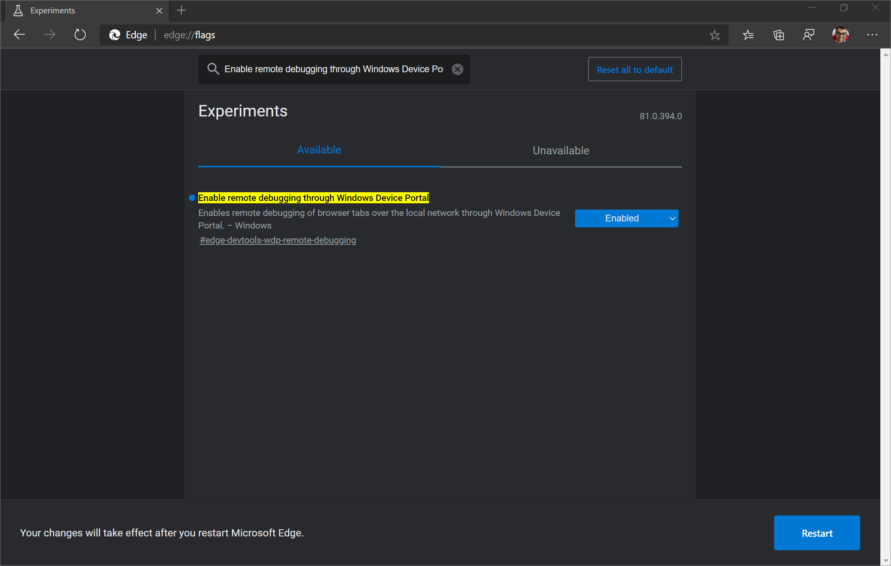
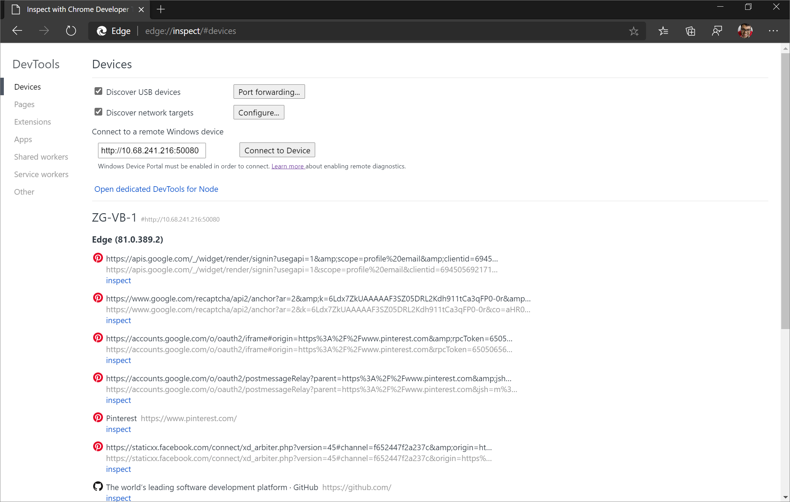

# Remotely debug Windows devices

Remote debug live content on a Windows 10 or later device from your Windows or macOS computer.

This tutorial teaches you the following tasks:

*  Set up your Windows device for remote debugging and connect to it from your development machine.

*  Inspect and debug live content on your Windows device from your development machine.

*  Screencast content from your Windows device onto a DevTools instance on your development machine.

<!-- ====================================================================== -->
## Step 1: Set up the host (debuggee machine)

The host or debuggee machine is the Windows 10 or later device that you want to debug.  It may be a remote device that is hard for you to physically access or it may not have keyboard and mouse peripherals, making it difficult to interact with the Microsoft Edge DevTools on that device.

To set up the host (debuggee) machine, use the following sub-sections, in order.

<!-- ------------------------------ -->
#### Install and configure Microsoft Edge

1. If not already installed, on the Windows 10 or later device that you want to debug, install Microsoft Edge, from [Get to Know Microsoft Edge](https://www.microsoft.com/edge).

1. If you're using a pre-installed version of Microsoft Edge on the host (debuggee) machine, verify that you have Microsoft Edge (Chromium) and not Microsoft Edge (EdgeHTML).  A quick way to check is to load `edge://settings/help` in the browser and confirm that the version number is 75 or higher.

1. Go to `edge://flags` in Microsoft Edge. 

1. In **Search flags**, type in **Enable remote debugging through Windows Device Portal**. Set that flag to **Enabled**. Then, click the **Restart** button to restart Microsoft Edge.

<!-- ------------------------------ -->
#### Install the Remote Tools for Microsoft Edge

1. Install the [Remote Tools for Microsoft Edge](https://apps.microsoft.com/detail/9p6cmfv44zlt) from the [Microsoft Store](https://apps.microsoft.com).

   To set up the host (debuggee) machine, it must be running Windows 10 version 1903 or later.  If you are on Windows 10 or later version 1809 or earlier,<!-- todo: later vs earlier; merge w/ previous sent. --> the **Download** or **Get** button in that **Remote Tools for Microsoft Edge** page might be disabled.  Update the host (debuggee) machine, to acquire Remote Tools for Microsoft Edge.

   

1. Launch Remote Tools for Microsoft Edge and, if prompted, accept the permissions dialog in the app.

1. Close Remote Tools for Microsoft Edge.  You don't need to have it open for future remote debugging sessions.

<!-- ------------------------------ -->
#### Activate Developer Mode and enable Device Portal

1. Activate Developer Mode; see [Enable your device for development](/windows/apps/get-started/enable-your-device-for-development).

1. Enable Device Portal; see [Windows Device Portal overview](/windows/uwp/debug-test-perf/device-portal).

1. If you are on a WiFi network, make sure the network is marked as either **Domain** or **Private**.  You can verify the state by opening the **Windows Security** app, selecting **Firewall & network protection** and checking if your network is listed as a **Domain** network or **Private** network.

1. If your network is listed as **Public**, go to **Settings** > **Network & Internet** > **Wi-Fi**, click on your network, and toggle the **Network profile** button to **Private**.

1. Open the **Settings** app.  In **Find a setting**, enter `Developer settings` and select it.  Toggle on **Developer Mode**.  You can now turn on the **Device Portal** by setting **Turn on remote diagnostics over local area network connections** to **On**.  You can then optionally turn **Authentication** on so that the client (debugger) device must provide the correct credentials to connect to this device.

1. If **Turn on remote diagnostics over local area network connections.** was previously turned on, you must turn it off and turn it on again for **Device Portal** to work with the [Remote Tools for Microsoft Edge (Beta)](https://www.microsoft.com/store/apps/9P6CMFV44ZLT).

   If  a **For developers** section isn't displayed in **Settings**, **Device Portal** may already be turned on, so try restarting the Windows 10 or later device instead.

   

1. Note the machine IP address and connection port that are displayed under **Connect using:**.  The IP address in the image below is `192.168.86.78` and the connection port is `50080`:

   

   You enter the information on the client (debugger) device in the next section, "Step 2: Set up the client (debugger machine)".  

1. Open tabs in Microsoft Edge and [Progressive Web Apps (PWAs)](../progressive-web-apps/index.md) on the host (debuggee) machine that you want to debug from the client (debugger) machine.

<!-- ====================================================================== -->
## Step 2: Set up the client (debugger machine)

The client or debugger machine is the device you want to debug from.  This device may be your daily development machine, or it may just be your PC or MacBook when working from home.

1. To set up the client (debugger) machine, install Microsoft Edge from [this page](https://www.microsoft.com/edge) if you haven't already.

1. If you're using a pre-installed version of Microsoft Edge on the host (debuggee) machine, verify that you have Microsoft Edge (Chromium) and not Microsoft Edge (EdgeHTML).  A quick way to check is to load `edge://settings/help` in the browser and confirm that the version number is 75 or higher.

1. Go to the `edge://inspect` page in Microsoft Edge.  By default, you should be on the **Devices** section.

1. Under **Connect to a remote Windows device**, enter the IP address and the connection port of the host (debuggee) machine in the text box following this pattern: http://`IP address`:`connection port`.

1. Click **Connect to Device**.

   

1. If you set up authentication for the host (debuggee) machine, you are prompted to enter the **Username** and **Password** for the client (debugger) machine to connect successfully.

<!-- ------------------------------ -->
#### Using https instead of http

If you want to connect to the host (debuggee) machine using `https` instead of `http`:

1. Go to `http://IP address:50080/config/rootcertificate` in Microsoft Edge on the client (debugger) machine.  This automatically downloads a security certificate named `rootcertificate.cer`.

1. Select `rootcertificate.cer`.  This opens the [Windows Certificate Manager tool](/dotnet/framework/wcf/feature-details/how-to-view-certificates-with-the-mmc-snap-in#view-certificates-with-the-certificate-manager-tool).

1. Click **Install certificate...**, make sure **Current User** is turned on, and then click **Next**.

1. Click **Place all certificates in the following store** and click **Browse...**.

1. Select the **Trusted Root Certification Authorities** store and then click **OK**.

1. Click **Next** and then click **Finish**.

1. If prompted, confirm that you want to install this certificate to the **Trusted Root Certification Authorities** store.

1. Now, when connecting to the host (debuggee) machine from the client (debugger) machine using the `edge://inspect` page, you must use a different `connection port` value.  By default, for desktop Windows, the Device Portal uses `50080` as the `connection port` for `http`.  For `https`, the Device Portal uses `50043` so follow this pattern: https://`IP address`:`50043` on the `edge://inspect` page.

To see the default ports that are used by Device Portal, see the table in [Setup](/windows/uwp/debug-test-perf/device-portal#setup) in _Windows Device Portal overview_.

<!-- ---------- -->
###### Default ports

The default port for `http` is `50080` and the default port for `https` is `50043`, but this isn't always the case, because Device Portal on desktop claims ports in the ephemeral range (\>50,000) to prevent collisions with existing port claims on the device.  

To see the default ports that are used by Device Portal, see the table in [Setup](/windows/uwp/debug-test-perf/device-portal#setup) in _Windows Device Portal overview_.

For information about port settings, see [Windows Device Portal for Desktop](/windows/uwp/debug-test-perf/device-portal-desktop).

See also:
* [Registry-based configuration](/windows/uwp/debug-test-perf/device-portal-desktop#registry-based-configuration) in _Windows Device Portal for Desktop_.

<!-- ====================================================================== -->
## Step 3: Debug content on the host from the client

If the client (debugger) machine successfully connects to the host (debuggee) machine, the `edge://inspect` page on the client now displays a list of the tabs in Microsoft Edge and any open PWAs on the host.

Determine the content you want to debug, and then click **inspect**.  Microsoft Edge DevTools opens in a new tab, and screencasts the content from the host (debuggee) machine to the client (debugger) machine.  You can now use the full power of Microsoft Edge DevTools on the client for content running on the host.

See also:
* [Microsoft Edge DevTools documentation](/microsoft-edge/devtools-guide-chromium/landing/)

<!-- ------------------------------ -->
#### Inspect elements

For example, try inspecting an element.  Go to the **Elements** tool of your DevTools instance on the client, and hover on an element to highlight it in the viewport of the host device.

You can also tap an element on your host device screen to select it in the **Elements** tool.  Select **Select Element** on your DevTools instance on the client, and then tap the element on your host device screen.

**Select Element** is disabled after the first touch, so you need to turn it on again every time you want to use this feature.

> [!IMPORTANT]
> The **Event Listeners** pane in the **Elements** tool is blank on Windows 10 version 1903.  This is a known issue and the team plans to fix the **Event Listeners** pane in a servicing update to Windows 10 version 1903.

<!-- ====================================================================== -->
## Step 4: Screencast your host screen to your client device

By default, the DevTools instance on the client have screencasting turned on, which allows you to view the content on the host device in your DevTools instance on your client device.  Click **Toggle Screencast** to turn this feature on or off.

You can interact with the screencast in multiple ways:
*  Clicks are translated into taps, firing proper touch events on the device.
*  Keystrokes on your computer are sent to the device.
*  To simulate a pinch gesture, hold **Shift** while dragging.
*  To scroll, use your trackpad or mouse wheel, or fling with your mouse pointer.

Notes about screencasts:

*  Screencasts only display page content.  Transparent portions of the screencast represent device interfaces, such as the Microsoft Edge Address bar, the Windows 10 or later taskbar, and the Windows 10 or later keyboard.

*  Screencasts negatively affect frame rates.  Disable screencasting while measuring scrolls or animations to get a more accurate picture of the performance of your page.

*  If your host device screen locks, the content of your screencast disappears.  Unlock your host device screen to automatically resume the screencast.
