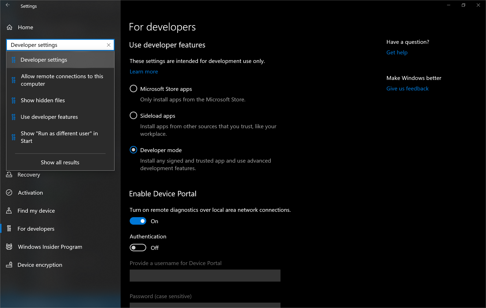
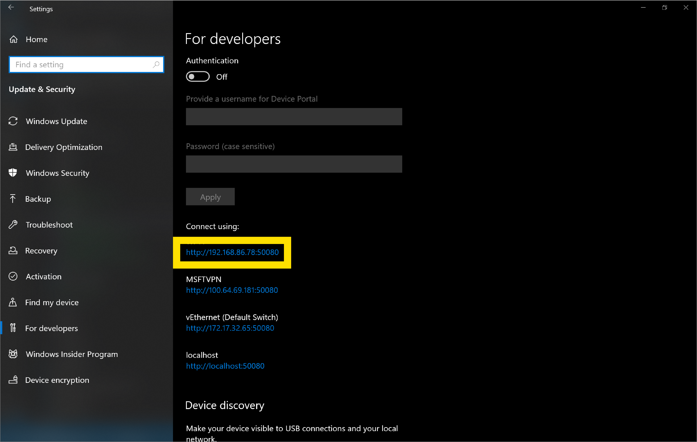
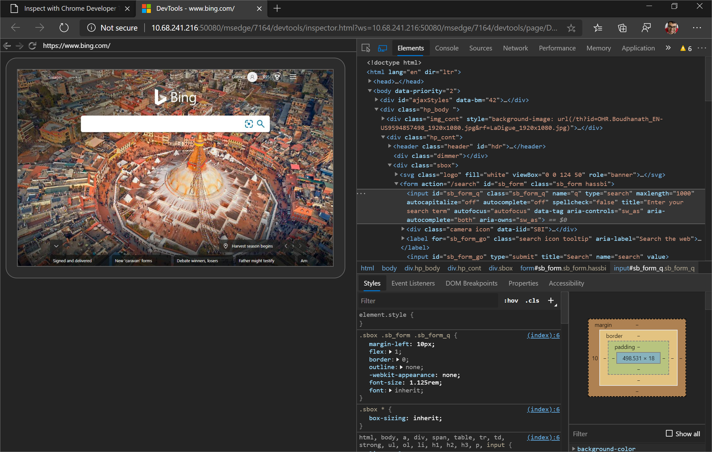

# Get Started with Remote Debugging Windows 10 Devices  

Remote debug live content on a Windows 10 device from your Windows or macOS computer.  This tutorial teaches you how to:  

*   Set up your Windows 10 device for remote debugging and connect to it from your development machine.  
*   Inspect and debug live content on your Windows 10 device from your development machine.  
*   Screencast content from your Windows 10 device onto a DevTools instance on your development machine.  

## Step 1: Set up the host (debuggee machine)  

The host or debuggee machine is the Windows 10 device that you want to debug.  It may be a remote device that is hard for you to physically access or it may not have keyboard and mouse peripherals, making it difficult to interact with the Microsoft Edge DevTools on that device.  To set up the host (debuggee) machine, you will need to:  

*   Install and configure [Microsoft Edge (Chromium)](https://www.microsoft.com/edge)  
*   Install the [Remote Tools for Microsoft Edge (Beta)](https://www.microsoft.com/store/apps/9P6CMFV44ZLT) from the [Microsoft Store](https://www.microsoft.com/store/apps/windows)  
*   Activate [Developer Mode](https://docs.microsoft.com/windows/uwp/get-started/enable-your-device-for-development) and enable [Device Portal](https://docs.microsoft.com/windows/uwp/debug-test-perf/device-portal)  

### Install and configure Microsoft Edge (Chromium)  

If you haven't already, install Microsoft Edge (Chromium) from [this page](https://www.microsoft.com/edge).  If you are using a pre-installed version of Microsoft Edge on the host (debuggee) machine, verify that you have Microsoft Edge (Chromium) and not Microsoft Edge (EdgeHTML).  A quick way to check is to load `edge://settings/help` in the browser and confirm that the version number is 75 or higher.  

Now navigate to `edge://flags` in Microsoft Edge (Chromium).  In **Search flags**, type in **Enable remote debugging through Windows Device Portal**.  Set that flag to **Enabled**.  Then, click the **Restart** button to restart Microsoft Edge (Chromium).  

> ##### Figure 1  
> Setting the **Enable remote debugging through Windows Device Portal** flag to **Enabled**  
>   

### Install the Remote Tools for Microsoft Edge (Beta)  

Install the [Remote Tools for Microsoft Edge (Beta)](https://www.microsoft.com/store/apps/9P6CMFV44ZLT) from the [Microsoft Store](https://www.microsoft.com/store/apps/windows).  

> [!NOTE]
> The **Get** button for the [Remote Tools for Microsoft Edge (Beta)](https://www.microsoft.com/store/apps/9P6CMFV44ZLT) may be disabled if you are on Windows 10 version 1809 or earlier.  To set up the host (debuggee) machine, it must be running Windows 10 version 1903 or later.  Update the host (debuggee) machine to acquire the [Remote Tools for Microsoft Edge (Beta)](https://www.microsoft.com/store/apps/9P6CMFV44ZLT).  

> ##### Figure 2  
> The [Remote Tools for Microsoft Edge (Beta)](https://www.microsoft.com/store/apps/9P6CMFV44ZLT) in the [Microsoft Store](https://www.microsoft.com/store/apps/windows)  
>   

Launch the [Remote Tools for Microsoft Edge (Beta)](https://www.microsoft.com/store/apps/9P6CMFV44ZLT) and, if prompted, accept the permissions dialog in the app. You are now able to close the [Remote Tools for Microsoft Edge (Beta)](https://www.microsoft.com/store/apps/9P6CMFV44ZLT) and you do not need to have it open for future remote debugging sessions.

### Activate Developer Mode and enable Device Portal  

If you're on a WiFi network, ensure the network is marked as either **Domain** or **Private**.  You can verify this by opening the **Windows Security** app, clicking on **Firewall & network protection** and checking if your network is listed as a **Domain** network or **Private** network.  

If it's listed as **Public**, go to **Settings** > **Network & Internet** > **Wi-Fi**, click on your network and toggle the **Network profile** button to **Private**.  

Now, open the **Settings** app.  In **Find a setting**, enter **Developer settings** and select it.  Toggle on **Developer Mode**.  You can now enable **Device Portal** by setting **Turn on remote diagnostics over local area network connections** to **On**.  You may then optionally turn **Authentication** on so that the client (debugger) device must provide the correct credentials to connect to this device.  

> ##### Figure 3  
> The **Settings** app with **Developer Mode** and **Device Portal** configured  
>   

Note the machine IP address and connection port displayed under **Connect using:**.  The IP address in the image below is `192.168.86.78` and the connection port is `50080`.  

> ##### Figure 4  
> Note the IP address and connection port in the **Settings**  
>   

You will enter this information on the client (debugger) device in the [next section](#step-2-set-up-the-client-debugger-machine).  Open tabs in Microsoft Edge and [Progressive Web Apps (PWAs)](../progressive-web-apps.md) on the host (debuggee) machine that you would like to debug from the client (debugger) machine.  

## Step 2: Set up the client (debugger machine)  

The client or debugger machine is the device you want to debug from.  This device may be your daily development machine or it may just be your PC or MacBook when working from home.  

To set up the client (debugger) machine, install Microsoft Edge (Chromium) from [this page](https://www.microsoft.com/edge) if you haven't already.  If you are using a pre-installed version of Microsoft Edge on the host (debuggee) machine, verify that you have Microsoft Edge (Chromium) and not Microsoft Edge (EdgeHTML).  A quick way to check is to load `edge://settings/help` in the browser and confirm that the version number is 75 or higher.  

Now navigate to `edge://flags` in Microsoft Edge (Chromium).  In **Search flags**, type in **Enable remote Windows device debugging in edge://inspect**.  Set that flag to **Enabled**.  Then, click the **Restart** button to restart Microsoft Edge (Chromium).  

> ##### Figure 5  
> Setting the **Enable remote Windows device debugging through edge://inspect** flag to **Enabled**  
>   

Now navigate to the `edge://inspect` page in Microsoft Edge (Chromium).  By default, you should be on the **Devices** section.  Under **Connect to a remote Windows device**, enter the IP address and the connection port of the host (debuggee) machine in the textbox following this pattern: http://`IP address`:`connection port`.  Now click **Connect to Device**.  

> ##### Figure 6  
> The `edge://inspect` page on the client  
>   

If you set up authentication for the host (debuggee) machine, you will be prompted to enter the **Username** and **Password** for the client (debugger) machine to connect successfully.  

### Using https instead of http  

If you want to connect to the host (debuggee) machine using `https` instead of `http`, you must navgiate to `http://IP address:50080/config/rootcertificate` in Microsoft Edge on the client (debugger) machine. This will automatically download a security certificate named `rootcertificate.cer`.

Click on `rootcertificate.cer`. This will open the [Windows Certificate Manager tool](https://docs.microsoft.com/dotnet/framework/wcf/feature-details/how-to-view-certificates-with-the-mmc-snap-in#view-certificates-with-the-certificate-manager-tool).

Click **Install certificate...**, ensure that **Current User** is selected, and click **Next**. Now select **Place all certificates in the following store** and click **Browse...**. Select the **Trusted Root Certification Authorities** store and click **OK**. Click **Next** and then click **Finish**. If prompted, confirm that you want to install this certificate to the **Trusted Root Certification Authorities** store.

Now, when connecting to the host (debuggee) machine from the client (debugger) machine using the `edge://inspect` page, you must use a different `connection port` value.  By default, for desktop Windows, the Device Portal will use `50080` as the `connection port` for `http`.  For `https`, the Device Portal uses `50043` so follow this pattern: https://`IP address`:`50043` on the `edge://inspect` page.  [Read more about the default ports used by Device Portal](https://docs.microsoft.com/windows/uwp/debug-test-perf/device-portal#setup).  

> [!NOTE]
> The default port for `http` is `50080` and the default port for `https` is `50043` but this is not always the case as Device Portal on desktop claims ports in the ephemeral range (>50,000) to prevent collisions with existing port claims on the device.  To learn more, see the [Port Settings](https://docs.microsoft.com/windows/uwp/debug-test-perf/device-portal-desktop#registry-based-configuration-for-device-portal) section for Device Portal on Windows desktop.  

## Step 3: Debug content on the host from the client  

If the client (debugger) machine successfully connects to the host (debuggee) machine, the `edge://inspect` page on the client will now display a list of the tabs in Microsoft Edge and any open PWAs on the host.  

> ##### Figure 7  
> The `edge://inspect` page on the client displays the tabs in Microsoft Edge and PWAs on the host  
>   

Determine the content you want to debug and click **inspect**.  The Microsoft Edge DevTools will open in a new tab and screencast the content from the host (debuggee) machine to the client (debugger) machine.  You are now able to use the full power of the Microsoft Edge DevTools on the client for content running on the host.  Learn more about how to use the Microsoft Edge DevTools [here](../../devtools-guide-chromium.md).  

> ##### Figure 8  
> The [Microsoft Edge DevTools](../../devtools-guide-chromium.md) on the client debugging a tab in Microsoft Edge on the host  
>   

### Inspect elements  

For example, try inspecting an element.  Go to the **Elements** panel of your DevTools instance on the client, and hover over an element to highlight it in the viewport of the host device.  

You may also tap an element on your host device screen to select it in the **Elements** panel.  Click **Select Element** on your DevTools instance on the client, and then tap the element on your host device screen.  Note that **Select Element** is disabled after the first touch, so you need to re-enable it every time you want to use this feature.  

> [!IMPORTANT]
> The **Event Listeners** pane in the **Elements** panel is blank on Windows 10 version 1903.  This is a known issue and we will fix the **Event Listeners** pane in a servicing update to Windows 10 version 1903.  

## Step 4: Screencast your host screen to your client device  

By default, the DevTools instance on the client will have screencasting toggled on, which enables you to view the content on the host device in your DevTools instance on your client device.  Click **Toggle Screencast** to turn off or on this feature.  

> ##### Figure 9  
> The **Toggle Screencast** button in the Microsoft Edge DevTools on the client  
>   

You are able to interact with the screencast in multiple ways:  
*   Clicks are translated into taps, firing proper touch events on the device.  
*   Keystrokes on your computer are sent to the device.  
*   To simulate a pinch gesture, hold `Shift` while dragging.  
*   To scroll, use your trackpad or mouse wheel, or fling with your mouse pointer.  

Some notes on screencasts:  
*   Screencasts only display page content.  Transparent portions of the screencast represent device interfaces, such as the Microsoft Edge address bar, the Windows 10 taskbar, or the Windows 10 keyboard.  
*   Screencasts negatively affect frame rates.  Disable screencasting while measuring scrolls or animations to get a more accurate picture of the performance of your page.  
*   If your host device screen locks, the content of your screencast disappears.  Unlock your host device screen to automatically resume the screencast.  

## Known Issues  

The **Event Listeners** pane in the **Elements** panel is blank on Windows 10 version 1903.  We will fix the **Event Listeners** pane in a servicing update to Windows 10 version 1903.  

The **Cookies** pane in the **Application** panel is blank on Windows 10 version 1903.  We will fix the **Cookies** pane in a servicing update to Windows 10 version 1903.  

The **Audits** panel, the **3D View** panel, the **Emulated Devices** section in **Settings**, and the **Accessibility tree** pane in the **Elements** panel are not currently working as expected.  We will fix these tools in a future update of Microsoft Edge.  

The file explorer will not launch from the DevTools in the **Sources** panel or in the **Security** panel when remote debugging.  We will fix these tools in a future update of Microsoft Edge.  
