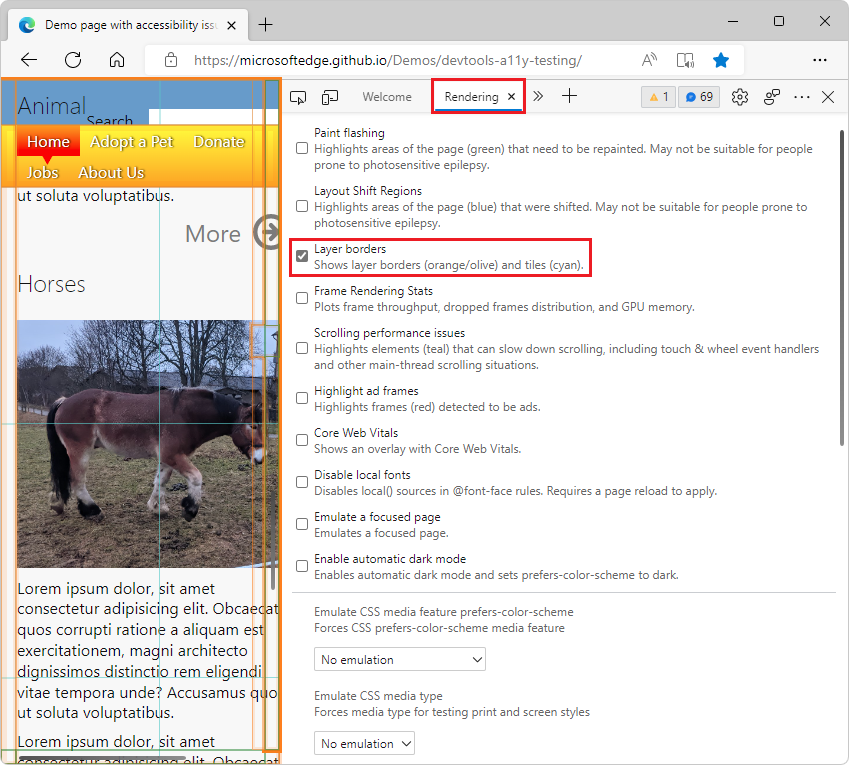

# Rendering tool, to see what a webpage looks like with different display options or vision deficiencies

Use the **Rendering** tool to see what your webpage looks like with different display options or vision deficiencies:

The **Rendering** tool is used for tasks such as the following:
* [Check for contrast issues with dark theme and light theme](../accessibility/test-dark-mode.md)
* [Verify that a page is usable by people with color blindness](../accessibility/test-color-blindness.md)
* [Verify that a page is usable with blurred vision](../accessibility/test-blurred-vision.md)
* [Verify that a page is usable with UI animation turned off](../accessibility/test-reduced-ui-motion.md)
* [Emulate vision deficiencies](../accessibility/emulate-vision-deficiencies.md)
* [Emulate dark or light schemes in the rendered page](../accessibility/preferred-color-scheme-simulation.md)
* [Simulate reduced motion](../accessibility/reduced-motion-simulation.md)
* Analyze rendering performance - see [Analyze rendering performance with the Rendering tool](../evaluate-performance/reference.md#analyze-rendering-performance-with-the-rendering-tool) in _Performance features reference_.
