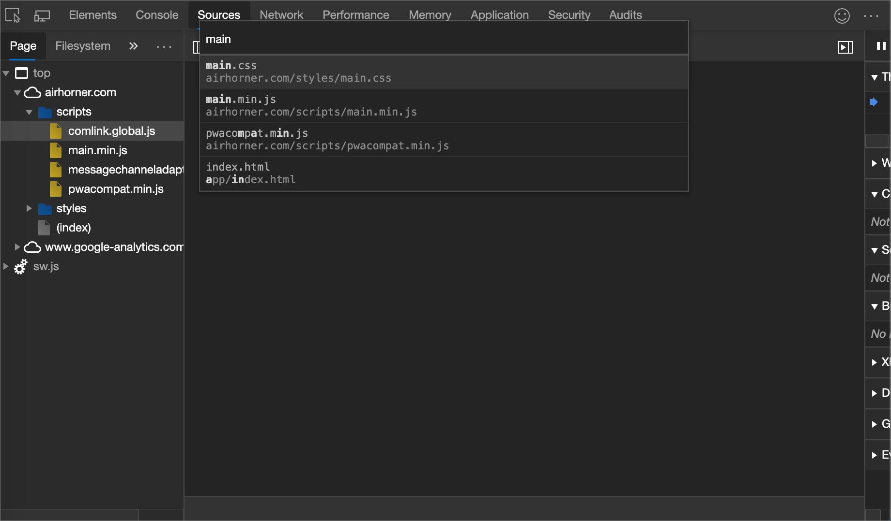
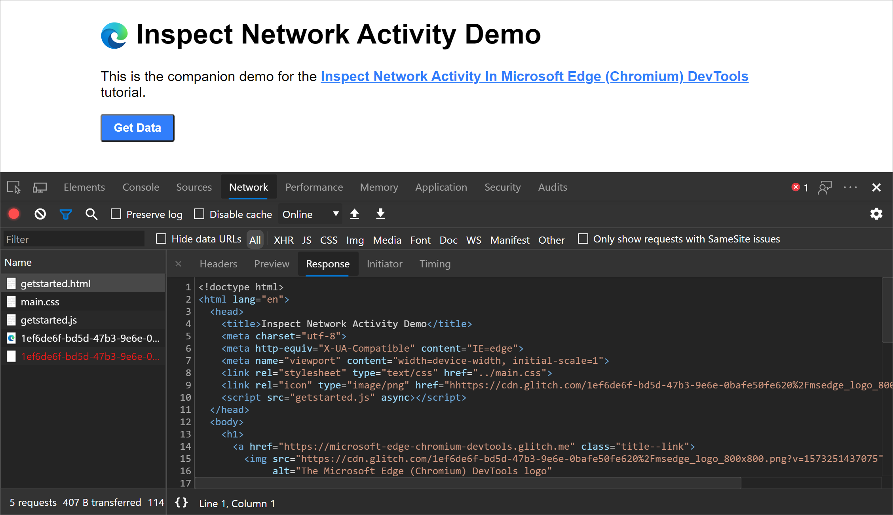
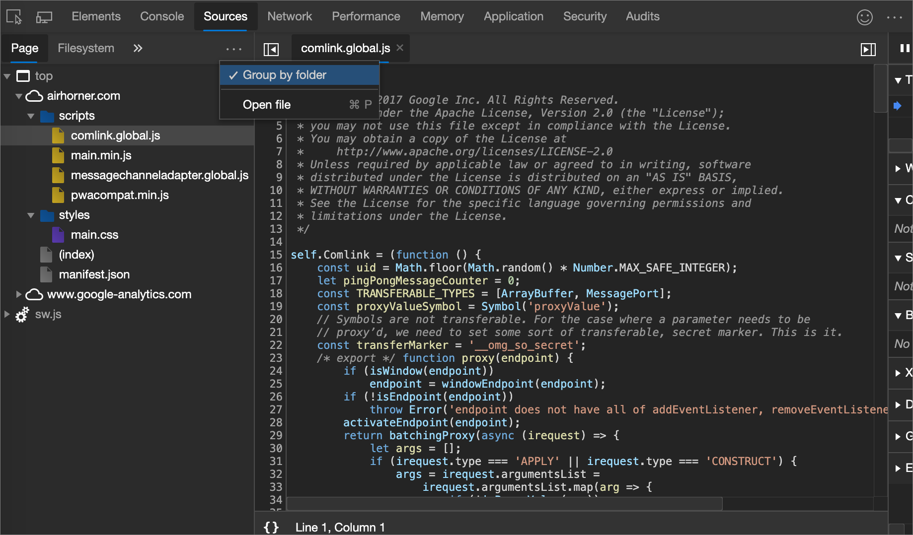
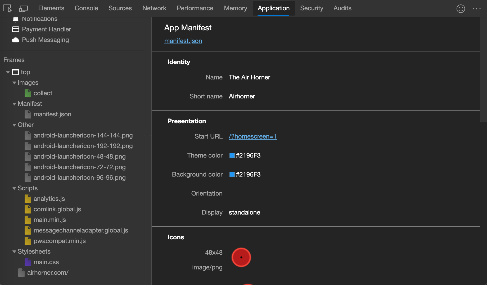
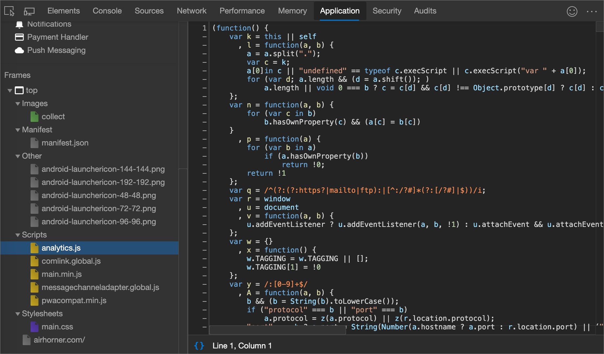

<!-- Copyright Kayce Basques

   Licensed under the Apache License, Version 2.0 (the "License");
   you may not use this file except in compliance with the License.
   You may obtain a copy of the License at

       https://www.apache.org/licenses/LICENSE-2.0

   Unless required by applicable law or agreed to in writing, software
   distributed under the License is distributed on an "AS IS" BASIS,
   WITHOUT WARRANTIES OR CONDITIONS OF ANY KIND, either express or implied.
   See the License for the specific language governing permissions and
   limitations under the License.  -->
# View page resources

Resources are the files that a page needs in order to display correctly.  Examples of resources include:
*  CSS files.
*  JavaScript files.
*  HTML files.
*  Image files.

You can view the resources that make up a web page from within several tools, or panels.

This guide assumes that you are familiar with the basics of [web development](https://developer.mozilla.org/docs/Learn) and [Microsoft Edge DevTools](../../devtools-guide-chromium/overview.md).

<!-- ====================================================================== -->
## Open resources from the Command Menu

When you know the name of the resource that you want to inspect, the **Command Menu** provides a fast way of opening the resource.

1. Press `Ctrl`+`P` (Windows, Linux) or `Command`+`P` (macOS).  The **Open File** dialog opens.

   

1. Select the file from the dropdown list, or start typing the filename and press `Enter` once the correct file is highlighted in the autocomplete box.

   

<!-- ====================================================================== -->
## Open resources in the Network tool

See [Inspect the details of a resource](../network/index.md#inspect-the-details-of-the-resource) in _Inspect network activity_.
<!--why?-->

<!-- need lead-in -->

### Reveal resources in the Network tool from other panels

The next section, [Browse resources in the Network panel](#browse-resources-in-the-network-panel), shows how to view resources from various parts of the DevTools UI.  To inspect a resource in the **Network** tool, right-click the resource and select **Reveal in Network panel**.

<!-- ====================================================================== -->
## Browse resources in the Network panel

<!-- to do x, -->

1. Open [Log network activity](../network/index.md#log-network-activity) (in the article  _Inspect network activity_) in a new tab or window.

<!-- 1. Do the steps in that section, and then continue below. -->

 <!-- open [link] in a new tab or window, and then continue below.. -->
<!--why?-->

<!-- need lead-in -->

<!-- ====================================================================== -->
## Browse resources by directory in the Sources tool

To view the resources of a webpage organized by directory:

1. Open DevTools.

1. Select the **Sources** tool, and then in the **Navigator** pane in the upper left, select the **Page** tab.

1. Click the **More options** (...) button to the right of the **Page** tab, and then select **Group by folder**.

   

    Here is a breakdown of the non-obvious items in the previous figure.

    | Page item | Description |
    |:--- |:--- |
    | `top` | The main document [browsing context](https://developer.mozilla.org/docs/Web/HTML/Element/iframe). |
    | `airhorner.com` | The domain.  All resources nested under it come from that domain.  For example, the full URL of the `comlink.global.js` file is probably `https://airhorner.com/scripts/comlink.global.js`. |
    | `scripts` | A directory. |
    | `(index)` | The main HTML document. |
    | `sw.js` | A service worker runtime context. |

1. Select a resource to view it in the **Editor**.

   

<!-- ====================================================================== -->
## Browse resources by filename in the Sources tool

By default, the **Page** tab groups resources by directory.  To display the resources for each domain as a flat list, instead of grouping them by directory:

1. Go to the **Sources** tool.

1. In the **Navigator** pane (on the left), select the **Page** tab.

1. Click **More options** `...` and then clear the **Group by folder** checkbox.

   

    Resources are organized by file type.  Within each file type, the resources are organized alphabetically.

   

<!-- ====================================================================== -->
## Browse resources by file type in the **Application** tool

To group resources together based on their file type:

1. Select the **Application** tab.  The **Application** tool opens.  By default, the **Manifest** pane usually opens first.

   

1. Scroll down to the **Frames** pane.

   

1. Expand the sections you're interested in.

1. Select a resource to view it.

   

<!-- ====================================================================== -->
## Browse files by type in the Network panel

See [Filter by resource type](../network/index.md#filter-by-resource-type).

<!-- ====================================================================== -->
> [!NOTE]
> Portions of this page are modifications based on work created and [shared by Google](https://developers.google.com/terms/site-policies) and used according to terms described in the [Creative Commons Attribution 4.0 International License](https://creativecommons.org/licenses/by/4.0).
> The original page is found [here](https://developer.chrome.com/docs/devtools/resources/) and is authored by [Kayce Basques](https://developers.google.com/web/resources/contributors#kayce-basques) (Technical Writer, Chrome DevTools \& Lighthouse).

This work is licensed under a [Creative Commons Attribution 4.0 International License](https://creativecommons.org/licenses/by/4.0).
