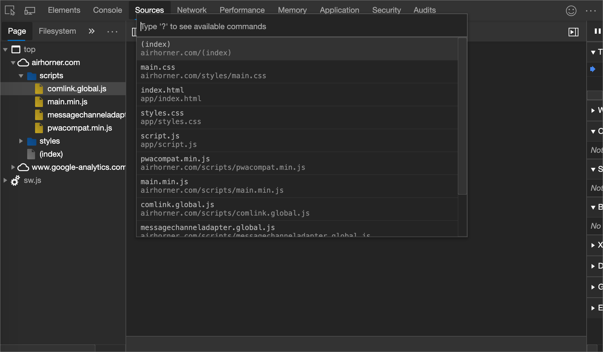
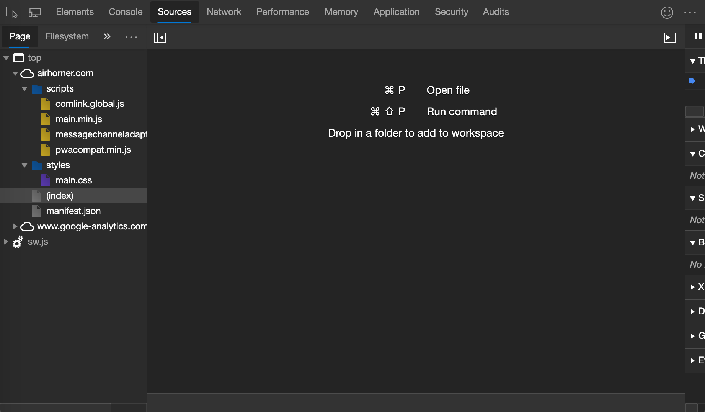
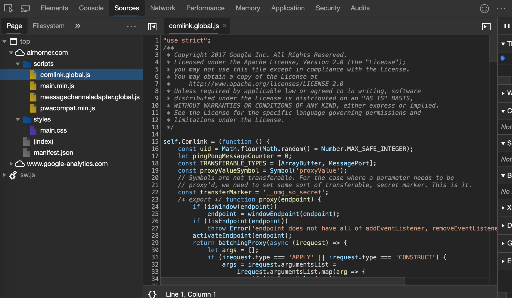

<!-- Copyright Kayce Basques

   Licensed under the Apache License, Version 2.0 (the "License");
   you may not use this file except in compliance with the License.
   You may obtain a copy of the License at

       https://www.apache.org/licenses/LICENSE-2.0

   Unless required by applicable law or agreed to in writing, software
   distributed under the License is distributed on an "AS IS" BASIS,
   WITHOUT WARRANTIES OR CONDITIONS OF ANY KIND, either express or implied.
   See the License for the specific language governing permissions and
   limitations under the License.  -->
# View page resources

Resources are the files that make up a webpage.  Examples of resources include:
*  CSS files.
*  JavaScript files.
*  HTML files.
*  Image files.

You can view the resources that make up a web page from within several tools (or _panels_) in Microsoft Edge DevTools, including:
*  Network tool
*  Sources tool
*  Application tool

See also:
*  [Learn web development](https://developer.mozilla.org/docs/Learn) at Mozilla.org
*  [Overview of DevTools](../../devtools-guide-chromium/overview.md)

To open DevTools, right-click the webpage, and then select **Inspect**. Or press `Ctrl`+ `Shift`+ `I` (Windows, Linux) or `Command`+ `Option`+ `I` (macOS).
<!-- ====================================================================== -->
## Open resources from the Command Menu

When you know the name of the resource that you want to inspect, the **Command Menu** in DevTools provides a fast way of finding and opening the resource.

1. To open DevTools, right-click the webpage, and then select **Inspect**. Or press `Ctrl`+ `Shift`+ `I` (Windows, Linux) or `Command`+ `Option`+ `I` (macOS).

1. When DevTools has focus, press `Ctrl`+ `P` (Windows, Linux) or `Command`+`P` (macOS). Or, you can click the () menu button in DevTools and then select **Open file**.  The Command Menu opens, displaying the **Open File** list:

   

1. Start typing the filename and press `Enter` when the correct file is highlighted in the autocomplete box or select the file from the dropdown list.

   Type filename:

   

<!-- ====================================================================== -->
## Open resources in the Network tool

In the **Network** tool, you can inspect the resources that make up the current webpage, such as `.html`, `.css`, `.js`, and image files.  To learn how to get the details for a specific resource, see [Inspect the details of the resource](../network/index.md#inspect-the-details-of-the-resource) in _Inspect network activity_.

Show network resource details:

#### Reveal resources in the Network tool from other panels

The next section, [Browse resources in the Network panel](#browse-resources-in-the-network-panel), shows how to view resources from various parts of the DevTools UI.  To inspect a resource in the **Network** tool, right-click the resource and select **Reveal in Network panel**.

Pick resource to show in Network panel:

<!-- ====================================================================== -->
## Browse resources in the Network panel

<!-- to do x, -->
See [Log network activity](../network/index.md#log-network-activity) in the article  _Inspect network activity_ to learn how to see the network activity generated by the page resources.

<!-- 1. Open [Log network activity](../network/index.md#log-network-activity) (in the article  _Inspect network activity_) in a new tab or window. --.

<!-- 1. Do the steps in that section, and then continue below. -->

 <!-- open [link] in a new tab or window, and then continue below.. -->
<!--why?-->

<!-- need lead-in -->
Show network activity for page resources:

<!-- ====================================================================== -->
## Browse resources by directory in the Sources tool

You can use the **Sources** tool to see webpage resources organized by directory.

To use the Sources tool:

1. Open DevTools.

1. Select the **Sources** tool, and then in the **Navigator** pane in the upper left, select the **Page** tab.

1. Click the **More options** (...) button to the right of the **Page** tab, and then select **Group by folder**.

   Open Sources tool:

   

    Here is a breakdown of the non-obvious items in the previous figure.

    | Page item | Description |
    |---|---|
    | `top` | The main document [browsing context](https://developer.mozilla.org/docs/Web/HTML/Element/iframe). |
    | `microsoftedge.github.io` | The domain.  All resources nested under it come from that domain.  For example, the full URL of the `buttons.js` file is [https://microsoftedge.github.io/Demos/devtools-a11y-testing/buttons.js](https://microsoftedge.github.io/Demos/devtools-a11y-testing/buttons.js). |
    | `css`, `photos` | Directories |
    | `(index)` | The main HTML document. |
    | `buttons.js` | A script to handle button presses on the page. |

1. Select a resource to view it in the **Editor**:

   

<!-- ====================================================================== -->
## Browse resources by filename in the Sources tool

By default, the **Page** tab groups resources by directory.  To display the resources for each domain as a flat list, instead of grouping them by directory:

1. Go to the **Sources** tool.

1. In the **Navigator** pane (on the left), select the **Page** tab.

1. Click **More options** `...` and then clear the **Group by folder** option.

   Group by folder selected:
   

    Resources are organized by file type.  For each file type, the resources are organized alphabetically:

   

<!-- ====================================================================== -->
## Browse resources by file type in the **Application** tool

Use the **Application** tool to group resources by file type:

1. Select the **Application** tab.  The **Application** tool opens and by default shows the **Manifest** pane first:
   
   

1. Scroll down to the **Frames** pane and then expand the folder that you're interested in:

   

1. Select a resource to view it.

   

<!-- ====================================================================== -->
## Browse files by type in the Network tool

When you view the resources that make up the current webpage, you can filter which type of resources to list, such as only showing `.css` or `.js` files.  For example, in the **Network** tool, you can click **CSS** to filter and only display CSS files:

For more information, see [Filter by resource type](../network/index.md#filter-by-resource-type) in _Inspect network activity_.

<!-- ====================================================================== -->
> [!NOTE]
> Portions of this page are modifications based on work created and [shared by Google](https://developers.google.com/terms/site-policies) and used according to terms described in the [Creative Commons Attribution 4.0 International License](https://creativecommons.org/licenses/by/4.0).
> The original page is found [here](https://developer.chrome.com/docs/devtools/resources/) and is authored by [Kayce Basques](https://developers.google.com/web/resources/contributors#kayce-basques) (Technical Writer, Chrome DevTools \& Lighthouse).

This work is licensed under a [Creative Commons Attribution 4.0 International License](https://creativecommons.org/licenses/by/4.0).
