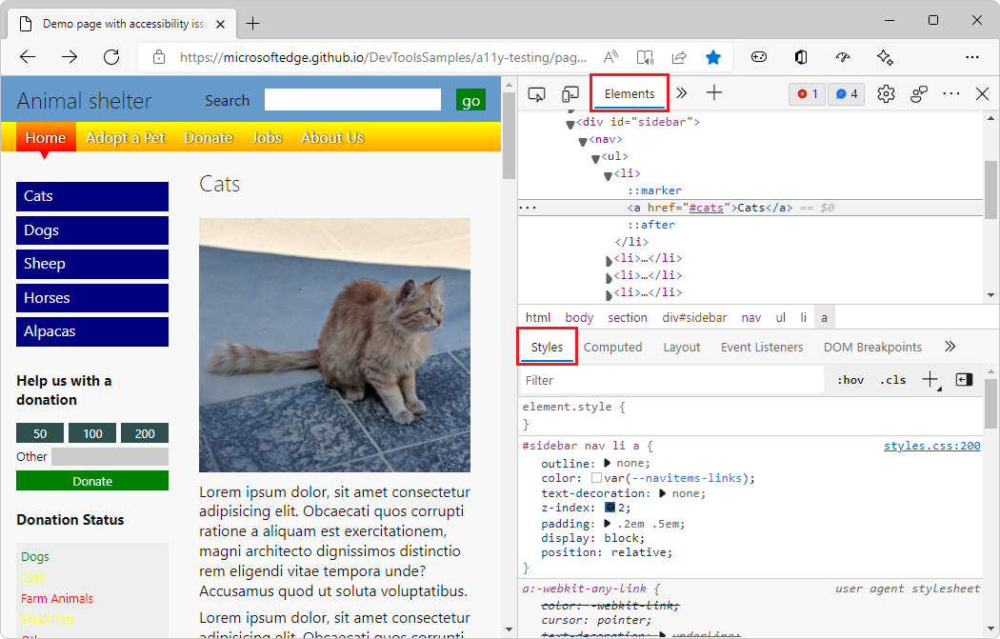
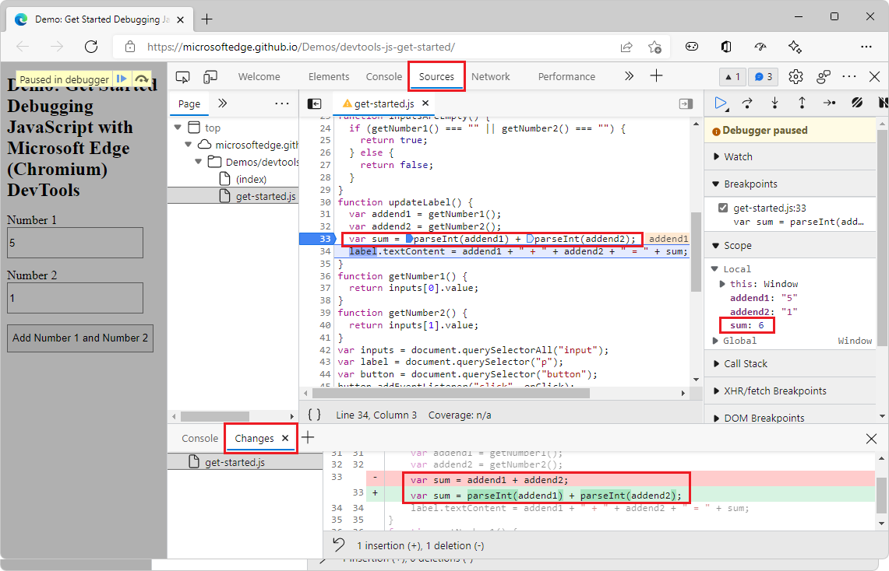

# Sample code for DevTools

The sample code that's used by the DevTools documentation is mainly in the [MicrosoftEdge/Demos](https://github.com/MicrosoftEdge/Demos) repo at GitHub.

<!-- A few demos are at other locations, such as Glitch. -->

<!-- ====================================================================== -->
## Demo webpage with accessibility issues

This demo webpage is useful for exploring various DevTools features.

1. Open the [Demo webpage with accessibility issues](https://MicrosoftEdge.github.io/Demos/devtools-a11y-testing/) in a new window or tab.

1. Right-click anywhere in the rendered webpage and then select **Inspect**.  DevTools opens next to the demo webpage.

   <!-- Or, press `F12`, `Ctrl`+`Shift`+`I` (on Windows/Linux), or `Command`+`Option`+`I` (on macOS). -->

### Articles

These articles walk you through using this demo webpage:

* [Overview of accessibility testing using DevTools](../accessibility/accessibility-testing-in-devtools.md) - Long article with sections that demonstrate using various DevTools features to do accessibility testing, by using the "Demo webpage with accessibility issues".

* [Use the Inspect tool to detect accessibility issues by hovering over the webpage](../accessibility/test-inspect-tool.md) - One of several short articles that are derived from sections of the above article.

* [Accessibility-testing features](../accessibility/reference.md) - A list of accessibility testing features of DevTools, with links to several articles that use the "Demo webpage with accessibility issues".

### Source code repo

This is the source code repo and its directory which stores the files for this demo webpage:

* [MicrosoftEdge/Demos > devtools-a11y-testing](https://github.com/MicrosoftEdge/Demos/tree/main/devtools-a11y-testing) - Contains files including:

   * `index.html` - The demo webpage, including page sections and input forms that send data to the `buttons.js` JavaScript file.  To view the rendered webpage, use the demo webpage link above.

   * `buttons.js` - Contains the JavaScript code that's used by the demo webpage.

   * `styles.css`, `light-theme.css`, and `dark-theme.css` - CSS files that control the presentation of the demo webpage.

   * Image files that are used in the demo webpage.

<!-- ====================================================================== -->
## Demo webpage: Debugging JavaScript with DevTools

This demo webpage is useful for exploring the **Sources** tool, especially the JavaScript debugger.

1. Open the demo webpage [Get started Debugging JavaScript with DevTools](https://MicrosoftEdge.github.io/Demos/devtools-js-get-started/) in a new window or tab.

1. Right-click anywhere in the rendered webpage and then select **Inspect**.  DevTools opens next to the demo webpage.

   <!-- Or, press `F12`, `Ctrl`+`Shift`+`I` (on Windows/Linux), or `Command`+`Option`+`I` (on macOS). -->

### Articles

These articles or article sections walk you through using this demo webpage:

* [The basic approach to using a debugger](../sources/index.md#the-basic-approach-to-using-a-debugger) in _Sources tool overview_.  This article section briefly walks you through the steps to use the JavaScript debugger in the **Sources** tool, to find the bug in the demo webpage.  To fix the bug, you convert the input strings to numbers before adding them.

* [Get started debugging JavaScript](../javascript/index.md) - A more in-depth walkthrough of using the demo webpage along with the debugger, demonstrating various features of the debugger, and setting different kinds of breakpoints.

### Source code repo

This is the source code repo and its directory which stores the files for this demo webpage:

* [MicrosoftEdge/Demos > devtools-js-get-started](https://github.com/MicrosoftEdge/Demos/tree/main/devtools-js-get-started) - Contains the files:

   *  `README.md` - Contains links to the rendered demo webpage and the in-depth tutorial article about using the demo webpage.

   *  `index.html` - The webpage with an input form that sends data to the JavaScript file, and that displays the result of the JavaScript.

   *  `get-started.js` - The JavaScript file that's used by the form in the demo webpage.

<!-- ====================================================================== -->
## URL patterns for rendered demo webpages and source code

To convert between the URL for a rendered demo webpage and the URL for the source code at GitHub, the patterns are as follows.

### Pattern

*  URL for the rendered demo webpage: `https://[org].github.io/[repo]/[path]`

*  URL for the webpage's source code: `https://github.com/[org]/[repo]/tree/main/[path]`

Not case-sensitive.

### Example

*  URL for the rendered demo webpage: `https://MicrosoftEdge.github.io/Demos/devtools-a11y-testing/`

*  URL for the webpage's source code: `https://github.com/MicrosoftEdge/Demos/tree/main/devtools-a11y-testing/`

*  Org = `MicrosoftEdge`
*  Repo = `Demos`
*  Path = `/devtools-a11y-testing/`
