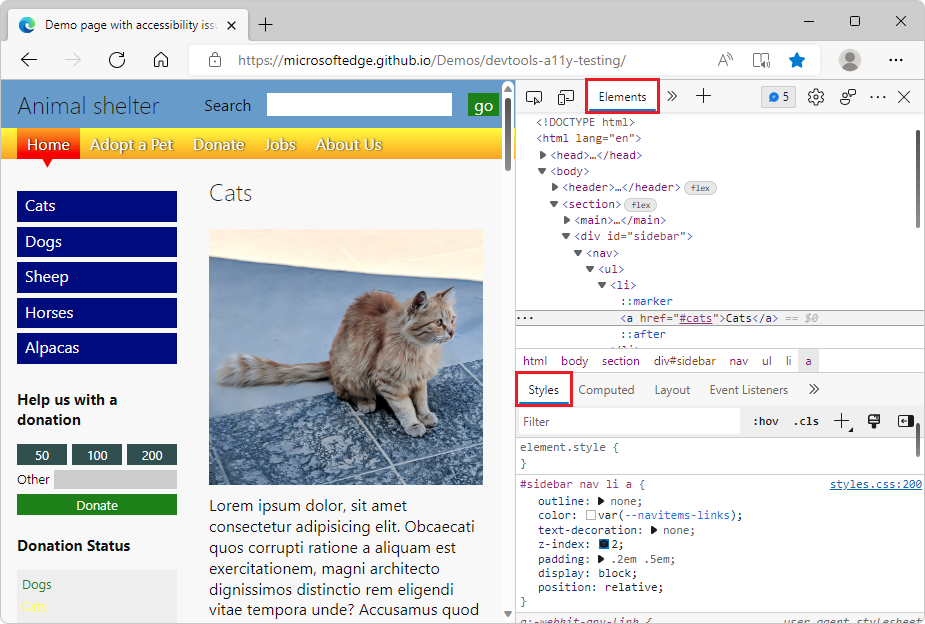

# Sample code for DevTools

Use the [Demos](https://github.com/MicrosoftEdge/Demos#readme) repo to learn how to use Microsoft Edge to develop webpages and web apps.  There are various ways to view, download, and modify these demo webpages, including:
*  DevTools in Microsoft Edge.
*  Visual Studio Code, with optional DevTools.
*  Visual Studio, with optional DevTools.

To view the source code for a rendered demo webpage in DevTools in Microsoft Edge:

1. In a Readme page, click the **Demo** link.  The live page opens in Microsoft Edge.

1. Right-click the demo webpage, and then select **Inspect** to open DevTools.


<!-- ====================================================================== -->
## List of DevTools samples

The following demos demonstrate DevTools features.

<!-- 
keep DevTools table sync'd:
https://github.com/MicrosoftEdge/Demos#readme
https://learn.microsoft.com/microsoft-edge/devtools-guide-chromium/sample-code/sample-code#sample-code-for-devtools
last sync'd Feb. 2, 2023
-->

| Demo name | Description | Repo directory | Live demo page |
|:---|:---|:---|:---|
| CSS mirroring sourcemaps | Used for [Update .css files from within the Styles tab (CSS mirror editing)](../../visual-studio-code/microsoft-edge-devtools-extension/css-mirror-editing-styles-tab.md) for the DevTools extension for Visual Studio Code. | [/css-mirroring-sourcemaps-demo/](https://github.com/MicrosoftEdge/Demos/tree/main/css-mirroring-sourcemaps-demo) | n/a |
| TODO app | Simple To Do app with vanilla JavaScript.  Used for screenshots in the [Microsoft Edge DevTools documentation](/microsoft-edge/devtools-guide-chromium/landing/), and for [Opening DevTools and the DevTools browser](../../visual-studio-code/microsoft-edge-devtools-extension/open-devtools-and-embedded-browser.md) for the DevTools extension for Visual Studio Code. | [/demo-to-do/](https://github.com/MicrosoftEdge/Demos/tree/main/demo-to-do) | [My tasks](https://microsoftedge.github.io/Demos/demo-to-do/) |
| Detached elements | Chat-like demo.  Used for [Debug DOM memory leaks with the Detached Elements tool](../memory-problems/dom-leaks.md). | [/detached-elements/](https://github.com/MicrosoftEdge/Demos/tree/main/detached-elements) | [Simulate traffic](https://microsoftedge.github.io/Demos/detached-elements/) |
| 3D View | Used for [Navigate webpage layers, z-index, and DOM using the 3D View tool](../3d-view/index.md). | [/devtools-3d/](https://github.com/MicrosoftEdge/Demos/tree/main/devtools-3d) | [Microsoft Edge DevTools 3D View tool demo](https://microsoftedge.github.io/Demos/devtools-3d/) |
| Accessibility testing | Used for [Accessibility-testing features](../accessibility/reference.md). | [/devtools-a11y-testing/](https://github.com/MicrosoftEdge/Demos/tree/main/devtools-a11y-testing) | [Animal shelter](https://microsoftedge.github.io/Demos/devtools-a11y-testing/) |
| Console panel demo pages | Used for [Console overview](../console/index.md), [Log messages in the Console tool](../console/console-log.md), and [Fix JavaScript errors that are reported in the Console](../console/console-debug-javascript.md). | [/devtools-console/](https://github.com/MicrosoftEdge/Demos/tree/main/devtools-console) | [DevTools Console panel demo pages](https://microsoftedge.github.io/Demos/devtools-console/) |
| Contrast bug fix | Used for [Improving contrast in Microsoft Edge DevTools: A bugfix case study](https://blogs.windows.com/msedgedev/2021/06/15/improving-contrast-in-microsoft-edge-devtools-a-bugfix-case-study/). | [/devtools-contrast-bugfix/](https://github.com/MicrosoftEdge/Demos/tree/main/devtools-contrast-bugfix) | [Testing all badges in DevTools for contrast issues](https://microsoftedge.github.io/Demos/devtools-contrast-bugfix/) |
| CSS Examples | Used for [Get started viewing and changing CSS](../css/index.md). | [/devtools-css-get-started/](https://github.com/MicrosoftEdge/Demos/tree/main/devtools-css-get-started) | [CSS Examples](https://microsoftedge.github.io/Demos/devtools-css-get-started/) |
| DOM Examples | Used for [Get started viewing and changing the DOM](../dom/index.md). | [/devtools-dom-get-started/](https://github.com/MicrosoftEdge/Demos/tree/main/devtools-dom-get-started) | [DOM Examples](https://microsoftedge.github.io/Demos/devtools-dom-get-started/) |
| Inspect tool demo | Used for [Analyze pages using the Inspect tool](../css/inspect.md). | [/devtools-inspect/](https://github.com/MicrosoftEdge/Demos/tree/main/devtools-inspect) | [Inspect Demo](https://microsoftedge.github.io/Demos/devtools-inspect/) |
| Debugging JavaScript that adds two numbers | Used for [Get started debugging JavaScript](../javascript/index.md). | [/devtools-js-get-started/](https://github.com/MicrosoftEdge/Demos/tree/main/devtools-js-get-started) | [Demo: Debugging JavaScript with Microsoft Edge DevTools](https://microsoftedge.github.io/Demos/devtools-js-get-started/) |
| Memory heap snapshot | Used for [Record heap snapshots using the Memory tool](../memory-problems/heap-snapshots.md). | [/devtools-memory-heap-snapshot/](https://github.com/MicrosoftEdge/Demos/tree/main/devtools-memory-heap-snapshot) | n/a |
| Performance Activity Tabs | Used for [View activities in a table](../evaluate-performance/reference.md#view-activities-in-a-table), about the **Performance** tool's **Bottom-Up**, **Call Tree**, and **Event Log** tabs. | [/devtools-performance-activitytabs/](https://github.com/MicrosoftEdge/Demos/tree/main/devtools-performance-activitytabs) | [Activity Tabs Demo](https://microsoftedge.github.io/Demos/devtools-performance-activitytabs/) |
| Sluggish Animation | Used for [Introduction to the Performance tool](../evaluate-performance/index.md). | [/devtools-performance-get-started/](https://github.com/MicrosoftEdge/Demos/tree/main/devtools-performance-get-started) | [Sluggish Animation](https://microsoftedge.github.io/Demos/devtools-performance-get-started/) |
| CSS :target pseudo-class | Used for [Support forcing the :target CSS state](../whats-new/2021/01/devtools.md#support-forcing-the-target-css-state). | [/devtools-target-pseudo/](https://github.com/MicrosoftEdge/Demos/tree/main/devtools-target-pseudo) | [CSS :target pseudo-class demo](https://microsoftedge.github.io/Demos/devtools-target-pseudo/) |
| Heap Snapshot Visualizer | Source code for the [Heap Snapshot Visualizer](https://microsoftedge.microsoft.com/addons/detail/heap-snapshot-visualizer/fceldlhognbemkgfacnffkdanocidgce) extension for DevTools. | [/heap-snapshot-visualizer/](https://github.com/MicrosoftEdge/Demos/tree/main/heap-snapshot-visualizer) | n/a |
| JSON dummy data | Simple JSON files.  Used for [View formatted JSON](../json-viewer/json-viewer.md). | [/json-dummy-data/](https://github.com/MicrosoftEdge/Demos/tree/main/json-dummy-data) | [JSON dummy data](https://microsoftedge.github.io/Demos/json-dummy-data/) |
| Inspect Network Activity | Used for [Inspect network activity](../network/index.md). | [/network-tutorial/](https://github.com/MicrosoftEdge/Demos/tree/main/network-tutorial) | [Inspect Network Activity Demo](https://microsoftedge.github.io/Demos/network-tutorial/) |
| Photo gallery demo | Used for [The truth about CSS selector performance](https://blogs.windows.com/msedgedev/2023/01/17/the-truth-about-css-selector-performance/). | [/photo-gallery/](https://github.com/MicrosoftEdge/Demos/tree/main/photo-gallery) | [Photo Gallery](https://microsoftedge.github.io/Demos/photo-gallery/) |
| Slow Calendar demo | A simple calendar demo app that's used to test various DevTools features such as the **Performance** tool or source map support. | [/slow-calendar/](https://github.com/MicrosoftEdge/Demos/tree/main/slow-calendar) | [Slow Calendar demo](https://microsoftedge.github.io/Demos/slow-calendar/public) |
| Workspaces demo | Use for [Edit files with Workspaces (Filesystem tab)](../workspaces/index.md), in the **Sources** tool. | [/workspaces/](https://github.com/MicrosoftEdge/Demos/tree/main/workspaces) | [DevTools Workspaces Demo](https://microsoftedge.github.io/Demos/workspaces/) |

A few of these samples are shown below.


<!-- ====================================================================== -->
## To Do demo

This simple To Do list webpage is used to demonstrate various DevTools features.  It has an `.html` file, a `.js` file, and `.css` files:


* Rendered page: [TODO app](https://microsoftedge.github.io/Demos/demo-to-do/)

* Source code: [demo-to-do](https://github.com/MicrosoftEdge/Demos/tree/main/demo-to-do)


<!-- ====================================================================== -->
## Demo webpage with accessibility issues

This Animal Shelter demo webpage is useful for exploring various DevTools features, including accessibility testing features.

1. Open the [Demo webpage with accessibility issues](https://MicrosoftEdge.github.io/Demos/devtools-a11y-testing/) in a new window or tab.

1. Right-click anywhere in the rendered webpage and then select **Inspect**.  DevTools opens next to the demo webpage.

   <!-- Or, press **F12**, **Ctrl+Shift+I** (on Windows/Linux), or **Command+Option+I** (on macOS). -->




#### Articles

These articles walk you through using this demo webpage:

* [Use the Inspect tool to detect accessibility issues by hovering over the webpage](../accessibility/test-inspect-tool.md) - One of several short articles that are derived from sections of the above article.

* [Accessibility-testing features](../accessibility/reference.md) - A list of accessibility testing features of DevTools, with links to several articles that use the "Demo webpage with accessibility issues".


#### Source code repo

This is the source code repo and its directory which stores the files for this demo webpage:

* [MicrosoftEdge/Demos > devtools-a11y-testing](https://github.com/MicrosoftEdge/Demos/tree/main/devtools-a11y-testing) - Contains files including:

   * `index.html` - The demo webpage, including page sections and input forms that send data to the `buttons.js` JavaScript file.  To view the rendered webpage, use the demo webpage link above.

   * `buttons.js` - Contains the JavaScript code that's used by the demo webpage.

   * `styles.css`, `light-theme.css`, and `dark-theme.css` - CSS files that control the presentation of the demo webpage.

   * Image files that are used in the demo webpage.


<!-- ====================================================================== -->
## Demo webpage: Debugging JavaScript with DevTools

This demo webpage is useful for exploring the **Sources** tool, especially the JavaScript debugger.

1. Open the demo webpage [Get started Debugging JavaScript with DevTools](https://MicrosoftEdge.github.io/Demos/devtools-js-get-started/) in a new window or tab.

1. Right-click anywhere in the rendered webpage and then select **Inspect**.  DevTools opens next to the demo webpage.

   <!-- Or, press **F12**, **Ctrl+Shift+I** (on Windows/Linux), or **Command+Option+I** (on macOS). -->


#### Articles

These articles or article sections walk you through using this demo webpage:

* [The basic approach to using a debugger](../sources/index.md#the-basic-approach-to-using-a-debugger) in _Sources tool overview_.  This article section briefly walks you through the steps to use the JavaScript debugger in the **Sources** tool, to find the bug in the demo webpage.  To fix the bug, you convert the input strings to numbers before adding them.

* [Get started debugging JavaScript](../javascript/index.md) - A more in-depth walkthrough of using the demo webpage along with the debugger, demonstrating various features of the debugger, and setting different kinds of breakpoints.


#### Source code repo

This is the source code repo and its directory which stores the files for this demo webpage:

* [MicrosoftEdge/Demos > devtools-js-get-started](https://github.com/MicrosoftEdge/Demos/tree/main/devtools-js-get-started) - Contains the files:

   *  `README.md` - Contains links to the rendered demo webpage and the in-depth tutorial article about using the demo webpage.

   *  `index.html` - The webpage with an input form that sends data to the JavaScript file, and that displays the result of the JavaScript.

   *  `get-started.js` - The JavaScript file that's used by the form in the demo webpage.


<!-- ====================================================================== -->
## Download or clone the Demos repo

The Demos repo is useful for following the various DevTools documentation.


#### Download the Demos repo

To download the Demos repo:

1. In a new window or tab, go to the [MicrosoftEdge / Demos](https://github.com/MicrosoftEdge/Demos#readme) repo.

1. Click the **Code** dropdown button, and then click **Download ZIP**.

   The `.zip` file is placed in your download directory.  Unzip these webpage source files into a suitable location.

To download a single directory of the Demos repo:

1. Go to [https://download-directory.github.io/](https://download-directory.github.io/) and then paste the URL [https://github.com/MicrosoftEdge/Demos/tree/main/demo-to-do](https://github.com/MicrosoftEdge/Demos/tree/main/demo-to-do).  

   The `.zip` file is placed in your download directory.  Unzip these webpage source files into a suitable location.

See also:
* [Download the WebView2Samples repo](../../webview2/how-to/machine-setup.md#download-the-webview2samples-repo) in _Set up your Dev environment for WebView2_.


#### Clone the Demos repo

Cloning a repo enables updating your local copy when the repo is updated.  The GitHub UI and various tools support cloning.  We'll show cloning by using Visual Studio Code, but you can use many other coding tools, such as GitHub Desktop, Visual Studio, or git bash shell.

To clone the repo:

1. In a new window or tab, go to the [MicrosoftEdge / Demos](https://github.com/MicrosoftEdge/Demos#readme) repo.

1. If the green **Code** button isn't shown, click **Demos** in the path **Microsoft Edge** / **Demos** in the upper left to go to the main page of the repo.

1. Click the **Code** dropdown button, and then click the **Copy** button next to the URL **https://github.com/MicrosoftEdge/Demos.git**.  You can then paste the URL into git bash or a Visual Studio Code dialog, for example.

   Or, click the **Code** dropdown button, and then click **Open with Visual Studio** if it appears.  A list of **Handler Selector** items is offered, one per Visual Studio instance installed.  This option appears only if you're logged in.

   

1. In Visual Studio Code, in the **Activity Bar**, click the **Source Control** () button, and then click the **Clone Repository** button.

1. In the **Provide repository URL** text box, paste the copied URL: **https://github.com/MicrosoftEdge/Demos.git** and then press **Enter**.  A folder selection dialog opens.

   

1. Navigate to your desired path, such as `C:\Users\username\Documents\GitHub` or `Users/username/GitHub`, and then click the **Select Repository Location** button.

1. The message **Cloning git repository** appears, then you're prompted to open the cloned repository.  Click the **Open** button:

   

1. If prompted **Do you trust...**, click the **Yes** button.  Or, click the **No** button and continue with most parts of this walkthrough.

   The **Explorer** tree lists many demos, including **demo-to-do**.

See also:
* [Cloning a repository](https://docs.github.com/en/repositories/creating-and-managing-repositories/cloning-a-repository) - GitHub docs.
* [Clone the WebView2Samples repo](../../webview2/how-to/machine-setup.md#clone-the-webview2samples-repo) in _Set up your Dev environment for WebView2_.


<!-- ====================================================================== -->
## Open a demo folder in the Sources tool and edit a file

To use this section, first [Download or clone the Demos repo](#download-or-clone-the-demos-repo).

To edit local files in the **Sources** tool, you might need to first click the **Allow** button to grant read/write access.  To do that, follow the steps in [Opening a folder from the Filesystem (Workspace) tab in the Sources tool](#opening-a-folder-from-the-filesystem-workspace-tab-in-the-sources-tool) below.

See also:
* [Approaches compared](../../visual-studio-code/microsoft-edge-devtools-extension.md#approaches-compared) in _Microsoft Edge DevTools extension for Visual Studio Code_.  Summarizes and compares several options for editing webpage files.


#### Opening a folder from the Filesystem (Workspace) tab in the Sources tool

After downloading or cloning the Demos repo:

1. In Microsoft Edge, open a new tab.

1. Right-click the webpage, and then select **Inspect**.  Or, press **Ctrl+Shift+I** (Windows, Linux) or **Command+Option+I** (macOS).  DevTools opens.

1. In DevTools, on the main toolbar, select the **Sources** tab.  If that tab isn't visible, click the **More tabs** () button.

1. In the **Sources** tab, on the left, select the **Filesystem** tab, which is grouped with the **Page** tab.  If the **Filesystem** tab isn't displayed, click the **More tabs** () button.

1. Click **+ Add folder to workspace**.  A folder selection dialog opens.

1. Select a specific folder, such as **demo-to-do**, or select the **Demos** root folder:

   

1. Above DevTools, your're prompted "DevTools requests full access to (directory)".  Click the **Allow** button:

   

To edit the files, see the editing steps in the next section.


See also:
* [Edit files with Workspaces (Filesystem tab)](../workspaces/index.md) - to open a local folder in the **Sources** tool of DevTools in the browser.
* [Using the Filesystem tab to define a local Workspace](../sources/index.md#using-the-filesystem-tab-to-define-a-local-workspace) in _Sources tool overview_.


#### Opening a local HTML file from the browser's File Open dialog and editing it from the Page tab of the Sources tool

To edit files in the **Sources** tool, before doing the steps in this section, you might need to click the **Allow** button to grant read/write access by following the steps in [Opening a folder from the Filesystem (Workspace) tab in the Sources tool](#opening-a-folder-from-the-filesystem-workspace-tab-in-the-sources-tool) above.


To open an `.html` file and edit it:

1. In Microsoft Edge, open a new tab, and then press **Ctrl+O** (Windows/Linux) or **Command+O** (macOS).  A file selection dialog opens.

1. Select an HTML file from the local copy of the **Demos** repo, such as `C:\Users\username\Documents\GitHub\Demos\demo-to-do\index.html`.  The `.html` file is opened and rendered in Microsoft Edge.

1. Right-click the webpage, and then select **Inspect**.  Or, press **Ctrl+Shift+I** (Windows, Linux) or **Command+Option+I** (macOS).  DevTools opens.

1. In DevTools, on the main toolbar, select the **Sources** tab.  If that tab isn't visible, click the **More tabs** () button.

1. In DevTools, on the left, select the **Page** tab, and then select the HTML file, such as `index.html` or **(index)**.

1. Press **Esc** to open the **Drawer** at the bottom of DevTools.

1. In the Drawer, click the **More Tools** () button, and then select the **Changes** tool.

1. In the middle, editor pane of the **Sources** tool, edit the `.html` file.  For example, in `demo-to-do/index.html` folder, in the `<h1>` heading line, change **My tasks** to **My modified tasks**:

   ```html
   <h1>📋 My modified tasks</h1>
   ```

   If editing isn't enabled, click the **Allow** button to grant read/write access to the folder by doing the steps in [Opening a folder from the Filesystem (Workspace) tab in the Sources tool](#opening-a-folder-from-the-filesystem-workspace-tab-in-the-sources-tool) above.

   The change is displayed in the **Changes** tool in the Drawer, and an asterisk is added to the file name in the **index.html** tab in the **Sources** tool:

   

1. Press **Ctrl+S** (Windows, Linux) or **Command+S** (macOS) to save the change.  The asterisk is removed from the **index.html** tab in the **Sources** tool.

1. Refresh the page.  The change is displayed in the rendered webpage; for example, the word **modified** is added to the title:

   


#### Opening a local HTML file from File Explorer and editing it in the browser

1. In File Explorer on Windows, or Finder on macOS, select an HTML file from the local copy of the **Demos** repo, such as `C:\Users\username\Documents\GitHub\Demos\demo-to-do\index.html`.  The `.html` file is opened and rendered in Microsoft Edge.

1. Follow the steps in the sections above.


<!-- ====================================================================== -->
## Open a demo folder in Visual Studio Code

After downloading or cloning the Demos repo:

1. In Visual Studio Code, in the **Activity Bar**, click the **Explorer** () button.  The **Explorer** pane opens.

1. In the **Explorer** pane, click the **Open Folder** button.  The **Open Folder** dialog opens.  Navigate to the `demo-to-do` folder in the Demo repo that you cloned, select the folder or go into it, and then click the **Select Folder** button:

   

   An example of a repo location where the **Demos** repo has been cloned is shown above.  The `demo-to-do` folder of the cloned **Demos** repo opens in the Explorer of Visual Studio Code:

   

Or, you can open the root folder of the Demos repo, to explore all of the demo folders in the **Explorer** pane.


See also:
* [Microsoft Edge DevTools extension for Visual Studio Code](../../visual-studio-code/microsoft-edge-devtools-extension.md) - to open a local folder in Visual Studio Code and use DevTools within Visual Studio Code.


<!-- ====================================================================== -->
## URL patterns for rendered demo webpages and source code

Most of the Readme files in the Demos repo have a link that opens the rendered `.html` file from the GitHub.io server.  Sometimes you have a URL for an HTML source file at GitHub.com, but instead you need to derive the **github.io** server URL to display the rendered file, rather than displaying the code listing of the `.html` source code in the GitHub directory.

To convert from the URL for the source code directory at GitHub.com to the URL for a rendered demo webpage at GitHub.io, the pattern is as follows.

Suppose the URL for the webpage's source code at GitHub.com is:
* `https://github.com/MicrosoftEdge/Demos/tree/main/demo-to-do/`

The key components of that GitHub.com URL are:
* `https://github.com/[org]/[repo]/tree/main/[path]`

In contrast, the desired GitHub.io URL pattern is:
* `https://[org].github.io/[repo]/[path]`

To fill in that GitHub.io URL pattern, in this example:
*  [org] is `MicrosoftEdge`.
*  [repo] is `Demos`.
*  [path] is `demo-to-do`.

Therefore, the resulting GitHub.io server URL for the rendered demo webpage is:
* `https://MicrosoftEdge.github.io/Demos/demo-to-do/`

These URLs aren't case-sensitive.


<!-- ====================================================================== -->
## See also

Opening and editing files:
* [Edit files with Workspaces (Filesystem tab)](../workspaces/index.md) - to open a local folder in the **Sources** tool of DevTools in the browser.
* [Using the Filesystem tab to define a local Workspace](../sources/index.md#using-the-filesystem-tab-to-define-a-local-workspace) in _Sources tool overview_.
* [Approaches compared](../../visual-studio-code/microsoft-edge-devtools-extension.md#approaches-compared) in _Microsoft Edge DevTools extension for Visual Studio Code_.  Summarizes and compares several options for editing webpage files.
* [Microsoft Edge IDE integration](../../visual-studio-code/ide-integration.md) - Webpage app development using Visual Studio Code or Visual Studio, including Microsoft Edge DevTools.

Downloading and cloning:
* [Step 5: Clone the Demos repo](../../visual-studio-code/microsoft-edge-devtools-extension/install.md#step-5-clone-the-demos-repo) in _Installing the DevTools extension for Visual Studio Code_.
* [Cloning a repository](https://docs.github.com/en/repositories/creating-and-managing-repositories/cloning-a-repository) - GitHub docs.

Running a local web server:
* [Step 6: Set up a localhost server](../../visual-studio-code/microsoft-edge-devtools-extension/install.md#step-6-set-up-a-localhost-server) in _Installing the DevTools extension for Visual Studio Code_.
