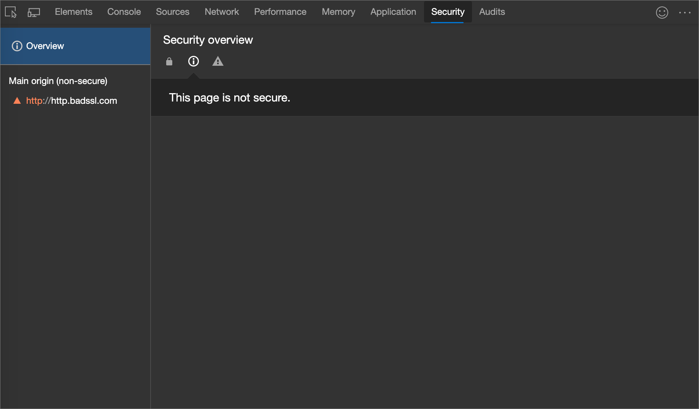
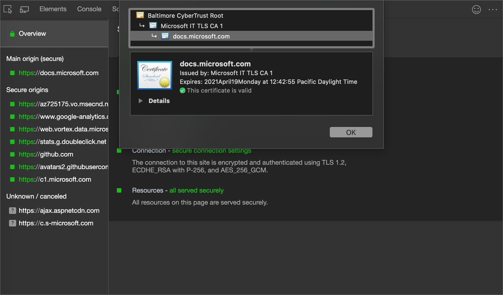
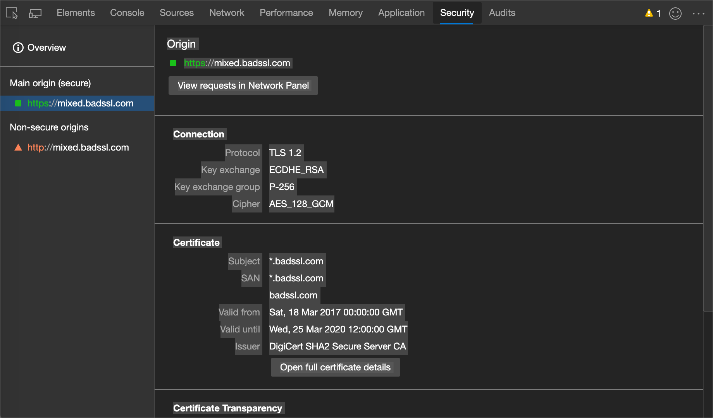

<!-- Copyright Kayce Basques

   Licensed under the Apache License, Version 2.0 (the "License");
   you may not use this file except in compliance with the License.
   You may obtain a copy of the License at

       https://www.apache.org/licenses/LICENSE-2.0

   Unless required by applicable law or agreed to in writing, software
   distributed under the License is distributed on an "AS IS" BASIS,
   WITHOUT WARRANTIES OR CONDITIONS OF ANY KIND, either express or implied.
   See the License for the specific language governing permissions and
   limitations under the License.  -->
# Understand security issues using the Security tool

<!--Use the **Security** Panel in DevTools to make sure HTTPS is properly implemented on a page.  See **Why HTTPS Matters** to learn why every website should be protected with HTTPS, even sites that don't handle sensitive user data.  -->

<!--todo: add section when why-https is available -->

Use the **Security** panel to inspect the security of a page.

1. To open DevTools, right-click a webpage, and then select **Inspect**.  Or, press **Ctrl+Shift+I** (Windows, Linux) or **Command+Option+I** (macOS).  DevTools opens.

1. In DevTools, on the main toolbar, click the **Security** tab.  If that tab isn't visible, click the **More tabs** () button, or else the **More Tools** () button.

   The **Security** tool (or _panel_) opens:

<!-- ====================================================================== -->
## Common problems

### Non-secure main origins

When the main origin of a page isn't secure, the **Security Overview** says **This page is not secure**.

This problem occurs when the URL that you visited was requested over HTTP.  To make it secure you need to request it over HTTPS.  For example, if you look at the URL in your address bar, it probably looks similar to `http://example.com`.  To make it secure the URL should be `https://example.com`.

If you already set up HTTPS on your server, all you need to do to fix this problem is configure your server to redirect all HTTP requests to HTTPS.

If you haven't set up HTTPS on your server, [Let's Encrypt](https://letsencrypt.org) provides a free and relatively easy way to start the process.  Or, you might consider hosting your site on a CDN.  Most major CDNs host sites on HTTPS by default now.

> [!TIP]
> The [Use HTTPS](https://webhint.io/docs/user-guide/hints/hint-https-only) hint in [webhint](https://webhint.io) can help automate the process of making sure that all HTTP requests are directed to HTTPS.

### Mixed content

**Mixed content**<!--[mixed content](/web/fundamentals/security/prevent-mixed-content/what-is-mixed-content)--> means that the main origin of a page is secure, but the page requested resources from non-secure origins.  Mixed content pages are only partially protected because the HTTP content is accessible to sniffers and vulnerable to man-in-the-middle attacks.

In the previous figure, select **View 1 request in Network panel** to open the **Network** tool and apply the `mixed-content:displayed` filter so that the **Network Log** only shows non-secure resources.

<!-- ====================================================================== -->
## View details

### View main origin certificate

From the **Security Overview**, click **View certificate** to quickly inspect the certificate for the main origin.

### View origin details

Click one of the entries in the left-hand nav to view the details of the origin.  From the details page you can view connection and certificate information.  Certificate transparency information is also shown when available.

<!-- ====================================================================== -->
> [!NOTE]
> Portions of this page are modifications based on work created and [shared by Google](https://developers.google.com/terms/site-policies) and used according to terms described in the [Creative Commons Attribution 4.0 International License](https://creativecommons.org/licenses/by/4.0).
> The original page is found [here](https://developer.chrome.com/docs/devtools/security/) and is authored by [Kayce Basques](https://developers.google.com/web/resources/contributors#kayce-basques) (Technical Writer, Chrome DevTools \& Lighthouse).

This work is licensed under a [Creative Commons Attribution 4.0 International License](https://creativecommons.org/licenses/by/4.0).
