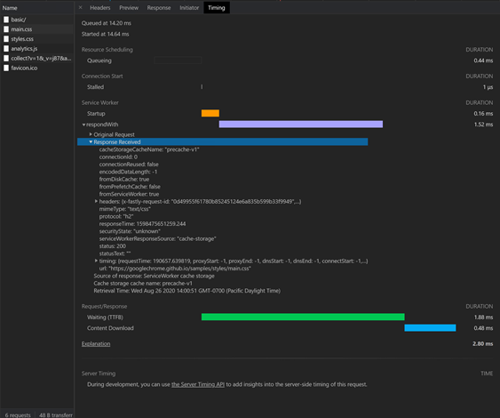
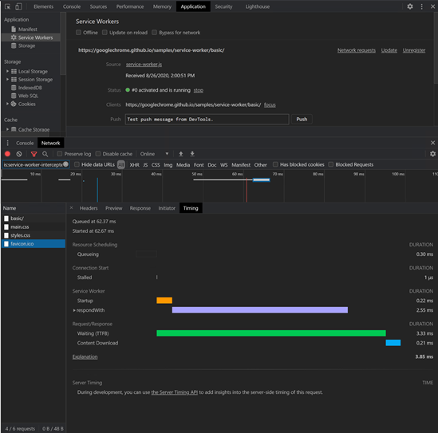
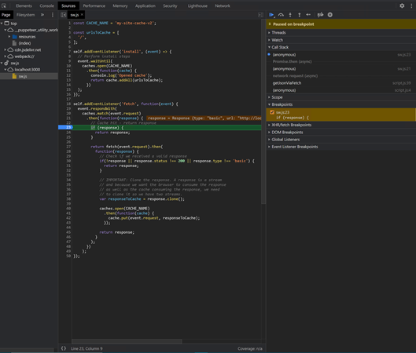

# Service Worker improvements

This article explains improvements to developer tools for working with [service workers](https://developer.mozilla.org/docs/Web/API/Service_Worker_API) and the network requests that pass through each service worker.  The **service worker improvements** are in the **Network**, **Application**, and **Sources** tools.

The improvements to service workers simplify the following tasks:

*  Debug based on Service Worker timelines.
    *  The start of a request and duration of the bootstrap.
    *  Update to Service worker registration.
    *  The runtime of a request using the [fetch event](https://developer.mozilla.org/docs/Web/API/FetchEvent) handler.
    *  The runtime of all fetch events for loading a client.
*  Explore the runtime details of fetch event handlers, install event handlers, and activate event handlers.
*  Step into and out of fetch event handler with [page script information](#sources).

The improved experiences span three different developer tools:

*  The [Network](#network) tool.  Select a network request that runs through a service worker and access the corresponding timeline of the service worker in the **Timing** tool.

*  The [Application](#application) tool.  To debug the service workers, go to the **Service Workers** tool.

*  The [Sources](#sources) tool.  Access page script information when stepping into fetch event handlers.

<!-- ====================================================================== -->
## Network

You can access the service worker debugging features in the **Network** tool in either of the following ways:

*  Directly in the **Network** tool.
*  Started in the **Application** tool.

### Request routing

To make request routing easier to visualize, timelines now display the service worker start-up and the `respondWith` fetch events.  To debug and visualize a network request that passed through a service worker:

1. Select the network request that went through a service worker.
1. Open the **Timing** tool.

### Fetch events

To learn more about the `respondWith` fetch events, click the dropdown arrow to the left of the `respondWith`.  To find more details about the **Original Request** and **Response Received**, click the corresponding dropdown arrows.

<!-- ====================================================================== -->
## Application

### Service worker update timeline

The Microsoft Edge DevTools team added a timeline in the **Application** tool to reflect the update lifecycle of the service worker.  This timeline displays the installation and activation events.  Each of the events have a corresponding dropdown arrow to give you more details.

### Request routing and fetch events

You can now access the service worker timelines through the **Network** tool in the console drawer.  This feature benefits performance, minimizes UI duplication, and creates a more comprehensive debugging experience.

1. Open the service worker that you're debugging.

1. Click the **Network** button to open the [request routing experience](#network).

1. Use the **respondWith** dropdown arrows for fetch event request and response information.

The **Network** tool displays the network requests that went through the service worker you are debugging.  The automatic filter is a way to narrow down your exploration.

See also [Application tool, to manage storage](../storage/application-tool.md).

<!-- ====================================================================== -->
## Sources

To find more stack information, set a break point in the fetch handler.  The details lead to where the resource is requested in the page script.

When the debugger pauses inside a fetch handler, a combined stack information is displayed in the panel to the right.  After that, you can move around in the stack frames.

### Future work

The Microsoft Edge DevTools team plans to further develop the cache detail, and are investigating more ways to improve the service worker debugging experience for [Progressive Web Application (PWA)](https://developer.mozilla.org/docs/Web/Progressive_web_apps) developers.
