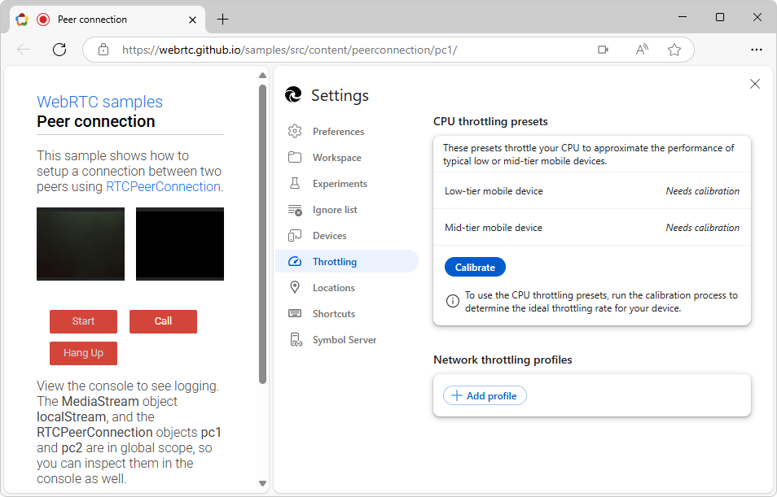
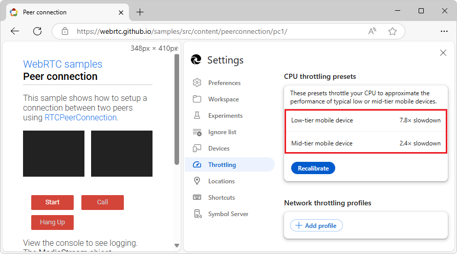
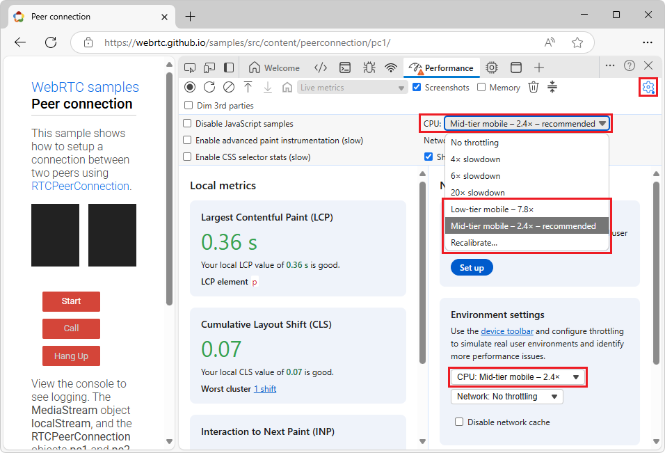
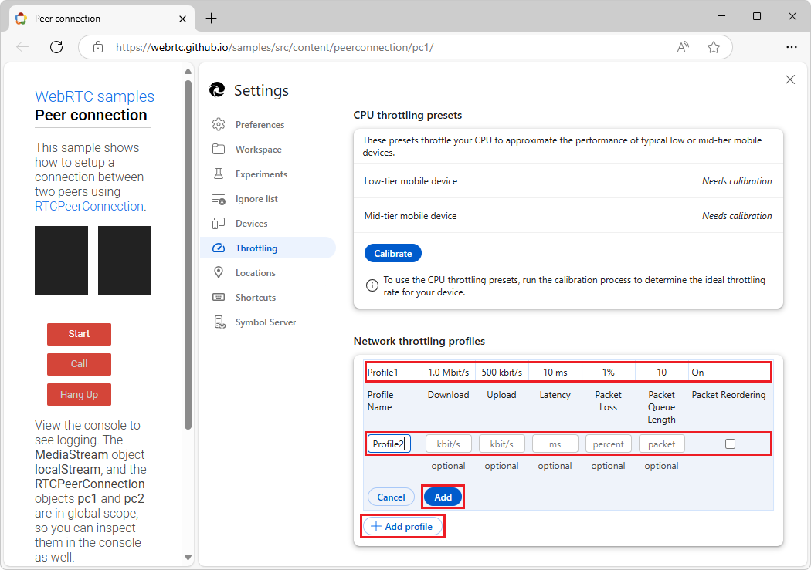
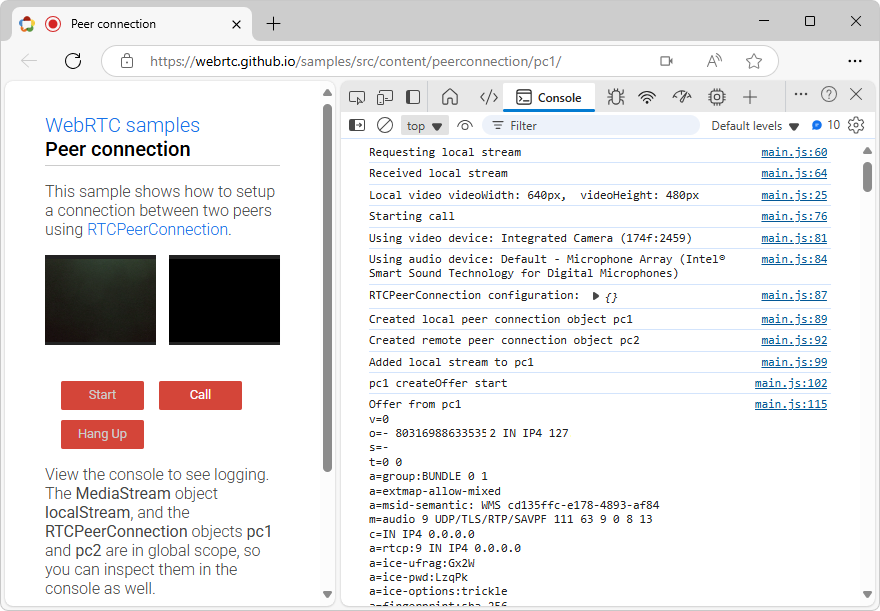

<!-- Copyright Sofia Emelianova

   Licensed under the Apache License, Version 2.0 (the "License");
   you may not use this file except in compliance with the License.
   You may obtain a copy of the License at

       https://www.apache.org/licenses/LICENSE-2.0

   Unless required by applicable law or agreed to in writing, software
   distributed under the License is distributed on an "AS IS" BASIS,
   WITHOUT WARRANTIES OR CONDITIONS OF ANY KIND, either express or implied.
   See the License for the specific language governing permissions and
   limitations under the License.  -->
# Throttling
<!-- https://developer.chrome.com/docs/devtools/settings/throttling -->

In the **Throttling** page of **Customize and control DevTools** () > **Settings**, you can:

* Calibrate CPU throttling presets to approximate the typical performance of low- and mid-tier mobile devices.

* Set up custom throttling profiles.  You can use your custom throttling profiles to test custom connection speeds in the **Network** tool, per [Create custom throttling profiles](../network/reference.md#create-custom-throttling-profiles) in _Network features reference_.

<!-- ====================================================================== -->
## Calibrate CPU throttling presets
<!-- https://developer.chrome.com/docs/devtools/settings/throttling#cpu-throttling -->

To calibrate CPU throttling presets:

1. Go to a webpage, such as the [Peer connection](https://webrtc.github.io/samples/src/content/peerconnection/pc1/) WebRTC sample.

1. Right-click the webpage and then select **Inspect**.

   DevTools opens.

1. In DevTools, click the **Customize and control DevTools** () button, and then select **Settings** ().

   The DevTools **Settings** page opens.

1. On the left, select the **Throttling** settings page.

1. In the **CPU throttling presets** section, click the **Calibrate** button, and then click the **Continue** button.

   After about 5 seconds, DevTools navigates away from the current webpage and then reloads it.

   The **Throttling** tab shows the CPU throttling rates that you can apply to your device to get an idea of how your page performs on low- and mid-tier mobile devices:

   

1. In DevTools **Settings**, click the **Close** (X) button.

1. In DevTools, open the **Performance** tool.

1. In the **Environment settings** section, select the **CPU** dropdown menu.

   Or, select the **Capture settings** () button, and then select the **CPU** dropdown menu.

   The calibrated factors are displayed next to the **Low-tier mobile** and **Mid-tier mobile** menuitems:

   

<!-- ====================================================================== -->
## Set up custom network throttling profile
<!-- https://developer.chrome.com/docs/devtools/settings/throttling#network-throttling -->

To add a custom network throttling profile:

1. Go to a webpage, such as the [Peer connection](https://webrtc.github.io/samples/src/content/peerconnection/pc1/) WebRTC sample.

1. Right-click the webpage and then select **Inspect**.

   DevTools opens.

1. In DevTools, click the **Customize and control DevTools** () button, and then select **Settings** ().

   The DevTools **Settings** page opens.

1. On the left, select the **Throttling** settings page.

1. In the **Network throttling profiles** section, click the **Add profile** button.

1. Specify the following optional parameter values for the new entry:

   

   * **Profile Name**.
   * **Download** and **Upload** speeds in Kbps.
   * **Latency** in milliseconds.

   Packet-related parameters:
   * **Packet Loss** in percent.
   * **Packet Queue Length** as a number.
   * **Packet Reordering** flag, on or off.

   With packet-related parameters, you can throttle [WebRTC](https://webrtc.org) applications without using third-party software.  You can try these parameters in the [Peer connection](https://webrtc.github.io/samples/src/content/peerconnection/pc1/) WebRTC sample:

   <!-- cleaned strings -->

1. Click **Add** to save the new profile.  You can now select the custom profile from the **Throttling** dropdown menu in the **Network** tool.

To edit or remove an existing profile, click the **Edit** (pencil) or **Delete** (wastebasket) buttons that appear on hover.

<!-- ====================================================================== -->
> [!NOTE]
> Portions of this page are modifications based on work created and [shared by Google](https://developers.google.com/terms/site-policies) and used according to terms described in the [Creative Commons Attribution 4.0 International License](https://creativecommons.org/licenses/by/4.0).
> The original page is found [here](https://developer.chrome.com/docs/devtools/settings/throttling) and is authored by Sofia Emelianova.

This work is licensed under a [Creative Commons Attribution 4.0 International License](https://creativecommons.org/licenses/by/4.0).
