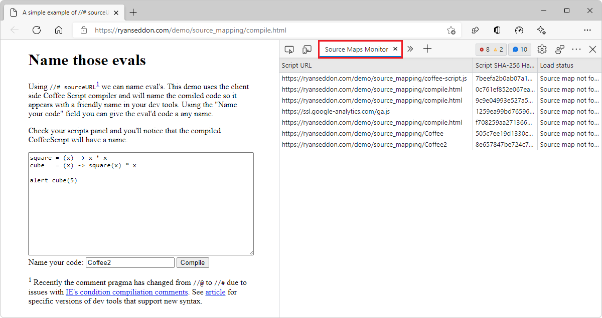

# Source Maps Monitor tool

Use the **Source Maps Monitor** tool to monitor which source files on your webpage requested loading of source maps, and whether the source maps were loaded.  This tool is useful if your webpage uses source maps to map your reprocessed code to your original source code.  _Source mapping_ enables you to see and debug your original source code, rather than having to work with the reprocessed version of your code that's returned by the server.

To try this feature:

1. In a new tab or window, follow the instructions in [Map the processed code to your original source code, for debugging](../javascript/source-maps.md), and then continue below.

1. Close the popup dialog that the demo opens.

1. In the **Sources** tool, in the **Page** tab, select the file that the demo created for you, such as **Coffee2.js**.

1. In DevTools, on the main toolbar, click the **More Tools** () button, and then select the **Source Maps Monitor** tool.

   

<!-- ====================================================================== -->
## Exclusions and inclusions

The **Source Maps Monitor** tool shows which URL lookups have or haven't been attempted.  For example:

1. In DevTools **Settings > Symbol Server**, in the **Authorization mode** dropdown list, select **Azure Active Directory**.

1. Double-click the **microsoft** org to select it.

1. In the **Filter behavior** dropdown list, select **Exclusion List**.

1. In the **Filter behavior** text box, enter a domain with wildcard (`https://ryanseddon.com/*`) to exclude.

1. Close DevTools **Settings**.

As a result, the **Source Maps Monitor** tool indicates excluded source map URL lookup attempts:

See also:
* [Improvements for connecting DevTools to Azure Artifacts symbol server](https://learn.microsoft.com/en-us/microsoft-edge/devtools-guide-chromium/whats-new/2023/07/devtools-115#improvements-for-connecting-devtools-to-azure-artifacts-symbol-server) in _What's New in DevTools (Microsoft Edge 115)_.

<!-- ====================================================================== -->
## See also

* [Map the processed code to your original source code, for debugging](../javascript/source-maps.md)
* [Securely debug original code by publishing source maps to the Azure Artifacts symbol server](../javascript/publish-source-maps-to-azure.md)
* [Securely debug original code by using Azure Artifacts symbol server source maps](../javascript/consume-source-maps-from-azure.md)
* [Sources tool now notifies you when sourcemaps can't be loaded](../whats-new/2021/11/devtools.md#sources-tool-now-notifies-you-when-sourcemaps-cant-be-loaded) in _What's new in DevTools (Microsoft Edge 96)_.
