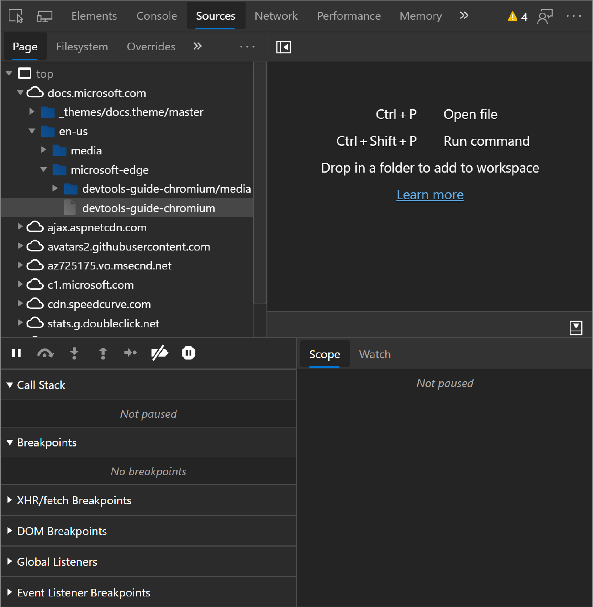
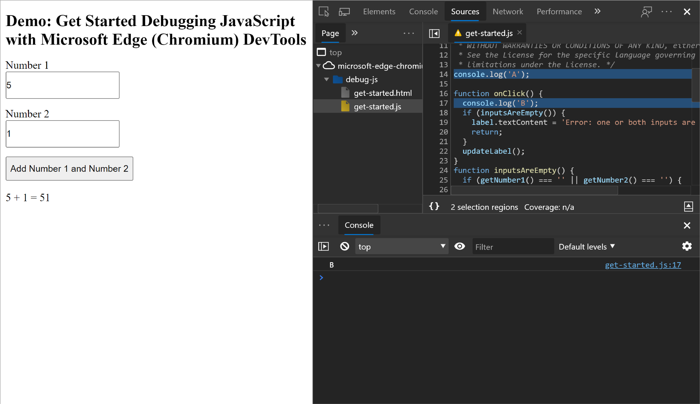
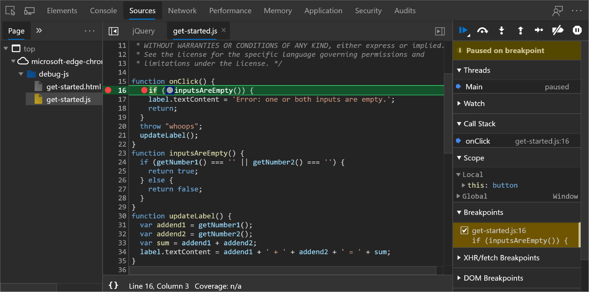

<!-- Copyright 05/29/2019 Kayce Basques 

   Licensed under the Apache License, Version 2.0 (the "License");
   you may not use this file except in compliance with the License.
   You may obtain a copy of the License at

       http://www.apache.org/licenses/LICENSE-2.0

   Unless required by applicable law or agreed to in writing, software
   distributed under the License is distributed on an "AS IS" BASIS,
   WITHOUT WARRANTIES OR CONDITIONS OF ANY KIND, either express or implied.
   See the License for the specific language governing permissions and
   limitations under the License. -->


# Sources Panel Overview 


Use the Microsoft Edge DevTools **Sources** panel to:

*   [View files](#view-files).  
*   [Edit CSS and JavaScript](#edit-css-and-javascript).  
*   [Create and save **Snippets** of JavaScript](#create-save-and-run-snippets), which you can run on any page.  **Snippets** are similar to bookmarklets.  
*   [Debug JavaScript](#debug-javascript).  
*   [Set up a Workspace](#set-up-a-workspace), so that changes you make in DevTools get saved to the code on
  your file system.  

## View files 

Use the **Page** pane to view all of the resources that the page has loaded.

<!--<figure>
  
  <figcaption>
    <b>Figure 1</b>. The <b>Page</b> pane
  </figcaption>
</figure>-->

> ##### Figure 1  
> The **Page** pane  
> ![Figure 1. The Page pane][ImageSourcesPagePane]  

How the **Page** pane is organized:  
*   The top-level, such as `top` in [**Figure 1**](#figure-1), represents an [HTML frame][HTML$Frames].  You'll find `top` on every page that you visit. `top` represents the main document frame.  
*   The second-level, such as `docs.microsoft.com` in [**Figure 1**](#figure-1), represents an [origin][HTMLOrigin].  
*   The third-level, fourth-level, and so on, represent directories and resources that were loaded from that origin.  For example, in [**Figure 1**](#figure-1) the full path to the resource `devtools-guide-chromium` is `docs.microsoft.com/en-us/microsoft-edge/devtools-guide-chromium`  

[HTML4Frames]: https://www.w3.org/TR/html401/present/frames.html  
[HTMLOrigin]: https://html.spec.whatwg.org/multipage/origin.html#origin  

Click a file in the **Page** pane to view its contents in the **Editor** pane.  You can view any type of file. For images, you see a preview of the image.  

<!--<figure>
  
  <figcaption>
    <b>Figure 2</b>. Viewing the contents of <code>6fc26531.index-docs.js</code> in the <b>Editor</b>
    pane
  </figcaption>
</figure>-->

> ##### Figure 2  
> Viewing the contents of `6fc26531.index-docs.js` in the **Editor** pane  
> ![Figure 2. Viewing the contents of 6fc26531.index-docs.js in the Editor pane][ImageSourcesEditorPane]  

## Edit CSS and JavaScript 

Use the **Editor** pane to edit CSS and JavaScript.  DevTools updates the page to run your new code. For example, if you edit the `text-subtle` of an element, you'll see that change take effect immediately.

<!--<figure>
  
  <figcaption>
    <b>Figure 3</b>. Editing CSS in the <b>Editor</b> pane to change the text color of the subtitle to red
  </figcaption>
</figure>-->

> ##### Figure 3  
> Editing CSS in the **Editor** pane to change the text color of the subtitle to red  
> ![Figure 3. Editing CSS in the Editor pane to change the text color of the subtitle to red][ImageEditCSS]  

CSS changes take effect immediately, no save needed. For JavaScript changes to take effect, press`Control`+`S` \(Windows\) or `Command`+`S` \(macOS\).  
DevTools doesn't re-run a script, so the only JavaScript changes that take effect are those that you make inside of functions.  <!--For example, in [**Figure 4**](#figure-4) note how `console.log('A')` doesn't run, whereas `console.log('B')` does. If DevTools re-ran the entire script after making the change, then the text `A` would have been logged to the **Console**. -->  

<!-- TODO: Link "example" when a good section exists. -->

<!--<figure>
  
  <figcaption>
    <b>Figure 4</b>. Editing JavaScript in the <b>Editor</b> pane
  </figcaption>
</figure>-->

> ##### Figure 4  
> Editing JavaScript in the **Editor** pane  
> ![Figure 4. Editing JavaScript in the Editor pane][ImageEditJS]  

DevTools erases your CSS and JavaScript changes when you reload the page. See [Set up a Workspace](#set-up-a-workspace) to learn how to save the changes to your file system.  

## Create, save, and run Snippets 

Snippets are scripts which you can run on any page. Imagine that you repeatedly type out the following code in the **Console**, in order to insert the jQuery library into a page, so that you can run jQuery commands from the **Console**:  

```javascript
let script = document.createElement('script');
script.src = 'https://code.jquery.com/jquery-3.2.1.min.js';
script.crossOrigin = 'anonymous';
script.integrity = 'sha256-hwg4gsxgFZhOsEEamdOYGBf13FyQuiTwlAQgxVSNgt4=';
document.head.appendChild(script);
```  

Instead, you can save this code in a **Snippet** and run it with a couple of button clicks, any time you need it. DevTools saves the **Snippet** to your file system.  

<!--<figure>
  
  <figcaption>
    <b>Figure 5</b>. A <b>Snippet</b> that inserts the jQuery library into a page
  </figcaption>
</figure>-->

> ##### Figure 5  
> A **Snippet** that inserts the jQuery library into a page  
> ![Figure 5. A Snippet that inserts the jQuery library into a page][ImageSnippet]  

To run a **Snippet**:

*   Open the file via the **Snippets** pane, and click **Run** ![The Run button][ImageRun].  
*   Open the **Command Menu**, delete the `>` character, type `!`, type the name of your **Snippet**, then press `Enter`.  

<!-- See [Run Snippets Of Code From Any Page][Snippet] to learn more.-->

<!--[Snippet]: /microsoft-edge/devtools-guide-chromium/snippets
[UICommandMenu]: /microsoft-edge/devtools-guide-chromium/ui#command-menu  -->

<!-- TODO: Link UI "Command Menu" when a good section exists. -->
<!-- TODO: Link "Snippets" when a good section exists. -->

## Debug JavaScript 

Rather than using `console.log()` to infer where your JavaScript is going wrong, consider using the Microsoft Edge DevTools debugging tools, instead. The general idea is to set a breakpoint, which is an intentional stopping place in your code, and then step through your code's execution, one line at a time. As you step through the code, you can view and change the values of all currently-defined properties and variables, run JavaScript in the **Console**, and more.

<!-- See [Get Started With Debugging JavaScript](/microsoft-edge/devtools-guide-chromium/javascript) to learn the
basics of debugging in DevTools.  -->

<!--<figure>
  
  <figcaption>
    <b>Figure 6</b>. Debugging JavaScript
  </figcaption>
</figure> -->

> ##### Figure 6  
> Debugging JavaScript  
> ![Figure 6. Debugging JavaScript][ImageDebugging]  

<!-- TODO: Link JavaScript "Get Started With Debugging JavaScript" when a good section exists. -->

## Set up a Workspace 

By default, when you edit a file in the **Sources** panel, those changes are lost when you reload the page.  **Workspaces** enable you to save the changes that you make in DevTools to your file system.  Essentially, this lets you use DevTools as your code editor.

<!-- See [Edit Files With Workspaces][Workspaces] to get started.

[Workspaces]: /microsoft-edge/devtools-guide-chromium/workspaces/ -->

<!-- TODO: Link "Snippets" when a good section exists. -->
<!-- TODO: Link Workspaces "Edit Files With Workspaces when a good section exists. -->

 


[ImageDebugging]: images/debugging.msft.png "Debugging JavaScript"  
[ImageEditCSS]: images/edit-css.msft.png "Editing CSS in the Editor pane to change the text color of the subtitle to red"  
[ImageEditJS]: images/edit-js.msft.png "Editing JavaScript in the Editor pane"  
[ImageRun]: images/run-snippet.msft.png  
[ImageSnippet]: images/snippet.msft.png "A Snippet that inserts the jQuery library into a page"  
[ImageSourcesEditorPane]: images/sources-editor-pane.msft.png "Viewing the contents of 6fc26531.index-docs.js in the Editor pane"  
[ImageSourcesPagePane]: images/sources-page-pane.msft.png "The Page pane"  

> [!NOTE]
> Portions of this page are modifications based on work created and [shared by Google][GoogleSitePolicies] and used according to terms described in the [Creative Commons Attribution 4.0 International License][CCA4IL].  
> The original page is found [here](https://developers.google.com/web/tools/chrome-devtools/sources) and is authored by [Kayce Basques][KayceBasques] \(Technical Writer, Chrome DevTools & Lighthouse\).  

[![Creative Commons License][CCby4Image]][CCA4IL]  
This work is licensed under a [Creative Commons Attribution 4.0 International License][CCA4IL].  

[CCA4IL]: http://creativecommons.org/licenses/by/4.0  
[CCby4Image]: https://i.creativecommons.org/l/by/4.0/88x31.png  
[GoogleSitePolicies]: https://developers.google.com/terms/site-policies  
[KayceBasques]: https://developers.google.com/web/resources/contributors/kaycebasques  
