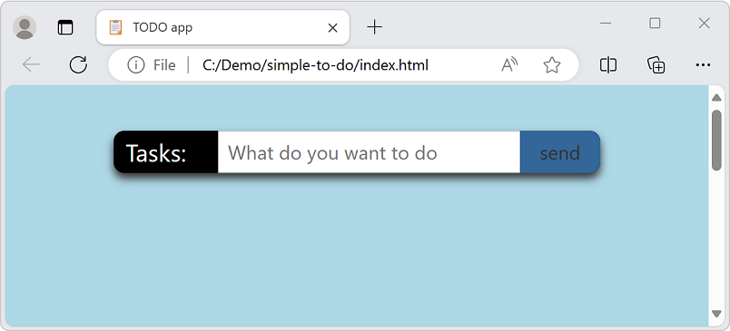
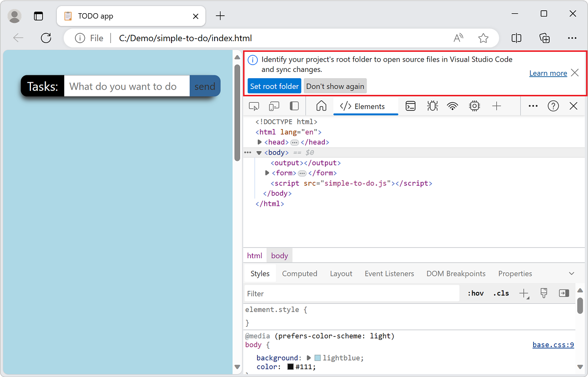
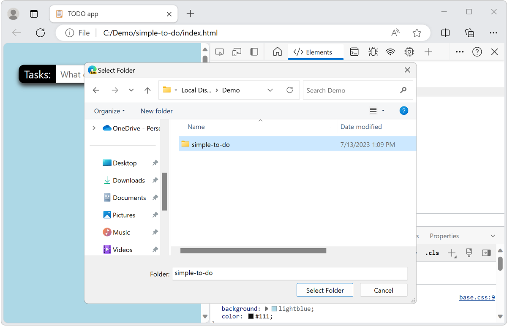
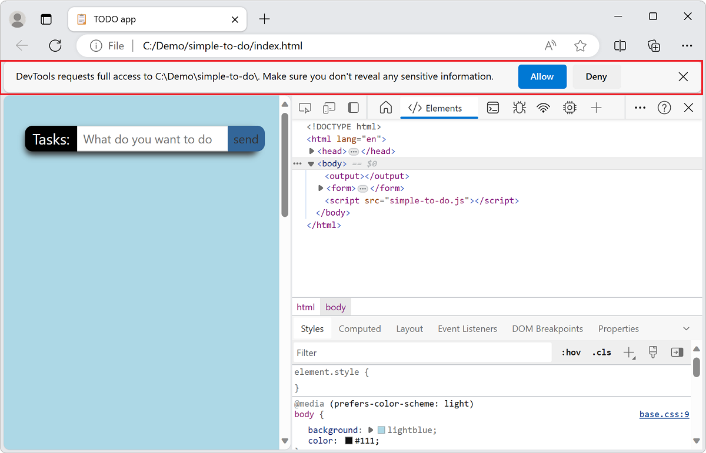
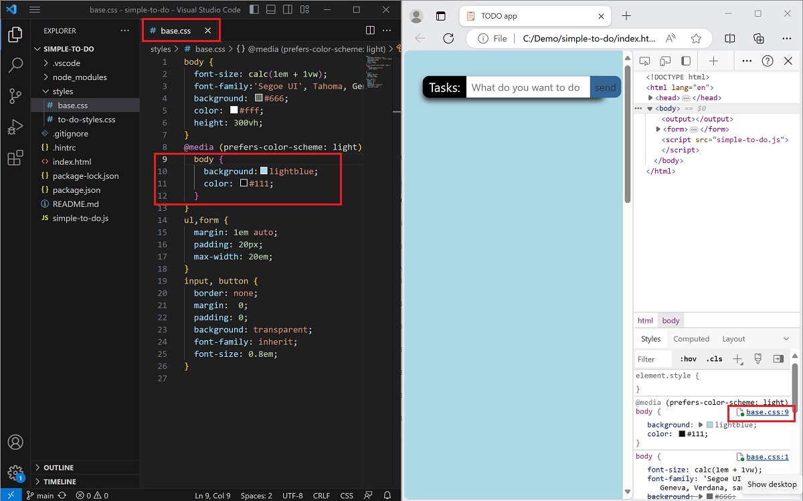
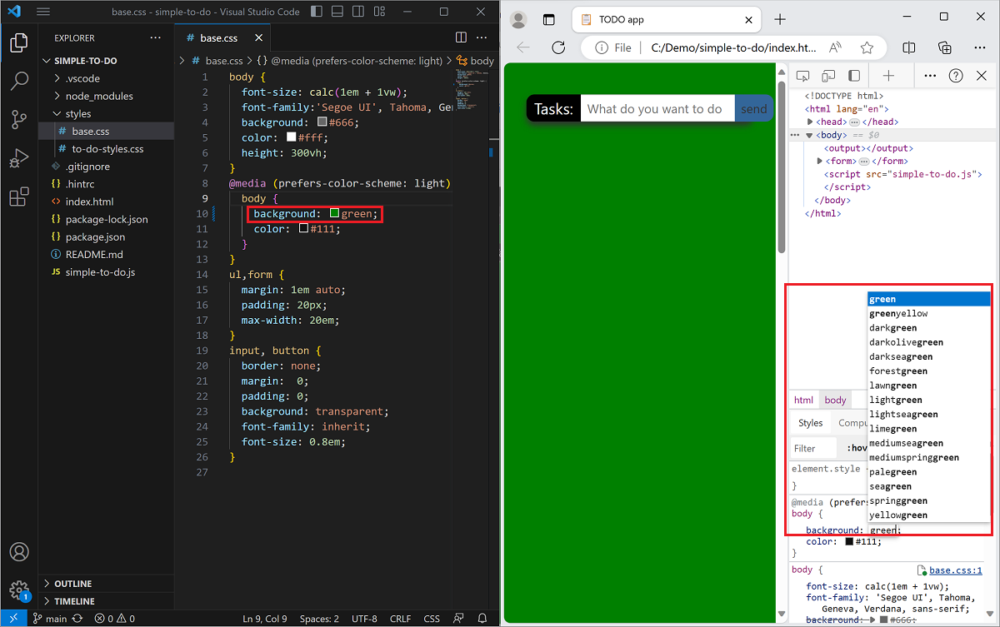
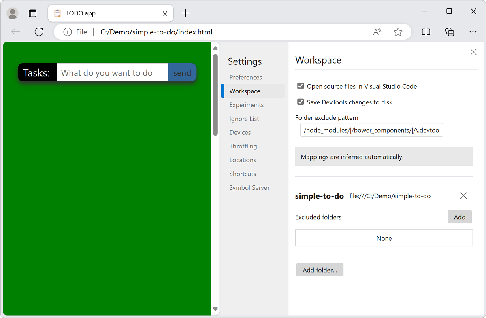

# Opening source files in Visual Studio Code

The **Open source files in Visual Studio Code** experiment allows you to use Microsoft Edge DevTools, but then edit your files in Visual Studio Code instead of in the code editor of the DevTools **Sources** tool.

When you use this experiment, if you use Visual Studio Code and you use DevTools to change your CSS rules, you no longer have to use the code editor in the Sources tool of DevTools.  You can simply use the code editor in Visual Studio Code.  When you turn on this experiment,
local files will get a different treatment.<!--TODO: be specific-->

<!-- ====================================================================== -->
## Setting up editing local files in Visual Studio Code

First, select DevTools > **Settings** > **Experiments** > **Open source files in Visual Studio Code**, and then re-start DevTools.

With this experiment enabled, suppose that in Microsoft Edge, you go to a local server (such as `http://localhost` or `http://127.0.0.1`), or open a local file.

<!-- todo:
instead of using 
https://github.com/codepo8/simple-to-do
use:
https://github.com/MicrosoftEdge/Demos/tree/main/demo-to-do
Rewrite article as numbered action steps -> results.
-->

When you open DevTools, you are prompted to identify your root folder.  You can opt out by selecting **Close** (`x`) or selecting the `Don't show again` button.  You can get more information by selecting the `Learn more` link.

If you select the **Set root folder** button, the operating system prompts you to navigate to the folder and select it.

After you select a root folder, you need to grant DevTools full access to the folder.  Above the toolbar, a prompt with **Allow** or **Deny** buttons asks you whether to grant permission to DevTools to access the folder.

After you grant permission, the folder you select is added as a Workspace in DevTools, in the **Filesystem** tab of the **Sources** tool.  This means that any file you edit in DevTools now opens in Microsoft Visual Studio Code instead of in the Sources tool. As an indicator, we show a `linked` icon next to the file name.  In this example, we'll select the `base.css` link in the **Styles** tool.

DevTools opens an instance of Visual Studio Code and shows all the files in the root folder.  DevTools also opens the file you've selected, scrolled to the correct line of the CSS selector.

Any changes that you make to the file in DevTools will now be synced to Visual Studio Code.  For example, if you change the `background` to be `green` for the styles of the body, the same CSS rule will automatically be added to the `base.css` file in the code editor of Visual Studio Code.

<!-- ====================================================================== -->
## Changing the workspace settings

To change the behavior of the **Open source files in Visual Studio Code** experiment, go to the DevTools **Settings** page by clicking **Settings** (the gear icon) or pressing **Shift+?**, and then select the **Workspace** page:

The **Settings** > **Workspace** page lists your workspaces, along with the following configuration options:

| UI control | Description |
|---|---|
| **Open source files in Visual Studio Code** checkbox | Sets whether to open source files in Visual Studio Code. |
| **Save DevTools changes to disk** checkbox | Automatically saves DevTools changes to disk. |
| **Folder exclude pattern** text box | Automatically excludes folders from a workspace folder. |
| **Add** button next to **Excluded folders** | Excludes a folder from a specific workspace. |
| **Add folder** button | Adds an additional workspace. |
