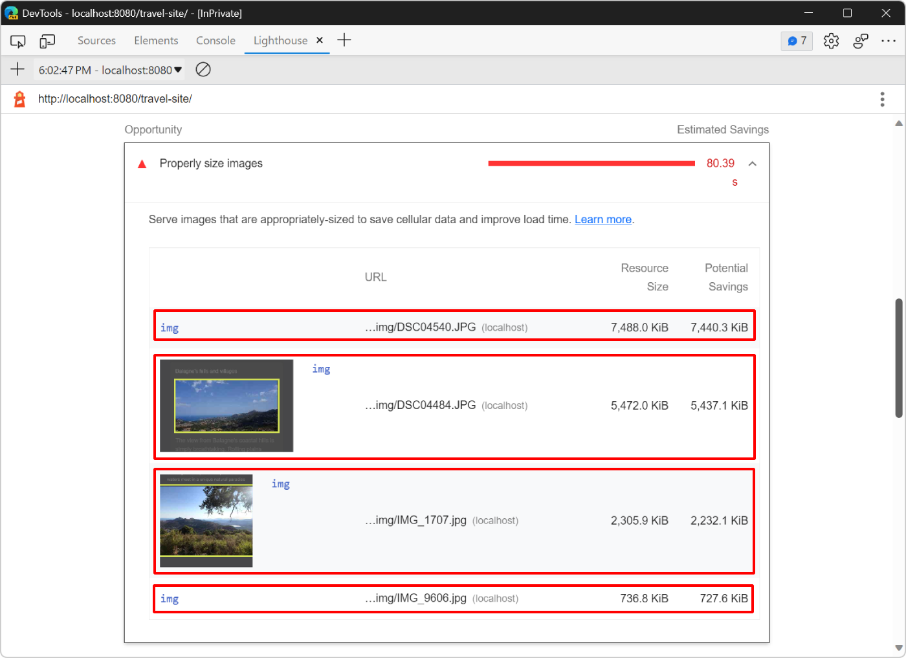
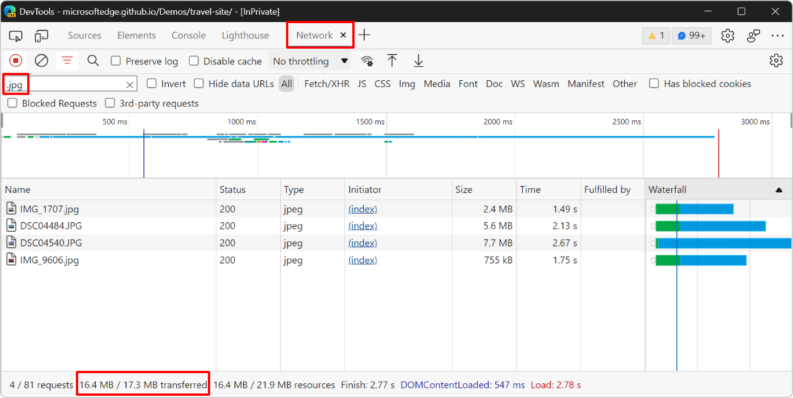
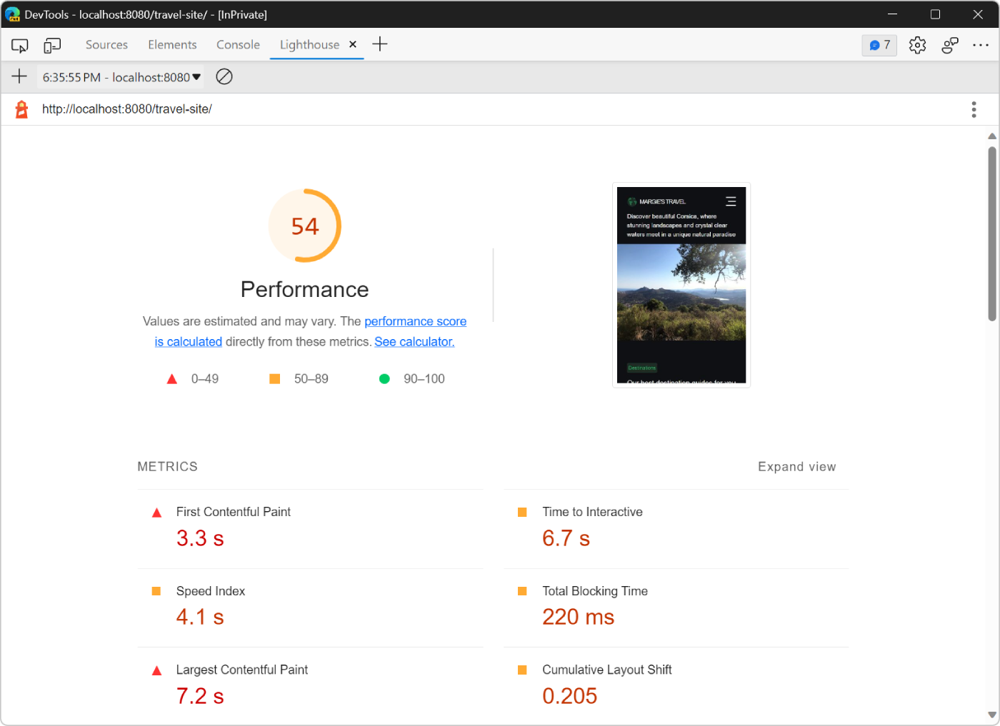
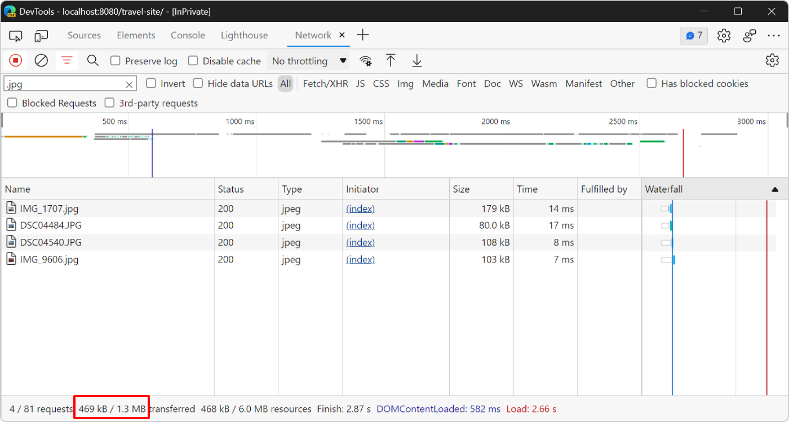
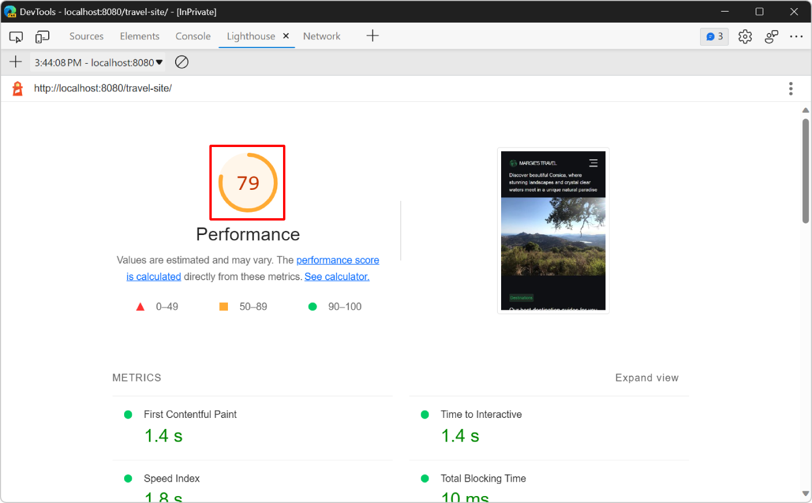
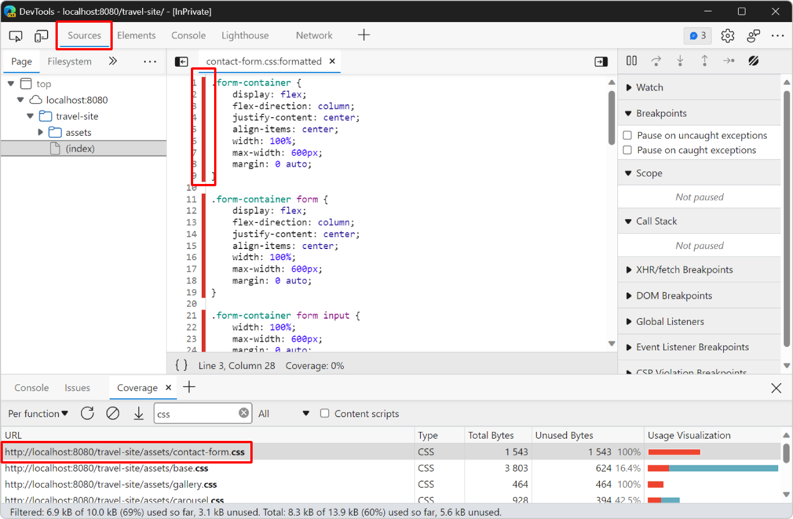

<!-- Copyright Kayce Basques

   Licensed under the Apache License, Version 2.0 (the "License");
   you may not use this file except in compliance with the License.
   You may obtain a copy of the License at

       https://www.apache.org/licenses/LICENSE-2.0

   Unless required by applicable law or agreed to in writing, software
   distributed under the License is distributed on an "AS IS" BASIS,
   WITHOUT WARRANTIES OR CONDITIONS OF ANY KIND, either express or implied.
   See the License for the specific language governing permissions and
   limitations under the License.  -->
# Optimize website speed using Lighthouse

This tutorial teaches you how to use Lighthouse, and other tools, in DevTools to find ways to make your websites load faster.

Note that the **Lighthouse** tool provides links to content hosted on third-party websites.  Microsoft is not responsible for and has no control over the content of these sites and any data that may be collected.


<!-- ====================================================================== -->
## Prerequisites

*  You should have basic web development experience, similar to what is taught in this [Introduction to Web Development class](https://www.coursera.org/learn/web-development#syllabus).

* Install [Visual Studio Code](https://code.visualstudio.com) to edit source code.

* Install [Node.js](https://nodejs.org) to use it as a local web server.

*  You don't need to know anything about load performance.  You learn about load performance in this tutorial.


<!-- ====================================================================== -->
## Introduction

In this tutorial, you will improve the performance of [Margie's travel](https://microsoftedge.github.io/Demos/travel-site/), a fictitious travel website that contains travel images, text descriptions, a few JavaScript-based user interactions, and an interactive map.

The source files for the website are at [MicrosoftEdge / Demos > travel-site](https://github.com/MicrosoftEdge/Demos/tree/main/travel-site). 


<!-- ====================================================================== -->
## Step 1: Setup the website locally

First, set up the website locally so that you can make changes to it later:

1. Get the website's source code locally: [Download or clone the Demos repo](../sample-code/sample-code.md#download-or-clone-the-demos-repo).

1. Open the folder you just downloaded or cloned in Visual Studio Code.

1. In Visual Studio Code, click **View** > **Terminal** or press `Ctrl` + `` ` ``.

   Visual Studio Code displays the source files in the **Explorer** sidebar, and the **Terminal**:

   

1. In the terminal, type `npx http-server` to start a local web server.

1. In Microsoft Edge, go to http://localhost:8080/travel-site to open the website:

   


<!-- ====================================================================== -->
## Step 2: Audit the site

Whenever you set out to improve the load performance of a site, always start with an audit.

The audit has two important functions:

*  It creates a **baseline** for you to measure subsequent changes against.

*  It gives you **actionable tips** on what changes have the most impact.

#### Establish a baseline

The baseline is a record of how the site performed before you made any performance improvements.

1. In Microsoft Edge, open DevTools by pressing `F12` or `Ctrl`+`Shift`+`I` (Windows, Linux) or `Command`+`Option`+`I` (macOS).

1. Open the **Lighthouse** tool.  It might be hidden behind the **More tools** () button.

   

   <!--todo: add link to Lighthouse when section is available  -->
   <!-- /web/tools/lighthouse  -->

1. Only keep the **Performance** category selected and clear all other categories. And keep all other options set by default. Here is an explanation of the different options:

   *  **Mode**: set to **Navigation (default)** to run tests when the webpage loads, set to **Timespan** to run tests during a given period of time, or set to **Snapshot** to run tests on the webpage as it appears now.

   *  **Device**: set to **Mobile** to simulate a mobile user agent string and a mobile viewport, or set to **Desktop** to test the webpage without any simulation.

   *  **Categories**: allows to only run a subset of the tests available in **Lighthouse**.

1. Click **Analyze page load**.  After 10 to 30 seconds, a report of the performance of the site is displayed:

   

#### Handling report errors

If you ever get an error in your **Lighthouse** report, try running the tool again from an **InPrivate** window with no other tabs open.  This ensures that you are running Microsoft Edge from a clean state.  Microsoft Edge Extensions in particular often interfere with the auditing process.


To open an **InPrivate** window:

1. Click the **Settings and more** (**...**) button in the top toolbar of Microsoft Edge.

1. Click **New InPrivate window**.

1. Establish a new baseline in **Lighthouse**:

   

#### Understand your report

###### Overall performance score

The number at the top of your report is the overall performance score for the webpage.  Later, as you make changes to the code, the number displayed should rise.  A higher score means better performance.


###### Metrics

The **Metrics** section provides quantitative measurements of the performance of the webpage.  Each metric provides insight into a different aspect of the performance.  For example, **First Contentful Paint** tells you when content is first painted to the screen, which is an important milestone in the user's perception of the page load, whereas **Time To Interactive** marks the point at which the page appears ready enough to handle user interactions.


Click **Expand view** to display a description for each metric.  Then click **Learn More** to read documentation about it.


###### Screenshots

Below the **Metrics** section is a collection of screenshots that show you how the page looked as it loaded.


###### Opportunities

The **Opportunities** section provides specific tips on how to improve the load performance of this specific webpage:


Click an opportunity to display more information about it, and then click **Learn more** to read documentation about why an opportunity is important, and specific recommendations on how to fix it:


###### Diagnostics

The **Diagnostics** section provides more information about factors that contribute to the load time of the page:


###### Passed audits

The **Passed audits** section shows you what the site is doing correctly.  Click **Show** to expand the section:


<!-- ====================================================================== -->
## Step 3: Experiment

The **Opportunities** section of your report gives you tips on how to improve the performance of the webpage.  In this section, you implement the recommended changes to the codebase, auditing the site again after each change to measure how it affects site speed.

#### Resize images

Your report indicates that serving appropriately sized images is one of the top opportunities for improving the performance of the page.  Resizing images helps reduce the size of the network payload.  If your user is viewing your images on a mobile device screen that is 500-pixels-wide, there is really no point in sending a 1500-pixel-wide image.  Ideally, you send a 500-pixel-wide image, at most.

In the **Opportunities** section of your report, click **Properly size images** to display which images should be resized. **Lighthouse** lists four `.png` files which can be resized to improve load time:



Before resizing these images, verify the amount of data the server must send to the browser for these images to be displayed:

1. Open the **Network** tool.

    If the tool is empty, refresh the page.

1. In the **Filter** text box, type `.jpg` to filter the list of requests and only show the four images.

    To learn more about filtering requests in the **Network** tool, see [Filter requests](../network/reference.md#filter-requests) in _Network features reference_.

1. Check the **Network** tool bottom toolbar to verify the amount of data transferred because of the images:

    

    The bottom toolbar shows that the four images contribute 16.4MB of the total 17.3MB of data transferred for this webpage.

Next, resize the images and run a new audit:

1. In Visual Studio Code, open the `/travel-site/assets/img/` folder in the **Explorer**, which contains all the images displayed on the webpage. Click one of the image files to open a preview and verify its dimensions in the status bar:

    

    The selected image is 4032 pixels wide, but the webpage's layout only displays it at 900 pixels or less.

1. Resize all images to 1000 pixels wide. Resizing images depends on your operating system. For example, to resize images on Windows, you can use **PowerToys**. To learn more, see [Image Resized utility](/windows/powertoys/image-resizer).

1. In **Lighthouse**, click **Run an audit** () to go back to the main **Lighthouse** page without losing your baseline report.

1. Click **Analyze page load** again to see how the change affects load performance:

    

The change has an important effect on the overall performance score. To verify how much data was saved, use the **Network** tool like you did before:



Now, only 469KB of data needs to be transferred for the images to appear on the webpage.

###### Automatically resize images

For a small app, doing a one-off resize like this might be good enough.  But for a large app, this isn't scalable.  Here are some strategies for managing images in large apps:

*  Resize images during your build process.

*  Create multiple sizes of each image during the build process and then use `srcset` in your code.  At runtime, the browser takes care of choosing which size is best for the device.  <!-- See [Responsive images](https://web.dev/responsive-images/). -->

*  Use an image CDN that lets you dynamically resize an image when you request it.

*  At the very least, optimize each image.  This can often create huge savings.

Optimization is when you run an image through a special program that reduces the size of the image file.  For more tips, see [Essential Image Optimization](https://images.guide).

#### Reduce unused JavaScript

Your latest **Lighthouse** report says that the webpage contains unused JavaScript code and that loading this code only when required would decrease the amount of data transferred when the page loads.

Click **Reduce unused JavaScript** to reveal the JavaScript files that contain the most unused code:


The reported JavaScript files are from the `www.bing.com` domain which means the unused code comes from the Bing Map component used on the webpage. Scroll down on the Margie's travel demo website to see the map:


To confirm the amount of unused code and possibly find other resources that are unused, use the **Coverage** tool:

1. In DevTools, press `Ctrl`+`Shift`+`P` (Windows, Linux) or `Command`+`Shift`+`P` (macOS) to open the Command Menu, start typing `Coverage`, and then select **Show Coverage** in the list.

    

1. In the **Coverage** tool, click **Start instrumenting coverage and refresh the page** (). The **Coverage** tool provides an overview of how much of the JavaScript and CSS code loaded on the page is actually used.

    

The coverage report confirms that the Bing Map dependencies contain code that's unused when the page loads. The map on the demo website is not visible when the page first loads so it is a good opportunity to not load the Bing Map files until the map is visible to the user.

To do this, you will use the Intersection Observer API which provides a way to observe changes in the intersection of a target element with the webpage's viewport. To learn more, see [Intersection Observer API](https://developer.mozilla.org/docs/Web/API/Intersection_Observer_API) at MDN.

1. In Visual Studio Code, open the `travel-site/index.html` file and scroll down to the bottom of the file. The Bing Map API is loaded by using a `<script>` tag:

    

    Below this line is another line that's responsible for configuring and loading the map in the right place: `<script src="assets/map.js"></script>`

1. Delete these two lines (183, and 184), and add this new line instead: `<script src="assets/map-on-demand.js"></script>`.

    

1. Open the `/travel-site/assets/map-on-demand.js` file in Visual Studio Code and read through the code to understand how the Bing Map component is now loaded and initialized. Below is snippet from the code and it description:

    ```javascript
    const MAP_CONTAINER_EL = document.querySelector('.place-discover-map');

    const mapElIntersectionObserver = new IntersectionObserver(loadMapOnDemand);
    mapElIntersectionObserver.observe(MAP_CONTAINER_EL);
 
    let map = null;
   
    function loadMapOnDemand(entries) {
       if (map) {
         return;
       }
   
       if (!entries.some(entry => entry.isIntersecting)) {
         return;
       }
   
       const script = document.createElement('script');
       script.type = 'text/javascript';
       script.src = 'https://www.bing.com/api/maps/mapcontrol?callback=GetMap&key=Ap_eazGgpq5468v9MXr7Wu0zh30LQActgaT-tI_QxZQSm-Bd5qJxVKs_2B7NsqR4';
       document.body.appendChild(script);
    }

    function GetMap() { /* ... */ }
    ```

    The code initializes the `mapElIntersectionObserver` variable to a new IntersectionObserver object. This observer is then set to observe the `MAP_CONTAINER_EL` element which is the element on the page that's meant to contain the map.

    As the user scrolls, the observer's `loadMapOnDemand` callback function is executed. This function returns immediately if the map has already been initialized, or if the map container element does not intersect the current viewport.

    If the user scrolls to a point where the map container element becomes visible in the viewport, and if the map has not been initialized yet, a new `script` element is created and inserted into the page. The script's `src` attribute is set to load the Bing Map API.

    The rest of the `map-on-demand.js` file is the same as the `map.js` file. As soon as the Bing Map API is loaded, the `GetMap` function is called and the map is configured and displayed in the container element.

1. Save your changes in Visual Studio Code, then refresh the webpage in Microsoft Edge, and run a new audit in the **Lighthouse** tool to see how your changes affect the load performance:

    

    By resizing big images and removing unused JavaScript, your **Lighthouse** score went from 47 to 79.

#### Eliminate render-blocking resources

The next opportunity displayed in the **Opportunities** section of the **Lighthouse** tool is related to eliminating render-blocking resources.

A render-blocking resource is an external JavaScript or CSS file that the browser must download, parse, and run before it displays the page. The more render-resources need to be processed when a webpage loads, the longer it will take for this webpage to start appearing in the browser. The goal is, therefore, to only run the core CSS and JavaScript code that is required to display the initial state of the page properly.

The first task, then, is to find code that you don't need to run on page load.

1. Click **Eliminate render-blocking resources** to display the resources that are blocking:

   

    **Lighthouse** displays a list of the stylesheets that the demo webpage uses, such as: `base.css`, `home.css`, `map.css`, and `carousel.css`.

1. Open the **Coverage** tool again: press `Ctrl`+`Shift`+`P` (Windows, Linux) or `Command`+`Shift`+`P` (macOS), type `Coverage`, and then select **Show Coverage**.

1. Click **Start instrumenting coverage and refresh the page** () to display the coverage report, and then type `css` in the **URL filter** field to only display the CSS files:

   

    The report shows that the `contact-form.css` and `gallery.css` files are not used at all. They both have 100% of unused bytes.

1. Click the `contact-form.css` file in the report.  DevTools opens the file in the **Sources** tool.  If a line of code ran, a blue bar appears next to it.  A red bar means the line of code was not run, and is definitely not needed on load of the webpage.

   

   Only red bars are displayed in this source file, which means that none of its lines of code are needed. 

Now, remove the references to these files from the code:

1. In Visual Studio Code, open the `/travel-site/index.html` file.

1. Near the top of the file, find the list of `<link>` tags that are used to load the stylesheets on the page.

1. Delete the two lines of code that are used to load the `contact-form.css` and `gallery.css` files:

    

1. Save your changes in Visual Studio Code, then refresh the webpage in Microsoft Edge, and run a new audit in the **Lighthouse** tool again to see how your changes affect the load performance.

###### Automatically remove non-critical CSS

In the previous step, your score improved a little bit but **Lighthouse** still flags other CSS files as blocking the initial render of the page.

The remaining CSS files are used on the webpage and can't be removed, but it is possible to split them in two groups:

* Critical CSS code that need to block the rendering of the webpage because they visually impact the style and layout of the part of the webpage that users see when it loads.

    For example, the `header h1` CSS rule in the `/travel-site/assets/base.css` file is needed for the webpage's title to appear correctly.

* Non-critical CSS code used to render parts of the page that are not visible when the page loads.

    For example, the `/travel-site/assets/desktop.css` file is only needed when the viewport is larger than `665px`.

To automatically split your CSS code this way, you can use the Critical tool. To learn more, see the [Critical project repository](https://github.com/addyosmani/critical) at GitHub.

You can then load your non-critical CSS code in a way to doesn't block the initial render of the page. To learn more, see [Defer non-critical CSS](https://web.dev/defer-non-critical-css/) at web.dev.

It is also a good to minify your CSS code and remove unneeded whitespace characters and comments. To learn more, see [Minify CSS](https://web.dev/minify-css/) at web.dev.

#### Do less main thread work

Your latest report shows some minor potential savings in the Opportunities section, but if you look down in the Diagnostics section, it looks like the biggest bottleneck is too much main thread activity.

The main thread is where the browser does most of the work needed to display a page, such as parsing and running HTML, CSS, and JavaScript.

The goal is to use the Performance panel to analyze what work the main thread is doing while the page loads, and find ways to defer or remove unnecessary work.

1. Select the **Performance** tool.

1. Click **Capture Settings** ().

1. Set **Network** to **Slow 3G** and **CPU** to **6x slowdown**.  Mobile devices typically have more hardware constraints than laptops or desktops, so these settings let you experience the page load as if you were using a less powerful device.

1. Click **Refresh** ().  DevTools refreshes the page and then produces a visualization of all the work performed in order to load the page.  This visualization is referred to as the **trace**.

   

The trace shows activity chronologically, from left to right.  The FPS, CPU, and NET charts at the top give you an overview of frames per second, CPU activity, and network activity.  The block of yellow highlighted in the figure after the next, the CPU was completely busy with scripting activity.  This is a clue that you may be able to speed up page load by doing less JavaScript work.


Investigate the trace to find ways to do less JavaScript work:

1. Click the **Timings** section to expand it.  Based on the fact that there may be a bunch of [Timing](https://developer.mozilla.org/docs/Web/API/User_Timing_API) measures from React, it seems like Tony's app is using the development mode of React.  Switching to the production mode of React may yield some easy performance wins.

   

1. Click **Timings** again to collapse that section.

1. Browse the **Main** section.  This section shows a chronological log of main thread activity, from left to right.  The y-axis (top to bottom) shows why events occurred.  For example, in the figyre after the following, the `Evaluate Script` event caused the `(anonymous)` function to run, which caused `(anonymous)` to run, which caused `__webpack__require__` to run, and so on.

  

1. Scroll down to the bottom of the **Main** section.  When you use a framework, most of the upper activity is caused by the framework, which is usually out of your control.  The activity caused by your app is usually at the bottom.  In this app, it seems like a function named `App` is causing a lot of requests to a `mineBitcoin` function.  It sounds like Tony might be using the devices of his fans to mine cryptocurrency...

   

   > [!NOTE]
   > Although the requests that your framework makes are usually out of your control, sometimes you might structure your app in a way that causes the framework to run inefficiently.  Restructuring your app to use the framework efficiently is a way to do less main thread work.  However, this requires a deep understanding of how your framework works, and what kind of changes you make in your own code in order to use the framework more efficiently.

1. Expand the **Bottom-Up** section.  This tab breaks down what activities took up the most time.  If nothing is displayed in the **Bottom-Up** section, click the label for **Main** section.  The **Bottom-Up** section only shows information for whatever activity, or group of activity, you have currently selected.  For example, if you chose one of the `mineBitcoin` activities, the **Bottom-Up** section is only going to show information for that one activity.

   

The **Self Time** column shows you how much time was spent directly in each activity.  For example, in the following figure, about 63% of main thread time was spent on the `mineBitcoin` function.

It's time to see whether using production mode and reducing JavaScript activity may speed up the page load.  Start with production mode:

1. In the editor tab, open `webpack.config.js`.

1. Change `"mode":"development"` to `"mode":"production"`.

1. Wait for the new build to deploy.

1. Audit the page again.

   

Reduce JavaScript activity by removing the request to `mineBitcoin`:

1. In the editor tab, open `src/App.jsx`.

1. Comment out the request to `this.mineBitcoin(1500)` in the `constructor`.

1. Wait for the new build to deploy.

1. Audit the page again.

   

Looks like that last change caused a massive jump in performance!

This section provided a rather brief introduction to the Performance tool.  To learn more about how to analyze page performance, see [Performance features reference)](../evaluate-performance/reference.md).

###### Doing less main thread work in the real world

The **Performance** tool is the most common way to understand what activity your site does as it loads, and to find ways to remove unnecessary activity.

If you prefer an approach that feels more like `console.log()`, the [User Timing API](https://developer.mozilla.org/docs/Web/API/User_Timing_API) enables you to arbitrarily mark up certain phases of your app lifecycle, in order to track how long each of those phases takes.


<!-- ====================================================================== -->
## Summary

*  Whenever you set out to optimize the load performance of a site, always start with an audit.  The audit establishes a baseline, and gives you tips on how to improve.
*  Make one change at a time, and audit the webpage after each change in order to display how that isolated change affects performance.


<!-- ====================================================================== -->
<!--
## Next steps

*  Run audits on your own site!  If you need help interpreting your report, or finding ways to improve your load performance, check out [Feedback](#feedback) for ways to get help from the DevTools community.  Stack Overflow, the mailing list, or Twitter are probably best for these types of questions.
*  Please leave [feedback](#feedback) on this tutorial.  The data is used to make better tutorials.
-->


<!-- ====================================================================== -->
> [!NOTE]
> Portions of this page are modifications based on work created and [shared by Google](https://developers.google.com/terms/site-policies) and used according to terms described in the [Creative Commons Attribution 4.0 International License](https://creativecommons.org/licenses/by/4.0).
> The original page is found [here](https://developer.chrome.com/docs/devtools/speed/get-started/) and is authored by [Kayce Basques](https://developers.google.com/web/resources/contributors#kayce-basques) (Technical Writer, Chrome DevTools \& Lighthouse).

[](https://creativecommons.org/licenses/by/4.0)
This work is licensed under a [Creative Commons Attribution 4.0 International License](https://creativecommons.org/licenses/by/4.0).
