<!-- Copyright Kayce Basques

   Licensed under the Apache License, Version 2.0 (the "License");
   you may not use this file except in compliance with the License.
   You may obtain a copy of the License at

       https://www.apache.org/licenses/LICENSE-2.0

   Unless required by applicable law or agreed to in writing, software
   distributed under the License is distributed on an "AS IS" BASIS,
   WITHOUT WARRANTIES OR CONDITIONS OF ANY KIND, either express or implied.
   See the License for the specific language governing permissions and
   limitations under the License.  -->
# Optimize website speed using Lighthouse

This tutorial teaches you how to use Lighthouse, and other tools, in DevTools to find ways to make your websites load faster.

Note that the **Lighthouse** tool provides links to content hosted on third-party websites.  Microsoft is not responsible for and has no control over the content of these sites and any data that may be collected.


<!-- ====================================================================== -->
## Prerequisites

*  You should have basic web development experience, similar to what is taught in this [Introduction to Web Development class](https://www.coursera.org/learn/web-development#syllabus).

* Install [Visual Studio Code](https://code.visualstudio.com) to edit source code.

* Install [Node.js](https://nodejs.org) to use it as a local web server.

*  You don't need to know anything about load performance.  You learn about load performance in this tutorial.


<!-- ====================================================================== -->
## Introduction

In this tutorial, you will improve the performance of [Margie's travel](https://microsoftedge.github.io/Demos/travel-site/), a fictitious travel website that contains travel images, text descriptions, a few JavaScript-based user interactions, and an interactive map.

The source files for the website are at [MicrosoftEdge / Demos > travel-site](https://github.com/MicrosoftEdge/Demos/tree/main/travel-site). 


<!-- ====================================================================== -->
## Step 1: Setup the website locally

First, set up the website locally so that you can make changes to it later:

1. Get the website's source code locally: [Download or clone the Demos repo](../sample-code/sample-code.md#download-or-clone-the-demos-repo).

1. Open the folder you just downloaded or cloned in Visual Studio Code.

1. In Visual Studio Code, click **View** > **Terminal** or press `Ctrl` + `` ` ``.

   Visual Studio Code displays the source files in the **Explorer** sidebar, and the **Terminal**:

   

1. In the terminal, type `npx http-server` to start a local web server.

1. In Microsoft Edge, go to http://localhost:8080/travel-site to open the website:

   


<!-- ====================================================================== -->
## Step 2: Audit the site

Whenever you set out to improve the load performance of a site, always start with an audit.

The audit has two important functions:

*  It creates a **baseline** for you to measure subsequent changes against.

*  It gives you **actionable tips** on what changes have the most impact.

#### Establish a baseline

The baseline is a record of how the site performed before you made any performance improvements.

1. In Microsoft Edge, open DevTools by pressing `F12` or `Ctrl`+`Shift`+`I` (Windows, Linux) or `Command`+`Option`+`I` (macOS).

1. Open the **Lighthouse** tool.  It might be hidden behind the **More tools** () button.

   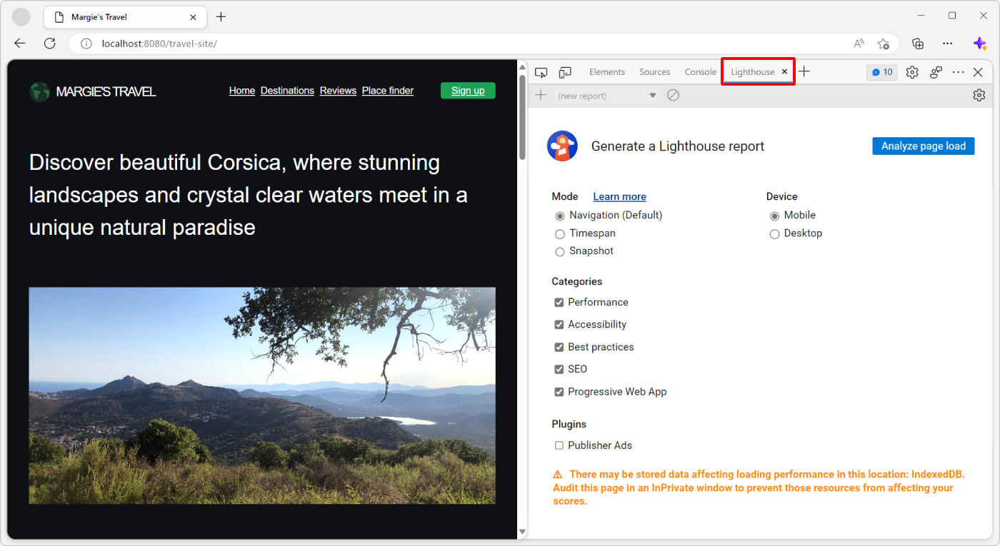

   <!--todo: add link to Lighthouse when section is available  -->
   <!-- /web/tools/lighthouse  -->

1. Only keep the **Performance** category selected and clear all other categories. And keep all other options set by default. Here is an explanation of the different options:

   *  **Mode**: set to **Navigation (default)** to run tests when the webpage loads, set to **Timespan** to run tests during a given period of time, or set to **Snapshot** to run tests on the webpage as it appears now.

   *  **Device**: set to **Mobile** to simulate a mobile user agent string and a mobile viewport, or set to **Desktop** to test the webpage without any simulation.

   *  **Categories**: allows to only run a subset of the tests available in **Lighthouse**.

1. Click **Analyze page load**.  After 10 to 30 seconds, a report of the performance of the site is displayed:

   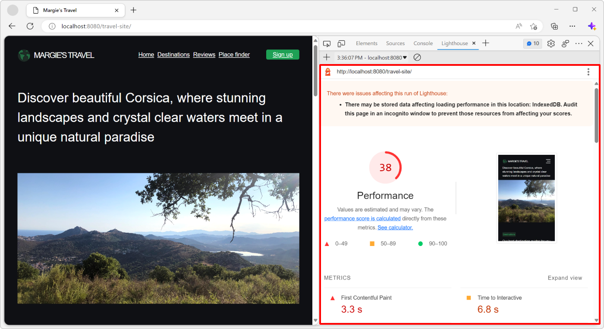

#### Handling report errors

If you ever get an error in your **Lighthouse** report, try running the tool again from an **InPrivate** window with no other tabs open.  This ensures that you are running Microsoft Edge from a clean state.  Microsoft Edge Extensions in particular often interfere with the auditing process.

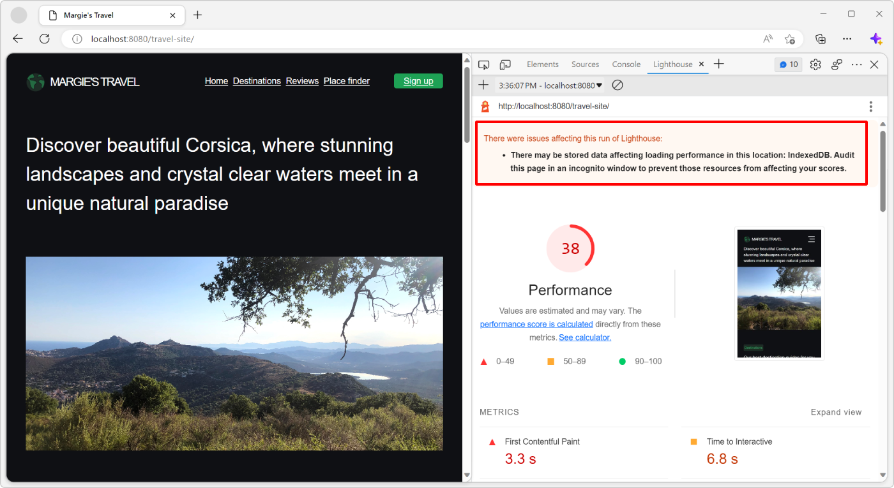

To open an **InPrivate** window:

1. Click the **Settings and more** (**...**) button in the top toolbar of Microsoft Edge.

1. Click **New InPrivate window**.

1. Establish a new baseline in **Lighthouse**:

   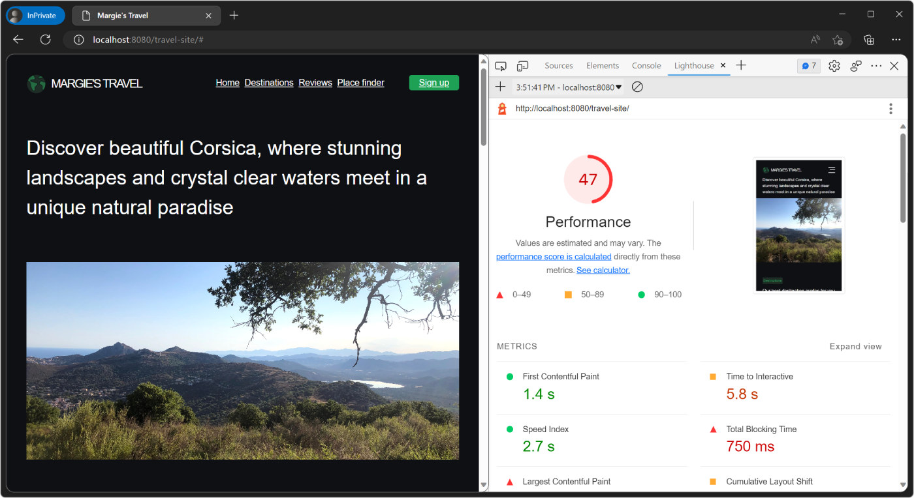

#### Understand your report

###### Overall performance score

The number at the top of your report is the overall performance score for the webpage.  Later, as you make changes to the code, the number displayed should rise.  A higher score means better performance.

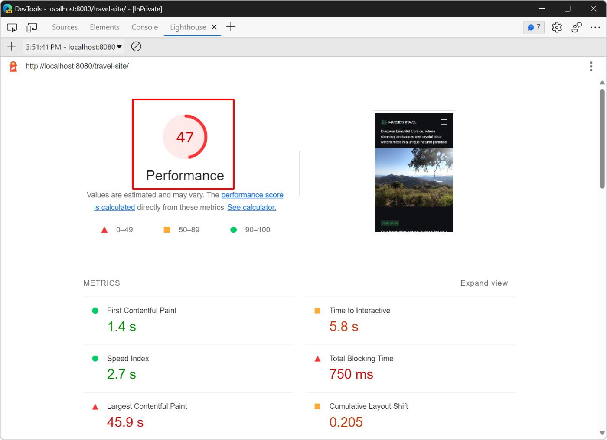

###### Metrics

The **Metrics** section provides quantitative measurements of the performance of the webpage.  Each metric provides insight into a different aspect of the performance.  For example, **First Contentful Paint** tells you when content is first painted to the screen, which is an important milestone in the user's perception of the page load, whereas **Time To Interactive** marks the point at which the page appears ready enough to handle user interactions.

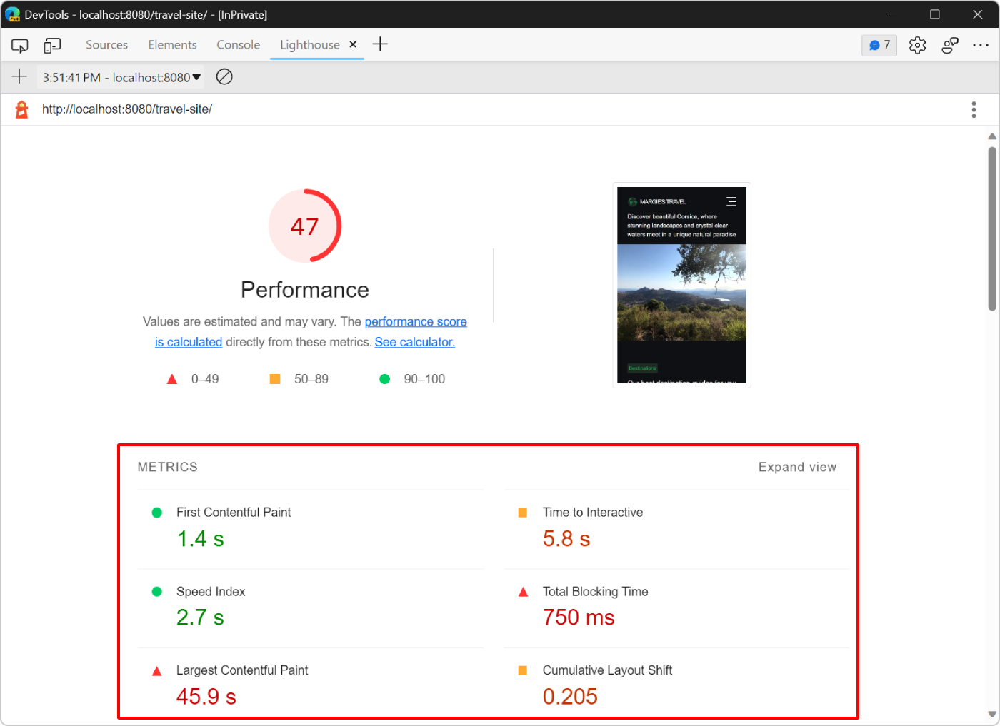

Click **Expand view** to display a description for each metric.  Then click **Learn More** to read documentation about it.

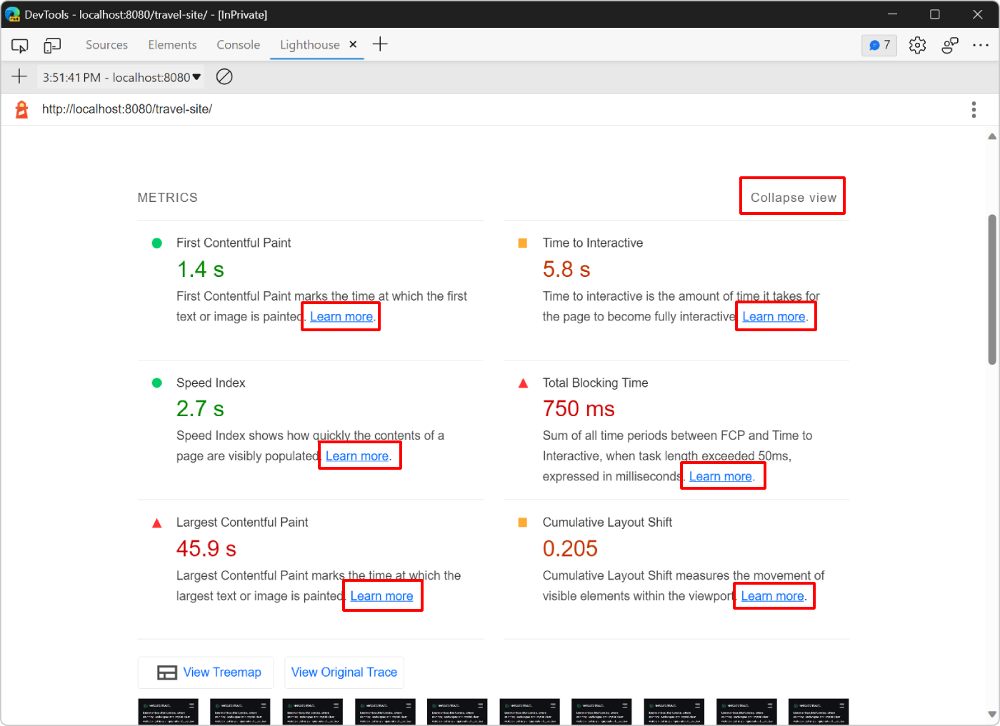

###### Screenshots

Below the **Metrics** section is a collection of screenshots that show you how the page looked as it loaded.

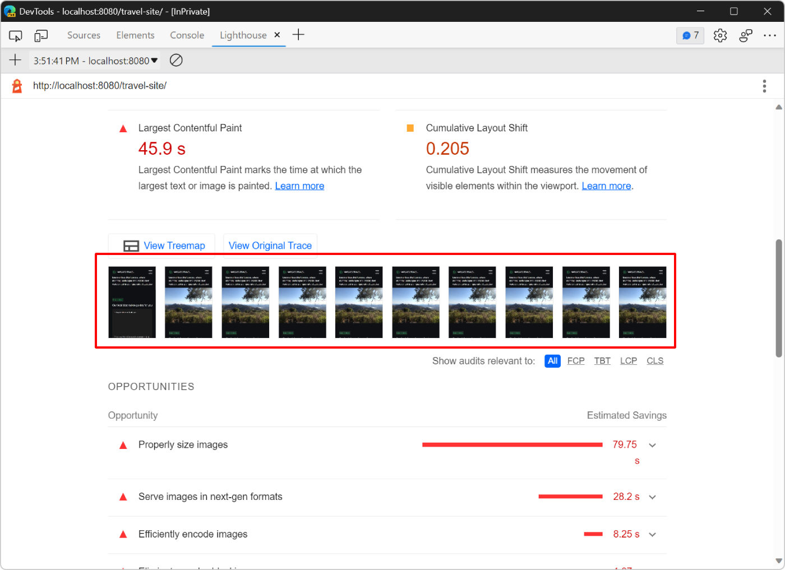

###### Opportunities

The **Opportunities** section provides specific tips on how to improve the load performance of this specific webpage:

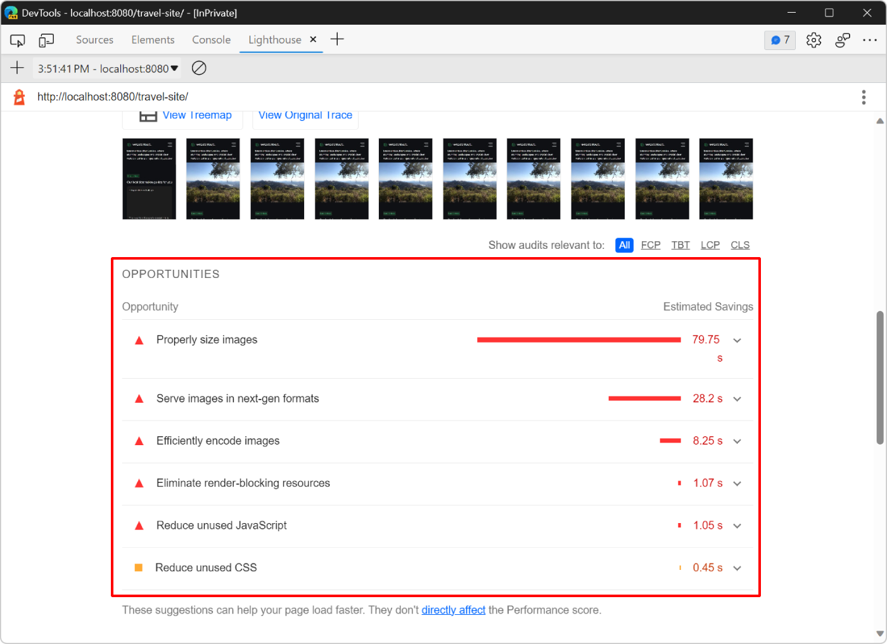

Click an opportunity to display more information about it, and then click **Learn more** to read documentation about why an opportunity is important, and specific recommendations on how to fix it:

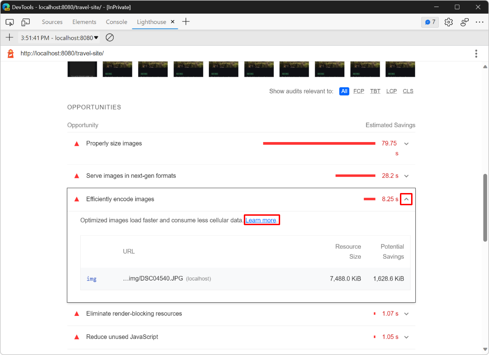

###### Diagnostics

The **Diagnostics** section provides more information about factors that contribute to the load time of the page:

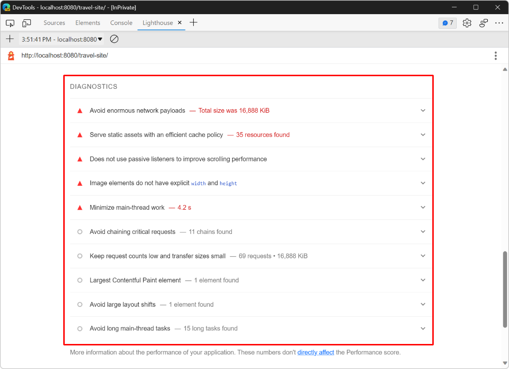

###### Passed audits

The **Passed audits** section shows you what the site is doing correctly.  Click **Show** to expand the section:

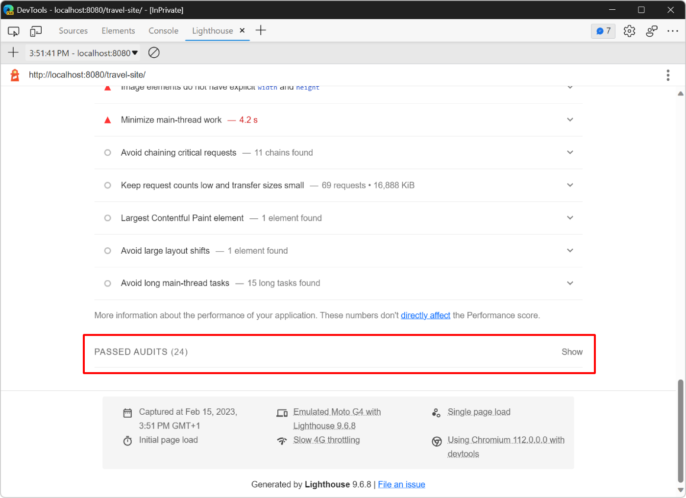


<!-- ====================================================================== -->
## Step 3: Experiment

The **Opportunities** section of your report gives you tips on how to improve the performance of the webpage.  In this section, you implement the recommended changes to the codebase, auditing the site again after each change to measure how it affects site speed.

### Enable text compression

Your report says that avoiding enormous network payloads is one of the top opportunities for improving the performance of the page.  Enabling text compression is an opportunity to improve the performance of the page.

Text compression is when you reduce, or compress, the size of a text file before sending it over the network.  This compression is similar to how you can archive a directory before sending it, to reduce the size.

Before you enable compression, here are a couple of ways to manually check whether text resources are compressed.

1. Click the **Network** tool.

   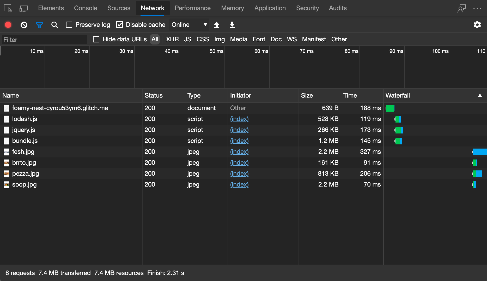

1. Click the **Network setting** icon.

1. Click the **Use Large Request Rows** checkbox.  The height of the rows in the table of network requests increases.

   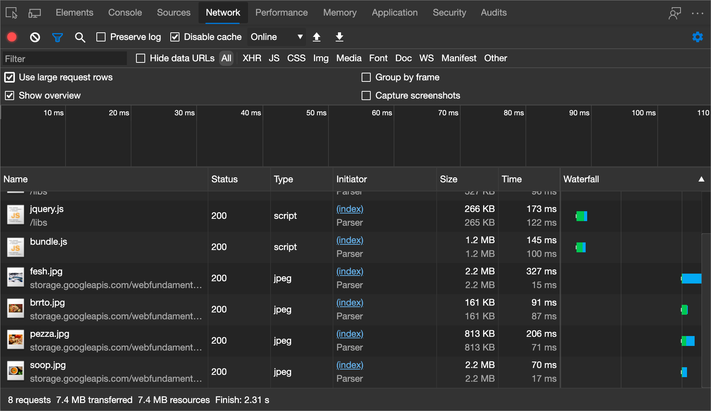

1. If the **Size** column in the table of network requests isn't displayed, click the table header > **Size**.

Each **Size** cell shows two values.  The top value is the size of the downloaded resource.  The bottom value is the size of the uncompressed resource.  If the two values are the same, then the resource isn't being compressed when it is sent over the network.  For example, in the previous figure, the top and bottom values for `bundle.js` are `1.2 MB` and `1.2 MB`.

Check for compression by inspecting the HTTP headers of a resource:

1. Click `bundle.js`.

1. Click the **Headers** panel.

   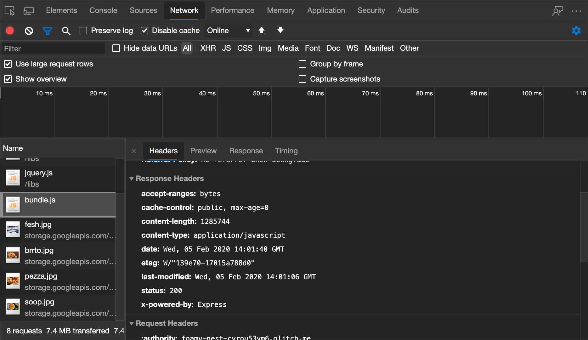

1. Search the **Response Headers** section for a `content-encoding` header.  A `content-encoding` heading isn't displayed, meaning that `bundle.js` wasn't compressed.  When a resource is compressed, this header is usually set to `gzip`, `deflate`, or `br`.  For an explanation of the values, see [Directives](https://developer.mozilla.org/docs/Web/HTTP/Headers/Content-Encoding#Directives).

Enough with the explanations; it's time to make some changes.  Enable text compression by adding a couple of lines of code, as follows.

1. In the editor tab, select **server.js**.

   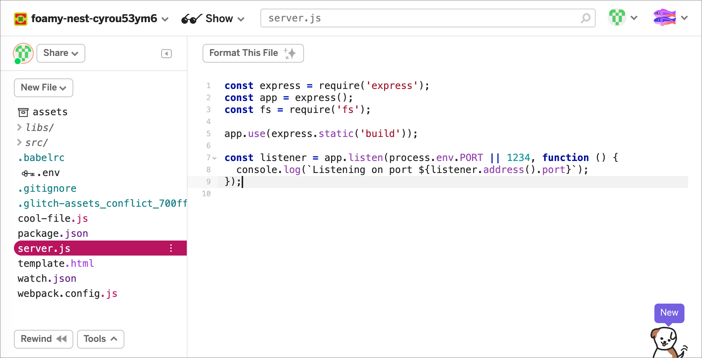

1. Add the following code to **server.js**.  Make sure to put `app.use(compression())` before `app.use(express.static('build'))`.

   ```javascript
   const express = require('express');
   const app = express();
   const fs = require('fs');
   const compression = require('compression');
   app.use(compression());
   app.use(express.static('build'));
   const listener = app.listen(process.env.PORT || 1234, function () {
      console.log(`Listening on port ${listener.address().port}`);
   });
   ```

   > [!NOTE]
   > Usually, you have to install the `compression` package via something like `npm i -S compression`, but this has already been done for you.

1. Wait for Glitch to deploy the new build of the site.  The fancy animation next to **Tools** means that the site is getting rebuilt and redeployed.  The change is ready when the animation next to **Tools** goes away.  Click **Show** and then select **In a New Window** again.

   <!--
   
   -->

Use the workflows that you learned earlier to manually check that the compression is working:

1. Go back to the demo tab and refresh the page.  The **Size** column should now show 2 different values for text resources like `bundle.js`.  In the figure after the following, the top value of `256 KB` for `bundle.js` is the size of the file that was sent over the network, and the bottom value of `1.2 MB` is the uncompressed file size.

   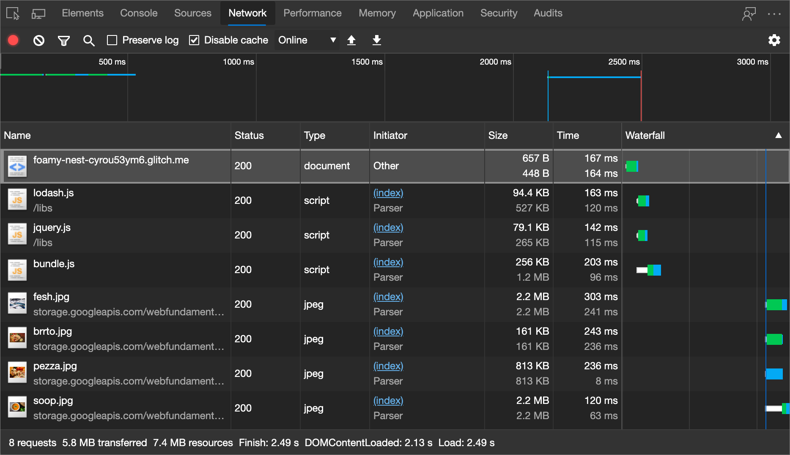

1. The **Response Headers** section for `bundle.js` now includes a `content-encoding: gzip` header:

   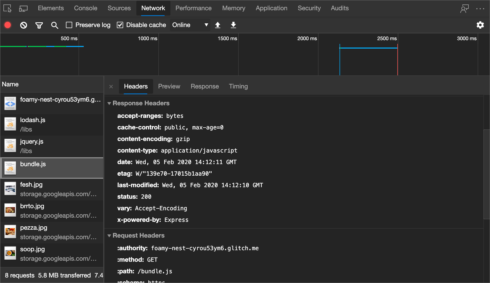

Audit the page again to measure what kind of impact text compression has on the load performance of the page:

1. Select the **Lighthouse** tool (formerly called the Audits tool).

1. Click **Perform an audit** ().

1. Keep the settings the same as before.

1. Click **Run audit**.

   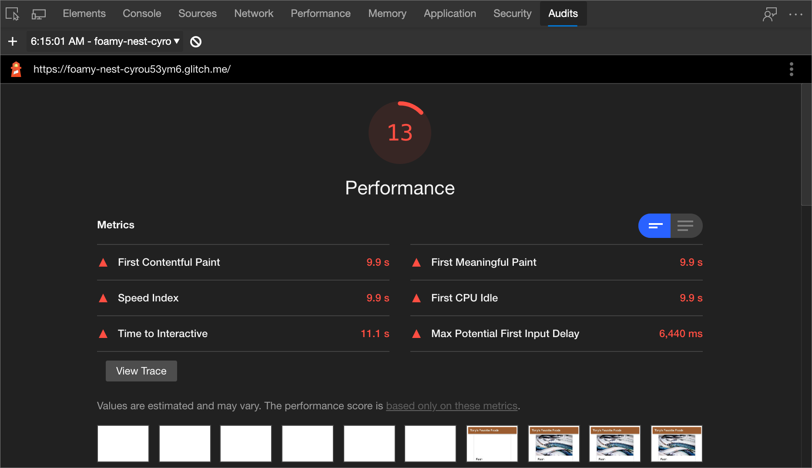

Your overall performance score should have increased, meaning that the site is getting faster.

#### Text compression in the real world

Most servers have simple fixes like this for enabling compression.  Do a search on how to configure whatever server you use to compress text.

### Resize images

Your report indicates that avoiding enormous network payloads is one of the top opportunities for improving the performance of the page.  Resizing images helps reduce the size of the network payload.  If your user is viewing your images on a mobile device screen that is 500-pixels-wide, there is really no point in sending a 1500-pixel-wide image.  Ideally, you send a 500-pixel-wide image, at most.

1. In your report, select **Avoid enormous network payloads** to display which images should be resized.  It looks like two of the `.jpg` files are over 2000 KB, which is bigger than necessary.

   <!--
   
   -->

1. Back in the editor tab, open `src/model.js`.

1. Replace `const dir = 'big'` with `const dir = 'small'`.  This directory contains copies of the same images which have been resized.

1. Audit the page again, to see how the change affects load performance.

   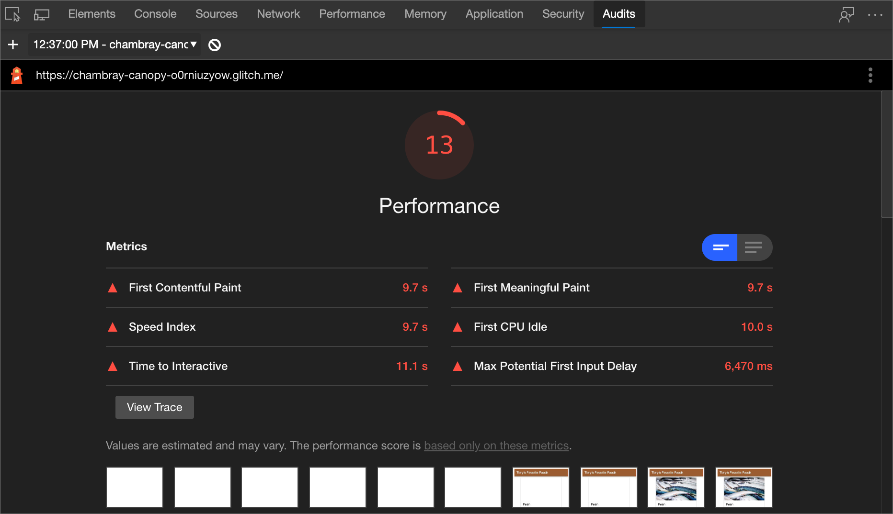

The change only has a minor effect on the overall performance score.  However, one thing that the score doesn't show clearly is how much network data you're saving your users.  The total size of the old photos was around 5.3 megabytes, whereas now it's only about 0.18 megabytes.

#### Resizing images in the real world

For a small app, doing a one-off resize like this might be good enough.  But for a large app, this isn't scalable.  Here are some strategies for managing images in large apps:

*  Resize images during your build process.

*  Create multiple sizes of each image during the build process and then use `srcset` in your code.  At runtime, the browser takes care of choosing which size is best for the device.  <!-- See [Responsive images](https://web.dev/responsive-images/). -->

*  Use an image CDN that lets you dynamically resize an image when you request it.

*  At the very least, optimize each image.  This can often create huge savings.

Optimization is when you run an image through a special program that reduces the size of the image file.  For more tips, see [Essential Image Optimization](https://images.guide).

### Eliminate render-blocking resources

Your latest report says that eliminating render-blocking resources is now the biggest opportunity.

A render-blocking resource is an external JavaScript or CSS file that the browser must download, parse, and run before it displays the page.  The goal is to only run the core CSS and JavaScript code that is required to display the page properly.

The first task, then, is to find code that you don't need to run on page load.

1. Click **Eliminate render-blocking resources** to display the resources that are blocking: `lodash.js` and `jquery.js`.

   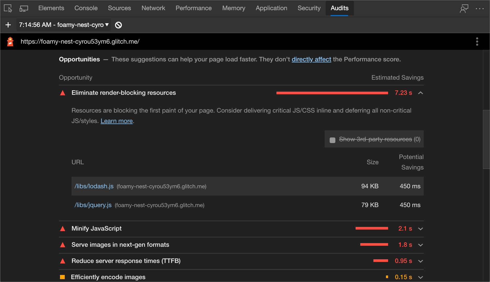

1. Press `Ctrl`+`Shift`+`P` (Windows, Linux) or `Command`+`Shift`+`P` (macOS) to open the Command Menu, start typing `Coverage`, and then select **Show Coverage**.

   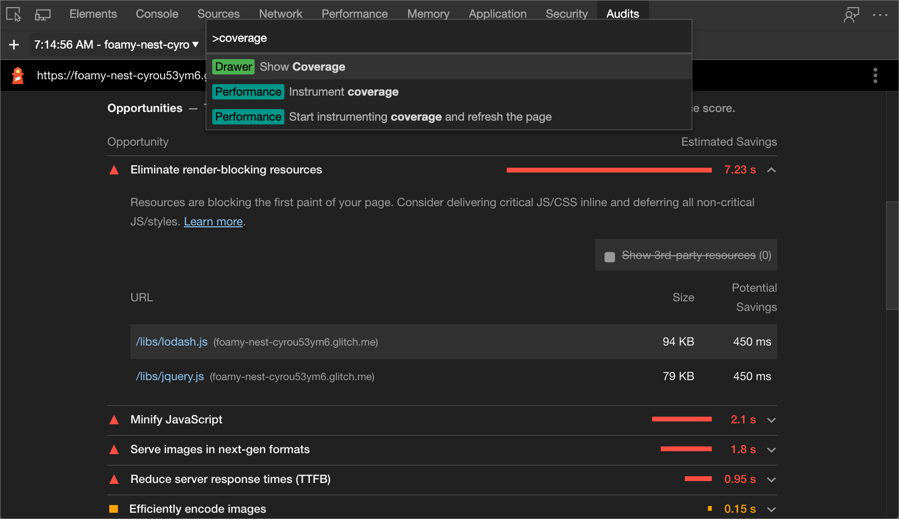

   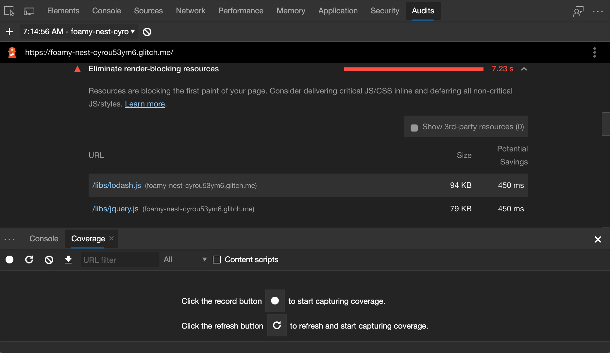

1. Click **Refresh** ().  The **Coverage** tool provides an overview of how much of the code in `bundle.js`, `jquery.js`, and `lodash.js` runs while the page loads.  In the figure after the following, about 76% and 30% of the jQuery and Lodash files aren't used, respectively.

   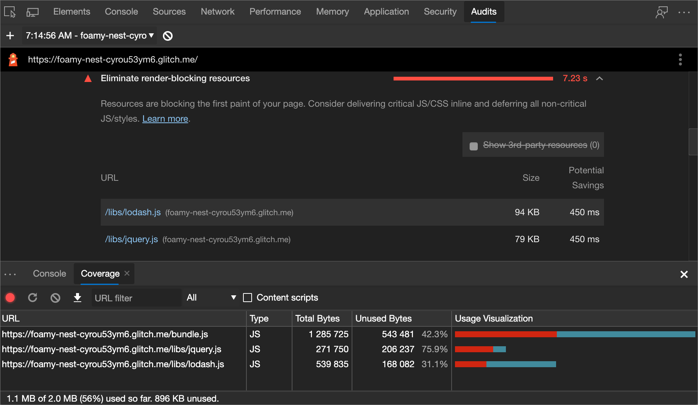

1. Click the `jquery.js` row.  DevTools opens the file in the **Sources** tool.  If a line of code ran, a blue bar appears next to it.  A red bar means the line of code was not run, and is definitely not needed on load of the webpage.

   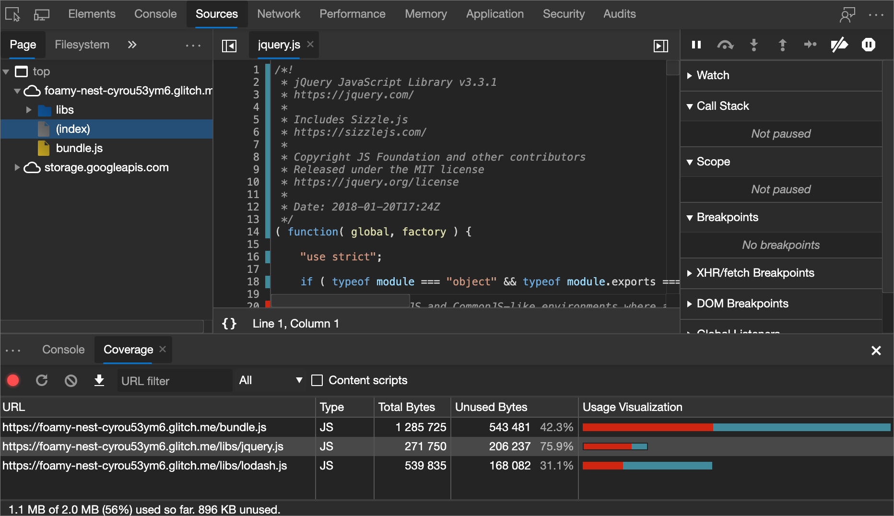

1. Scroll through the jQuery code.  Some of the lines that run are actually just comments.  To strip comments and reduce the size of the file, run the code through a minifier app or script.

In short, when you're working with your own code, the **Coverage** tool helps you analyze your code, line-by-line, and only ship the code that's needed for page load.

Are the `jquery.js` and `lodash.js` files even needed to load the page?  The **Request blocking** tool shows what happens when resources aren't available:

1. Select the **Network** tool.

1. Press `Ctrl`+`Shift`+`P` (Windows, Linux) or `Command`+`Shift`+`P` (macOS) to open the Command Menu again.

1. Start typing `blocking`, and then select **Show Request Blocking**.

   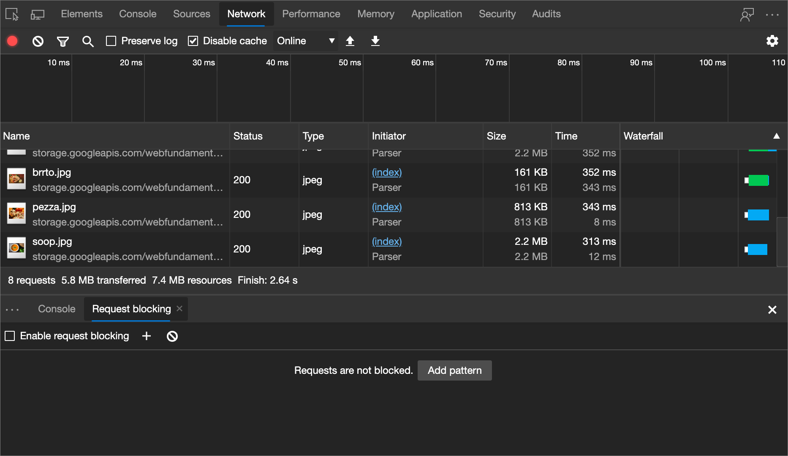

1. Click **Add Pattern** (), type `/libs/*`, and then press `Enter` to confirm.

   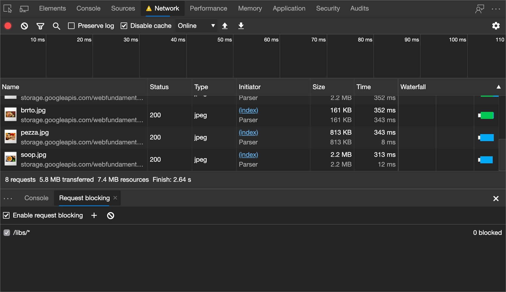

1. Refresh the page.  The jQuery and Lodash requests are red, meaning that the requests were blocked.   The page still loads and is interactive, so it looks like these resources aren't needed whatsoever!

   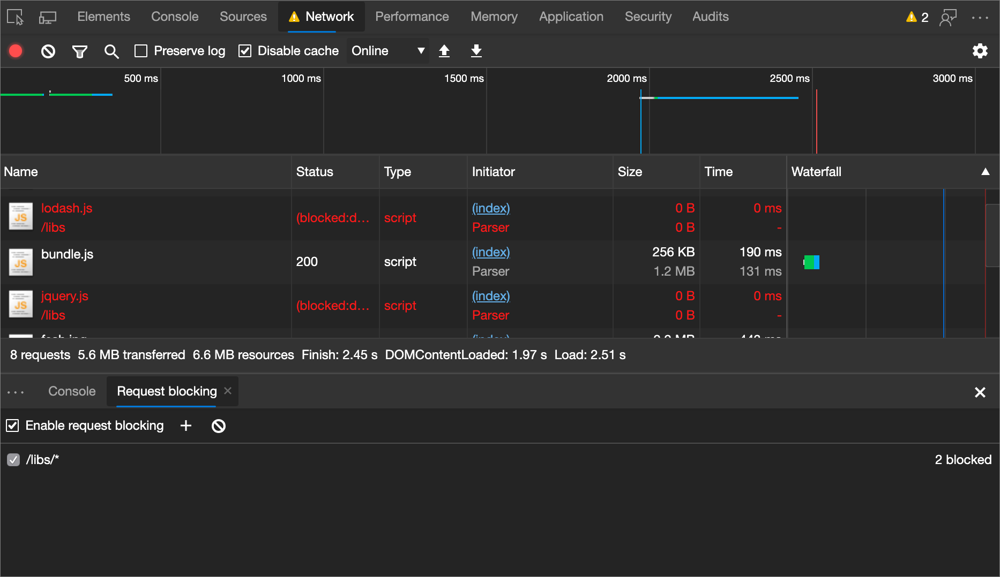

1. Click **Remove all patterns** () to delete the `/libs/*` blocking pattern.

In general, the **Request blocking** tool is useful for simulating how your page behaves when any given resource isn't available.

Now, remove the references to these files from the code and audit the page again:

1. Back in the editor tab, open `template.html`.

1. Delete `<script src="/libs/lodash.js">` and `<script src="/libs/jquery.js"></script>`.

1. Wait for the site to re-build and re-deploy.

1. Audit the page again from the **Audits** tool.  Your overall score should have improved again.

   

#### Optimizing the Critical Rendering Path in the real-world

The **Critical Rendering Path** refers to the code that you need to load a page.  In general, speed up page load by only shipping critical code during the page load, and then lazy-loading everything else.

<!-- [Critical Rendering Path](/web/fundamentals/performance/critical-rendering-path/) -->

*  It's unlikely that you can find scripts that you can remove outright, but you might find many scripts that you don't need to request during the page load, which can instead be requested asynchronously.  <!-- See [Using async or defer](/web/fundamentals/performance/optimizing-content-efficiency/loading-third-party-javascript/#use_async_or_defer). -->

*  If you're using a framework, check whether it has a production mode.  This production mode might use a feature such as [tree shaking](https://webpack.js.org/guides/tree-shaking) in order to eliminate unnecessary code that's blocking the critical render.

### Do less main thread work

Your latest report shows some minor potential savings in the Opportunities section, but if you look down in the Diagnostics section, it looks like the biggest bottleneck is too much main thread activity.

The main thread is where the browser does most of the work needed to display a page, such as parsing and running HTML, CSS, and JavaScript.

The goal is to use the Performance panel to analyze what work the main thread is doing while the page loads, and find ways to defer or remove unnecessary work.

1. Select the **Performance** tool.

1. Click **Capture Settings** ().

1. Set **Network** to **Slow 3G** and **CPU** to **6x slowdown**.  Mobile devices typically have more hardware constraints than laptops or desktops, so these settings let you experience the page load as if you were using a less powerful device.

1. Click **Refresh** ().  DevTools refreshes the page and then produces a visualization of all the work performed in order to load the page.  This visualization is referred to as the **trace**.

   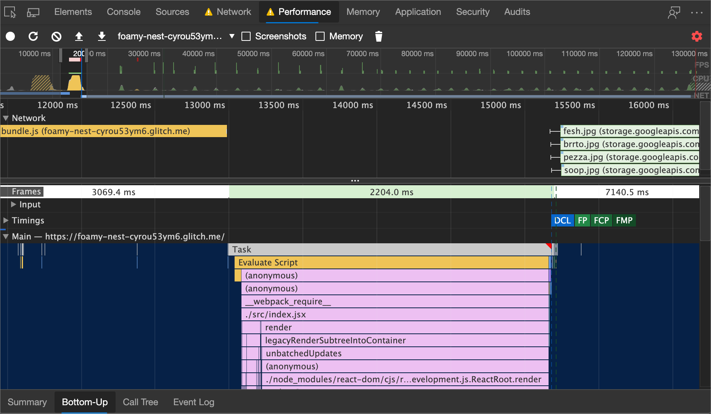

The trace shows activity chronologically, from left to right.  The FPS, CPU, and NET charts at the top give you an overview of frames per second, CPU activity, and network activity.  The block of yellow highlighted in the figure after the next, the CPU was completely busy with scripting activity.  This is a clue that you may be able to speed up page load by doing less JavaScript work.

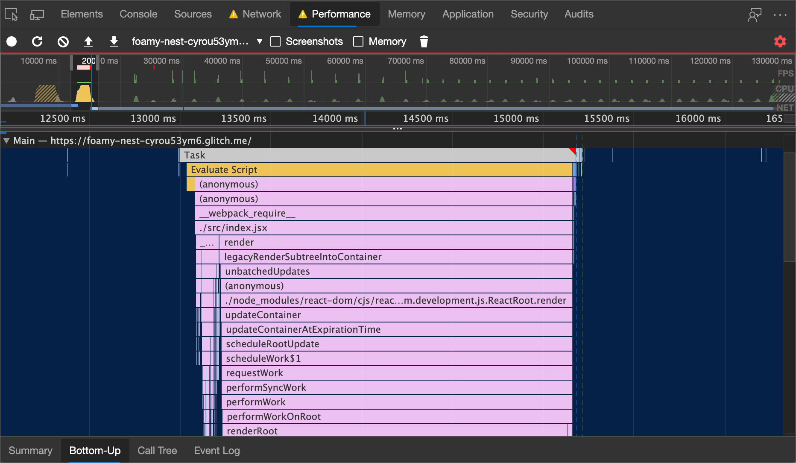

Investigate the trace to find ways to do less JavaScript work:

1. Click the **Timings** section to expand it.  Based on the fact that there may be a bunch of [Timing](https://developer.mozilla.org/docs/Web/API/User_Timing_API) measures from React, it seems like Tony's app is using the development mode of React.  Switching to the production mode of React may yield some easy performance wins.

   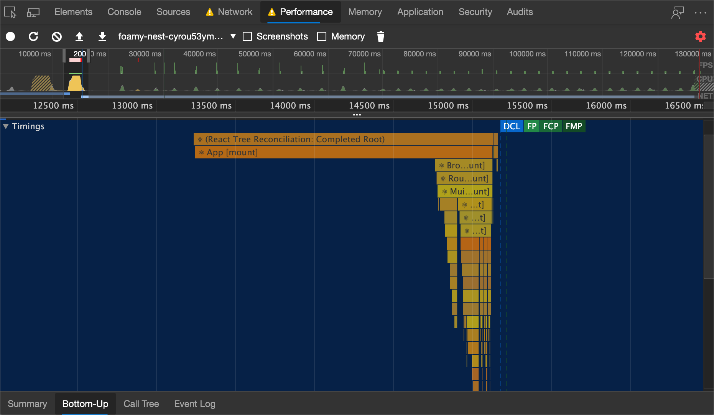

1. Click **Timings** again to collapse that section.

1. Browse the **Main** section.  This section shows a chronological log of main thread activity, from left to right.  The y-axis (top to bottom) shows why events occurred.  For example, in the figyre after the following, the `Evaluate Script` event caused the `(anonymous)` function to run, which caused `(anonymous)` to run, which caused `__webpack__require__` to run, and so on.

  

1. Scroll down to the bottom of the **Main** section.  When you use a framework, most of the upper activity is caused by the framework, which is usually out of your control.  The activity caused by your app is usually at the bottom.  In this app, it seems like a function named `App` is causing a lot of requests to a `mineBitcoin` function.  It sounds like Tony might be using the devices of his fans to mine cryptocurrency...

   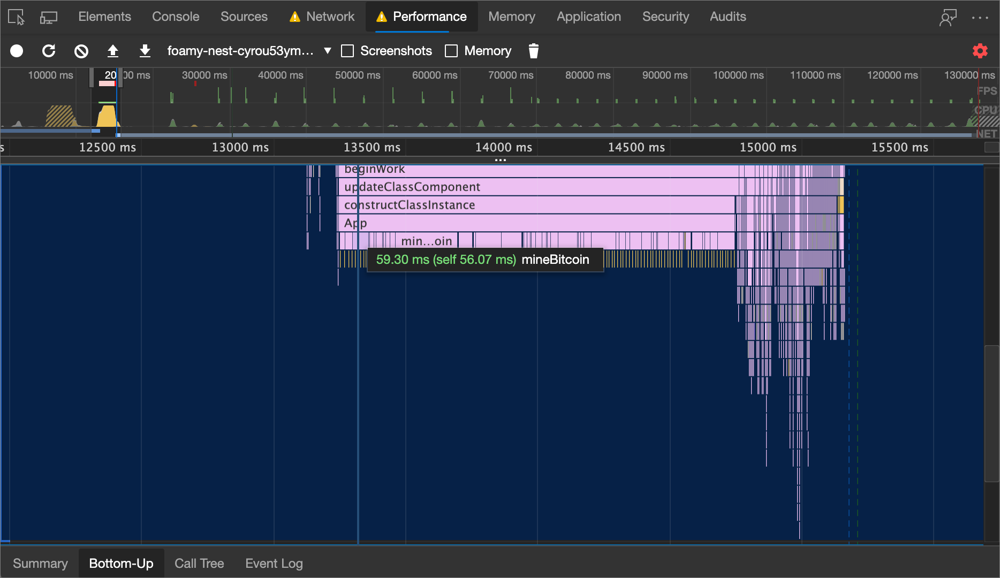

   > [!NOTE]
   > Although the requests that your framework makes are usually out of your control, sometimes you might structure your app in a way that causes the framework to run inefficiently.  Restructuring your app to use the framework efficiently is a way to do less main thread work.  However, this requires a deep understanding of how your framework works, and what kind of changes you make in your own code in order to use the framework more efficiently.

1. Expand the **Bottom-Up** section.  This tab breaks down what activities took up the most time.  If nothing is displayed in the **Bottom-Up** section, click the label for **Main** section.  The **Bottom-Up** section only shows information for whatever activity, or group of activity, you have currently selected.  For example, if you chose one of the `mineBitcoin` activities, the **Bottom-Up** section is only going to show information for that one activity.

   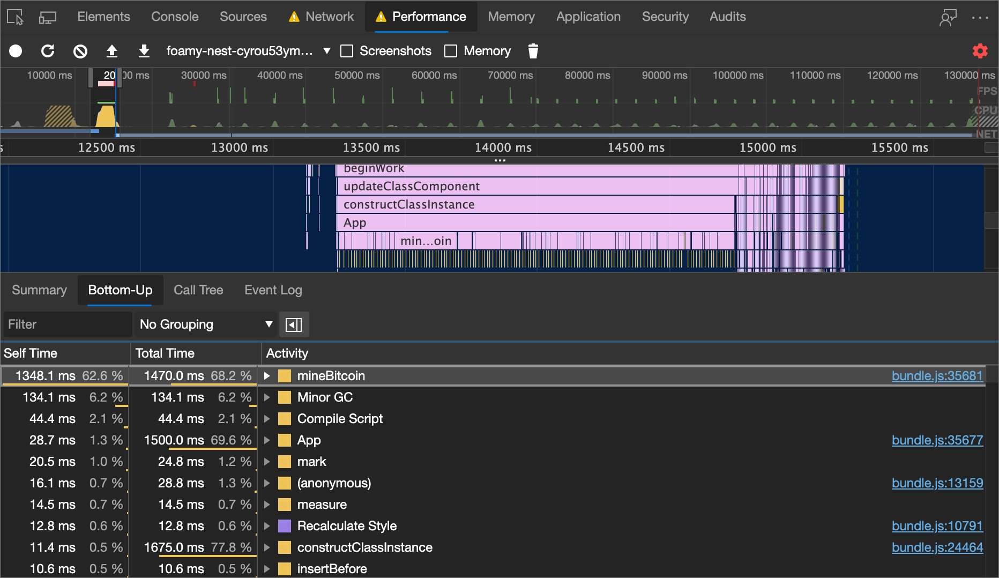

The **Self Time** column shows you how much time was spent directly in each activity.  For example, in the following figure, about 63% of main thread time was spent on the `mineBitcoin` function.

It's time to see whether using production mode and reducing JavaScript activity may speed up the page load.  Start with production mode:

1. In the editor tab, open `webpack.config.js`.

1. Change `"mode":"development"` to `"mode":"production"`.

1. Wait for the new build to deploy.

1. Audit the page again.

   

Reduce JavaScript activity by removing the request to `mineBitcoin`:

1. In the editor tab, open `src/App.jsx`.

1. Comment out the request to `this.mineBitcoin(1500)` in the `constructor`.

1. Wait for the new build to deploy.

1. Audit the page again.

   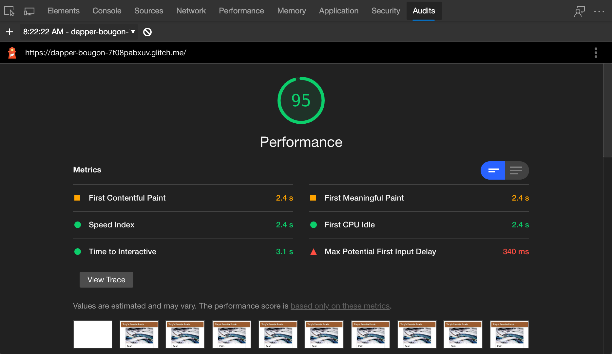

Looks like that last change caused a massive jump in performance!

This section provided a rather brief introduction to the Performance tool.  To learn more about how to analyze page performance, see [Performance features reference)](../evaluate-performance/reference.md).

#### Doing less main thread work in the real world

The **Performance** tool is the most common way to understand what activity your site does as it loads, and to find ways to remove unnecessary activity.

If you prefer an approach that feels more like `console.log()`, the [User Timing API](https://developer.mozilla.org/docs/Web/API/User_Timing_API) enables you to arbitrarily mark up certain phases of your app lifecycle, in order to track how long each of those phases takes.


<!-- ====================================================================== -->
## Summary

*  Whenever you set out to optimize the load performance of a site, always start with an audit.  The audit establishes a baseline, and gives you tips on how to improve.
*  Make one change at a time, and audit the webpage after each change in order to display how that isolated change affects performance.


<!-- ====================================================================== -->
<!--
## Next steps

*  Run audits on your own site!  If you need help interpreting your report, or finding ways to improve your load performance, check out [Feedback](#feedback) for ways to get help from the DevTools community.  Stack Overflow, the mailing list, or Twitter are probably best for these types of questions.
*  Please leave [feedback](#feedback) on this tutorial.  The data is used to make better tutorials.
-->


<!-- ====================================================================== -->
> [!NOTE]
> Portions of this page are modifications based on work created and [shared by Google](https://developers.google.com/terms/site-policies) and used according to terms described in the [Creative Commons Attribution 4.0 International License](https://creativecommons.org/licenses/by/4.0).
> The original page is found [here](https://developer.chrome.com/docs/devtools/speed/get-started/) and is authored by [Kayce Basques](https://developers.google.com/web/resources/contributors#kayce-basques) (Technical Writer, Chrome DevTools \& Lighthouse).

[](https://creativecommons.org/licenses/by/4.0)
This work is licensed under a [Creative Commons Attribution 4.0 International License](https://creativecommons.org/licenses/by/4.0).
