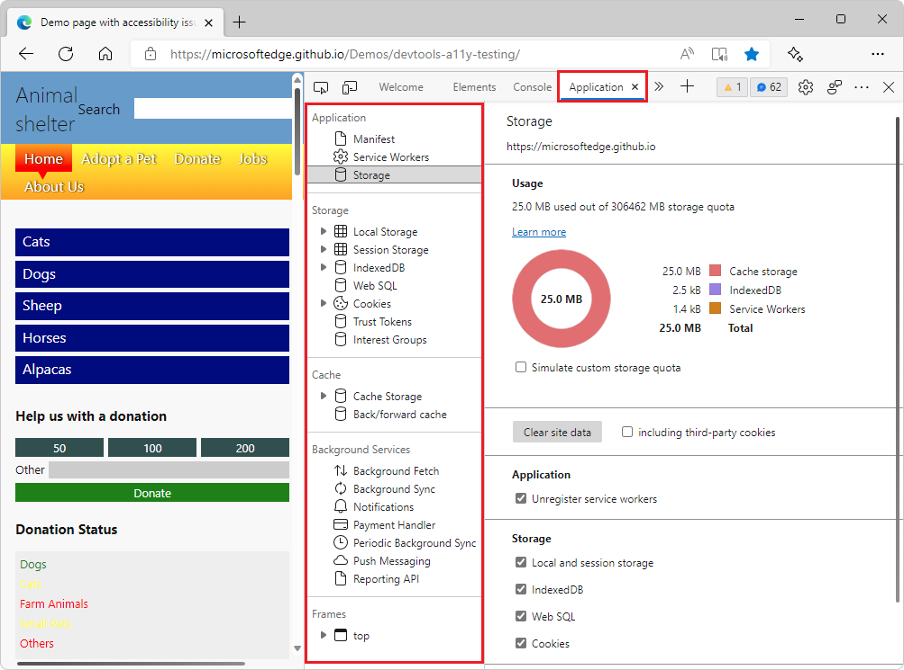

# Application tool, to manage storage

Use the **Application** tool to manage storage for web app pages, including manifest, service workers, local storage, cookies, cache storage, and background services.

The Application tool has the following pages:

*  Application
   *  Manifest
   *  Service Workers
   *  Storage

*  Storage
   *  Local Storage
   *  IndexedDB
   *  Web SQL
   *  Cookies
   *  Trust Tokens
   *  Interest Groups

*  Cache
   *  Cache Storage
   *  Back/forward cache

*  Background Services
   *  Background Fetch
   *  Background Sync
   *  Notifications
   *  Payment Handler
   *  Periodic Background Sync
   *  Push Messaging
   *  Reporting API

*  Frames 

Note: to accurately interpret the **Storage Usage** chart in the **Application** tool, see the [Quota usage](../progressive-web-apps/index.md#quota-usage) section of the Debug Progressive Web Apps article.
