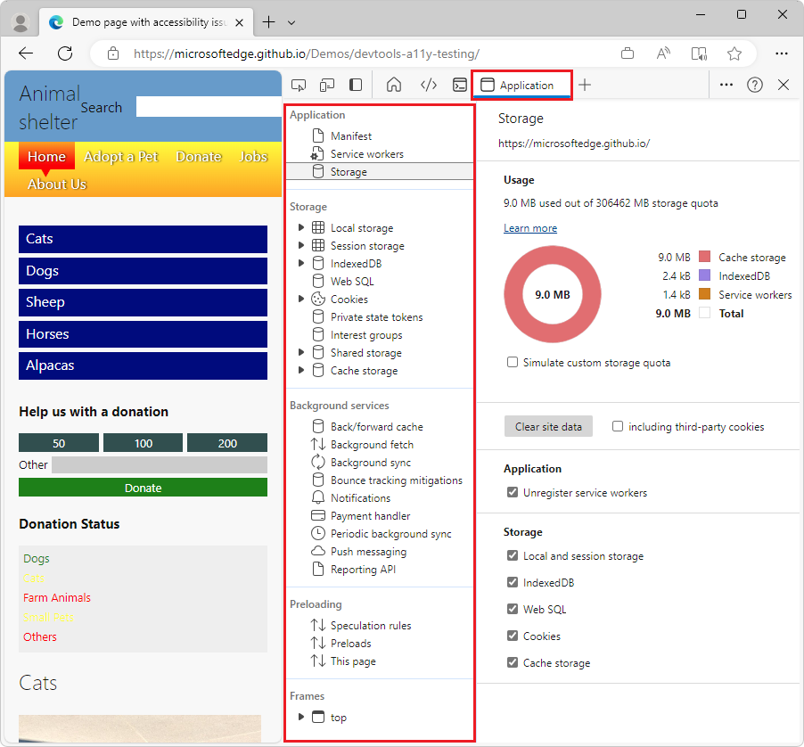

# Application tool, to manage storage

Use the **Application** tool to manage storage for web app pages, including manifest, service workers, local storage, cookies, cache storage, and background services.

The **Application** tool has the following pages, listed on the left:

* Application
   * Manifest
   * Service workers
   * Storage

* Storage
   * Local storage
   * Session storage
   * IndexedDB
   * Web SQL
   * Cookies
   * Private state tokens
   * Interest groups
   * Shared storage
   * Cache storage

* Background services
   * Back/forward cache
   * Background fetch
   * Background sync
   * Bounce tracking mitigations
   * Notifications
   * Payment handler
   * Periodic background sync
   * Push messaging
   * Reporting API

* Preloading
   * Speculation rules
   * Preloads
   * This page

* Frames 
   * top

To interpret the **Storage** > **Usage** section in the **Application** tool, see [Quota usage](../progressive-web-apps/index.md#quota-usage) in _Debug Progressive Web Apps (PWAs)_.

<!-- ====================================================================== -->
<!--
## See also
-->
