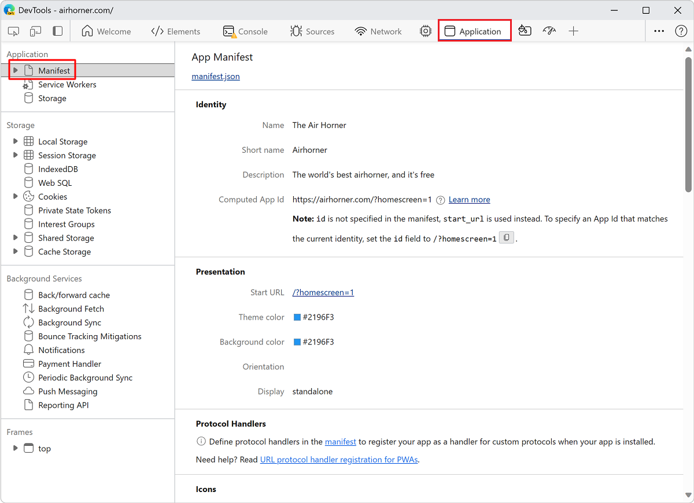
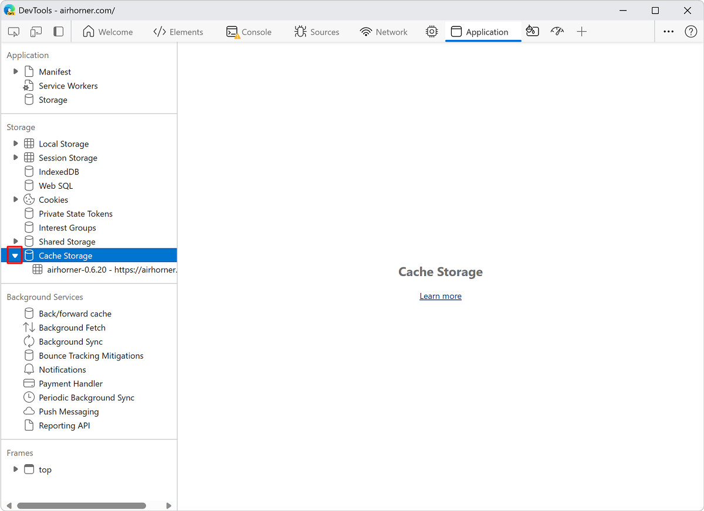
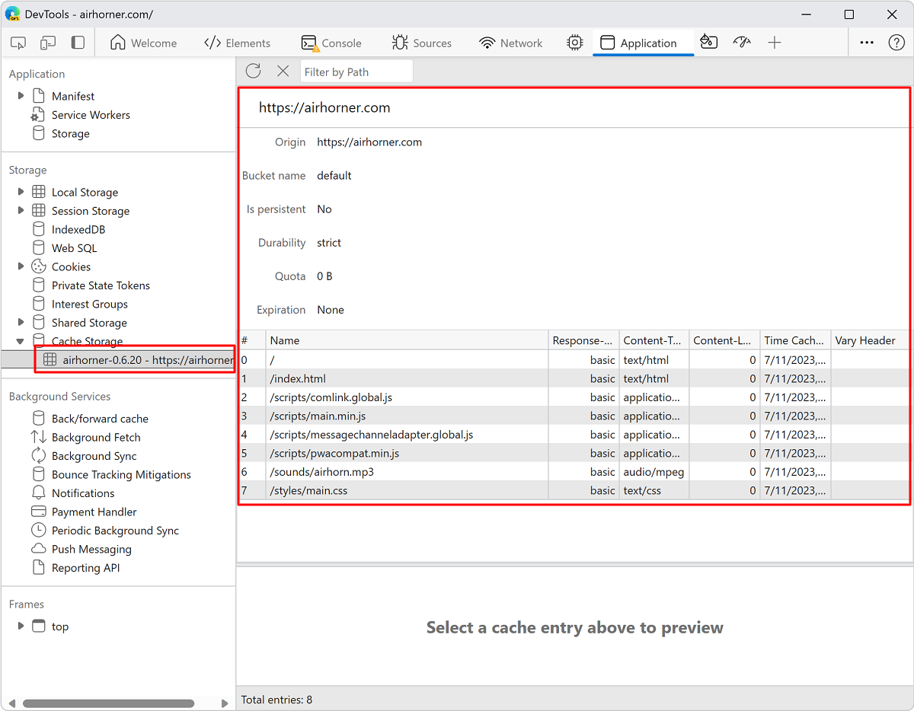
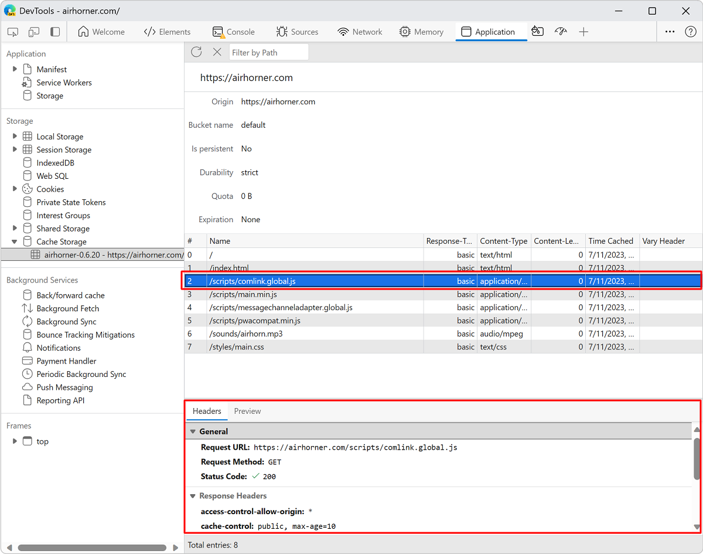
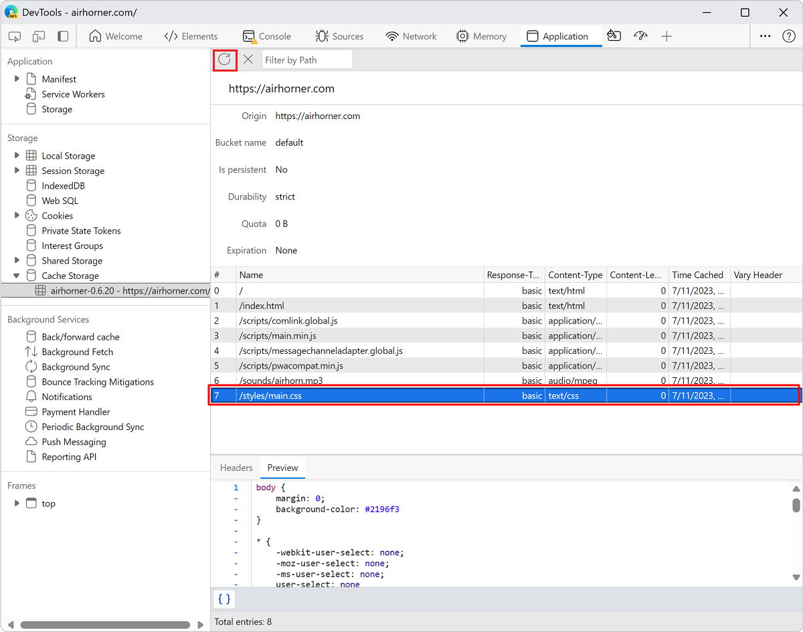
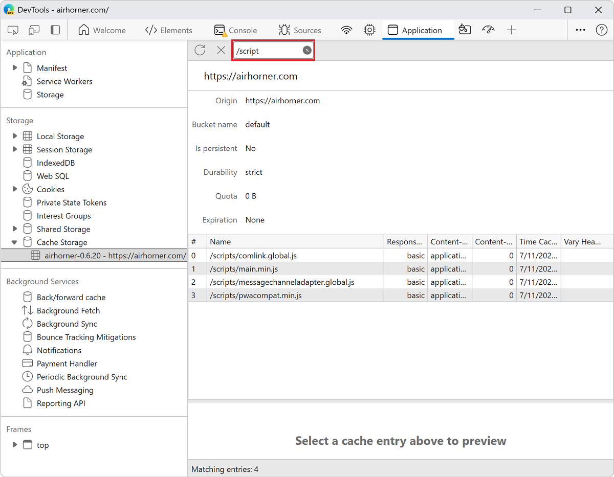
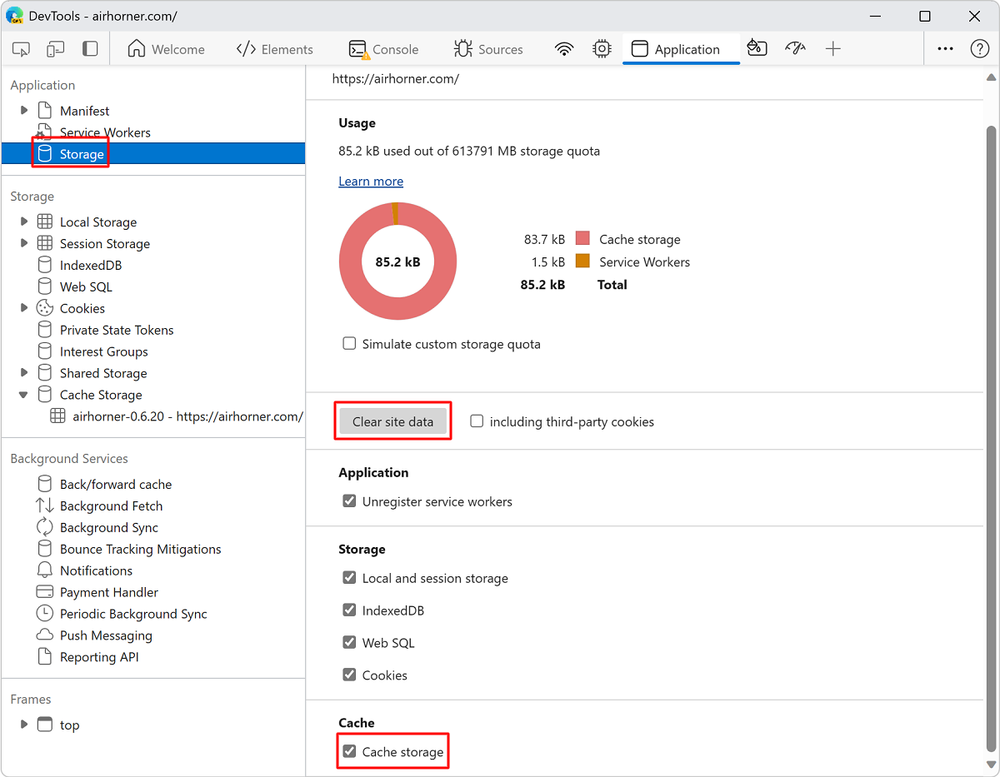

<!-- Copyright Kayce Basques

   Licensed under the Apache License, Version 2.0 (the "License");
   you may not use this file except in compliance with the License.
   You may obtain a copy of the License at

       https://www.apache.org/licenses/LICENSE-2.0

   Unless required by applicable law or agreed to in writing, software
   distributed under the License is distributed on an "AS IS" BASIS,
   WITHOUT WARRANTIES OR CONDITIONS OF ANY KIND, either express or implied.
   See the License for the specific language governing permissions and
   limitations under the License.  -->
# View Cache data

This guide shows you how to use DevTools to inspect [Cache](https://developer.mozilla.org/docs/Web/API/Cache) data.

To inspect [HTTP cache](https://developer.mozilla.org/docs/Web/HTTP/Caching) data, in the **Network** tool, use the **Size** column of the **Network Log**.  See [Log network activity](../network/index.md#log-network-activity) in _Inspect network activity_.

<!-- ====================================================================== -->
## View cache data

1. Open DevTools by pressing **F12** or **Ctrl+Shift+I** (Windows, Linux) or **Command+Option+I** (macOS).

1. In DevTools, on the **Activity Bar**, select the **Application** tab.  If that tab isn't visible, click the **More tools** () button, and then click **Application**. The **Manifest** pane usually opens by default:

   

1. Expand the **Cache Storage** section to view available caches:

   

1. Click a cache to view the contents:

   

1. Click a resource to view the HTTP headers in the section below the table:

   

1. Click **Preview** to view the content of a resource:

   

To learn more about cache data storage quota, see the [Quota usage](../progressive-web-apps/index.md#quota-usage) section of the Debug Progressive Web Apps article.

<!-- ====================================================================== -->
## Refresh a resource

1. [View the data for a cache](#view-cache-data).

1. Click the resource that you want to refresh. DevTools highlights it to indicate that it is selected.

1. Click **Refresh** ():

   

<!-- ====================================================================== -->
## Filter resources

1. [View the data for a cache](#view-cache-data).

1. Use the **Filter by Path** text box to filter out any resources that don't match the path that you provide:

   

<!-- ====================================================================== -->
## Delete a resource

1. [View the data for a cache](#view-cache-data).

1. Click the resource that you want to delete.  DevTools highlights it to indicate that it is selected.

1. Click **Delete Selected** ():
   
   

<!-- ====================================================================== -->
## Delete all cache data

1. In the **Application** tool, click **Storage**.

1. Make sure that the **Cache storage** checkbox is selected.

1. Click the **Clear site data** button:

   

<!-- ====================================================================== -->
> [!NOTE]
> Portions of this page are modifications based on work created and [shared by Google](https://developers.google.com/terms/site-policies) and used according to terms described in the [Creative Commons Attribution 4.0 International License](https://creativecommons.org/licenses/by/4.0).
> The original page is found [here](https://developer.chrome.com/docs/devtools/storage/cache/) and is authored by [Kayce Basques](https://developers.google.com/web/resources/contributors#kayce-basques) (Technical Writer, Chrome DevTools \& Lighthouse).

This work is licensed under a [Creative Commons Attribution 4.0 International License](https://creativecommons.org/licenses/by/4.0).
