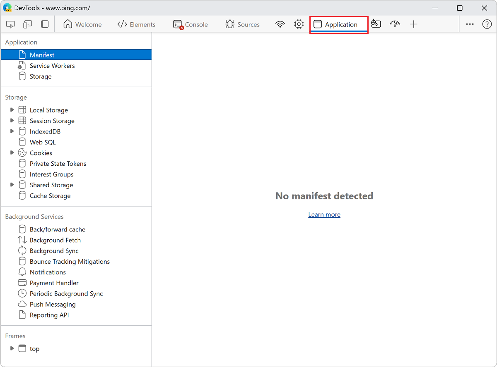
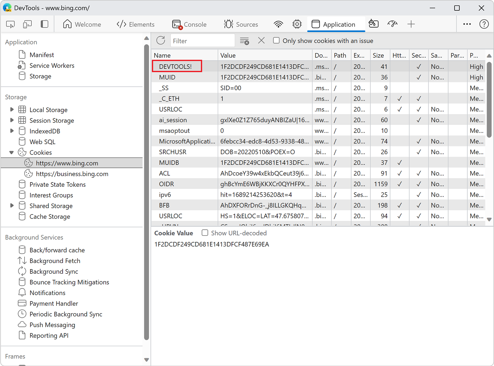
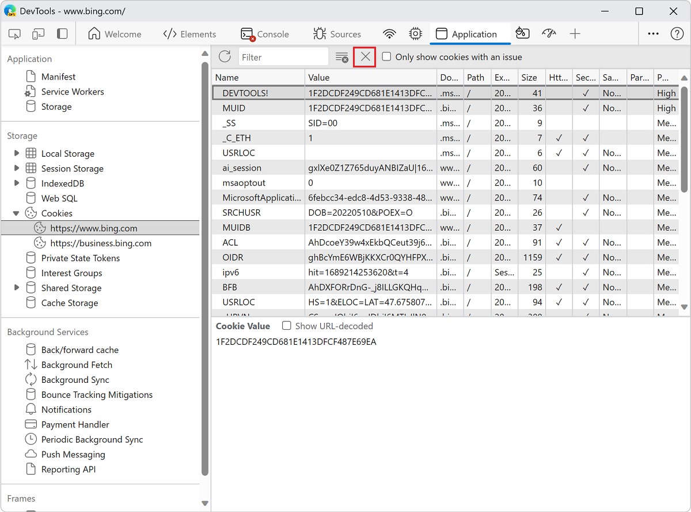

<!-- Copyright Kayce Basques

   Licensed under the Apache License, Version 2.0 (the "License");
   you may not use this file except in compliance with the License.
   You may obtain a copy of the License at

       https://www.apache.org/licenses/LICENSE-2.0

   Unless required by applicable law or agreed to in writing, software
   distributed under the License is distributed on an "AS IS" BASIS,
   WITHOUT WARRANTIES OR CONDITIONS OF ANY KIND, either express or implied.
   See the License for the specific language governing permissions and
   limitations under the License.  -->
# View, edit, and delete cookies

_HTTP cookies_ are used to manage user sessions, store user personalization preferences, and track user behavior.  Use the **Cookies** pane of the **Application** tool to view, edit, and delete the HTTP cookies for a webpage.

See [Using HTTP cookies](https://developer.mozilla.org/docs/Web/HTTP/Cookies).

<!-- ====================================================================== -->
## Open the Cookies pane

1. Open DevTools by pressing **F12** or **Ctrl+Shift+I** (Windows, Linux) or **Command+Option+I** (macOS).

1. In DevTools, on the **Activity Bar**, select the **Application** tab.  If that tab isn't visible, click the **More tools** () button, and then click **Application**. The **Manifest** pane usually opens by default:

   

1. Under **Storage**, expand **Cookies**, then select an origin:

   

<!-- ====================================================================== -->
## Fields

The **Cookies** table contains the following fields:

*  **Name**.  The name of the cookie.

*  **Value**.  The value of the cookie.

*  **Domain**.  The hosts that are allowed to receive the cookie.  See [Scope of cookies](https://developer.mozilla.org/docs/Web/HTTP/Cookies#Scope_of_cookies).

*  **Path**.  The URL that must exist in the requested URL in order to send the `Cookie` header.  See [Scope of cookies](https://developer.mozilla.org/docs/Web/HTTP/Cookies#Scope_of_cookies).

*  **Expires / Max-Age**.  The expiration date or maximum age of the cookie.  See [Permanent cookies](https://developer.mozilla.org/docs/Web/HTTP/Cookies#Permanent_cookies).  For [session cookies](https://developer.mozilla.org/docs/Web/HTTP/Cookies#Session_cookies) this value is always `Session`.

*  **Size**.  The size, in bytes, of the cookie.

*  **HttpOnly**.  If `true`, this field indicates that the cookie should only be used over HTTP, and JavaScript modification isn't allowed.  See [HttpOnly cookies](https://developer.mozilla.org/docs/Web/HTTP/Cookies#Secure_and_HttpOnly_cookies).

*  **Secure**.  If `true`, this field indicates that the cookie must be sent to the server only over a secure, HTTPS connection.  See [Secure cookies](https://developer.mozilla.org/docs/Web/HTTP/Cookies#Secure_and_HttpOnly_cookies).

*  **SameSite**.  Contains `strict` or `lax` if the cookie is using the experimental [Samesite](https://developer.mozilla.org/docs/Web/HTTP/Cookies#SameSite_cookies) attribute.

*  **SameParty**. This attribute provides web developers a means to annotate cookies that are allowed to be set or sent in same-party, cross-site contexts. 

*  **Partition Key**. The _partition key_ of a cookie only exists when the cookie is set in partitioned storage and corresponds to the top-level site where the cookie was initially created. See [Cookies Having Independent Partitioned State (CHIPS) origin trial](https://developer.chrome.com/blog/chips-origin-trial/).

*  **Priority**.  Contains `low`, `medium` (default), or `high` if the cookie is using the deprecated [Cookie Priority](https://bugs.chromium.org/p/chromium/issues/detail?id=232693) attribute.

<!-- ====================================================================== -->
## Filter cookies

To filter cookies by **Name** or **Value**, use the **Filter** text box:

**Note:** Filtering by other fields isn't supported.

<!-- ====================================================================== -->
## Edit a cookie

The **Name**, **Value**, **Domain**, **Path**, and **Expires / Max-Age** fields are editable.  Double-click a field to edit it:

<!-- ====================================================================== -->
## Delete cookies

To delete a specific cookie, click a cookie and then click **Delete Selected** ():

To delete all cookies, click **Clear all cookies** ():

<!-- ====================================================================== -->
> [!NOTE]
> Portions of this page are modifications based on work created and [shared by Google](https://developers.google.com/terms/site-policies) and used according to terms described in the [Creative Commons Attribution 4.0 International License](https://creativecommons.org/licenses/by/4.0).
> The original page is found [here](https://developer.chrome.com/docs/devtools/storage/cookies/) and is authored by [Kayce Basques](https://developers.google.com/web/resources/contributors#kayce-basques) (Technical Writer, Chrome DevTools \& Lighthouse).

This work is licensed under a [Creative Commons Attribution 4.0 International License](https://creativecommons.org/licenses/by/4.0).
