<!-- Copyright Kayce Basques

   Licensed under the Apache License, Version 2.0 (the "License");
   you may not use this file except in compliance with the License.
   You may obtain a copy of the License at

       https://www.apache.org/licenses/LICENSE-2.0

   Unless required by applicable law or agreed to in writing, software
   distributed under the License is distributed on an "AS IS" BASIS,
   WITHOUT WARRANTIES OR CONDITIONS OF ANY KIND, either express or implied.
   See the License for the specific language governing permissions and
   limitations under the License.  -->
# View and change IndexedDB data

To view and change [IndexedDB](https://developer.mozilla.org/docs/Web/API/IndexedDB_API) data, use the **Application** tool.


<!-- ====================================================================== -->
## View IndexedDB data

1. Open a webpage that uses IndexedDB in a new window or tab. You can use [the PWAmp demo application](https://microsoftedge.github.io/Demos/pwamp/).

1. To open DevTools, right-click the webpage, and then select **Inspect**.  Or, press **Ctrl+Shift+I** (Windows, Linux) or **Command+Option+I** (macOS).  DevTools opens.

1. In DevTools, on the **Activity Bar**, select the **Application** tab.  If that tab isn't visible, click the **More tools** () button.

   The **Manifest** pane usually opens by default:

   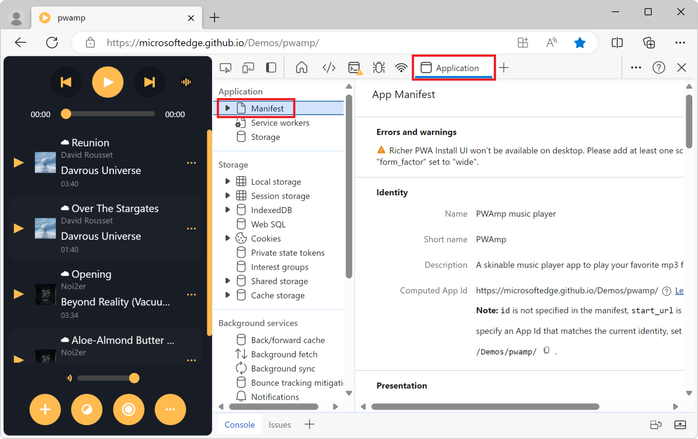

1. In the sidebar, under **Storage**, expand the **IndexedDB** menu to see which databases are available:

   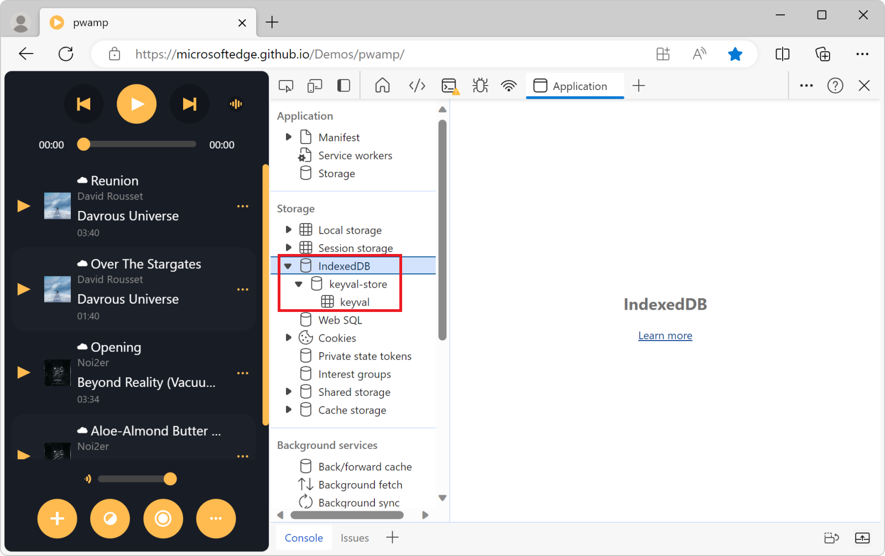

   * () `keyval-store` represents a database.

   * () `keyval` is an object store in the database.

1. Select the `keyval-store` database, to see its origin, version number, and other information about the database:

   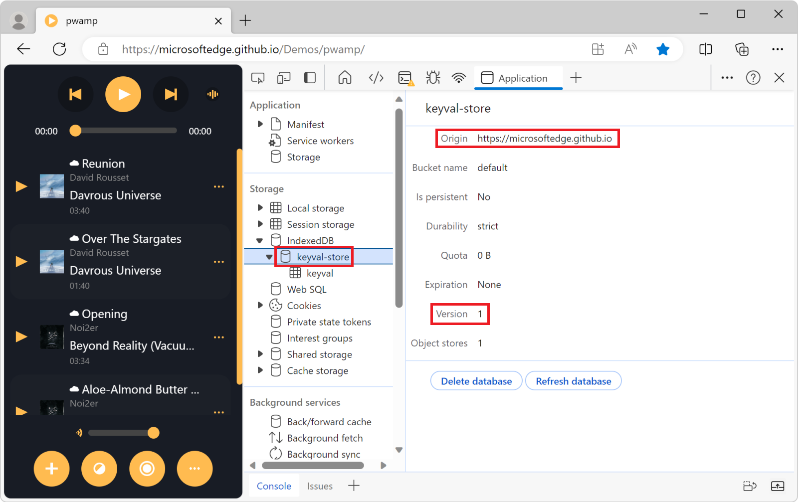

1. Click the `keyval` object store, to see the key-value pairs:

   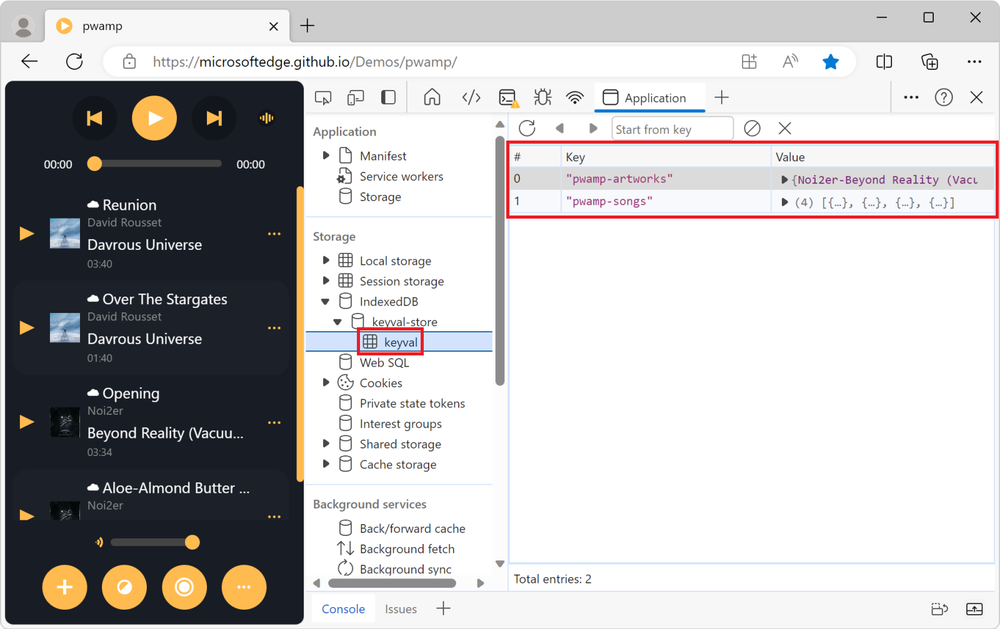

   **Note:** IndexedDB data doesn't update in real-time. If you see outdated data displayed in an object store, refresh the object store view. See [Refresh IndexedDB data](#refresh-indexeddb-data).

1. Click a cell in the **Value** column to expand the value:

   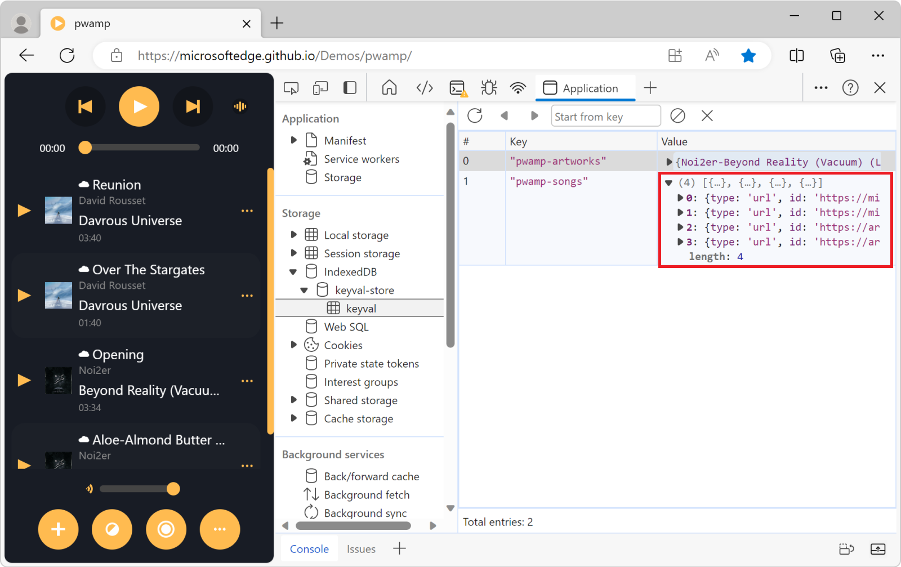


<!-- ====================================================================== -->
## Refresh IndexedDB data

IndexedDB values in the **Application** tool don't update in real-time.

*  To refresh the data, view an object store and then click the **Refresh** () button.

*  To refresh all data in an IndexedDB database, view a database and then click **Refresh database**:

   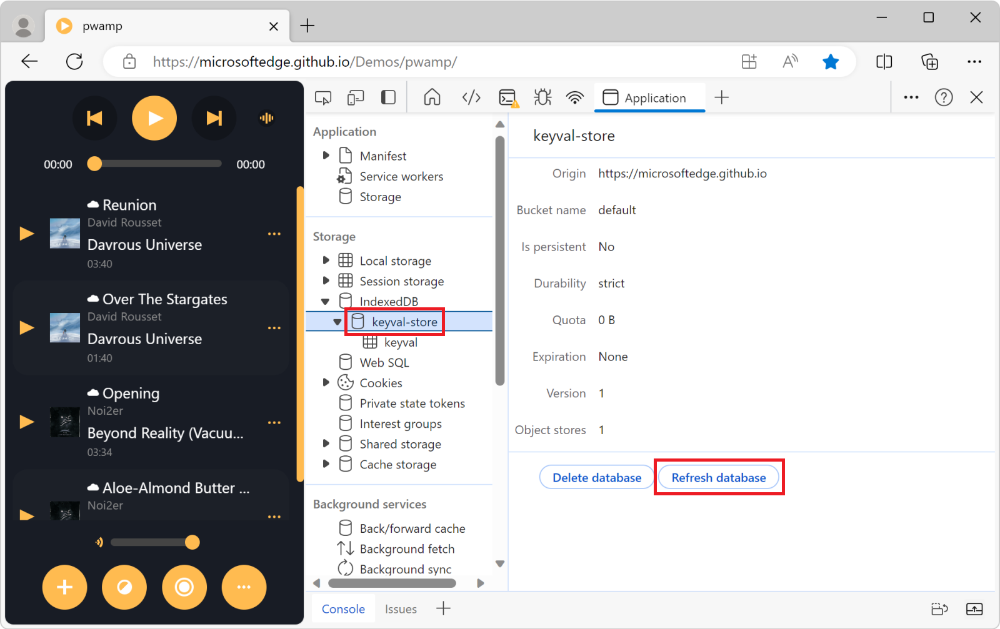


<!-- ====================================================================== -->
## Edit IndexedDB data

IndexedDB keys and values aren't editable from the **Application** tool.  However, since DevTools has access to the page context, you can run JavaScript code within DevTools to edit the data stored in an IndexedDB database.

#### Edit IndexedDB data by using the Console tool

1. In DevTools, on the **Activity Bar**, select the **Console** tab.

1. In the **Console** tool, run JavaScript code to edit the IndexedDB data. For example, to add a new value to the `keyval` object store, run the following code:
   
   ```javascript
   let connection = indexedDB.open("keyval-store", 1);

   connection.onsuccess = e => {
     const database = e.target.result;
     const transaction = database.transaction("keyval", "readwrite");
     const objectStore = transaction.objectStore("keyval");
     const request = objectStore.add({foo: "bar"}, "new-key");
     request.onsuccess = e => {
       console.log(e.target.result);
     }
   }
   ```

#### Edit IndexedDB data by using snippets

[Snippets](../javascript/snippets.md) are a way to store and run JavaScript code repeatedly, within DevTools.  If you need to edit IndexedDB data often, store it in a new snippet, and then run the snippet. To learn more, see [Run snippets of JavaScript on any webpage](../javascript/snippets.md).

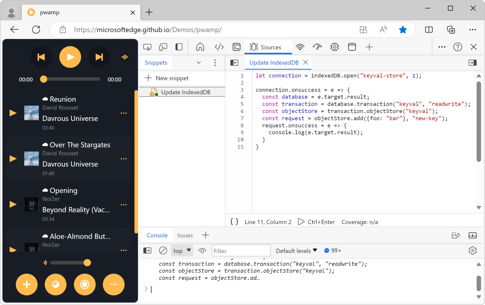


<!-- ====================================================================== -->
## Delete IndexedDB data


You can delete any of the following:
* An IndexedDB key-value pair.
* All key-value pairs in an object store.
* An IndexedDB database.
* All IndexedDB storage.

These options are described below.


#### Delete an IndexedDB key-value pair

1. [View an IndexedDB object store](#view-indexeddb-data).

1. Click the key-value pair that you want to delete.  DevTools highlights the key-value pair to indicate that it's selected:

   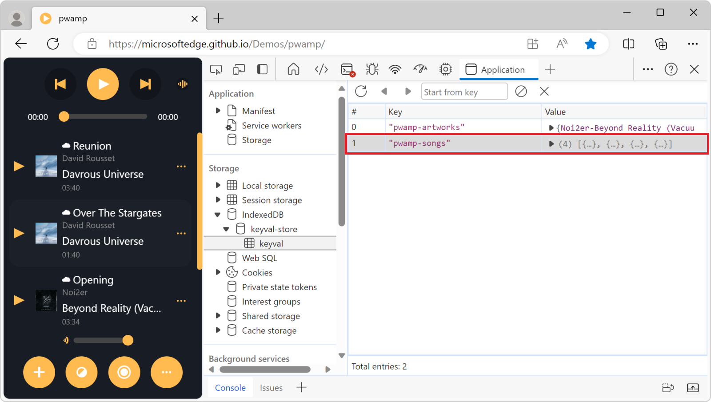

1. Press `Delete`, or click the **Delete selected** () button:

   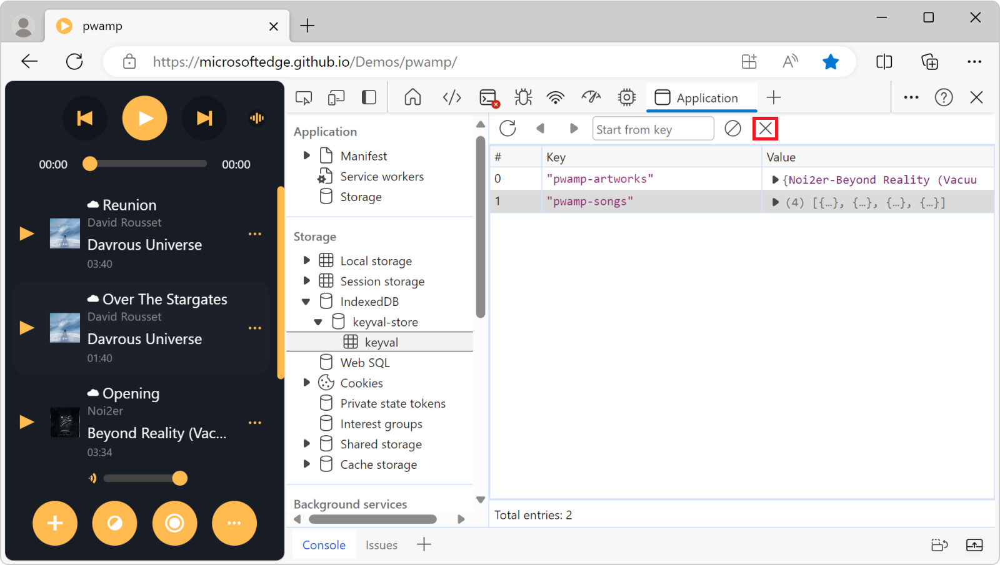

#### Delete all key-value pairs in an object store

1. [View an IndexedDB object store](#view-indexeddb-data).

1. Click the **Clear object store** () button.

   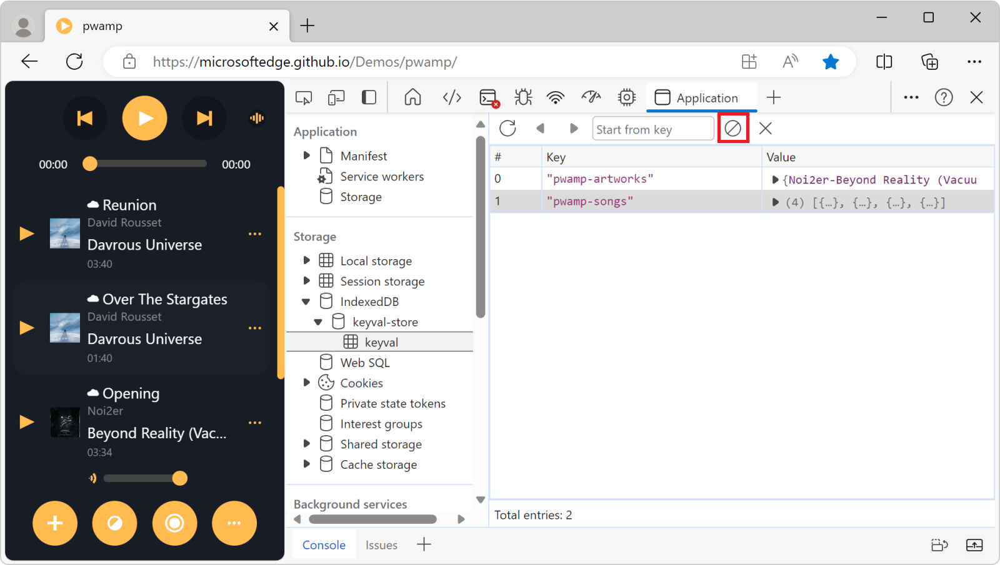

#### Delete an IndexedDB database

1. [View the IndexedDB database](#view-indexeddb-data) that you want to delete.

1. Click **Delete database**.

   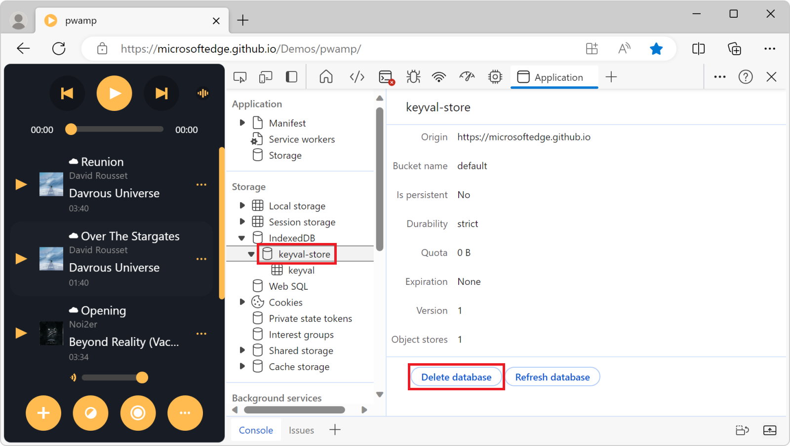

#### Delete all IndexedDB storage

1. In the sidebar of the **Application** tool, click **Storage**.

1. Scroll down to the **Storage** checkboxes and make sure that the **IndexedDB** checkbox is selected.

1. Click the **Clear site data** button.

   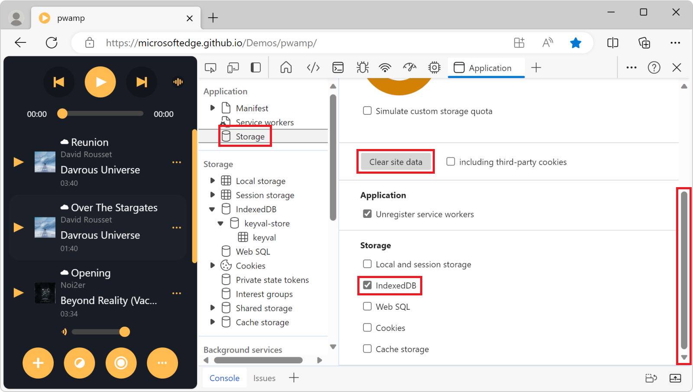


<!-- ====================================================================== -->
> [!NOTE]
> Portions of this page are modifications based on work created and [shared by Google](https://developers.google.com/terms/site-policies) and used according to terms described in the [Creative Commons Attribution 4.0 International License](https://creativecommons.org/licenses/by/4.0).
> The original page is found [here](https://developer.chrome.com/docs/devtools/storage/indexeddb/) and is authored by [Kayce Basques](https://developers.google.com/web/resources/contributors#kayce-basques) (Technical Writer, Chrome DevTools \& Lighthouse).

[](https://creativecommons.org/licenses/by/4.0)
This work is licensed under a [Creative Commons Attribution 4.0 International License](https://creativecommons.org/licenses/by/4.0).
