<!-- Copyright Kayce Basques

   Licensed under the Apache License, Version 2.0 (the "License");
   you may not use this file except in compliance with the License.
   You may obtain a copy of the License at

       https://www.apache.org/licenses/LICENSE-2.0

   Unless required by applicable law or agreed to in writing, software
   distributed under the License is distributed on an "AS IS" BASIS,
   WITHOUT WARRANTIES OR CONDITIONS OF ANY KIND, either express or implied.
   See the License for the specific language governing permissions and
   limitations under the License.  -->
# View and change IndexedDB data

To view and change [IndexedDB](https://developer.mozilla.org/docs/Web/API/IndexedDB_API) data, use the **Application** tool.

<!-- ====================================================================== -->
## View IndexedDB data

1. In DevTools, click the **Application** tab to open the **Application** tool.  The **Manifest** pane usually opens by default.

   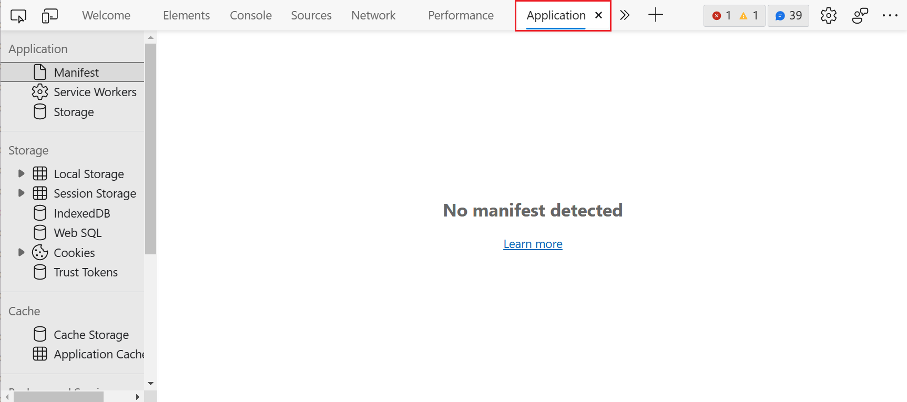

1. Expand the **IndexedDB** menu to review which databases are available.

   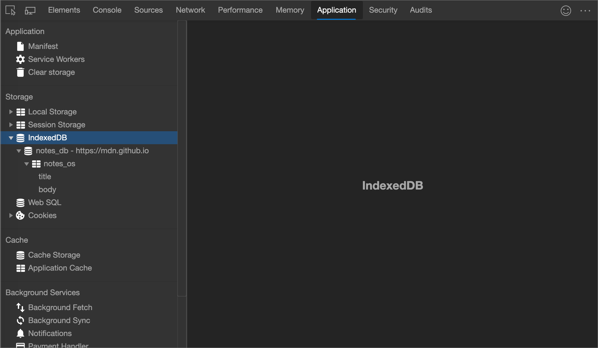

   * () `notes - https://mdn.github.io` represents a database, where `notes` is the name of the database and `https://mdn.github.io` is the origin that accesses the database.

   * () `notes` is an object store.

   *  **title** and **body** are [indexes](https://developer.mozilla.org/docs/Web/API/IndexedDB_API/Using_IndexedDB#Using_an_index).

   > [!NOTE]
   > **Known Limitation**  Third-party databases aren't visible.  For example, if you use an `<iframe>` to embed an ad on your page, and your ad network uses IndexedDB, the IndexedDB data for your ad network isn't visible.  See [issue #943770](https://crbug.com/943770).

1. Select a database, to see the origin and version number.

   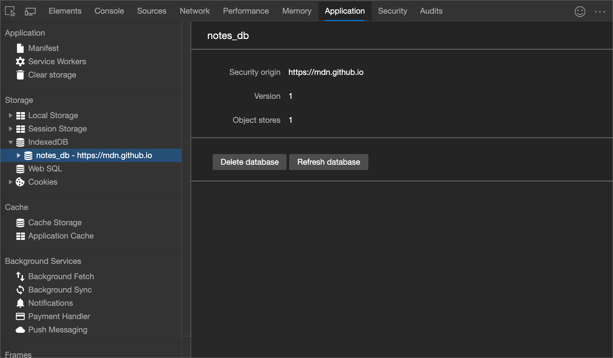

1. Click an object store, to see the key-value pairs.

   > [!NOTE]
   > IndexedDB data doesn't update in real-time.  See [Refresh IndexedDB data](#refresh-indexeddb-data).

   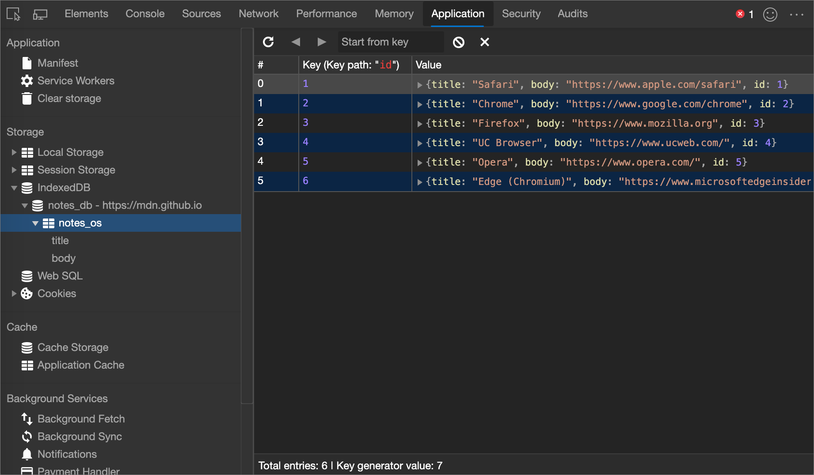

   *  **Total entries** is the total number of key-value pairs in the object store.

   *  **Key generator value** is the next available key.  The field is only shown when using [key generators](https://developer.mozilla.org/docs/Web/API/IndexedDB_API/Basic_Concepts_Behind_IndexedDB#gloss_keygenerator).

1. Click a cell in the **Value** column to expand the value.

   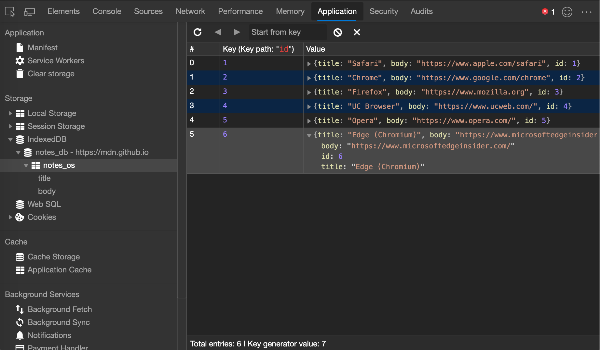

1. Click an index, such as **title** or **body** in the following figure, to sort the object store according to the values of that index.

   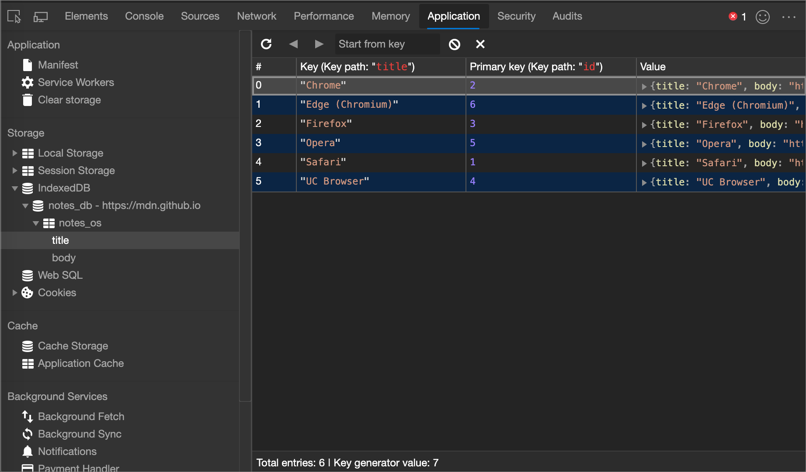

<!-- ====================================================================== -->
## Refresh IndexedDB data

IndexedDB values in the **Application** tool don't update in real-time.

*  To refresh the data, view an object store and then click **Refresh** ().
*  To refresh all data, view a database and click **Refresh database**.

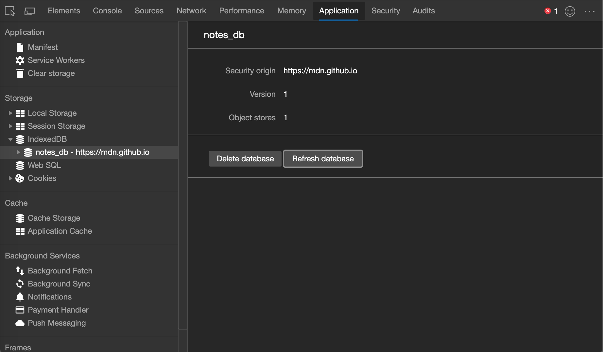

<!-- ====================================================================== -->
## Edit IndexedDB data

IndexedDB keys and values aren't editable from the **Application** tool.  However, since DevTools has access to page context, you can run JavaScript code within DevTools to edit IndexedDB data.

### Edit IndexedDB data with Snippets

[Snippets](../javascript/snippets.md) are a way to store and run blocks of JavaScript code within DevTools.  When you run a Snippet, the result is logged to the **Console**.  You can use a Snippet to run JavaScript code to edit an IndexedDB database.

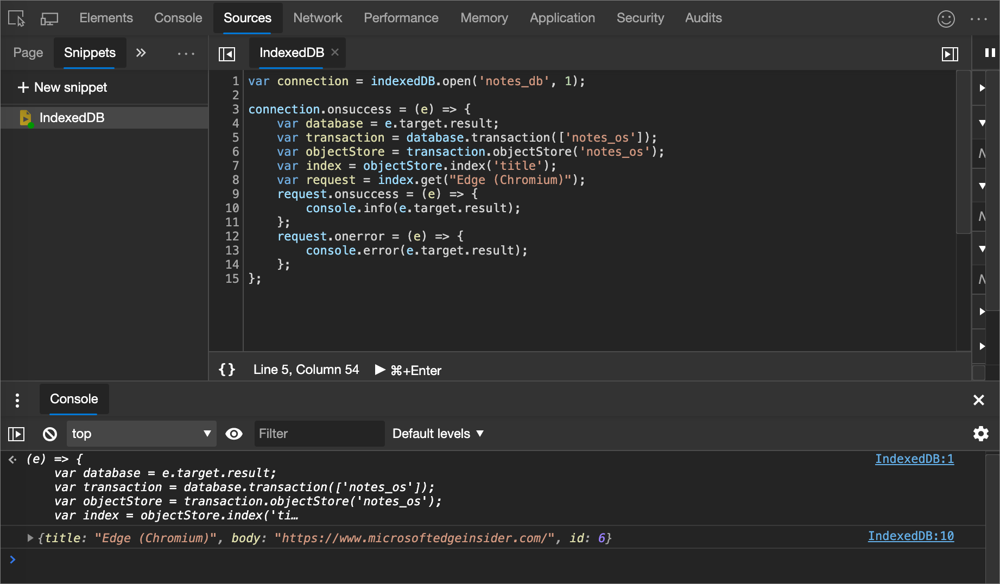

<!-- ====================================================================== -->
## Delete IndexedDB data

### Delete an IndexedDB key-value pair

1. [View an IndexedDB object store](#view-indexeddb-data).

1. Click the key-value pair that you want to delete.  DevTools highlights it to indicate that it is selected.

   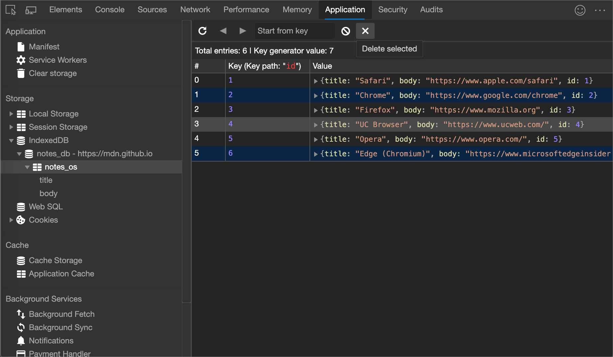

1. Press `Delete` or click **Delete Selected** ().

   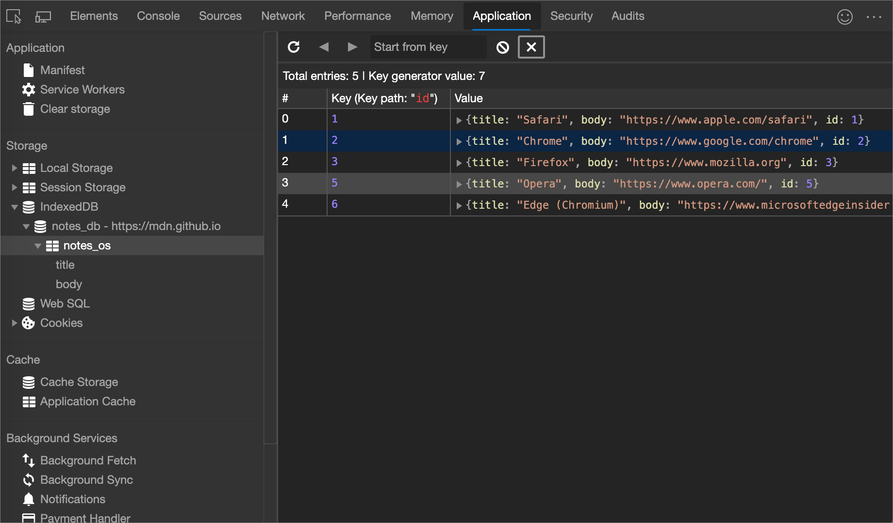

### Delete all key-value pairs in an object store

1. [View an IndexedDB object store](#view-indexeddb-data).

   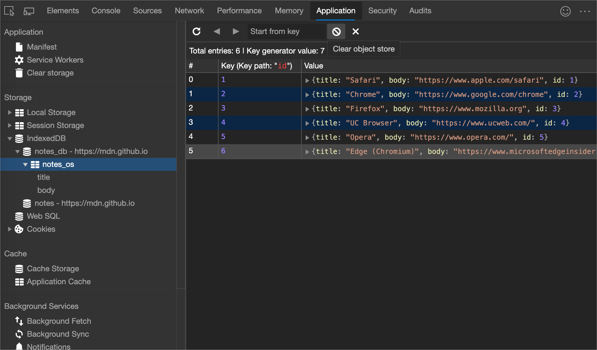

1. Click **Clear object store** ().

### Delete an IndexedDB database

1. [View the IndexedDB database](#view-indexeddb-data) that you want to delete.

1. Click **Delete database**.

   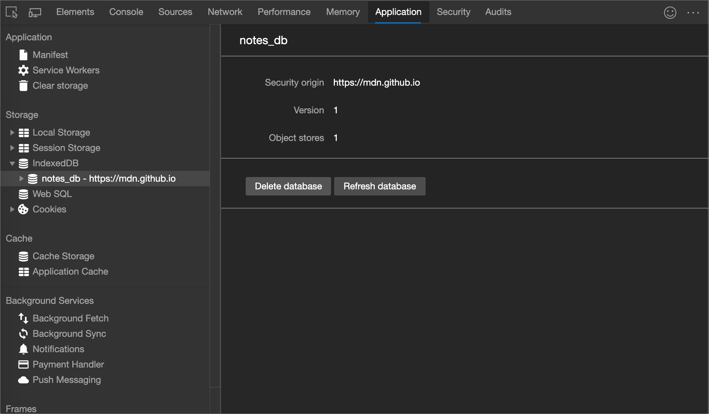

### Delete all IndexedDB storage

1. Open the **Clear storage** pane.

1. Make sure that the **IndexedDB** checkbox is enabled.

1. Click **Clear site data**.

   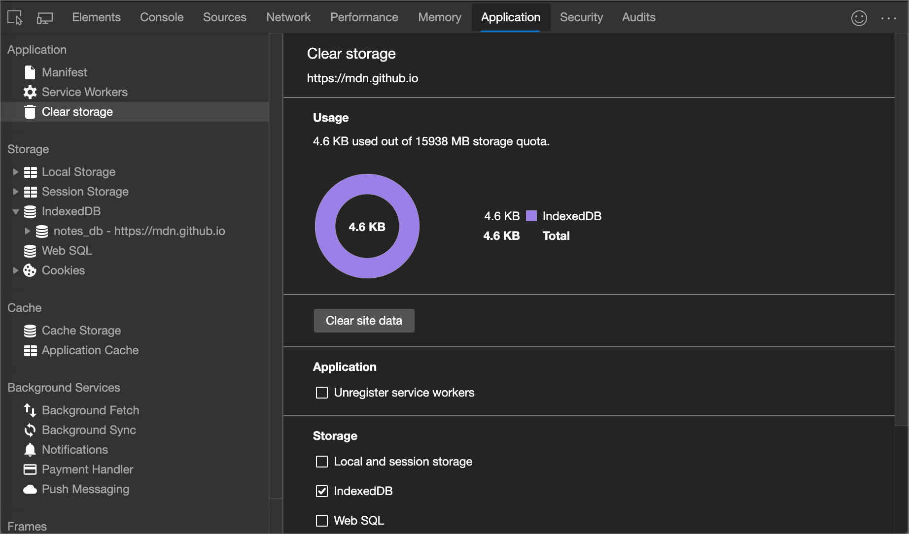

<!-- ====================================================================== -->
> [!NOTE]
> Portions of this page are modifications based on work created and [shared by Google](https://developers.google.com/terms/site-policies) and used according to terms described in the [Creative Commons Attribution 4.0 International License](https://creativecommons.org/licenses/by/4.0).
> The original page is found [here](https://developer.chrome.com/docs/devtools/storage/indexeddb/) and is authored by [Kayce Basques](https://developers.google.com/web/resources/contributors#kayce-basques) (Technical Writer, Chrome DevTools \& Lighthouse).

This work is licensed under a [Creative Commons Attribution 4.0 International License](https://creativecommons.org/licenses/by/4.0).
