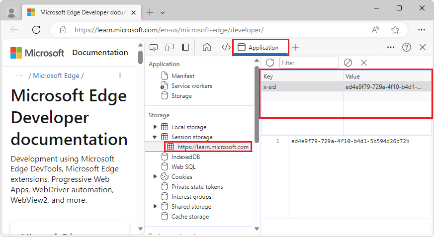
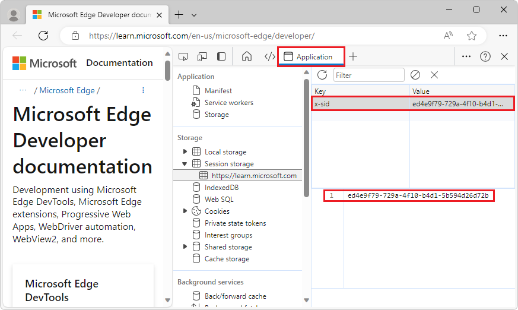

<!-- Copyright Kayce Basques

   Licensed under the Apache License, Version 2.0 (the "License");
   you may not use this file except in compliance with the License.
   You may obtain a copy of the License at

       https://www.apache.org/licenses/LICENSE-2.0

   Unless required by applicable law or agreed to in writing, software
   distributed under the License is distributed on an "AS IS" BASIS,
   WITHOUT WARRANTIES OR CONDITIONS OF ANY KIND, either express or implied.
   See the License for the specific language governing permissions and
   limitations under the License.  -->
# View and edit session storage

To view, edit, and delete [sessionStorage](https://developer.mozilla.org/docs/Web/API/Window/sessionStorage) key-value pairs, use the **Application** tool.

<!-- ====================================================================== -->
## View sessionStorage keys and values

1. In DevTools, click the **Application** tab to open the **Application** tool.  The **Manifest** panel is shown by default.

   

1. Expand the **Session Storage** menu.

   

1. Click a domain to view the key-value pairs.

   

1. Click a row of the table to view the value in the viewer below the table.

   

<!-- ====================================================================== -->
## Create a new sessionStorage key-value pair

1. [View the sessionStorage key-value pairs of a domain](#view-sessionstorage-keys-and-values).

1. Double-click the empty part of the table.  DevTools creates a new row and focuses your cursor in the **Key** column.

   

<!-- ====================================================================== -->
## Edit sessionStorage keys or values

1. [View the sessionStorage key-value pairs of a domain](#view-sessionstorage-keys-and-values).

1. Double-click a cell in the **Key** or **Value** column to edit that key or value.

   

<!-- ====================================================================== -->
## Delete sessionStorage key-value pairs

1. [View the `sessionStorage` key-value pairs of a domain](#view-sessionstorage-keys-and-values).

1. Click the key-value pair that you want to delete.  DevTools highlights it blue to indicate that it is selected.

1. Press `Delete` or click **Delete Selected** ().

<!-- ====================================================================== -->
## Delete all sessionStorage key-value pairs for a domain

1. [View the `sessionStorage` key-value pairs of a domain](#view-sessionstorage-keys-and-values).

1. Click **Clear All** ().

<!-- ====================================================================== -->
## Interact with sessionStorage from the Console

Since you can run JavaScript in the **Console**, and since the **Console** has access to the JavaScript contexts of the page, it's possible to interact with `sessionStorage` from the **Console**.

1. Use the **JavaScript contexts** menu to change the JavaScript context of the **Console** if you want to access the `sessionStorage` key-value pairs of a domain other than the page you are on.

   

1. Run your `sessionStorage` expressions in the **Console**, the same as your JavaScript.

   

<!-- ====================================================================== -->
> [!NOTE]
> Portions of this page are modifications based on work created and [shared by Google](https://developers.google.com/terms/site-policies) and used according to terms described in the [Creative Commons Attribution 4.0 International License](https://creativecommons.org/licenses/by/4.0).
> The original page is found [here](https://developer.chrome.com/docs/devtools/storage/sessionstorage/) and is authored by [Kayce Basques](https://developers.google.com/web/resources/contributors#kayce-basques) (Technical Writer, Chrome DevTools \& Lighthouse).

This work is licensed under a [Creative Commons Attribution 4.0 International License](https://creativecommons.org/licenses/by/4.0).
