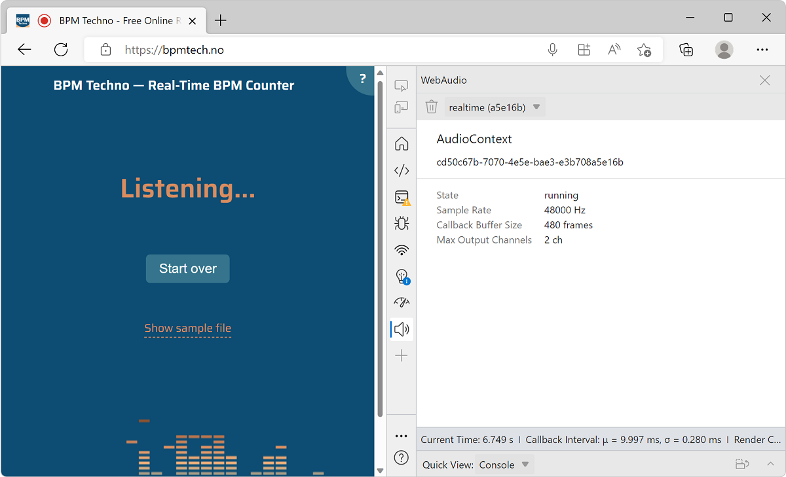

Use the **WebAudio** tool to monitor **WebAudio** calls and traffic, for a webpage that uses the WebAudio API.

To open the **WebAudio** tool:

1. To open DevTools, right-click the webpage, and then select **Inspect**.  Or, press `Ctrl`+`Shift`+`I` (Windows, Linux) or `Command`+`Option`+`I` (macOS).  DevTools opens.

1. In DevTools, on the main toolbar, click the **More Tools** () button, and then select **WebAudio**.

1. Go to a webpage that uses the WebAudio API.

<!-- 
https://webaudio.github.io/demo-list/
-->