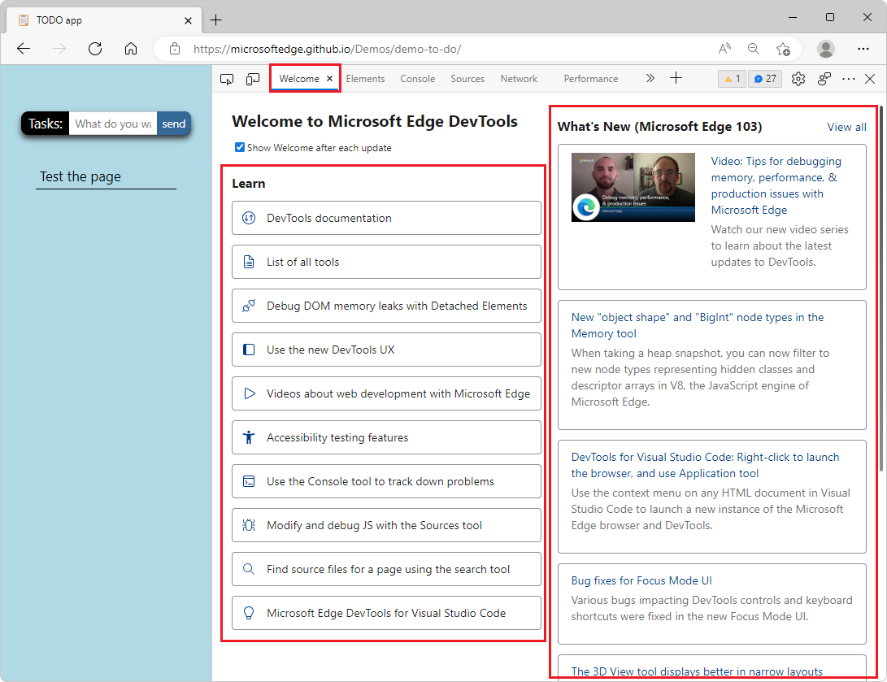

# Welcome tool

The **Welcome** tool opens when you first open DevTools.  It displays:

*  Links to developer docs.
*  Latest features.
*  Release notes.
*  Option to contact the Microsoft Edge DevTools team.

The **Welcome** tool opens automatically after each update to Microsoft Edge.

To prevent the display of the **Welcome** tool after each update, clear the checkbox next to **Open tab after each update** under the **Welcome** tool title.

