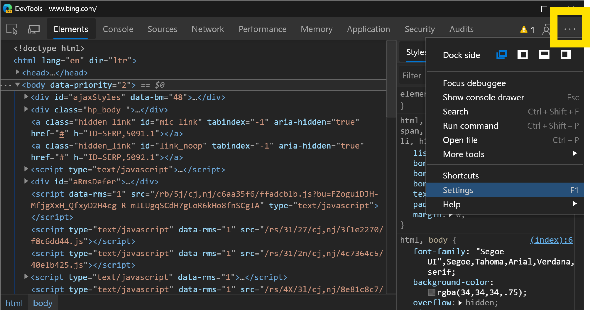
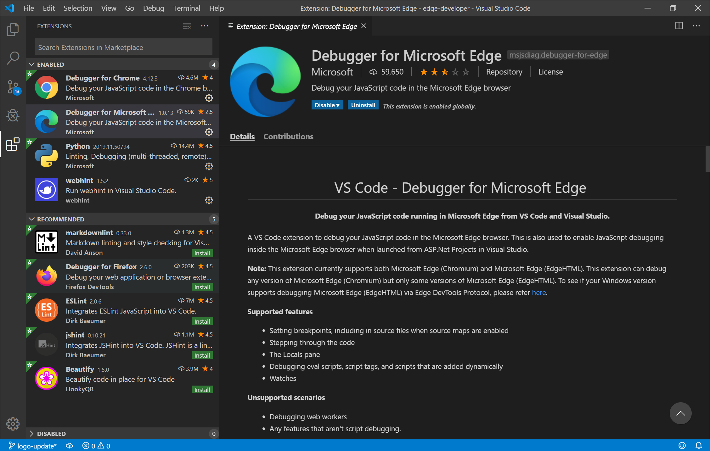

# What's new in the Microsoft Edge (Chromium) DevTools

Thank you so much for trying out a preview of the next version of Microsoft Edge! With this release, we've undertaken a major shift in the underlying web platform of Microsoft Edge by adopting the Chromium open source project. With this change, it will be easier for you to build and test your web sites in Microsoft Edge and ensure they will still work as expected even if your users are browsing in a different Chromium-based browser, like Google Chrome, Vivaldi, Opera, or Brave.

## The new Microsoft Edge (Chromium) DevTools

If you are checking out Microsoft Edge and you mainly develop in a Chromium-based browser, you should feel right at home. The Microsoft Edge (Chromium) Developer Tools are exactly like the developer tools you already know and use!


If you are checking out the next version of Microsoft Edge and you mainly developed in Microsoft Edge (EdgeHTML), we have got some great new tools that we hope will make it easier and faster for you to build and test your web sites in Microsoft Edge! To learn more about these new tools, check out [The Microsoft Edge (Chromium) DevTools Guide](./../devtools-guide-chromium.md).

## New dark and light themes for the DevTools

We've designed some new dark and light themes for the DevTools that we think you'll love! By default, the Microsoft Edge (Chromium) DevTools will use the Dark theme. To change the theme of the DevTools, press `Fn` + `F1` on Windows or Mac or navigate to Settings using the `...` button in the top right corner of the DevTools.



From Settings, you can change the theme of the DevTools. If you liked the way the DevTools looked in your Chromium-based browser, you can make the Microsoft Edge (Chromium) DevTools look exactly like them by selecting the **Dark (Chromium)** or **Light (Chromium)** themes respectively. 

## Debug Microsoft Edge (Chromium) from VS Code

With the [Debugger for Microsoft Edge](https://marketplace.visualstudio.com/items?itemName=msjsdiag.debugger-for-edge) VS Code extension, you can now debug both Microsoft Edge (EdgeHTML) and Microsoft Edge (Chromium) directly from VS Code!



To launch Microsoft Edge (Chromium) instead of Microsoft Edge (EdgeHTML) from VS Code, you need to add a `version` attribute to your existing **launch.json** configuration with the version of Microsoft Edge (Chromium) you want to launch (`dev`, `beta`, or `canary`). Here's a sample **launch.json** configuration that will launch the Canary version of Microsoft Edge (Chromium) to [bing.com](https://www.bing.com/):

```json
{
    "type": "edge",
    "request": "launch",
    "version": "canary",
    "name": "Launch Microsoft Edge (Chromium) Canary against Bing",
    "url": "https://bing.com"
}
```

For more information, check out [how to debug Microsoft Edge (Chromium) from VS Code](./../visual-studio-code/debugger-for-edge.md).

## Edge DevTools Protocol update

With the shift in the underlying web platform of Microsoft Edge, the Edge DevTools Protocol will not be receiving any further updates. The Microsoft Edge (Chromium) DevTools will use the Chrome DevTools Protocol or CDP. To reference documentation on the domains and methods in CDP, please refer to [the CDP viewer](https://chromedevtools.github.io/devtools-protocol/tot/Accessibility).

In the next version of Microsoft Edge, any methods that are prefixed with `ms` will not be supported. To learn more about how to use CDP in Microsoft Edge (Chromium), please refer to [DevTools Protocol (Chromium)](./../devtools-protocol-chromium.md).

## Known issues

Many links from the Microsoft Edge (Chromium) DevTools to content hosted on third-party sites have been removed temporarily. As soon as we can replace these links, we will add them back to the DevTools. We have also removed the **What's New** tool from the drawer in the DevTools, which also contains content that is hosted on a third-party site, until we can replace it.

Extensions to the DevTools cannot yet be installed from the [Microsoft Store](https://edgestoreweb.asgfalcon.io/en-us/microsoft-edge/insider-addons/category/EdgeExtensions). For now, you can acquire DevTools extensions from the [Chrome Web Store](https://chrome.google.com/webstore/category/extensions). See [the Extensions section](./../devtools-guide-chromium.md#extensions) of the Microsoft Edge (Chromium) DevTools Guide for more information.

When debugging web content on an Android device from Microsoft Edge (Chromium), the version of the DevTools that launches when you click the **Inspect** button from the **Remote devices** tool may not match the version of the browser on your Android device. As a result, you may see new features in the DevTools that will not work against the browser on your Android device. If this is something you encounter, we'd love to hear about it so please [file feedback](./../devtools-guide-chromium.md#feedback)!

Finally, Visual Studio on Windows and Mac does not yet support Microsoft Edge (Chromium). Sign up [here](https://visualstudio.microsoft.com/vs/preview/) to be the first to know when we have a preview version of Visual Studio that supports JavaScript debugging inside Microsoft Edge (Chromium) for ASP.NET projects!