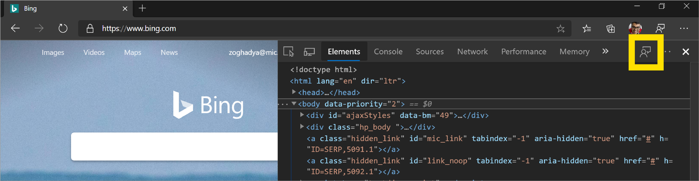
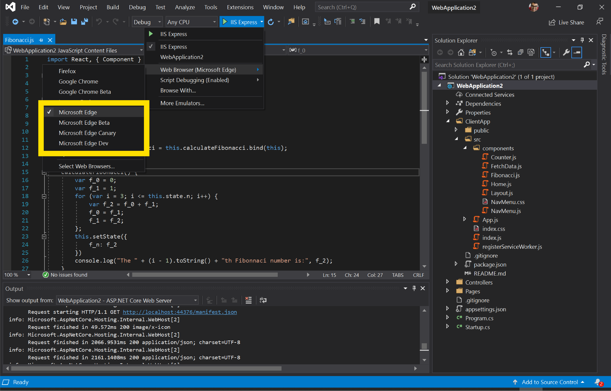

# What Is New In DevTools (Microsoft Edge 80) 


## Accessibility improvements to the DevTools  

Microsoft has contributed over 200 changes to the DevTools to address high-impact color contrast, keyboard, and screen reader issues.  Microsoft wants to enable every developer building the web to use the DevTools including screen reader and keyboard users.  

<figure>
  
</figure>

Want to learn how to make your web page accessible to all of your users?  Download the [Accessibility Insights](https://accessibilityinsights.io) or [webhint](https://webhint.io/docs/user-guide/extensions/extension-browser) extensions for Microsoft Edge to get started.  If you use screen readers or the keyboard to navigate around the DevTools, Microsoft is eager to hear your feedback so [tweet](https://twitter.com/intent/tweet?text=@EdgeDevTools) or click the  icon and let Microsoft know what you think!  

## Using the DevTools in other languages  

When data from other developer tools was examined, it was learned that many developers prefer to use development tools in their native language, not just in English.  So Microsoft has been hard at work translating the DevTools into 10 other languages.  You are able to now use the DevTools in the following languages:  

1.  Chinese (Simplified) - 中文(简体)（简体）  
1.  Chinese (Traditional) - 中文(繁體)（繁體）  
1.  English (United States)  
1.  French – français  
1.  German - Deutsch  
1.  Italian - italiano  
1.  Japanese - 日本語  
1.  Korean - 한국어  
1.  Portuguese - português  
1.  Russian – русский  
1.  Spanish - español  

To use the DevTools in your native language, navigate to `edge://flags` and set the **Enable localized Developer Tools** flag to **Enabled**.  Also set the **Developer Tools experiments** flag to **Enabled**.  Restart the browser and open the DevTools.  <!-- Press `F1` in the DevTools or go to Settings > Experiments and check the **Match browser language** checkbox.  -->  Now, whatever language you display the browser in `edge://settings/languages`, the DevTools matches that language.  

<figure>
  
</figure>

If you want to use the DevTools in a different language than the ones that Microsoft has available, send your feedback by [tweeting](https://twitter.com/intent/tweet?text=@EdgeDevTools) or clicking the  icon.  

## webhint Mirosoft Edge extension  

The webhint browser extension allows you to easily scan your web page and get feedback on accessibility, browser compatibility, security, performance, and more within the Microsoft Edge DevTools.  Read more at [https://webhint.io](https://webhint.io).  

<figure>
  
</figure>

[Try the webhint browser extension in Microsoft Edge](https://microsoftedge.microsoft.com/insider-addons/detail/mlgfbihcfnkaenjpdcngdnhcpkdmcdee).  Once you install the extension, simply open DevTools and select the Hints tab.  From here, you are be able to run a customizable site scan.  Head over to [webhint.io](https://webhint.io/docs/user-guide/extensions/extension-browser) to learn more about the extension.  

## 3D View  

Use the **3D View** to debug your web application by navigating through the [Document Object Model \(DOM\)](https://developer.mozilla.org/docs/Web/API/Document_Object_Model) or the [z-index](https://developer.mozilla.org/docs/Web/CSS/z-index) stacking context.  

<figure>
  
</figure>

With it you are able to:  

*   Explore the web page translated into a 3D perspective  
*   Debugging based on z-index stacking context  
*   Clear some of the clutter in the DOM pane or the z-index pane
*   Pick the color scheme to best debug your DOM problems or z-index problems  

To access the 3D View, navigate to `edge://flags` and ensure that the **Developer Tools experiments** flag is set to **Enabled**.  Restart the browser and open the DevTools.  Press `F1` in the DevTools or go to `Settings > Experiments` and check the **Enable 3D View** checkbox.  Now, press `Ctrl` + `Shift` + `P`, type in **3D View** and select **Show 3D View**.  

There are two panes that you may use for your debugging experience.  
1.  **Z-index**  Navigate through the different elements in the web application with the z-index context in mind.  This is the default pane.  
2.  **3D DOM**  Explore the DOM as a whole with all the elements at your fingertips.  To access this pane, click on the **DOM** pane next to the **Z-index** pane.  

Microsoft is working on the UI and adding more functionality to the 3D View based on asks from users like you.  Please send your feedback so Microsoft is able to continue improving the 3D View for you!  Simply click the  icon in the DevTools and enter any feedback or feature requests you have for the 3D View.

## VS Code extensions  

Microsoft has also released some extensions for [VS Code](https://code.visualstudio.com) that let you use the power of the DevTools directly from your text editor.  You are able to debug your JavaScript, see a preview of your web page, edit style rules with the Elements tool, and scan your code with webhint all while writing your web page in VS Code!  Check out the extensions below:  

### Elements for Microsoft Edge  

By adding the [Elements for Edge](https://marketplace.visualstudio.com/items?itemName=ms-edgedevtools.vscode-edge-devtools) VS Code extension, you are able to use the Microsoft Edge Elements tool from within [Visual Studio Code \(VS Code\)](https://code.visualstudio.com).  By either launching or attaching, the Elements tool connects to an instance of Microsoft Edge, display the runtime HTML structure, and allow you to alter the layout or fix styling issues.  

<figure>
  
</figure>

For more information, check out [this page](/microsoft-edge/visual-studio-code/elements-for-edge.md).  

### Debugger for Microsoft Edge  

With the [Debugger for Microsoft Edge](https://marketplace.visualstudio.com/items?itemName=msjsdiag.debugger-for-edge) VS Code extension, you are able to now debug both Microsoft Edge \(EdgeHTML\) and Microsoft Edge \(Chromium\) directly from VS Code!  

<figure>
  
</figure>

To launch Microsoft Edge \(Chromium\) instead of Microsoft Edge \(EdgeHTML\) from VS Code, you need to add a `version` attribute to your existing **launch.json** configuration with the version of Microsoft Edge \(Chromium\) you want to launch \(`dev`, `beta`, or `canary`\).  Here is a sample **launch.json** configuration that launches the Canary version of Microsoft Edge \(Chromium\) to [bing.com](https://www.bing.com):  

```json
{
    "type": "edge",
    "request": "launch",
    "version": "canary",
    "name": "Launch Microsoft Edge (Chromium) Canary against Bing",
    "url": "https://bing.com"
}
```

For more information, check out [how to debug Microsoft Edge (Chromium) from VS Code](/microsoft-edge/visual-studio-code/debugger-for-edge.md).  

### webhint  

The [webhint](https://marketplace.visualstudio.com/items?itemName=webhint.vscode-webhint) VS Code extension uses `webhint` to improve your web page during development.  This extension runs and reports diagnostics for workspace files based on `webhint` analysis.  

<figure>
  
</figure>

[Learn more about the VS Code webhint extension](https://webhint.io/docs/user-guide/extensions/vscode-webhint).  

## Visual Studio  

With [Visual Studio](https://visualstudio.microsoft.com) today, you are able to already debug JavaScript running in the legacy version of Microsoft Edge, built on top of the [EdgeHTML](/microsoft-edge/dev-guide/whats-new.md) web platform.  Starting with Visual Studio 2019 version 16.2, support is extended to the current builds of Microsoft Edge that leverage Chromium.  Head to [https://visualstudio.microsoft.com/downloads](https://visualstudio.microsoft.com/downloads) to download the latest Visual Studio!  

<figure>
  
</figure>

[Read our blog post about how to debug Microsoft Edge from Visual Studio](https://devblogs.microsoft.com/visualstudio/debug-javascript-in-microsoft-edge-from-visual-studio).  

## Support for `let` and `class` redeclarations in the Console   

The Console now supports redeclarations of `let` and `class` statements.  The inability to redeclare was a common annoyance for web developers who use the Console to experiment with new JavaScript code.  

> [!WARNING]
> Redeclaring a `let` or `class` statement in a script outside of the Console or within a single Console input still causes a `SyntaxError`.  

For example, previously, when redeclaring a local variable with `let`, the Console would throw an error:  

<figure>
  
</figure>

Now, the Console allows the redeclaration:  

<figure>
  
</figure>

Chromium issue [#1004193](https://crbug.com/1004193)  

## Improved WebAssembly debugging 

DevTools has started to support the [DWARF Debugging Standard](http://dwarfstd.org), which means increased support for stepping over code, setting breakpoints, and resolving stack traces in your source languages within DevTools.  
<!-- [TODO: Add this link back] Check out [Improved WebAssembly debugging in Microsoft Edge DevTools](/microsoft-edge/devtools-guide-chromium/whats-new/2019/12/webassembly)
for the full story.  -->

<!-- [TODO: Replace this image with screenshot in Edge] <figure>
  
</figure> -->

## Network panel updates   

### Request Initiator Chains in the Initiator tab   

You are able to now view the initiators and dependencies of a network request as a nested list.  This may help you understand why a resource was requested, or what network activity a certain resource \(such as a script\) caused.  

<figure>
  
</figure>

After [logging network activity in the Network panel](/microsoft-edge/devtools-guide-chromium/network/index.md), click a resource and then go to the **Initiator** tab to view the **Request Initiator Chain**:  

*   The **inspected resource** is bold.  In the screenshot above, `https://az416426.vo.msecnd.net/next/ai.2.min.js` is the inspected resource.  
*   The resources above the inspected resource are the **initiators**.  In the screenshot above, `https://www.microsoftedgeinsider.com/en-us` is the initiator of `https://az416426.vo.msecnd.net/next/ai.2.min.js`.  In other words, `https://www.microsoftedgeinsider.com/en-us` caused the network request for `https://az416426.vo.msecnd.net/next/ai.2.min.js`.  
*   The resources below the inspected resource are the **dependencies**.  In the screenshot above, `https://dc.services.visualstudio.com/v2/track` is a dependency of `https://az416426.vo.msecnd.net/next/ai.2.min.js`.  In other words, `https://az416426.vo.msecnd.net/next/ai.2.min.js` caused the network request for `https://dc.services.visualstudio.com/v2/track`.  

> [!NOTE]
> Initiator and dependency information may also be accessed by holding `Shift` and then hovering over network resources.  See [View initiators and dependencies](/microsoft-edge/devtools-guide-chromium/network/reference.md#view-initiators-and-dependencies).  

Chromium issue [#842488](https://crbug.com/842488)  

### Highlight the selected network request in the Overview   

After you click a network resource in order to inspect it, the Network panel now puts a blue border around that resource in the **Overview**.  This is able to help you detect if the network request is happening earlier or later than expected.  

<figure>
  
</figure>

Chromium issue [#988253](https://crbug.com/988253)  

### URL and path columns in the Network panel   

Use the new **Path** and **URL** columns in the **Network** panel to see the absolute path or full URL of each network resource.  

<figure>
  
</figure>

Right-click the **Waterfall** table header and select **Path** or **URL** to show the new columns.  


Chromium issue [#993366](https://crbug.com/993366)  

### Updated User-Agent strings   

DevTools supports setting a custom User-Agent string through the **Network Conditions** tab.  The User-Agent string affects the `User-Agent` HTTP header attached to network resources, and also the value of `navigator.userAgent`.  

The predefined User-Agent strings have been updated to reflect modern browser versions.  

<figure>
  
</figure>

To access **Network Conditions**, [open the Command Menu](/microsoft-edge/devtools-guide-chromium/command-menu/index.md) and run the `Show Network Conditions` command.  

> [!NOTE]
> You may also [set User-Agent strings in Device Mode](/microsoft-edge/devtools-guide-chromium/device-mode/index.md#simulate-a-mobile-viewport).  

Chromium issue [#1029031](https://crbug.com/1029031)  

## Audits panel updates   

### New configuration UI   

The configuration UI has a new, responsive design, and the throttling configuration options have been simplified.  See [Audits Panel Throttling][GitHubGoogleChromeDevToolsAuditsPanelThrottling] for more information on the throttling UI changes.  

<figure>
  
</figure>

## Coverage tab updates   

### Per-function or per-block coverage modes   

The [Coverage tab](/microsoft-edge/devtools-guide-chromium/coverage/index.md) has a new dropdown menu that lets you specify whether code coverage data should be collected **per function** or **per block**.  **Per block** coverage is more detailed but also far more expensive to collect.  DevTools uses **per function** coverage by default now.  

> [!CAUTION]
> You may see large code coverage differences in HTML files depending on whether you use **per function** or **per block** mode.  When using **per function** mode, inline scripts in HTML files are treated as functions.  If the script runs at all then DevTools marks the entire script as used code.  Only if the script does not run at all does DevTools mark the script as unused code.  

<figure>
  
</figure>

### Coverage must now be initiated by a page reload   

Toggling code coverage without a page reload has been removed because the coverage data was unreliable.  For example, a function may be reported as unused if the runtime was a long time ago and the V8 garbage collector has cleaned it up.  

Chromium issue [#1004203](https://crbug.com/1004203)  

## Feedback   


To discuss the new features and changes in this post, or anything else related to DevTools:  

*   Send your feedback using the  icon in the DevTools.  
*   Tweet at [@EdgeDevTools](https://twitter.com/intent/tweet?text=@EdgeDevTools).  
*   File bugs on this document in the [edge-developer](https://github.com/MicrosoftDocs/edge-developer/issues/new?title=[DevTools%20Docs%20Feedback]) repository.  

## Consider Canary   

If you are on Windows or macOS, consider using [Microsoft Edge Canary][MicrosoftEdgeCanary] as your default development browser.  Canary gives you access to the latest DevTools features.  

> [!NOTE]
> Canary is released as soon as its built, without testing.  This means that Canary breaks about once-a-month.  It is usually fixed within a day.  You are able to go back to using Microsoft Edge Stable while Canary is broken.  

<!--<<../../_shared/discover.md>>  -->  


<!-- image links -->  

<!-- links -->  

[MicrosoftEdgeCanary]: https://www.microsoftedgeinsider.com/download/canary  

[GitHubGoogleChromeDevToolsAuditsPanelThrottling]: https://github.com/GoogleChrome/lighthouse/blob/master/docs/throttling.md#devtools-audits-panel-throttling  

> [!NOTE]
> Portions of this page are modifications based on work created and [shared by Google][GoogleSitePolicies] and used according to terms described in the [Creative Commons Attribution 4.0 International License][CCA4IL].  
> The original page is found [here](https://developers.google.com/web/updates/2019/12/devtools/index) and is authored by [Kayce Basques][KayceBasques] \(Technical Writer, Chrome DevTools & Lighthouse\).  

[![Creative Commons License][CCby4Image]][CCA4IL]  
This work is licensed under a [Creative Commons Attribution 4.0 International License][CCA4IL].  

[CCA4IL]: http://creativecommons.org/licenses/by/4.0  
[CCby4Image]: https://i.creativecommons.org/l/by/4.0/88x31.png  
[GoogleSitePolicies]: https://developers.google.com/terms/site-policies  
[KayceBasques]: https://developers.google.com/web/resources/contributors/kaycebasques  
