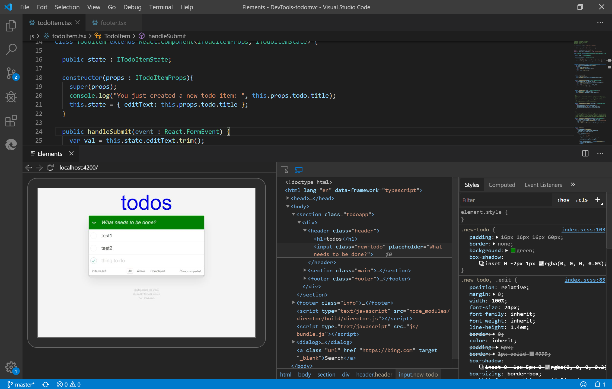
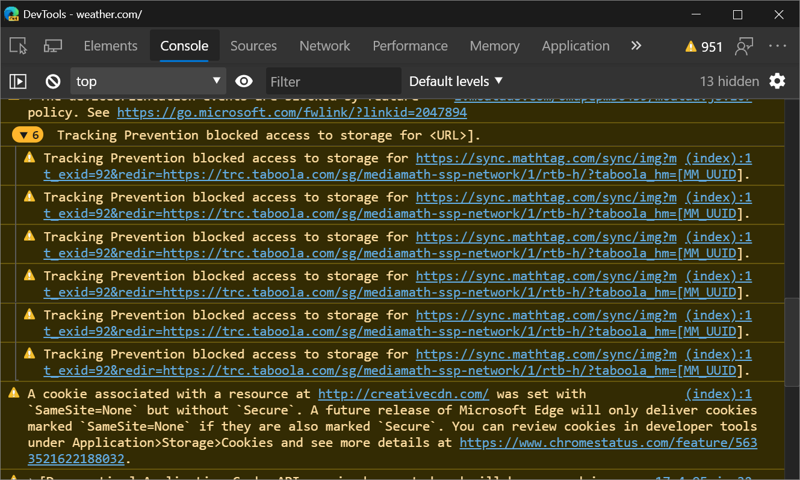
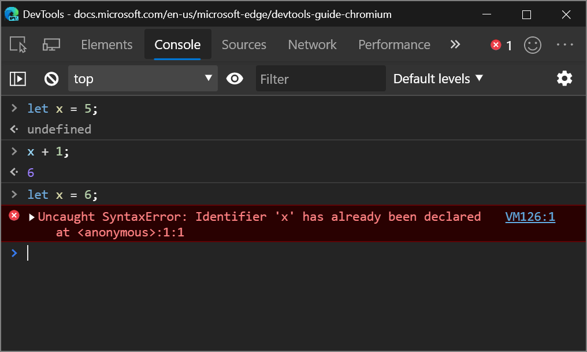
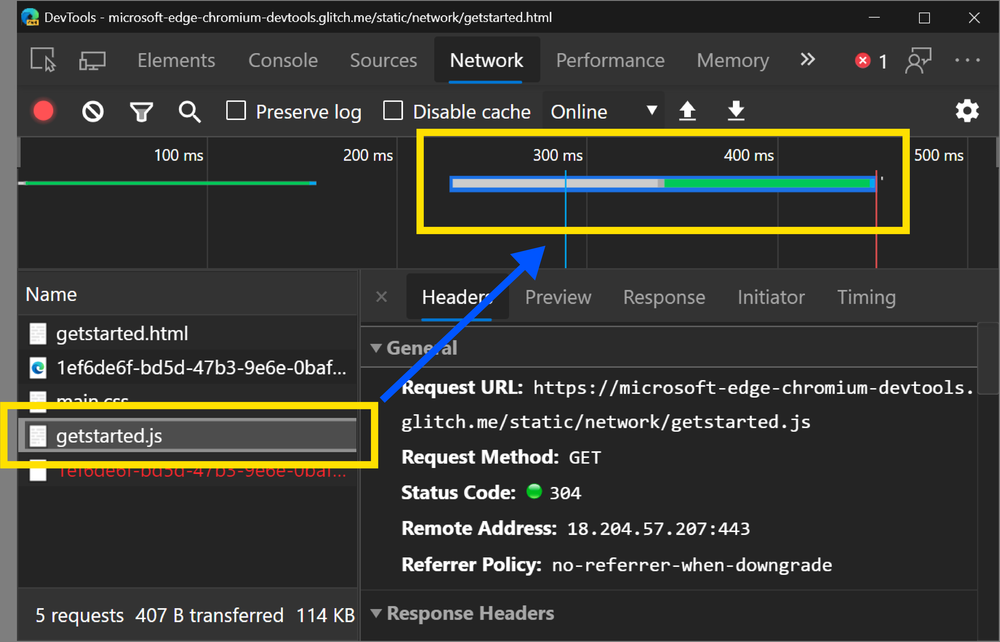

<!-- Copyright Kayce Basques

   Licensed under the Apache License, Version 2.0 (the "License");
   you may not use this file except in compliance with the License.
   You may obtain a copy of the License at

       https://www.apache.org/licenses/LICENSE-2.0

   Unless required by applicable law or agreed to in writing, software
   distributed under the License is distributed on an "AS IS" BASIS,
   WITHOUT WARRANTIES OR CONDITIONS OF ANY KIND, either express or implied.
   See the License for the specific language governing permissions and
   limitations under the License.  -->
# What's New in DevTools (Microsoft Edge 80)

[!INCLUDE [Microsoft Edge team note for top of What's New](../../includes/edge-whats-new-note.md)]

<!-- ====================================================================== -->
## Announcements from the Microsoft Edge DevTools team

<!-- ====================================================================== -->
### Accessibility improvements to the DevTools

<!-- dup entries: 2019/12, 2020/01 -->

The DevTools team has contributed 170 changes to Chromium to address high-impact color contrast, keyboard, and screen reader issues in the DevTools.  Every developer building the web should be able to use the DevTools.

Want to learn how to make your web page accessible to all of your users?  Download the [Accessibility Insights](https://aka.ms/a11yinsights) and [webhint](https://aka.ms/webhint/browser-extension) extensions for Microsoft Edge to get started.

If you use screen readers or the keyboard to navigate around the DevTools, send your feedback by [tweeting](https://aka.ms/tweet/edgedevtools) at us or selecting the [Send Feedback](../../../contact.md) icon!

Chromium issue [#963183](https://crbug.com/963183)

See also:
* [Accessibility-testing features](../../../accessibility/reference.md)
* [Navigate DevTools with assistive technology](../../../accessibility/navigation.md)

<!-- ====================================================================== -->
### Using the DevTools in other languages

<!-- dup entries: 2019/12, 2020/01 -->

Many developers use other developer tools, like StackOverflow and Visual Studio Code, in their native language, not just in English.  We're excited to announce localization for the DevTools, which you can now use in one of 10 languages besides English:

* Chinese (Simplified) - &#20013;&#25991;&#65288;&#31616;&#20307;&#65289;
* Chinese (Traditional) - &#20013;&#25991;&#65288;&#32321;&#39636;&#65289;
* French – fran&#231;ais
* German - deutsch
* Italian - italiano
* Japanese - &#26085;&#26412;&#35486;
* Korean - &#54620;&#44397;&#50612;
* Portuguese - portugu&#234;s
* Russian – &#1088;&#1091;&#1089;&#1089;&#1082;&#1080;&#1081;
* Spanish - espa&#241;ol

<!--
|  |  |
|:--- |:--- |
| Chinese (Simplified) - 中文（简体）| Chinese (Traditional) - 中文（繁體）|
| French – français | German - deutsch |
| Italian - italiano | Portuguese - português |
| Korean - 한국어 | Japanese - 日本語 |
| Russian – русский | Spanish - español |
-->

Go to `edge://flags` and set the **Enable localized Developer Tools** flag to **Enabled**.  Also set the **Developer Tools experiments** flag to **Enabled**.  Restart Microsoft Edge and open the DevTools.  <!-- Press **F1** in the DevTools or go to Settings > Experiments and check the **Match browser language** checkbox.  -->  The DevTools match the language you use for Microsoft Edge in `edge://settings/languages`.

If you want to use the DevTools in a different language than the ones that are available, [tweet](https://aka.ms/tweet/edgedevtools) at us or click the [Send Feedback](../../../contact.md) icon.

Chromium issue [#941561](https://crbug.com/941561)

See also:
* [Change DevTools language settings](../../../customize/localization.md)

<!-- ====================================================================== -->
### webhint Microsoft Edge extension

<!-- dup entries: 2019/12, 2020/01 -->

The webhint Microsoft Edge extension allows you to easily scan your web page and get feedback on accessibility, browser compatibility, security, performance, and more within the DevTools.  Read more at [https://webhint.io](https://aka.ms/webhint).

[Try the webhint browser extension in Microsoft Edge](https://aka.ms/webhint/edge-extension).  Once you install the extension, open DevTools and then select the **Hints** tool.  From here, run a customizable site scan.  Head over to [webhint.io](https://aka.ms/webhint/browser-extension) to learn more.

See also:
* [The webhint extension for Visual Studio Code](../../../../test-and-automation/webhint.md)

<!-- ====================================================================== -->
### 3D View

<!-- dup entries: 2019/12, 2020/01 -->

Use the **3D View** to debug your web application by navigating through the [Document Object Model (DOM)](https://developer.mozilla.org/docs/Web/API/Document_Object_Model) or the [z-index](https://developer.mozilla.org/docs/Web/CSS/z-index) stacking context.

To access the 3D View, go to `edge://flags` and ensure that the **Developer Tools experiments** flag is set to **Enabled**.  Restart Microsoft Edge and open the DevTools.  Press **F1** in DevTools, or open the **Settings** > **Experiments** section, and turn on the **Enable 3D View** checkbox.  Now, press **Ctrl+Shift+P** (Windows/Linux) or **Command+Shift+P** (macOS), type in **3D View**, and then select **Show 3D View**.

We're working on the UI and adding more functionality to the 3D View, so please send us your [feedback](../../../contact.md).

Chromium issue [#987787](https://crbug.com/987787)

See also:
* [Navigate z-index, DOM, and layers using the 3D View tool](../../../3d-view/index.md)

<!-- ====================================================================== -->
### Visual Studio Code extensions

The DevTools team has also released some extensions for [Visual Studio Code](https://aka.ms/vscode) that let you use the power of the DevTools directly from your text editor. Check out the following extensions.

#### Elements for Microsoft Edge

<!-- dup entries: 2019/12, 2020/01 -->

Use the Elements tool from within Visual Studio Code by adding the [Elements for Microsoft Edge](https://marketplace.visualstudio.com/items?itemName=ms-edgedevtools.vscode-edge-devtools) Visual Studio Code extension.

Update: As of 2022, the **Elements for Microsoft Edge** extension is now the **Microsoft Edge DevTools extension for Visual Studio Code**.

For more information, check out [Microsoft Edge DevTools extension for Visual Studio Code](../../../../visual-studio-code/microsoft-edge-devtools-extension.md).

#### Debugger for Microsoft Edge

<!-- dup entries: 2019/12, 2020/01 -->

With the Debugger for Microsoft Edge Visual Studio Code extension, debug JavaScript running in Microsoft Edge directly from Visual Studio Code.
<!-- old url: https://marketplace.visualstudio.com/items?itemName=msjsdiag.debugger-for-edge -->

Update: As of 2022, the **Debugger for Microsoft Edge Visual Studio Code extension** has been replaced by a built-in debugger for Microsoft Edge in Visual Studio Code.  See [Debug Microsoft Edge in Visual Studio Code](../../../../visual-studio-code/debugger-for-edge.md).

#### webhint

<!-- dup entries: 2019/12, 2020/01 -->

The [webhint](https://aka.ms/webhint4code) Visual Studio Code extension uses `webhint` to improve your web page while you're writing it! This extension runs and reports diagnostics on your workspace files based on `webhint` analysis.

[Learn more about the Visual Studio Code webhint extension](https://aka.ms/webhint/code-extension).

See also:
* [Visual Studio Code for web development](../../../../visual-studio-code/index.md)
* [The webhint extension for Visual Studio Code](../../../../visual-studio-code/webhint.md)

<!-- ====================================================================== -->
### Visual Studio integration

<!-- dup entries: 2019/12, 2020/01 -->

In Visual Studio 2019 version 16.2 or later, use the Visual Studio debugger to debug JavaScript running in Microsoft Edge.  [Download Visual Studio 2019](https://aka.ms/vs/download) to try this feature out.

[Read our blog post to learn how to debug Microsoft Edge from Visual Studio](https://aka.ms/vs/debug-edge).

To learn more about debugging Microsoft Edge from Visual Studio, see [Visual Studio for web development](../../../../visual-studio/index.md).

<!-- ====================================================================== -->
### Tracking prevention Console messages

<!-- dup entries: 2019/12, 2020/01 -->

Tracking prevention is a unique feature in Microsoft Edge that blocks you from being tracked by a website before you visited it.  The default tracking prevention setting is Balanced mode, which blocks 3rd party trackers and known malicious trackers for an experience that balances privacy and web compatibility.  To give you more insight into the compatibility of your web page when certain trackers are blocked, The Microsoft Edge team added warning messages in the **Console** when a tracker is blocked.

[Read more about tracking prevention and the balance between privacy and web compatibility](https://aka.ms/microsoftedge/tracking-prevention-blog).

See also:
* [Tracking prevention in Microsoft Edge](../../../../web-platform/tracking-prevention.md)
* [Console overview](../../../console/index.md)

<!-- ====================================================================== -->
## Announcements from the Chromium project

The following sections announce additional features available in Microsoft Edge 80 that were contributed to the open source Chromium project.

<!-- ====================================================================== -->
### Support for let and class redeclarations in the Console

The **Console** now supports redeclarations of `let` and `class` statements.  The inability to redeclare was a common annoyance for web developers who use the Console to experiment with new JavaScript code.

> [!WARNING]
> Redeclaring a `let` or `class` statement in a script outside of the Console or within a single Console input still causes a `SyntaxError`.

For example, previously, when re-declaring a local variable with `let`, the Console threw an error:

Now, the Console allows the redeclaration:

Chromium issue [#1004193](https://crbug.com/1004193)

See also:
* [Console overview](../../../console/index.md)
* [Run JavaScript in the Console](../../../console/console-javascript.md)

<!-- ====================================================================== -->
### Improved WebAssembly debugging

DevTools has started to support the DWARF Debugging Standard, which means increased support for stepping over code, setting breakpoints, and resolving stack traces in your source languages within DevTools.

<!-- [TODO: Add this link back] -->
<!--Check out [Improved WebAssembly debugging in Microsoft Edge DevTools](201912Webassembly) for the full story.  -->

<!-- [TODO: Replace this image with screenshot in Edge] -->
<!--

-->

See also:
* [Filter Wasm resource type in the Network tool](../../../whats-new/2021/05/devtools.md#filter-wasm-resource-type-in-the-network-tool) in _What's New in DevTools (Microsoft Edge 92)_.
* [WebAssembly Debugging: Enable DWARF support](../../../experimental-features/index.md#webassembly-debugging-enable-dwarf-support) in _Experimental features_.

<!-- ====================================================================== -->
### Network panel updates

#### Request Initiator Chains in the Initiator panel

You can now view the initiators and dependencies of a network request as a nested list.  This may help you understand why a resource was requested, or what network activity a certain resource (such as a script) caused.

After [logging network activity in the Network panel](../../../network/index.md), select a resource and then go to the **Initiator** panel to view the **Request Initiator Chain**:

*  The **inspected resource** is bold.  In the screenshot above, `ai.2.min.js` is the inspected resource.
*  The resources above the inspected resource are the **initiators**.  In the screenshot above, `https://www.microsoftedgeinsider.com` is the initiator of `ai.2.min.js`.  In other words, `https://www.microsoftedgeinsider.com` caused the network request for `ai.2.min.js`.  (The screenshot shows an outdated URL.  The latest URL is `https://www.microsoft.com/edge/download/insider`.)
*  The resources below the inspected resource are the **dependencies**.  In the screenshot above, `https://dc.services.visualstudio.com/v2/track` is a dependency of `ai.2.min.js`.  In other words, `ai.2.min.js` caused the network request for `https://dc.services.visualstudio.com/v2/track`.

Initiator and dependency information can also be accessed by holding **Shift** and then hovering over network resources.  See [Display initiators and dependencies](../../../network/reference.md#display-initiators-and-dependencies) in _Network features reference_.

Chromium issue [#842488](https://crbug.com/842488)

#### Highlight the selected network request in the Overview

After you select a network resource in order to inspect it, the Network panel now puts a blue border around that resource in the **Overview**.  This can help you detect if the network request is happening earlier or later than expected.

Chromium issue [#988253](https://crbug.com/988253)

See [Hide the Overview pane](../../../network/reference.md#hide-the-overview-pane) in _Network features reference_.

#### URL and path columns in the Network panel

Use the new **Path** and **URL** columns in the **Network** tool to display the absolute path or full URL of each network resource.

To display the new columns, right-click the **Waterfall** table header, and then select **Path** or **URL**.
<!-- **Path** or **URL** not found in N.f.r. page-->

Chromium issue [#993366](https://crbug.com/993366)

See also:
* [Network features reference](../../../network/reference.md).
* [Sort requests](../../../network/reference.md#sort-requests) in _Network features reference_ mentions the **Waterfall** column.

#### Updated User-Agent strings

DevTools supports setting a custom User-Agent string through the **Network Conditions** panel.  The User-Agent string affects the `User-Agent` HTTP header attached to network resources, and also the value of `navigator.userAgent`.

The predefined User-Agent strings have been updated to reflect modern browser versions.

To access **Network Conditions**, [open the Command Menu](../../../command-menu/index.md) and run the `Show Network Conditions` command.

> [!NOTE]
> You can also [set User-Agent strings in Device Mode](../../../device-mode/index.md#simulate-a-mobile-viewport).

Chromium issue [#1029031](https://crbug.com/1029031)

See also:
* [Network conditions tool](../../../network-conditions/network-conditions-tool.md)
* [Override the user agent string](../../../device-mode/override-user-agent.md)

<!-- ====================================================================== -->
### Audits panel updates

In a later release, the **Audits** panel was renamed as the **Lighthouse** panel.

#### New configuration UI

The configuration UI has a new, responsive design, and the throttling configuration options have been simplified.  For more information on the throttling UI changes, see [Audits Panel Throttling](https://github.com/GoogleChrome/lighthouse/blob/master/docs/throttling.md#devtools-audits-panel-throttling).<!-- changing master to main doesn't work 5/19/2022 -->

See also:
* [Lighthouse tool](../../../lighthouse/lighthouse-tool.md)

<!-- ====================================================================== -->
### Coverage tool updates

#### Per-function or per-block coverage modes

The **Coverage** tool has a new dropdown menu that lets you specify whether code coverage data should be collected **per function** or **per block**.  **Per block** coverage is more detailed but also far more expensive to collect.  DevTools uses **per function** coverage by default now.

> [!CAUTION]
> You may notice large code coverage differences in HTML files depending on whether you use **per function** or **per block** mode.  When using **per function** mode, inline scripts in HTML files are treated as functions.  If the script runs at all, DevTools marks the entire script as used code.  If the script doesn't run at all, DevTools marks the script as unused code.

#### Coverage must now be initiated by a page refresh

Toggling code coverage without a page refresh has been removed because the coverage data was unreliable.  For example, a function may be reported as unused if the runtime was a long time ago and the V8 garbage collector has cleaned it up.

Chromium issue [#1004203](https://crbug.com/1004203)

See also:
* [Find unused JavaScript and CSS code with the Coverage tool](../../../coverage/index.md)

<!-- ====================================================================== -->
> [!NOTE]
> Portions of this page are modifications based on work created and [shared by Google](https://developers.google.com/terms/site-policies) and used according to terms described in the [Creative Commons Attribution 4.0 International License](https://creativecommons.org/licenses/by/4.0).
> The original page is found [here](https://developer.chrome.com/blog/new-in-devtools-80) and is authored by [Kayce Basques](https://developers.google.com/web/resources/contributors#kayce-basques) (Technical Writer, Chrome DevTools \& Lighthouse).

This work is licensed under a [Creative Commons Attribution 4.0 International License](https://creativecommons.org/licenses/by/4.0).
