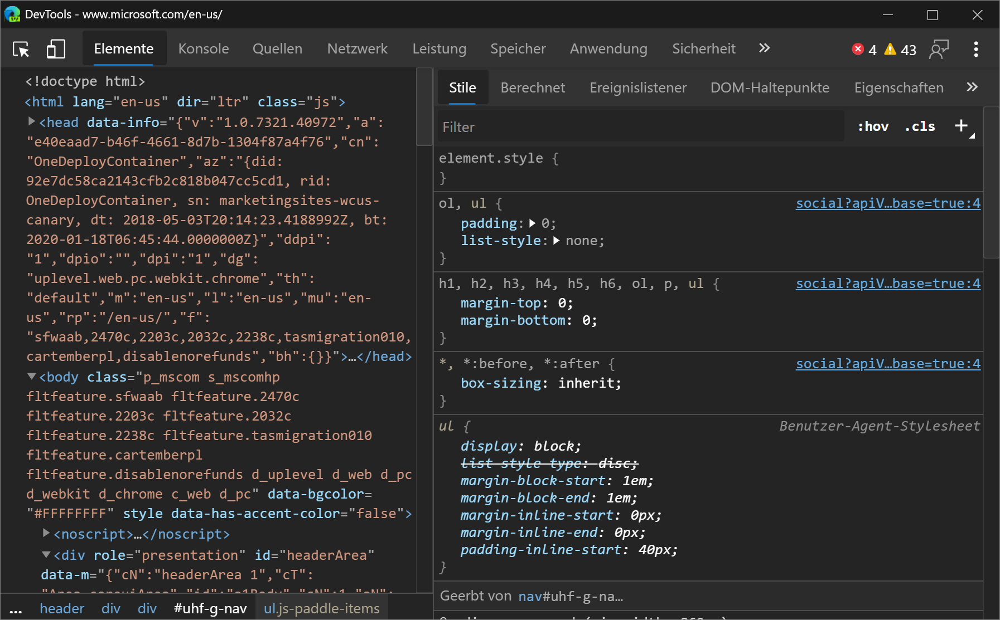
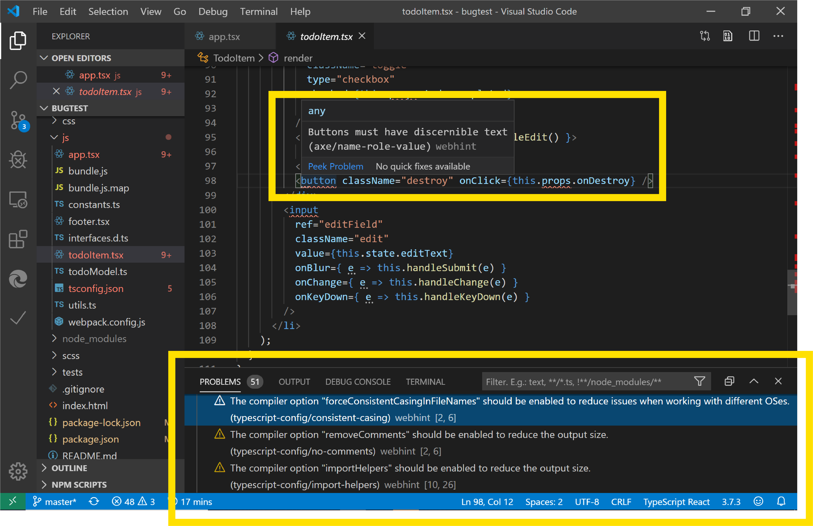

<!-- Copyright Kayce Basques

   Licensed under the Apache License, Version 2.0 (the "License");
   you may not use this file except in compliance with the License.
   You may obtain a copy of the License at

       https://www.apache.org/licenses/LICENSE-2.0

   Unless required by applicable law or agreed to in writing, software
   distributed under the License is distributed on an "AS IS" BASIS,
   WITHOUT WARRANTIES OR CONDITIONS OF ANY KIND, either express or implied.
   See the License for the specific language governing permissions and
   limitations under the License.  -->
# What's New in DevTools (Microsoft Edge 81)

[!INCLUDE [Microsoft Edge team note for top of What's New](../../includes/edge-whats-new-note.md)]

<!-- ====================================================================== -->
## Announcements from the Microsoft Edge DevTools team

<!-- ====================================================================== -->
### Accessibility improvements to the DevTools

<!-- dup entries: 2019/12, 2020/01 -->

The DevTools team has contributed 170 changes to Chromium to address high-impact color contrast, keyboard, and screen reader issues in the DevTools.  Every developer building the web should be able to use the DevTools.

Want to learn how to make your web page accessible to all of your users?  Download the [Accessibility Insights](https://accessibilityinsights.io) and [webhint](https://webhint.io/docs/user-guide/extensions/extension-browser) extensions for Microsoft Edge to get started.

If you use screen readers or the keyboard to navigate around the DevTools, send us your feedback by [tweeting](https://twitter.com/intent/tweet?text=@EdgeDevTools) at us or clicking the **Send Feedback** icon!

Chromium issue [#963183](https://crbug.com/963183)

See also:
* [Accessibility-testing features](../../../accessibility/reference.md)
* [Navigate DevTools with assistive technology](../../../accessibility/navigation.md)

<!-- ====================================================================== -->
### Using the DevTools in other languages

<!-- dup entries: 2019/12, 2020/01 -->

Many developers use other developer tools, like StackOverflow and Visual Studio Code, in their native language, not just in English.  We're excited to announce localization for the DevTools, which you can now use in one of 10 languages besides English:

* Chinese (Simplified) - &#20013;&#25991;&#65288;&#31616;&#20307;&#65289;
* Chinese (Traditional) - &#20013;&#25991;&#65288;&#32321;&#39636;&#65289;
* French – fran&#231;ais
* German - deutsch
* Italian - italiano
* Japanese - &#26085;&#26412;&#35486;
* Korean - &#54620;&#44397;&#50612;
* Portuguese - portugu&#234;s
* Russian – &#1088;&#1091;&#1089;&#1089;&#1082;&#1080;&#1081;
* Spanish - espa&#241;ol

<!--
|  |  |
|:--- |:--- |
| Chinese (Simplified) - 中文(简体)（简体）| Chinese (Traditional) - 中文(繁體)（繁體）|
| French – français | German - deutsch |
| Italian - italiano | Portuguese - português |
| Korean - 한국어 | Japanese - 日本語 |
| Russian – русский | Spanish - español |
-->

The DevTools automatically match the language you use for Microsoft Edge in `edge://settings/languages`.

If you want Microsoft Edge to be in one language and your DevTools to remain in English, press **F1** in DevTools to open [Settings](../../../customize/index.md#settings) and disable **Match browser language**.

**Console** messages aren't localized.  Only the strings used in the DevTools UI are displayed in the language you use for Microsoft Edge.

If you want to use the DevTools in a different language than the ones that are available, [tweet](https://twitter.com/intent/tweet?text=@EdgeDevTools) at us or click the **Send Feedback** icon.

Chromium issue [#941561](https://crbug.com/941561)

See also:
* [Change DevTools language settings](../../../customize/localization.md)

<!-- ====================================================================== -->
### webhint Microsoft Edge extension

<!-- dup entries: 2019/12, 2020/01 -->

The webhint Microsoft Edge extension allows you to easily scan your web page and get feedback on accessibility, browser compatibility, security, performance, and more within the DevTools.  Read more at [https://webhint.io](https://webhint.io).

[Try the webhint browser extension in Microsoft Edge](https://microsoftedge.microsoft.com/addons/detail/webhint/mlgfbihcfnkaenjpdcngdnhcpkdmcdee).  Once you install the extension, open the DevTools and select the **Hints** tool.  From here, run a customizable site scan.  Head over to [webhint.io](https://webhint.io/docs/user-guide/extensions/extension-browser) to learn more.

See also:
* [The webhint extension for Visual Studio Code](../../../../test-and-automation/webhint.md)

<!-- ====================================================================== -->
### 3D View

<!-- dup entries: 2019/12, 2020/01 -->

Use the **3D View** to debug your web application by navigating through the [Document Object Model (DOM)](https://developer.mozilla.org/docs/Web/API/Document_Object_Model) or the [z-index](https://developer.mozilla.org/docs/Web/CSS/z-index) stacking context.

To open the **3D View** tool, press **Ctrl+Shift+P** (Windows/Linux) or **Command+Shift+P** (macOS) to open the Command Menu, start typing `3d view`, and then select **Show 3D View**.

The Microsoft Edge team is working with the Chromium team on the UI and adding more functionality to the 3D View, so please use the **Send Feedback** icon!

Chromium issue [#987787](https://crbug.com/987787)

See also:
* [Navigate z-index, DOM, and layers using the 3D View tool](../../../3d-view/index.md)

<!-- ====================================================================== -->
### Visual Studio Code extensions

The DevTools team has also released some extensions for [Visual Studio Code](https://code.visualstudio.com) that let you use the power of the DevTools directly from your text editor! Check out the extensions below:

See also:
* [Visual Studio Code for web development](../../../../visual-studio-code/index.md)
* [Microsoft Edge DevTools extension for Visual Studio Code](../../../../visual-studio-code/microsoft-edge-devtools-extension.md)

<!-- ====================================================================== -->
#### Elements for Microsoft Edge

<!-- dup entries: 2019/12, 2020/01 -->

Use the Elements tool from within Visual Studio Code by adding the [Elements for Microsoft Edge](https://marketplace.visualstudio.com/items?itemName=ms-edgedevtools.vscode-edge-devtools) Visual Studio Code extension.

Update: As of 2022, the **Elements for Microsoft Edge** extension is now the **Microsoft Edge DevTools extension for Visual Studio Code**.

For more information, check out [Microsoft Edge DevTools extension for Visual Studio Code](../../../../visual-studio-code/microsoft-edge-devtools-extension.md).

<!-- ====================================================================== -->
#### Debugger for Microsoft Edge

<!-- dup entries: 2019/12, 2020/01 -->

With the Debugger for Microsoft Edge Visual Studio Code extension, debug JavaScript running in Microsoft Edge directly from Visual Studio Code.
<!-- old url: https://marketplace.visualstudio.com/items?itemName=msjsdiag.debugger-for-edge -->

Update: As of 2022, the **Debugger for Microsoft Edge Visual Studio Code extension** has been replaced by a built-in debugger for Microsoft Edge in Visual Studio Code.  See [Debug Microsoft Edge in Visual Studio Code](../../../../visual-studio-code/debugger-for-edge.md).

<!-- ====================================================================== -->
#### webhint

<!-- dup entries: 2019/12, 2020/01 -->

The [webhint](https://marketplace.visualstudio.com/items?itemName=webhint.vscode-webhint) Visual Studio Code extension uses `webhint` to improve your web page while you are writing it.  This extension runs and reports diagnostics on your workspace files based on `webhint` analysis.

[Learn more about the Visual Studio Code webhint extension](https://webhint.io/docs/user-guide/extensions/vscode-webhint).

See also:
* [Visual Studio Code for web development](../../../../visual-studio-code/index.md)
* [The webhint extension for Visual Studio Code](../../../../visual-studio-code/webhint.md)

<!-- ====================================================================== -->
### Visual Studio integration

<!-- dup entries: 2019/12, 2020/01 -->

In Visual Studio 2019 version 16.2 or later, use the Visual Studio debugger to debug JavaScript running in Microsoft Edge.  [Download Visual Studio 2019](https://visualstudio.microsoft.com/downloads) to try this feature out!

To learn more about debugging Microsoft Edge from Visual Studio, see [Visual Studio for web development](../../../../visual-studio/index.md).

<!-- ====================================================================== -->
### Tracking prevention Console messages

<!-- dup entries: 2019/12, 2020/01 -->

Tracking prevention is a unique feature in Microsoft Edge that protects you from being tracked by websites you have not visited before.  The default tracking prevention setting is Balanced mode, which blocks 3rd party trackers and known malicious trackers for an experience that balances privacy and web compatibility.  To give you more insight into the compatibility of your web page when certain trackers are blocked, warning messages were added in the **Console** when a tracker is blocked.

[Read more about tracking prevention and the balance between privacy and web compatibility](https://blogs.windows.com/msedgedev/2019/12/03/improving-tracking-prevention-microsoft-edge-79).

See also:
* [Tracking prevention in Microsoft Edge](../../../../web-platform/tracking-prevention.md)
* [Console overview](../../../console/index.md)

<!-- ====================================================================== -->
## Announcements from the Chromium project

The following sections announce additional features available in Microsoft Edge 81 that were contributed to the open source Chromium project.

<!-- ====================================================================== -->
### Moto G4 support in Device Mode

After [enabling the Device Toolbar](../../../device-mode/index.md#simulate-a-mobile-viewport), simulate the dimensions of a Moto G4 viewport from the **Device** list.

Click [Show Device Frame](../../../device-mode/index.md#show-device-frame) to show the Moto G4 hardware around the viewport.

Related features:

*  Open the [Command Menu](../../../command-menu/index.md) and run the `Capture screenshot` command to take a screenshot of the viewport that includes the Moto G4 hardware (after enabling **Show Device Frame**).
* [Throttle the network and CPU](../../../device-mode/index.md#throttle-the-network-and-cpu) to more accurately simulate a mobile user's web browsing conditions.

Chromium issue [#924693](https://crbug.com/924693)

<!-- ====================================================================== -->
### Cookie-related updates

See also:
* [View, edit, and delete cookies](../../../../devtools-guide-chromium/storage/cookies.md)
* [Display cookies](../../../../devtools-guide-chromium/network/reference.md#display-cookies) in _Network features reference_

<!-- ====================================================================== -->
#### Blocked cookies in the Cookies pane

The **Cookies** pane in the **Application** panel now displays blocked cookies with a yellow background.

Chromium issue [#1030258](https://crbug.com/1030258)  <!-- inaccessible  -->

<!-- ====================================================================== -->
#### Cookie priority in the Cookie pane

The Cookies tables in the **Network** and **Application** tools now include a **Priority** column.

Caution: Chromium-based browsers, like Microsoft Edge, are the only browsers that support cookie priority.

Chromium issue [#1026879](https://crbug.com/1026879)

<!-- ====================================================================== -->
#### Edit all cookie values

All cells in the Cookie tables are editable now, except cells in the **Size** column because that column represents the network size of the cookie, in bytes.  For an explanation of each column, see [Fields](../../../storage/cookies.md#fields)in _View, edit, and delete cookies_.

<!-- ====================================================================== -->
#### Copy as Node.js fetch to include cookie data

To get a `fetch` expression that includes cookie data, right-click a network request, and then select **Copy** > **Copy as Node.js fetch**.

Chromium issue [#1029826](https://crbug.com/1029826)

<!-- ====================================================================== -->
### More accurate web app manifest icons

Previously, the **Manifest** pane in the **Application** panel sent its own requests in order to display web app manifest icons.  DevTools now shows the exact same manifest icon that Microsoft Edge uses.

Chromium issue [#985402](https://crbug.com/985402)

See also:
* [Open the Cookies pane](../../../../devtools-guide-chromium/storage/cookies.md#open-the-cookies-pane) in _View, edit, and delete cookies_

<!-- ====================================================================== -->
### Hover on CSS content properties to display unescaped values

In the **Styles** pane of the **Elements** tool, to display the unescaped version of a value of a `content` property, hover on the value.

For example, in this [demo](https://mathiasbynens.github.io/css-dbg-stories/css-escapes.html) when you inspect the `p::after` pseudo-element an escaped string is displayed in the **Styles** pane:

When you hover on the `content` value, the unescaped value is displayed.

See also:
* [CSS features reference](../../../../devtools-guide-chromium/css/reference.md)

<!-- ====================================================================== -->
### More detailed source map errors in the Console

The Console now provides more detail on why a source map failed to load or parse.  Previously it just provided an error without explaining what went wrong.

See also:
* [Console overview](../../../../devtools-guide-chromium/console/index.md)
* [Map the processed code to your original source code, for debugging](../../../../devtools-guide-chromium/javascript/source-maps.md)

<!-- ====================================================================== -->
### Setting for disabling scrolling past the end of a file

To prevent the default UI behavior that allows you to scroll well past the end of a file in the **Sources** panel, open [Settings](../../../customize/index.md#settings) and then clear the checkbox **Preferences** > **Sources** > **Allow scrolling past end of file**.

See also:
* [Using the Editor pane to view or edit files](../../../../devtools-guide-chromium/sources/index.md#using-the-editor-pane-to-view-or-edit-files) in _Sources tool overview_.

<!-- ====================================================================== -->
> [!NOTE]
> Portions of this page are modifications based on work created and [shared by Google](https://developers.google.com/terms/site-policies) and used according to terms described in the [Creative Commons Attribution 4.0 International License](https://creativecommons.org/licenses/by/4.0).
> The original page is found [here](https://developer.chrome.com/blog/new-in-devtools-81) and is authored by [Kayce Basques](https://developers.google.com/web/resources/contributors#kayce-basques) (Technical Writer, Chrome DevTools \& Lighthouse).

This work is licensed under a [Creative Commons Attribution 4.0 International License](https://creativecommons.org/licenses/by/4.0).
